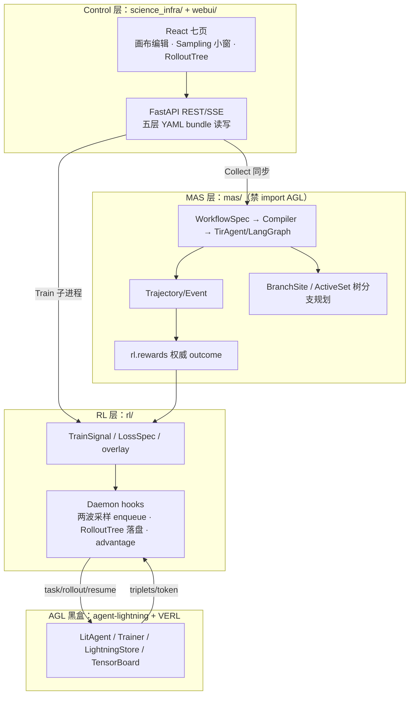

# Agent Science Infra

面向 **Agent RL 研究**的多智能体系统（MAS）科学基础设施：把「多 Agent 工作流采样 → 分支 Rollout → GRPO 族训练（ARPO/AEPO/RAE）→ 实时诊断」做成一条可复现、可观测、可声明的实验链路，训练后端复用 [Agent-Lightning](https://github.com/qihoo360/agent-lightning)（AGL）+ VERL。

## 项目状态

| 项 | 状态 |
|----|------|
| 阶段 | 研究原型（v0.1.0） |
| 更新日期 | 2026-09-20 |
| 已端到端跑通 | mock/live Collect → reward → Harness 诊断 → ARPO 训练（真实 LLM + GRPO 更新）→ RolloutTree 落盘 + UI 可视化 |
| 测试 | `./run.sh feature-test --all`：15 功能域 154 例全绿（2026-09-20 实测） |

## 目录

- [为什么 / 解决什么问题](#为什么--解决什么问题)
- [核心特性](#核心特性)
- [架构总览](#架构总览)
- [快速开始](#快速开始)
- [使用方式](#使用方式)
- [项目结构](#项目结构)
- [测试与验收](#测试与验收)
- [文档索引](#文档索引)
- [开发约定](#开发约定)
- [常见问题](#常见问题)

## 为什么 / 解决什么问题

Agent RL 实验的三个痛点，本项目逐一给出工程答案：

1. **不可复现**：多 Agent 工作流散落在脚本里。→ 五层 YAML 实验 bundle（experiment / llm / workflow / rl / harness），一切配置落盘、seed 固定、CLI 与 UI 读写同一份真源。
2. **分支采样语义混乱**：「在哪一步 fork、fork 几条、算谁的 advantage」全靠改代码。→ 声明式 `BranchSite`（5 anchor × 9 gate）写进 `workflow.yaml`，ActiveSet/Daemon 自动执行两波采样，RolloutTree 记录真实 rollout id 树。
3. **训练是黑盒**：GRPO 族训练过程看不见。→ Control UI 七页 + SSE 实时事件 + RolloutTree 可视化 + Harness 实时诊断（log_error / loss 波动 / 认知收敛 / reward hacking）。

## 核心特性

- **分层架构与硬边界**：`science_infra`（Control/UI）→ `mas`（工作流/采样，禁 import AGL）→ `rl`（训练 overlay/hooks）→ AGL（黑盒，仅 `mas/train_tir_agent.py` 一处 import）
- **七页 Control UI**：Experiment / LLM / MAS 画布 / RL / RolloutTree / Harness / Monitor（FastAPI + React + SSE，`/docs` 全量 API）
- **声明式分支采样**：`BranchSite` = anchor（after_tool / after_agent_turn / after_verifier / on_token / after_edge）× gate（entropy_delta / dual_entropy / always / tool_ok / … 共 9 种）× fork 预算，UI 小窗编辑、API 持久化回归验证
- **GRPO 族算法**：grpo / arpo / aepo / appo / rae 六算法 overlay；两波采样（initial 独立 + branch resume + global 补齐凑满 group_n）；RAE verdict / k-hop credit assignment
- **真实 rollout id 的 RolloutTree**：Daemon 训练期把分支树落盘为 `mas/.local_expansion/tree_*.json`，React Flow 分层渲染 + SSE `node_added` 实时帧
- **agent 化工作流（schema 0.3）**：kind/profile/routers 合同、RouterSpec 适配器、blank agent tool-call shell（`blank:<id>`）、两层 memory、per-agent window_events
- **实时 Harness 诊断**：训练 stdout JSONL 帧 → SSE → `Diagnoser.consume`；RewardHackingMonitor leave-one-out z-score

## 架构总览



详细分层说明与代码级地图：[docs/TECHNICAL_FRAMEWORK.md](docs/TECHNICAL_FRAMEWORK.md)。

## 快速开始

### 前置依赖

| 依赖 | 说明 |
|------|------|
| GPU + `nvidia-smi` | 仅训练需要（A800 单卡实测可跑 Qwen3-4B） |
| Python 3.11 + [uv](https://docs.astral.sh/uv/) | 创建仓库 `.venv`（勿用 miniconda 裸环境） |
| Node.js + npm | 构建 `webui/dist` |
| `data/{train,val}.parquet` | GSM8K 数据；**当前仓库内为 5 行小样本**（端到端快速验证用；全量备份 `data/*.full.parquet.bak`） |
| 模型权重 | `LLM/Qwen3-4B`（local LLM 与训练 `model_path`） |
| API 配置（可选） | `.env`：`OPENAI_API_KEY / OPENAI_API_BASE / OPENAI_MODEL`（Collect live / 多专家测试用） |

### 三步跑起来

```bash
# 1. 环境（首次；装 uv 依赖 + editable 安装 science-infra）
bash scripts/setup_uv_env.sh

# 2. 启动 Control UI（首次自动 npm build webui）
./run.sh ui --daemon        # 日志：artifacts/run_smoke/ui.log

# 3. 浏览器打开
#    http://127.0.0.1:8787/    （API 文档 /docs）
```

AutoDL 等公网入口固定在 6006 的场景，用转发器把公网 6006 转到容器 8787（支持 SSE 透传）：

```bash
nohup python3 scripts/ui_public_forwarder.py --listen 6006 --target 127.0.0.1:8787 \
  > artifacts/ui_forwarder.log 2>&1 &
```

建议用**外部浏览器**访问（IDE 内嵌 webview 有 HTTP/1.1 每域名 6 连接上限，SSE 长连接容易把 UI 请求饿死，详见手册 FAQ）。

## 使用方式

### CLI（`science-infra`）

```bash
science-infra doctor                                  # 环境/AGL/GPU 探测
science-infra collect --mock --n 2 --out /tmp/traj.json
science-infra diagnose /tmp/traj.json                 # Harness 四插件
science-infra status /tmp/traj.json --html /tmp/status.html
science-infra serve --port 8787                       # 即 ./run.sh ui
```

### `run.sh` 子命令

| 命令 | 作用 |
|------|------|
| `./run.sh smoke` | 无 GPU 冒烟：doctor→层依赖红线→mock 采集→diagnose→dashboard |
| `./run.sh live-api` / `live-api-data` | API LLM 单题 / 从 parquet 抽题跑 TirAgent（需 `.env`） |
| `./run.sh live-vllm` | 本地 vLLM（LLM→tool→答案→reward） |
| `./run.sh ui [--daemon|--stop|--rebuild]` | Control UI 启停 |
| `./run.sh train [fast] --algo arpo --rl-yaml experiments/arpo_e2e/rl.yaml` | CLI 直接训练 |
| `./run.sh feature-test [--list\|<域>\|--all]` | 15 功能域分组测试 |
| `./run.sh branch-ui-test [--train]` | 分支采样站点 + Collect/Train wiring 验收 |
| `./run.sh arpo-train-test` | ARPO 端到端 4 阶段验收（GPU） |
| `./run.sh traj-test` | 前端轨迹推导 vitest |

### Control UI 跑 ARPO（最短路径）

1. 选实验 `arpo_e2e`（合同摘要确认 `入口=hub · 可训=[hub]`）
2. MAS 页：Rollout Sampling 小窗 mode=`arpo`、group_n=`4`、beam_size=`2`，勾 `after_agent_turn` + `after_tool` 双站点 → 保存 workflow.yaml
3. RL 页：algo=`arpo`、每题采样条数=`4`、profile=`fast` → 保存超参
4. 顶栏勾 GPU → 点 **Train**
5. RolloutTree 页看树实时生长（`node_added` LIVE chip）；Monitor 页看 reward 曲线

完整步骤与验收判据：[docs/UI_USER_MANUAL.md](docs/UI_USER_MANUAL.md) §5。

## 项目结构

```text
├── science_infra/       # Control 层：FastAPI REST/SSE + CLI + 实验 bundle（不训模型）
├── webui/               # React + React Flow 前端（七页）
├── mas/                 # ★ MAS 层：workflow 合同/Compiler/TirAgent/ActiveSet/Harness（禁 import AGL）
│   ├── tir_agent.py     # LangGraph ReAct agent（routers/blank shell/window_events）
│   ├── train_tir_agent.py  # 训练入口（唯一 import agl 的 MAS 文件）
│   └── tests/           # unittest 套件
├── rl/                  # RL overlay 层：rewards/loss/train_signal/hooks（daemon/advantage/rae）
├── experiments/         # 实验配置真源：<id>/{experiment,llm,workflow,rl,harness}.yaml
├── scripts/             # 验收脚本：feature_test / arpo_train_verify / rollout_tree_verify / ui_public_forwarder …
├── data/                # GSM8K parquet（当前为 5 行小样本，全量备份 *.full.parquet.bak）
├── LLM/                 # 本地模型权重（Qwen3-4B）
├── agent-lightning/     # AGL 框架（git submodule，黑盒）
├── run.sh               # 仓库统一入口脚本
└── docs/                # 全部设计与验收文档（见下方索引）
```

## 测试与验收

```bash
./run.sh feature-test --list    # 16 个功能域一览（--all 跑 15 域 154 例，smoke 域单列）
./run.sh feature-test branch    # 只测分支采样域
./run.sh smoke                  # 无 GPU 冒烟
```

| 验收脚本 | 覆盖 |
|----------|------|
| `./run.sh arpo-train-test`（`scripts/arpo_train_verify.py`） | ARPO 端到端：启动→轮询 metrics→树落盘→扩展性（2026-09-20 5 样本全 PASS：branch_local=6、6 棵树、step ≈237s，run `384d1927458a`） |
| `scripts/rollout_tree_verify.py` | RolloutTree 契约 + API + 节点徽标（B1–B5，5/5 PASS） |
| `./run.sh branch-ui-test` | 采样站点持久化 + Collect wiring（`--train` 短训扫 expansion） |

测试矩阵与功能域详解：[docs/MAS_AGENT_FRAMEWORK_TEST.md](docs/MAS_AGENT_FRAMEWORK_TEST.md)、[docs/ARPO_TRAIN_TEST.md](docs/ARPO_TRAIN_TEST.md)。

## 文档索引

| 文档 | 读者 / 内容 |
|------|------------|
| [docs/UI_USER_MANUAL.md](docs/UI_USER_MANUAL.md) | **使用者**：七页操作、参数教程、ARPO 端到端教程、FAQ |
| [docs/TECHNICAL_FRAMEWORK.md](docs/TECHNICAL_FRAMEWORK.md) | **开发者**：当前代码框架、合同、实现差距、路线图（权威） |
| [docs/CONTROL_UI.md](docs/CONTROL_UI.md) | Control 面落地说明与 API 一览 |
| [docs/ARPO_TRAIN_TEST.md](docs/ARPO_TRAIN_TEST.md) | ARPO 训练验收手册（CLI 视角 + 实测结果） |
| [docs/ROLLOUT_SAMPLING.md](docs/ROLLOUT_SAMPLING.md) | 采样语义（independent/branch/beam、任务池模型） |
| [docs/SAMPLING_ARPO_APPO.md](docs/SAMPLING_ARPO_APPO.md) | 官方 ARPO/APPO 与 MAS 机制对照 |
| [docs/BRANCH_SITE_DESIGN.md](docs/BRANCH_SITE_DESIGN.md) | BranchSite 合同、RAE reward 设计 |
| [docs/NEW_FRAMEWORK_DESIGN.md](docs/NEW_FRAMEWORK_DESIGN.md) | v2 最优架构（P0–P3 分期） |
| [docs/MAS_AGENT_FRAMEWORK_TEST.md](docs/MAS_AGENT_FRAMEWORK_TEST.md) | agent 化架构说明 + 测试矩阵 |
| [design.md](design.md) | 产品原则 |

## 开发约定

**架构硬边界**（由 `mas/scripts/check_workflow_deps.py` 红线测试强制）：

1. `mas/workflow` **禁止 import AGL**；AGL 只在 `mas/train_tir_agent.py` 出现；
2. 画布只产 YAML（React Flow → MASSpec），不生成代码；
3. AGL 是黑盒：不 fork、不改 `agent-lightning/` 源码；
4. rollout/resume/enqueue 协议字段保留（`role` / `resume_boundary` / `verdict_list`）。

**热更新双终端法**（改前端免重启）：终端 A `science-infra serve --port 8787`；终端 B `cd webui && npm run dev`（Vite 代理 `/api`）。

**改 Python 代码后必须重启 UI**：`./run.sh ui --stop && ./run.sh ui --daemon`——后端 palette、hooks、daemon 逻辑都是启动时加载。

## 常见问题

- **Collect 绿了但没分支树？** Collect 不做树分支；真 branch 只在 Train Daemon（`tir_algo∈{arpo,aepo,rae}`）。见 [UI 手册 FAQ Q4](docs/UI_USER_MANUAL.md)。
- **`branch_local_count` 恒 0？** 旧版 Daemon 在 super() 快照后才补写 expand 字段；2026-09-20 已修复（`_preinject_expand_fields`）。拉最新代码重启 UI。
- **训练结束 Monitor 曲线消失？** 已修复：离线回落到 `mas/checkpoints/AgentLightning/<exp>/metrics.jsonl`，重启 UI 生效。
- **RolloutTree 页转圈不出数据？** 多半是内嵌浏览器连接配额（SSE 占满 6 连接），换外部浏览器；API 层用 `curl /api/mas/rollout-trees` 验证。

更多见 [docs/UI_USER_MANUAL.md](docs/UI_USER_MANUAL.md) §6。
