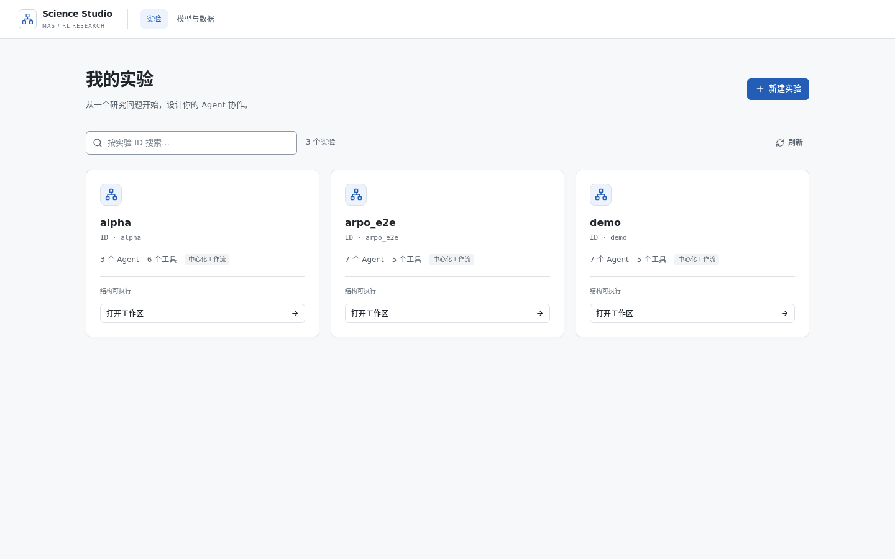
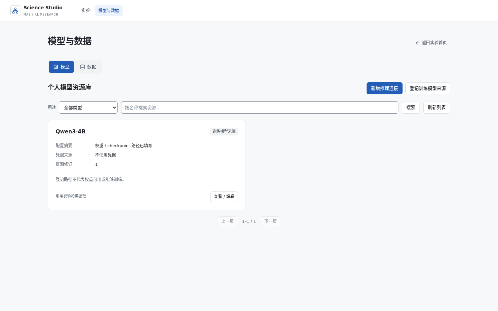
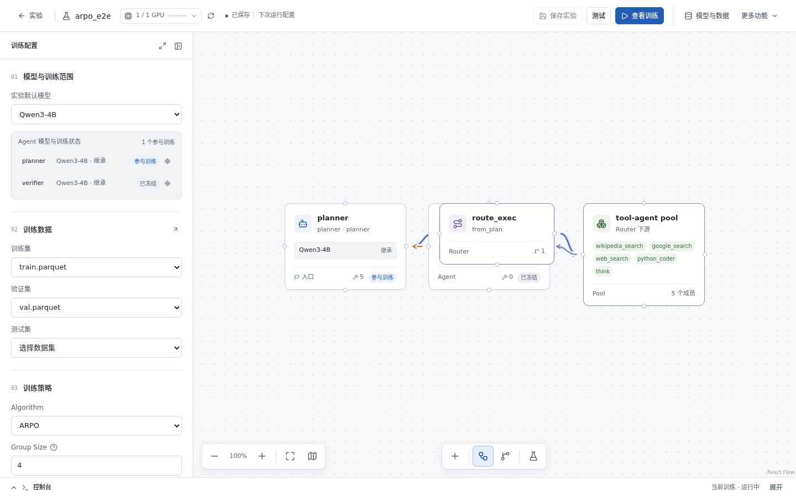
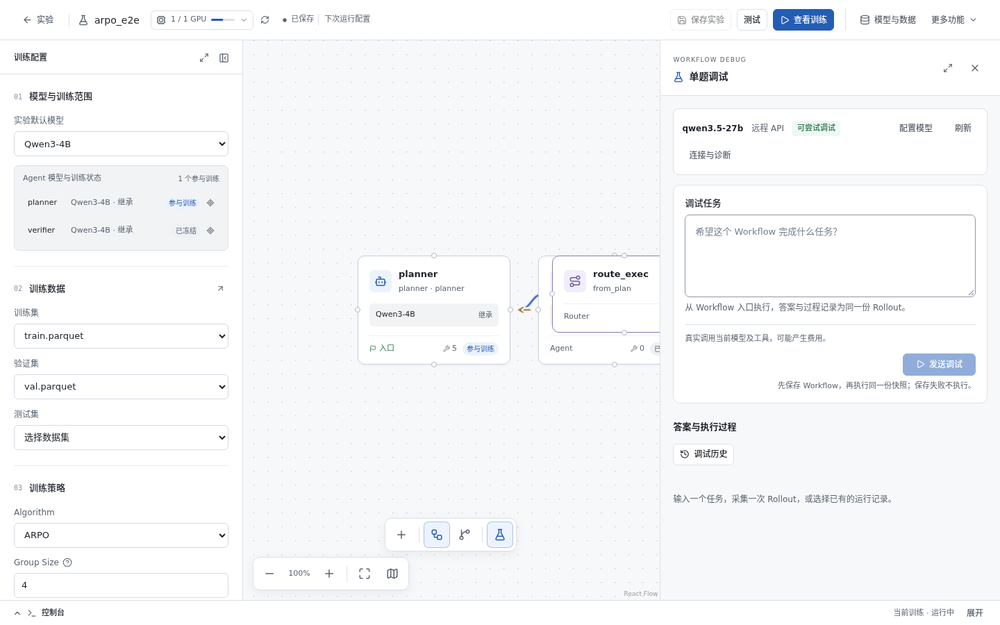
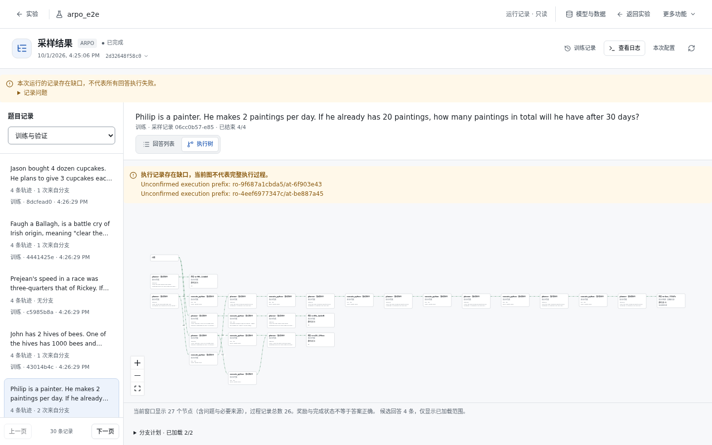
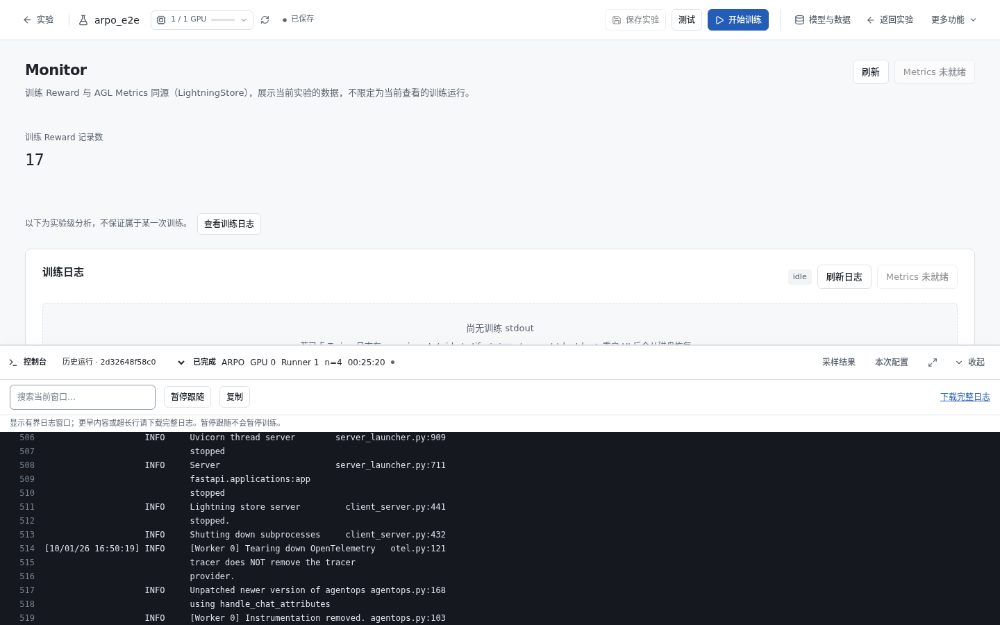
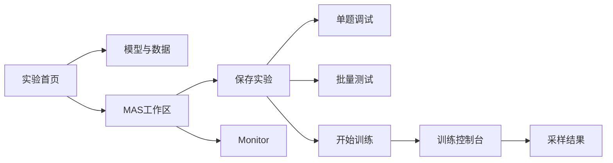
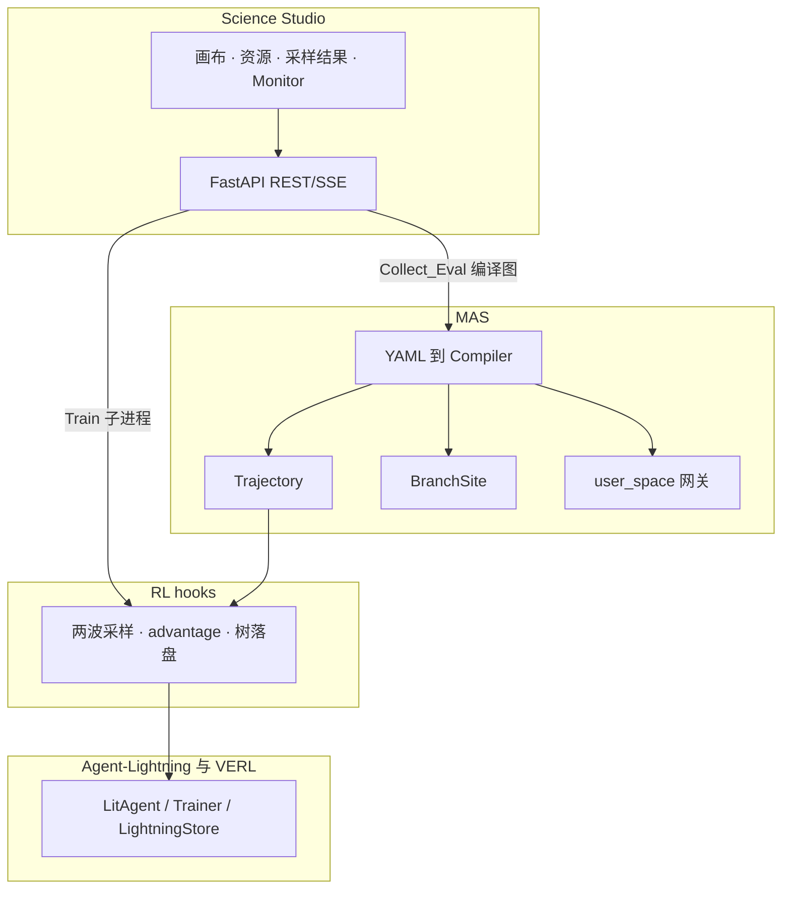

# Science Studio

Science Studio 是多智能体强化学习实验的控制面。一个实验是 `experiments/<id>/` 下的五份 YAML（experiment / llm / workflow / rl / harness）。界面和命令行读写同一份文件。画布编辑 Agent 工作流和分支采样站点，不生成 LangGraph 代码。

训练算法是 GRPO 族：`grpo` / `arpo` / `aepo` / `igpo` / `gigpo` / `rae`。界面里的 APPO 只是 ARPO 的别名。采样站点写在 planner、verifier、router 或边上，不按 tool 展开。Collect / 单题调试走编译后的多 Agent 图；训练热路径仍是单 hub TirAgent，加上 YAML 里声明的分支采样。

训练运行时使用 [Agent-Lightning](https://github.com/qihoo360/agent-lightning) 与 VERL。本仓库不修改 `agent-lightning/` 的源码。

更新日期：2026-10-01。

## 界面

首页列出实验。模型与数据是独立页。进入实验后，工作区是 **MAS 画布 + 左侧训练配置 + 顶栏保存/测试/训练 + 底部控制台**。LLM、RL、Harness 是画布上的设置区，和 MAS 共用同一份未保存草稿。切设置不会丢掉草稿；换实验才会用磁盘上的 YAML 覆盖。保存动作是顶栏的「保存实验」。

下面的截图来自本机 Science Studio（实验 `arpo_e2e`）。














```mermaid
flowchart LR
  home[实验首页] --> resources[模型与数据]
  home --> workspace[MAS工作区]
  workspace --> save[保存实验]
  save --> debug[单题调试]
  save --> eval[批量测试]
  save --> train[开始训练]
  train --> console[训练控制台]
  console --> samples[采样结果]
  workspace --> monitor[Monitor]
```

完整点击说明：[docs/UI_USER_MANUAL.md](docs/UI_USER_MANUAL.md)。

## 怎么跑通一次实验

```bash
bash scripts/setup_uv_env.sh   # 首次
./run.sh ui --daemon           # http://127.0.0.1:8787/
```

1. 首页打开实验（例如 `arpo_e2e`），或新建一个。
2. 「模型与数据」里绑定推理模型和训练集。训练权重在左侧「训练对象」的 `model_path`。
3. 画布切到 Sampling：mode=`arpo`，`group_n=4`，`beam_size=2`，在 planner / verifier 上放站点。
4. 左侧训练策略：algo=`arpo`，每题采样条数=`4`，profile 按机器选择（单卡用 `fast`）。
5. 顶栏勾上 GPU，点「保存实验」，再点「开始训练」。
6. 「查看训练」看当前 run 的 stdout。训练记录里点「采样结果」看树。Monitor 看实验级 reward。

命令行读写同一份 YAML：

```bash
science-infra doctor
science-infra collect --mock --n 2 --out /tmp/traj.json   # 不占训练 GPU
science-infra diagnose /tmp/traj.json
./run.sh train fast --algo arpo --rl-yaml experiments/arpo_e2e/rl.yaml
```

`./run.sh ui` 就是 `science-infra serve`。mock 采集走编译图；上面的 `train` 走单 hub 训练热路径。

公网入口固定在 6006 时：

```bash
nohup python3 scripts/ui_public_forwarder.py --listen 6006 --target 127.0.0.1:8787 \
  > artifacts/ui_forwarder.log 2>&1 &
```

请用外部浏览器打开。IDE 内嵌 webview 对同一域名大约只有 6 条 HTTP/1.1 连接，SSE 容易把其余请求堵住。

## 架构


```mermaid
flowchart TB
  subgraph ctrl [Science Studio]
    ui[画布 · 资源 · 采样结果 · Monitor] --> api[FastAPI REST/SSE]
  end
  subgraph mas [MAS]
    spec[YAML 到 Compiler] --> traj[Trajectory]
    spec --> sites[BranchSite]
    spec --> gw[user_space 网关]
  end
  subgraph rl [RL hooks]
    hooks[两波采样 · advantage · 树落盘]
  end
  subgraph agl [Agent-Lightning 与 VERL]
    trainer[LitAgent / Trainer / LightningStore]
  end
  api -->|Collect_Eval 编译图| spec
  api -->|Train 子进程| hooks
  hooks --> trainer
  traj --> hooks
```

三条运行时和模块边界：[docs/TECHNICAL_FRAMEWORK.md](docs/TECHNICAL_FRAMEWORK.md)。

## 快速开始

| 依赖 | 说明 |
|------|------|
| GPU + `nvidia-smi` | 只在训练时需要 |
| Python 3.11 + [uv](https://docs.astral.sh/uv/) | 仓库 `.venv` |
| Node.js + npm | 构建 `webui/dist` |
| `data/{train,val}.parquet` | 仓库内是 5 行 GSM8K 小样本；全量在 `data/*.full.parquet.bak` |
| `LLM/Qwen3-4B` | 本地推理与训练 `model_path` |
| `.env`（可选） | `OPENAI_API_KEY` / `OPENAI_API_BASE` / `OPENAI_MODEL`；Assistant 另用 `AI_ASSISTANT_*` |

```bash
bash scripts/setup_uv_env.sh
./run.sh ui --daemon
# http://127.0.0.1:8787/    API 文档 /docs
```

### `run.sh`

| 命令 | 作用 |
|------|------|
| `./run.sh smoke` | 无 GPU：doctor、依赖红线、mock 采集、diagnose、dashboard |
| `./run.sh live-api` / `live-api-data` | API LLM 单题，或从 parquet 抽题 |
| `./run.sh live-vllm` | 本地 vLLM：工具调用、答案、reward |
| `./run.sh ui [--daemon\|--stop\|--rebuild]` | 启停 Science Studio |
| `./run.sh train [fast] --algo arpo --rl-yaml experiments/arpo_e2e/rl.yaml` | 命令行训练 |
| `./run.sh feature-test [--list\|<域>\|--all]` | 功能域测试。全量数字以 `--list` 为准 |
| `./run.sh branch-ui-test [--train]` | 采样站点持久化；`--train` 再扫 expansion |
| `./run.sh arpo-train-test --steps 3 --timeout 1800` | ARPO 端到端验收（需要 GPU） |
| `./run.sh traj-test` | 前端 vitest |

## 项目结构

```text
├── science_infra/       # FastAPI、SSE、CLI、实验 bundle
├── webui/               # Science Studio（React + React Flow）
├── mas/                 # 工作流合同、Compiler、TirAgent、ActiveSet、Harness
│   ├── tir_agent.py     # LangGraph ReAct（训练热路径）
│   ├── train_tir_agent.py
│   ├── train_mas_agent.py   # StructAgent 平行训练栈，产品 UI 不走这条
│   └── workflow/user_gateway/  # HIVE / EPC-AW 封装，写入 user_space/
├── rl/                  # reward、TrainSignal、Daemon / advantage hooks
├── experiments/         # <id>/{experiment,llm,workflow,rl,harness}.yaml
├── user_space/          # 用户项目；Assistant 唯一可写树
├── scripts/
├── data/                # GSM8K parquet（当前为小样本）
├── LLM/
├── agent-lightning/     # 训练运行时，黑盒 submodule
├── run.sh
└── docs/
```

## 测试

```bash
./run.sh feature-test --list
./run.sh feature-test functional user-space studio
./run.sh smoke
./run.sh arpo-train-test --steps 3 --timeout 1800
```

域列表和用例数以 `--list` 为准，不要把历史数字当成当前全量。本轮（2026-10-01）`feature-test --all` 与 `smoke` 全绿。

| 验收 | 覆盖 |
|------|------|
| `./run.sh arpo-train-test --steps 3 --timeout 1800` | ARPO：启动、metrics、树落盘 |
| `scripts/rollout_tree_verify.py` | 树契约、API、节点徽标 |
| `./run.sh branch-ui-test` | 站点写回 workflow；`--train` 扫 expansion |

GPU 本轮：实验 `arpo_e2e`，run `2d32648f58c0`，`tir_algo=arpo`，3 个 training step 完成（returncode 0）。三步的 `branch_local_count` 为 5 / 3 / 6；`GET /api/rl/runs/2d32648f58c0/rollout-trees` 返回 30 棵树、合计 8 条分支边。截图来自这次 Studio 会话。

## 文档

| 文档 | 内容 |
|------|------|
| [docs/UI_USER_MANUAL.md](docs/UI_USER_MANUAL.md) | 界面操作、三条主流程、FAQ |
| [docs/TECHNICAL_FRAMEWORK.md](docs/TECHNICAL_FRAMEWORK.md) | 代码框架、合同、已知差距 |
| [docs/CONTROL_UI.md](docs/CONTROL_UI.md) | Control API |
| [docs/ARPO_TRAIN_TEST.md](docs/ARPO_TRAIN_TEST.md) | ARPO 验收 |
| [docs/ROLLOUT_SAMPLING.md](docs/ROLLOUT_SAMPLING.md) | 采样语义 |
| [docs/SAMPLING_ARPO_APPO.md](docs/SAMPLING_ARPO_APPO.md) | 与 ARPO / APPO 机制的对照 |
| [docs/BRANCH_SITE_DESIGN.md](docs/BRANCH_SITE_DESIGN.md) | BranchSite 与 RAE |
| [design.md](design.md) | 产品原则：层可独立、合同优先、插件化 |

## 开发约定

`mas/scripts/check_workflow_deps.py` 守住这些边界：

1. `mas/workflow` 不 import Agent-Lightning。AGL 只出现在 `mas/train_tir_agent.py` 和 `mas/train_mas_agent.py`。
2. 画布只产 YAML。
3. 不改 `agent-lightning/` 源码。
4. rollout / resume / enqueue 的协议字段保留：`role`、`resume_boundary`、`verdict_list`。
5. Assistant 写入只限 `user_space/projects/<id>/`。

改前端可以开两个终端：一个 `science-infra serve --port 8787`，一个 `cd webui && npm run dev`。改 Python 后要重启 UI：`./run.sh ui --stop && ./run.sh ui --daemon`。

## 致谢

训练运行时建立在这些工作之上。本仓库把它们当作黑盒或对照，不把上游实现复制进产品代码。

- [Agent-Lightning](https://github.com/qihoo360/agent-lightning)：LitAgent、Trainer、LightningStore。
- [VERL](https://github.com/volcengine/verl)：GRPO 参数更新。算法 overlay 保持 `adv_estimator=grpo`，ARPO / AEPO / RAE 的差异在采样和 advantage 钩子里。
- [LangGraph](https://github.com/langchain-ai/langgraph)：ReAct 执行图。
- ARPO、AEPO 一类分支采样工作给出了「先独立采样、再从高熵位置续写」的问题定义。本仓库用 `BranchSite` 把站点、门控和 fork 预算声明出来。机制对照见 [docs/SAMPLING_ARPO_APPO.md](docs/SAMPLING_ARPO_APPO.md)。

## 常见问题

- 采集成功但没有分支树。Collect / 单题调试 / 批量测试不产生训练分支。真分支只在 `tir_algo` 为 arpo、aepo 或 rae 的训练里，到 Runs 的采样结果看。
- 训练结束后 Monitor 曲线空了。实验级曲线会回落到 `mas/checkpoints/AgentLightning/<exp>/metrics.jsonl`。当前 run 的 stdout 在训练日志里，换 run 会清空上一份。
- 采样结果一直转圈。先换外部浏览器，再用 `curl http://127.0.0.1:8787/api/rl/runs/<runId>/rollout-trees?experiment_id=<id>` 看 API 是否有树。
- IDE 内嵌页请求卡住。外部浏览器打开；SSE 会占满 webview 的连接池。
- Assistant 改不了实验 YAML。它只写 `user_space/`；应用到画布后仍须点「保存实验」。

更多见 [docs/UI_USER_MANUAL.md](docs/UI_USER_MANUAL.md)。
