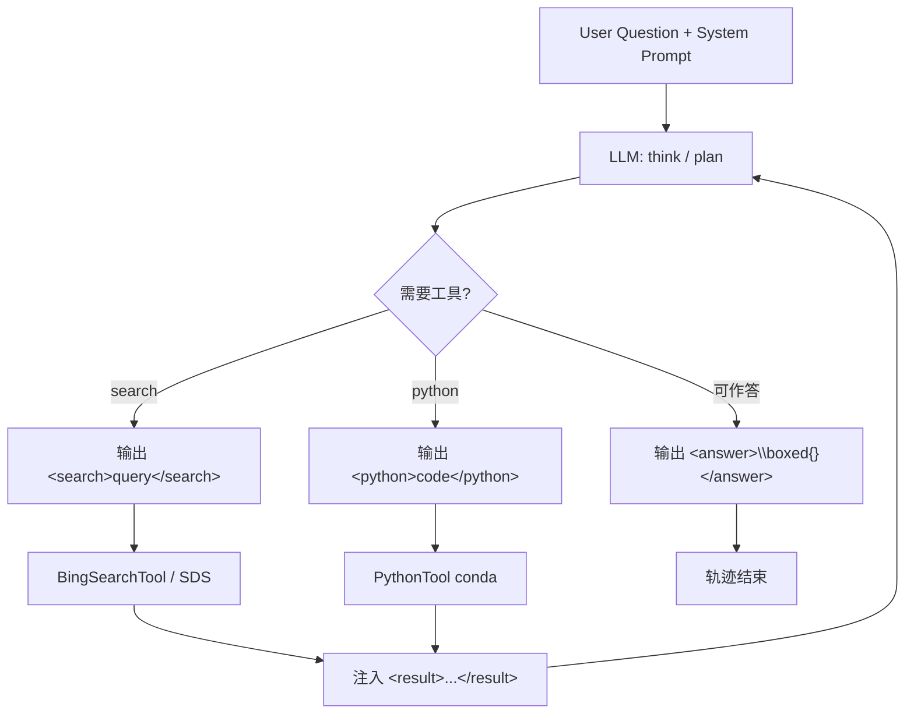
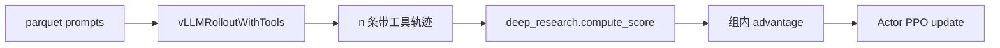
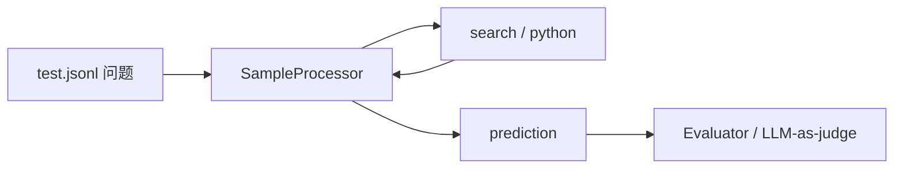

# ARPO Agent 架构、工具与 Workflow

本文说明本仓库里 **Agent 是什么形态、能调哪些工具、一轮交互怎么跑**。路径相对仓库根目录 `ARPO/`。

相关文档：

- 总览：[`ARPO_TECHNICAL_REPORT.md`](ARPO_TECHNICAL_REPORT.md)
- Rollout 熵分支：[`ARPO_ROLLOUT_SAMPLING.md`](ARPO_ROLLOUT_SAMPLING.md)

---

## 0. 一句话结论

本仓库的 Agent **不是** LangGraph / AutoGen / OpenAI Agents SDK 那类多 Agent 编排框架，也 **不是** function-calling JSON schema 工具调用。

它是一个 **单 LLM + XML 标签触发工具** 的 **Tool-Integrated Reasoning（TIR）/ ReAct 变体**：

1. System prompt 规定可用工具和标签协议  
2. 模型在 `<think>` 里推理，需要外部信息时输出 `<search>` / `<python>`  
3. 运行时截停、执行工具、把结果包进 `<result>` 写回上下文  
4. 模型继续推理，直到输出 `<answer>...\\boxed{}...</answer>`

训练时这套循环嵌在 VERL rollout 里；评测时是独立的异步 vLLM 客户端循环。工具集合相同：**Bing 搜索（Bright Data）** 与 **本地 Python 解释器**。

---

## 1. 架构总览

```text
┌─────────────────────────────────────────────────────────────┐
│                     Policy LLM (Actor)                       │
│         Qwen2.5 / Qwen3 / Llama3.1 / QwQ ...                 │
└───────────────────────────┬─────────────────────────────────┘
                            │ 生成 XML 文本
                            ▼
┌─────────────────────────────────────────────────────────────┐
│              Agent Runtime（两条实现，协议相同）               │
│  训练主路径: vLLMRolloutWithTools  (mode=sync_with_tool)     │
│  训练备选:   ToolAgent + vLLMAgentRollout (mode=agent)       │
│  评测路径:   SampleProcessor + ToolExecutor                  │
└───────────────┬─────────────────────────────┬───────────────┘
                │                             │
       ┌────────▼────────┐           ┌────────▼────────┐
       │  Search Tool    │           │  Python Tool    │
       │  trigger=search │           │  trigger=python │
       │  Bright Data    │           │  conda subprocess│
       │  Bing SERP      │           │  python -c      │
       └────────┬────────┘           └────────┬────────┘
                │                             │
                └──────────────┬──────────────┘
                               ▼
                     <result>...</result>
                     写回上下文，继续生成
```

| 维度 | 本仓库做法 |
|---|---|
| Agent 数量 | **单 Agent**（一个 policy LLM） |
| 规划风格 | ReAct / TIR：think → act(tool) → observe → think → answer |
| 工具调用协议 | **XML 标签**，不是 OpenAI `tools=` / JSON function call |
| 控制流 | 运行时用 vLLM `stop` 序列截停；评测侧解析 `</search>` / `</python>` |
| 记忆 | **整段对话上下文**（prompt + 历史生成 + 工具结果），无独立向量记忆模块 |
| 多工具并行 | 训练侧 batch 内多轨迹可并发调工具；**单条轨迹同一时刻通常只触发一个工具标签** |

---

## 2. 交互协议（所有路径共用）

### 2.1 标签语义

| 标签 | 谁写 | 含义 |
|---|---|---|
| `<think>...</think>` | 模型 | 内部推理（可多轮出现） |
| `<search>...</search>` | 模型 | 调用搜索；内容是 query |
| `<python>...</python>` | 模型 | 调用解释器；内容是代码 |
| `<result>...</result>` | **运行时** | 工具返回，注入上下文 |
| `<answer>...\\boxed{...}...</answer>` | 模型 | 最终答案；reward / 评测抽 box |

Stop 序列（训练）：`</search>`、`</python>`。模型一旦吐出闭合标签，本轮生成结束，进入工具执行。

### 2.2 System prompt 教什么

评测侧模板在 [`evaluation/src/prompt_manager.py`](evaluation/src/prompt_manager.py)。训练数据的 system 消息与 `code_search` 模板同族（见 `deep_research.py` 示例），核心要求：

> 逐步思考；需要事实时用 Wikipedia/Bing 搜索；需要计算时用 Python；推理放在 `<think>`，答案放在 `<answer>`，最终答案用 `\\boxed{}`。

`prompt_type` 决定开放哪些工具：

| `prompt_type` | 可用工具 | 典型场景 |
|---|---|---|
| `code_search` | search + python | 默认 Deep Search / 综合推理 |
| `search` | 仅 search | 开放域 QA |
| `math` | 仅 python | 数学计算 |
| `base` | 无工具 | 纯推理基线 |
| `code_search_cn` | search + python | 中文数据集 |
| `react` | 主要 search | ReAct 文风变体 |
| `gemini` / `claude` | search + python | 更长的英文规范说明 |

训练 parquet 里的 `prompt` 字段已经是带 system/user 的 chat messages；RL 时 `RLHFDataset` 做 `apply_chat_template`，**不会再走** `PromptManager`。评测才用 `PromptManager`。

### 2.3 一条合法轨迹长什么样

```text
<think> 先拆问题……需要查一个事实 </think>
<search> some entity or question </search>
<result>
  …Bright Data 返回的摘要片段…
</result>
<think> 根据结果，还要算一下 </think>
<python>
print(1+1)
</python>
<result>
2
</result>
<think> 可以作答了 </think>
<answer> The final answer is \[ \boxed{2} \] </answer>
```

Reward（训练）会检查：think/answer 成对、search/python 与 result 顺序正确、answer 里有 `\\boxed{}`。格式错直接 **-1**。

---

## 3. 能调用哪些工具

仓库里 **业务上只有两类工具**。实现有训练版 / 评测版两套代码，协议一致。

### 3.1 Search（`trigger_tag = "search"`）

| | 训练 | 评测（基础） | 评测（SDS） |
|---|---|---|---|
| 类 | `BingSearchTool` | `BingSearchTool` | `BingSearchToolSDS` |
| 路径 | `verl/.../rollout/tools/search_tool.py` 或 `agent/tools/search_tool.py` | `evaluation/src/tools/search_tool.py` | `evaluation/src/tools/search_tool_sds.py` |
| 后端 | Bright Data `https://api.brightdata.com/request` → Bing SERP | 同左 | 同左 + **抓取网页正文** + **摘要 LLM** |
| 输入 | `<search>` 内查询字符串 | 同左 | 同左 |
| 输出 | 若干结果标题/摘要拼接，截断到 `result_length` | 同左 | 对 top URL 抽正文，再用 summarization 模型压成短证据 |
| 缓存 | JSON 文件（`search_cache.json`） | SQLite 类 cache manager | search cache + url cache |

关键参数（yaml / 脚本）：

- `api_key` / `zone`：Bright Data  
- `max_results`：默认 10  
- `result_length`：每条/总摘要长度上限  
- `location`：如 `cn`  
- SDS 额外：`summ_model_urls`、`summ_model_path`、网页抽取（可选 Jina Reader）

语言：query 用 `langid` 判中英文，设置 Bing `mkt` / `setLang`。

### 3.2 Python（`trigger_tag = "python"`）

| | 训练 | 评测 |
|---|---|---|
| 类 | `PythonTool` | `PythonTool` |
| 路径 | `verl/.../rollout/tools/python_tool.py` | `evaluation/src/tools/python_tool.py` |
| 执行 | `{conda_path}/envs/{conda_env}/bin/python -c code` | 类似，可限制并发 |
| 预处理 | 若最后一句是表达式，自动包成 `print(...)` | 视实现而定 |
| 超时 | 默认 120s | 默认 120s |
| 安全 | **本地 conda 子进程，非沙箱隔离**；依赖你配的 env | 同左 |

没有单独的「计算器 / 代码沙箱 API」工具——数学计算就靠这个解释器。

### 3.3 没有内置、但框架支持扩展的

`BaseTool` 抽象只有：

```python
name: str
trigger_tag: str
execute(content: str) -> str
```

新工具 = 新类 + yaml `tool_instances` 登记 + prompt 里教模型写对应 XML。当前官方脚本 **没有** 注册 browser、终端、文件、多 Agent 通信等工具。

VERL 上游 `examples/sglang_multiturn` 里还有 `SandboxFusionTool` 等示例，**ARPO 主训练路径未使用**。

### 3.4 调用次数限制

| 场景 | Search | Python | 总工具 |
|---|---|---|---|
| 训练 yaml `tools.call_limit` | 计入同一计数器 | 计入同一计数器 | 默认 3～5（每条轨迹） |
| 评测 | `max_search_times`（如 3） | `max_python_times`（如 5） | 分开计 |
| 评测 completion 模式 | 超限会注入「不许再搜」的 `<result>` | 同理 | 另禁重复 query |

---

## 4. 训练侧：两套 Runtime，一种协议

官方 ARPO 脚本：

```bash
actor_rollout_ref.rollout.mode=sync_with_tool
```

因此 **日常训练走的是 A**，不是 B。

### 4.1 路径 A（主路径）：`vLLMRolloutWithTools`

文件：[`ARPO/verl_arpo_entropy/verl/workers/rollout/vllm_rollout/vllm_rollout_with_tools.py`](ARPO/verl_arpo_entropy/verl/workers/rollout/vllm_rollout/vllm_rollout_with_tools.py)

挂载点：[`fsdp_workers.py`](ARPO/verl_arpo_entropy/verl/workers/fsdp_workers.py) 在 `mode == "sync_with_tool"` 时实例化。

特点：

- **没有** 显式 `Agent` 类；Agent 行为内嵌在 `generate_sequences` 的 `while active_indices` 循环里  
- 工具直接加载：`rollout.tools.tool_instances`  
- 额外做 ARPO **熵自适应分支**（见 `ARPO_ROLLOUT_SAMPLING.md`）  
- 工具结果 token 的 `loss_mask=0`，模型生成 token 为 `1`

Workflow：

```text
每个 prompt 复制 initial_rollouts 条轨迹
        │
        ▼
┌── while 还有 active 轨迹 ──────────────────────────┐
│  1. vLLM 生成（stop=</search>|</python>，n=1）      │
│  2. 计算本轮熵（用于是否 fork）                      │
│  3. 若命中工具标签：                                 │
│       抽 <tag>内容</tag> → ThreadPool 执行工具       │
│       追加 " <result>\n...\n</result>"（mask=0）     │
│  4. 若 EOS：该轨迹结束                               │
│  5. 若仍 active：按熵决定是否 copy 前缀 fork          │
│  6. 名额不足：可从裸 prompt 再开一条                  │
└────────────────────────────────────────────────────┘
        │
        ▼
每个 prompt 凑满 n 条 → 交给 GRPO reward / update
```

### 4.2 路径 B（备选）：`ToolAgent` + `vLLMAgentRollout`

文件：

- [`verl/workers/agent/base.py`](ARPO/verl_arpo_entropy/verl/workers/agent/base.py) — Gym 风格抽象  
- [`verl/workers/agent/tool_agent.py`](ARPO/verl_arpo_entropy/verl/workers/agent/tool_agent.py) — 具体 Agent  
- [`verl/workers/rollout/vllm_rollout/vllm_agent_rollout.py`](ARPO/verl_arpo_entropy/verl/workers/rollout/vllm_rollout/vllm_agent_rollout.py) — 驱动 `reset/step`  
- 配置样例：[`verl/workers/agent/agent.yaml`](ARPO/verl_arpo_entropy/verl/workers/agent/agent.yaml)

接口：

```text
BaseAgent
  reset(prompts, sampling_params)   # 初始化 batch 轨迹状态
  step() -> dones                   # 一步：生成 + 工具 + 更新状态
  get_final_responses()             # 取出 responses / loss_mask
```

`vLLMAgentRollout.generate_sequences`：

```text
agent.reset(...)
while not all dones:
    agent.step()
return pack(agent.get_final_responses())
```

与路径 A 的差异：

| | `sync_with_tool` | `agent` |
|---|---|---|
| 结构 | 单体 `generate_sequences` | Gym `reset/step` |
| 熵分支 | **有** | **无**（只有随机 `branch_probability`） |
| 工具加载 | `rollout.tools` | `agent.tools` + `ToolExecutor` |
| 官方脚本 | **使用** | 未默认开启 |

`AGENT_REGISTRY` 目前只注册了 `"tool_agent"`，预留了 `"react_agent"` 注释位，**没有第二套已实现 Agent**。

### 4.3 训练侧工具加载

yaml（[`scripts/config/ppo_trainer.yaml`](ARPO/scripts/config/ppo_trainer.yaml)）：

```yaml
actor_rollout_ref.rollout.tools:
  call_limit: 3
  max_workers: 64
  timeout: 120
  retry_count: 3
  tool_instances:
    python:
      class_path: verl.workers.rollout.tools.python_tool.PythonTool
      params: { conda_path: ..., conda_env: verl }
    search:
      class_path: verl.workers.rollout.tools.search_tool.BingSearchTool
      params: { api_key: ..., zone: ..., cache_file: ... }
```

动态 `importlib` 实例化，按 `trigger_tag` 进字典。部分脚本会把 search 的 `class_path` 改成 `verl.workers.agent.tools.search_tool.BingSearchTool`——两套实现功能接近，改代码时认准最终覆盖的路径。

---

## 5. 评测侧 Workflow

与训练 **协议相同、栈不同**：不经过 VERL / FSDP，而是 HTTP 调已部署的 vLLM。

### 5.1 组件

| 组件 | 文件 | 职责 |
|---|---|---|
| 入口 | `evaluation/infer.py` | 选 `infer_mode`，起异步推理 |
| 引擎 | `evaluation/src/inference_engine.py` | 建工具、并发跑样本 |
| 单样本循环 | `evaluation/src/sample_processor.py` | think–act–observe 主循环 |
| Prompt | `evaluation/src/prompt_manager.py` | system 模板 |
| 工具注册 | `evaluation/src/tools/tool_executor.py` | `identify_tool` / `extract_content` / `execute` |
| vLLM 池 | `evaluation/src/vllm_client_pool.py` | 多 endpoint |

`infer_mode`：

| 模式 | Processor | 行为 |
|---|---|---|
| `default` | `SampleProcessor` | 超限则停止调用并结束 |
| `completion` | `SampleProcessorCompletion` | 超限/重复 query 时仍注入反馈，让模型继续 |
| `completion_sds` | SDS 变体 | 搜索走 `BingSearchToolSDS`（深搜） |

### 5.2 单样本主循环

[`SampleProcessor.run`](evaluation/src/sample_processor.py)：

```text
messages = [system, user(question)]
in_context = chat_template(messages)

while True:
    output = await call_llm(stop=True)   # 生成到工具闭合标签或 answer
    追加到 output / in_context

    tag = identify_tool(output)          # 看有没有 </search> 或 </python>
    if tag == python and 未超限:
        code = extract(<python>)
        result = await python.execute(code)
        追加 <result>result</result>
    elif tag == search and 未超限:
        query = extract(<search>)
        result = await search.execute(query)
        追加 <result>result</result>
    else:
        若没有 </answer>，再无 stop 生成一次收尾
        break

prediction = extract_answer(完整 output)  # 抽 <answer> / \boxed{}
```

与训练循环的对照：

| | 训练 `vLLMRolloutWithTools` | 评测 `SampleProcessor` |
|---|---|---|
| 截停 | vLLM `stop` 参数 | 生成后字符串切分 + 可选再生成 |
| 上下文 | token id 列表原地 extend | 字符串 `in_context` 追加 |
| 分支采样 | ARPO 熵 fork，组大小 `n` | 通常 `n=1`；Pass@k 靠外层多次跑 |
| 工具并发 | 同 batch 多轨迹 ThreadPool | 多样本 asyncio；单样本串行工具 |

### 5.3 SDS（Simple Deep Search）多出来的一层

`BingSearchToolSDS` 在 SERP 之上：

1. 解析搜索结果里的 URL  
2. 抓取页面正文（`requests` + BeautifulSoup / pdfplumber；可选 Jina）  
3. 用 **另一台摘要模型**（`summ_model_*`）把长文压成与 query / 当前推理相关的短证据  
4. 把摘要当作 `<result>` 返回给主推理模型  

因此评测 Deep Search 需要 **两个** vLLM 服务：推理模型 + 摘要模型。训练侧默认 search 通常只返回 SERP snippet，**不**默认跑完整 SDS 管线（更快、更省）。

---

## 6. 端到端 Workflow 图

### 6.1 单条轨迹（训练或评测逻辑等价）



### 6.2 训练一步（含 GRPO）



### 6.3 评测一步



---

## 7. 和「常见 Agent 框架」的对照

| 框架特征 | 本仓库 |
|---|---|
| Planner–Executor 多模块 | 否；规划与执行都在同一 LLM 文本里 |
| 显式状态机 / LangGraph 节点 | 否；while + stop tag |
| OpenAI function calling | 否；XML |
| 多 Agent 对话 | 否；单 policy |
| 长期记忆 / RAG store | 否；仅上下文窗口 + 搜索缓存 |
| 环境 Gym | 仅 `mode=agent` 的 `ToolAgent` 接口像 Gym；主路径不暴露给用户 |

若要用一句话归类：**XML-tag Tool-Augmented LLM Agent（TIR），训练时用 VERL+vLLM 做带工具的 on-policy rollout。**

---

## 8. 文件地图（按「想改什么」）

| 目的 | 文件 |
|---|---|
| 改标签协议 / 教模型怎么调工具 | 训练：数据集 system prompt；评测：`evaluation/src/prompt_manager.py` |
| 改训练主循环（工具截停、注入、mask） | `verl/.../vllm_rollout_with_tools.py` |
| 改 Gym 式 Agent | `verl/workers/agent/tool_agent.py`、`vllm_agent_rollout.py` |
| 改搜索实现 / API | `rollout/tools/search_tool.py` 或评测 `evaluation/src/tools/search_tool*.py` |
| 改 Python 沙箱 | `*/python_tool.py` + conda 路径配置 |
| 注册新工具 | 实现 `BaseTool` → yaml `tool_instances` → 更新 prompt |
| 改评测循环 | `evaluation/src/sample_processor.py` |
| 改 SDS 深搜 | `evaluation/src/tools/search_tool_sds.py` |
| 改格式奖励 | `verl/utils/reward_score/deep_research.py` |

---

## 9. 实践注意

1. **主训练路径没有独立 Agent 类**——行为在 `vLLMRolloutWithTools` 里；别只在 `ToolAgent` 上改却期望官方脚本生效。  
2. **训练 search 与评测 SDS 不是同一深度**——线上指标若依赖网页正文+摘要，本地训练可能工具更「浅」。  
3. **Python 非强隔离**——任意代码在 conda env 里跑，生产环境需自行加固。  
4. **Bright Data 密钥**必须配进 yaml / 脚本，否则 search 全失败，模型会在空结果上硬编答案。  
5. **格式极严**——缺 `\\boxed{}` 或 tag 不成对，训练 reward 直接 -1，SFT 阶段要把协议打稳。

---

读完后若只关心「Agent 怎么干活」：记住 **单模型 + XML 双工具 + 截停注入循环**；官方训练入口是 `sync_with_tool`，评测入口是 `SampleProcessor`。
