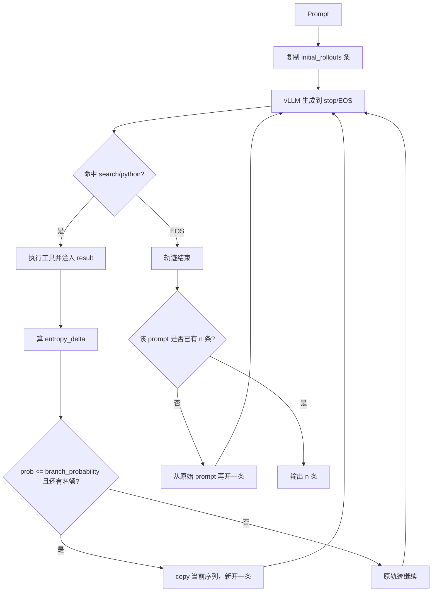

# ARPO 项目技术报告（面向改代码）

本文档拆解本仓库的完整训练/评测链路，说明 **用了哪些 RL 框架、主体实现在哪些文件、改某一类行为该动哪里**。路径均相对仓库根目录 `ARPO/`。

相关论文：

- ARPO：[Agentic Reinforced Policy Optimization](https://arxiv.org/abs/2507.19849)（ICLR 2026）
- AEPO：[Agentic Entropy-Balanced Policy Optimization](https://arxiv.org/abs/2510.14545)（WWW 2026 Oral）

---

## 0. 先读结论（改代码前必看）

1. **RL 底座是 VERL，而且用了。** 不是 pip 安装后直接调 API，而是把 VERL **整仓 vendored** 进仓库：
  - ARPO：`ARPO/verl_arpo_entropy/`（内部版本 `verl/version/version` = `0.3.1.dev`）
  - AEPO：`AEPO/verl_aepo_entropy/`
2. **没有独立的** `ARPOTrainer`**。** 入口就是 VERL 标准命令 `python3 -m verl.trainer.main_ppo`，训练循环是 `RayPPOTrainer.fit()`。
3. **策略优化算法是 GRPO，不是带 Critic 的 PPO。** 脚本覆盖 `algorithm.adv_estimator=grpo`，无 value head。外层 loss 仍是 VERL 的 dual-clip PPO surrogate。
4. **ARPO 的论文创新几乎全在 Rollout，不在 loss。** 核心文件只有一个：`vLLMRolloutWithTools`。高熵 tool-call 轮次对当前轨迹做前缀 fork。
5. **改 ARPO 行为不要去改** `verl/workers/agent/`**。** 官方脚本 `rollout.mode=sync_with_tool`，走的是 `vllm_rollout_with_tools.py`。`mode=agent` 的 `ToolAgent` 只有随机分支，没有熵自适应。
6. `examples/` **和** `recipe/` **里的 DAPO / SPPO / SPIN / PRIME / RLOO 不是本项目主路径。** 那是 VERL 自带的示例，改 ARPO 时可以当黑盒。

---


## 1. 项目定位与算法对照

本仓库是 **Agentic RL 系列** 代码：先可选 SFT cold-start，再用带搜索/Python 工具的多轮 Agent 做 RL，最后独立评测。同一套工程里有两个算法：


|             | 标准 GRPO                        | ARPO                                                | AEPO                                                  |
| ----------- | ------------------------------ | --------------------------------------------------- | ----------------------------------------------------- |
| Advantage   | 组内 `(r - mean) / std`，无 Critic | 同 GRPO                                              | 同 GRPO，再可选按 token 熵缩放 advantage                       |
| Rollout     | 每个 prompt 独立采样 `n` 条完整轨迹       | 先采 `initial_rollouts` 条，tool-call 后按熵 fork，直到凑满 `n` | ARPO 分支 + 可选动态分配初始条数 + 连续分支惩罚                         |
| Policy loss | dual-clip PPO                  | 同 VERL 标准 `compute_policy_loss`                     | 可选 Entropy Clipping-Balanced（对 clip 上界 stop-gradient） |
| 工具          | 无（或 SGLang multi-turn）         | vLLM + XML tag 触发 search/python                     | 同 ARPO                                                |
| Critic      | 不需要                            | 不需要                                                 | 不需要                                                   |


论文观察：LLM 在收到每一轮 tool 反馈后，**接下来生成的前若干 token 熵显著升高**。ARPO 把采样预算压到这些高不确定步骤上，用大约一半的 tool-call 量达到接近独立 `n` 采样的 GRPO 效果。

AEPO 认为 ARPO 会在连续高熵步骤上 **过度分支**，并且 PPO clip 会把高熵 token 的梯度压没。于是在 rollout 和 update 两端都做熵平衡。

---


## 2. 仓库目录地图

```
ARPO/                          # 仓库根
├── README.md
├── ARPO_TECHNICAL_REPORT.md   # 本报告
│
├── LLaMA-Factory/             # ① 可选 Cold-start SFT（vendored LLaMA-Factory）
│   └── arpo_train_sft/
│       ├── sft_train.sh
│       ├── yaml/qwen.yaml
│       └── dataset_info/
│
├── ARPO/                      # ② ARPO RL 训练
│   ├── requirements.txt       # 环境 freeze（含 verl==0.4.0 的 pin，见坑）
│   ├── scripts/               # 真正启动训练的 shell + hydra yaml
│   ├── rl_datasets/           # parquet
│   ├── search_cache/          # Bing 搜索缓存
│   ├── merge_ckpt/            # FSDP ckpt → HuggingFace
│   └── verl_arpo_entropy/     # ★ ARPO 定制版 VERL
│
├── AEPO/                      # ③ AEPO RL 训练（结构镜像 ARPO）
│   ├── scripts/
│   └── verl_aepo_entropy/     # ★ AEPO 定制版 VERL
│
└── evaluation/                # ④ 独立评测栈（不走 VERL trainer）
    ├── infer.py / infer_cn.py
    ├── evaluate.py
    ├── src/                   # 异步多轮推理 + 工具 + 打分
    ├── data/                  # 各 benchmark jsonl
    └── vllm_scripts/
```

四段流水线互不共享 Python 包路径：SFT 用 LLaMA-Factory；RL 用 `PYTHONPATH=.../verl_*_entropy`；评测用 `evaluation/src`。

---


## 3. RL 框架：VERL 用了什么、ARPO 改了哪一层


### 3.1 依赖栈


| 层           | 组件                                        | 角色                                                            |
| ----------- | ----------------------------------------- | ------------------------------------------------------------- |
| RL 训练循环     | **VERL HybridFlow**（本地 fork）              | Ray driver + worker RPC：rollout → reward → advantage → update |
| Advantage   | **GRPO**                                  | outcome reward，组内归一化                                          |
| Policy loss | VERL `compute_policy_loss`（dual-clip PPO） | ARPO 原样使用；AEPO 换成 entropy-balanced 版本                         |
| 训练并行        | **FSDP / FSDP2**                          | Actor 训练                                                      |
| 推理          | **vLLM**                                  | Rollout 生成；`rollout.name=vllm`                                |
| 调度          | **Ray**                                   | `ActorRolloutRefWorker` 等                                     |
| 配置          | **Hydra / OmegaConf**                     | `scripts/config/ppo_trainer*.yaml` + shell 覆盖                 |
| SFT         | **LLaMA-Factory** + DeepSpeed ZeRO-3      | 与 RL 完全分离                                                     |
| 未使用         | OpenRLHF、TRL trainer、DeepSpeed-Chat       | `trl` 只是间接依赖，不是训练循环                                           |


README 原文：RL 训练参考 [ReCall](https://github.com/Agent-RL/ReCall) 和 [VERL](https://github.com/volcengine/verl)。

### 3.2 VERL 如何被接进来

不是 git submodule（仓库无 `.gitmodules`）。训练脚本：

```bash
export PYTHONPATH="<your_path_to_ARPO>"/verl_arpo_entropy:$PYTHONPATH
python3 -m verl.trainer.main_ppo --config-path=... --config-name=ppo_trainer.yaml ...
```

因此 **真正 import 的是本地 fork**，不是 site-packages 里的包。

版本冲突（改环境时注意）：

- 本地 fork：`ARPO/verl_arpo_entropy/verl/version/version` → `0.3.1.dev`
- `ARPO/requirements.txt` 同时 pin 了 `verl==0.4.0`
- 评测 `evaluation/requirement.txt` 也 pin 了 `verl==0.4.0`

只要 `PYTHONPATH` 指向 fork，pip 的 `verl==0.4.0` 不会进训练路径。不要用 `pip install -e` 覆盖本地 fork，也不要假设 API 与官方 0.4.0 一致。

### 3.3 VERL 原有能力 vs ARPO 定制

VERL fork 里仍带完整基础设施和一堆 recipe。ARPO 主实验只用其中一小截：

```
VERL 原样使用（可当黑盒）
├── verl/trainer/main_ppo.py              入口
├── verl/trainer/ppo/ray_trainer.py       训练循环（仅 loss_mask 分支有定制）
├── verl/trainer/ppo/core_algos.py        GRPO + dual-clip PPO（ARPO 几乎原样）
├── verl/workers/actor/dp_actor.py        Actor update（ARPO 几乎原样）
├── verl/workers/fsdp_workers.py          Worker；新增了 sync_with_tool 分支
├── verl/single_controller/               Ray worker group
├── verl/workers/sharding_manager/        FSDP ↔ vLLM 权重同步
└── recipe/ examples/                     DAPO/SPPO/...  主实验不用

ARPO 真正新增/大改
├── verl/workers/rollout/vllm_rollout/vllm_rollout_with_tools.py   ★核心
├── verl/workers/rollout/tools/{base,search,python}_tool.py
├── verl/utils/reward_score/deep_research.py
├── ARPO/scripts/*.sh + scripts/config/ppo_trainer*.yaml
└──（备选，官方脚本不用）verl/workers/agent/ + vllm_agent_rollout.py
```

AEPO 在 ARPO 基础上再改：

- `verl/workers/rollout/vllm_rollout/vllm_rollout_with_tools.py`：动态初始 rollout、连续分支惩罚、分支公式符号相反
- `verl/trainer/ppo/core_algos.py`：新增 `compute_policy_loss_entropy_balanced_clipping`
- `verl/workers/actor/dp_actor.py`：调用上述 loss

---


## 4. 端到端数据流

```
可选 SFT (LLaMA-Factory)
        │  HF 权重
        ▼
ARPO/AEPO RL (VERL + vLLM + tools)
        │  FSDP sharded ckpt
        ▼
merge_ckpt → HuggingFace
        │
        ▼
evaluation/infer.py  (独立 vLLM + 工具)
        │  json/jsonl
        ▼
evaluation/evaluate.py  (规则 / LLM-as-judge)
```


### 4.1 Cold-start SFT（可选）

- 入口：`LLaMA-Factory/arpo_train_sft/sft_train.sh`
- 配置：`LLaMA-Factory/arpo_train_sft/yaml/qwen.yaml`
- 启动：`torchrun ... ../src/llamafactory/launcher.py yaml/qwen.yaml`
- 数据：HuggingFace `dongguanting/ARPO-SFT-54K`，在 `dataset_info.json` 里登记；yaml 里 `dataset: final_5w4_still`
- 关键超参：full SFT、DeepSpeed ZeRO-3 offload、`cutoff_len=15000`、`lr=7e-6`、3 epoch

要从 base 直接 RL，可以跳过这一步。

### 4.2 RL 数据

位置：`ARPO/rl_datasets/`（AEPO 脚本复用同一目录）


| 文件                                       | 用途                                                |
| ---------------------------------------- | ------------------------------------------------- |
| `train_10k.parquet`                      | Reasoning / Knowledge 训练（约 10K）                   |
| `valid.parquet`                          | Reasoning 验证                                      |
| `hard_search_1k.parquet`                 | Deep Search 训练（约 1K：SimpleDeepSearch + WebDancer） |
| `gaia_test.parquet` / `hle_test.parquet` | Deep Search 验证                                    |


加载类：`ARPO/verl_arpo_entropy/verl/utils/dataset/rl_dataset.py` 的 `RLHFDataset`。

关键字段（改数据必须对齐）：


| 字段                          | 含义                                                            |
| --------------------------- | ------------------------------------------------------------- |
| `prompt`                    | chat messages 列表（`role` / `content`），`data.prompt_key=prompt` |
| `reward_model.ground_truth` | 规则奖励的答案                                                       |
| `data_source`               | 传给 reward function 的数据源标签                                     |


处理：`datasets.load_dataset("parquet")` → `tokenizer.apply_chat_template` → 过滤超长 prompt → collate 成 `DataProto`。

### 4.3 Checkpoint 转换

训练存的是 FSDP sharded actor。转 HF：

```bash
bash ARPO/merge_ckpt/convert_checkpoint_from_verl_to_hf_qwen3.sh
```

实际调用 `convert_checkpoint_from_verl_to_hf.py merge --backend fsdp`，输入 `global_step_*/actor`，输出 HF 目录。评测加载的是这份 HF 权重，不是 FSDP shard。

---


## 5. ARPO 训练逐步拆解


### 5.1 启动入口

官方脚本：


| 脚本                                          | 任务              | 配置                    |
| ------------------------------------------- | --------------- | --------------------- |
| `ARPO/scripts/ARPO_7B_Reasoning_1node.sh`   | 数学/知识推理         | `ppo_trainer.yaml`    |
| `ARPO/scripts/ARPO_8B_Deepsearch_1node.sh`  | Deep Search     | `ppo_trainer_dr.yaml` |
| `ARPO/scripts/ARPO_14b_Deepsearch_1node.sh` | Deep Search 14B | `ppo_trainer_dr.yaml` |


公共模式：

```text
python3 -m verl.trainer.main_ppo
  algorithm.adv_estimator=grpo
  actor_rollout_ref.rollout.name=vllm
  actor_rollout_ref.rollout.mode=sync_with_tool
  reward_model.reward_manager=naive
  custom_reward_function.path=.../deep_research.py
  custom_reward_function.name=compute_score
```

调用链：

```
main_ppo.py::main
  → run_ppo() 初始化 Ray
  → TaskRunner.run()
      下载模型、建 tokenizer
      按 actor.strategy=fsdp 选择 ActorRolloutRefWorker
      load_reward_manager() 加载 NaiveRewardManager + custom compute_score
      构造 RayPPOTrainer
      trainer.fit()
```

关键文件：

- `ARPO/verl_arpo_entropy/verl/trainer/main_ppo.py`
- `ARPO/verl_arpo_entropy/verl/trainer/ppo/ray_trainer.py`（`RayPPOTrainer`，约 L347 定义，`fit` 约 L937）
- `ARPO/verl_arpo_entropy/verl/workers/fsdp_workers.py`（约 L432：`sync_with_tool` → `vLLMRolloutWithTools`）

`adv_estimator=grpo` 时 `RayPPOTrainer.__init__` 设 `self.use_critic = False`（约 L400–411），Critic worker 不会做 value 更新。

### 5.2 `fit()` 一步在干什么

`RayPPOTrainer.fit()`（`ray_trainer.py` L937 起）每步：

```
1. dataloader 取一个 batch（prompt）
2. generate_sequences          # vLLMRolloutWithTools：工具循环 + 熵分支
3. batch.repeat(n) 后 union 生成结果
4. 构造 response_mask
5. compute_reward              # NaiveRewardManager + deep_research.compute_score
6. compute_log_prob            # 当前 actor 重算 old_log_probs
7. compute_ref_log_prob        # 可选；脚本 kl_coef=0，结构仍在
8. compute_advantage           # GRPO
9. update_actor                # dual-clip PPO
10. 周期性 save / validate / 把 rollout 落到 trainer.rollout_data_dir
```

Driver 进程只做 RPC 编排和 advantage 计算；重计算在 GPU worker 上。

### 5.3 Rollout 如何接到 `vLLMRolloutWithTools`

`fsdp_workers.py` 约 L426–437：

```python
if self.config.rollout.mode == "sync":
    vllm_rollout_cls = vLLMRollout
elif self.config.rollout.mode == "async":
    vllm_rollout_cls = vLLMAsyncRollout
elif self.config.rollout.mode == "sync_with_tool":
    from verl.workers.rollout.vllm_rollout.vllm_rollout_with_tools import vLLMRolloutWithTools
    vllm_rollout_cls = vLLMRolloutWithTools
elif self.config.rollout.mode == "agent":
    from verl.workers.rollout.vllm_rollout.vllm_agent_rollout import vLLMAgentRollout
    vllm_rollout_cls = vLLMAgentRollout
```

官方脚本只用 `sync_with_tool`。`agent` 是另一套 Gym-like `reset/step` 封装，分支不看熵。

---


## 6. ARPO 核心：熵自适应分支 Rollout

文件：`ARPO/verl_arpo_entropy/verl/workers/rollout/vllm_rollout/vllm_rollout_with_tools.py`

类：`vLLMRolloutWithTools(vLLMRollout)`

### 6.1 超参含义

由 yaml 提供默认值，**shell 会覆盖**。yaml 里 `n: 1`、`beam_size: 1.` 只是占位，以脚本为准。


| 配置项                          | 脚本典型值 | 含义                                    |
| ---------------------------- | ----- | ------------------------------------- |
| `rollout.n`                  | 16    | 每个 prompt **最终**要产出的轨迹数（GRPO 组大小）     |
| `rollout.initial_rollouts`   | 8     | 一开始并行跑几条（共享同一 prompt）                 |
| `rollout.beam_size`          | 2     | 每个 active 源一次最多再 fork `beam_size-1` 条 |
| `rollout.branch_probability` | 0.5   | 分支阈值                                  |
| `rollout.entropy_weight`     | 0.2   | 熵差对随机数的偏移强度                           |
| `tools.call_limit`           | 3     | 单条轨迹最大工具调用次数                          |
| `tools.max_workers`          | 64    | 工具线程池                                 |
| `tools.timeout`              | 120   | 单次工具超时（秒）                             |


Deep Search 8B 还会把 `max_prompt_length=2000`、`max_response_length=10000` 拉长。

### 6.2 多轮循环

`generate_sequences()`（约 L181）主循环：

1. 每个 prompt 复制 `initial_rollouts` 份，记入 `curr_inputs` / `init_inputs` / `result_masks` / `call_counters`。
2. 对所有 active 序列调用 vLLM：`n=1`，`stop=["</search>", "</python>"]`，`logprobs=10`。
3. 看 `finish_reason` / `stop_reason`：
  - stop 且命中 `</search>` 或 `</python>` → 抽标签内文本，线程池执行工具，把  `<result>\n...\n</result>` **追加进 context**。
  - `length` 且未到 `response_length` → 继续生成。
  - EOS → 该轨迹结束。
  - 超过 `call_limit` → 补 EOS，结束。
4. 在仍 active 的轨迹上做熵分支（下一小节）。
5. 已结束但该 prompt 还不满 `n` 条：从 **原始 prompt** 再开一条（不是 fork）。
6. 循环直到没有 active。最后每个 prompt 取前 `n` 条；不够就 **复制最后一条** 凑数。

工具结果 token 的 mask 为 0，模型自己生成的 token mask 为 1。最终写入 batch 的 `loss_mask`（约 L624–631）。

### 6.3 熵怎么算、怎么决定 fork

熵（`_calc_entropy`，约 L172–177）：

```python
def _calc_entropy(self, logprobs):
    p_list = [math.exp(l) for l in logprobs]
    entropy = -sum(p * l for p, l in zip(p_list, logprobs))
    return entropy
```

每轮生成后，取 **前 20 个 token**、每个位置 top-`logprobs` 的 logprob，算 Shannon entropy，再除以 `log(vocab_size)` 归一化（约 L283–305）。该轨迹第一次出现的熵记为 `initial_entropy_dict[idx]`。

分支判定（约 L468–477）：

```python
entropy_now = current_entropy_dict.get(source_idx, 0.0)
entropy_init = self.initial_entropy_dict.get(source_idx, 0.0)
entropy_delta = entropy_now - entropy_init
prob = random.random() - self.entropy_weight * entropy_delta
prob = max(0.0, min(1.0, prob))
if prob > self.branch_probability:
    continue   # 不 fork
# 否则 copy curr_inputs[source_idx] 创建新轨迹
```

直观含义：

- `entropy_delta > 0`（相对初始更不确定）→ 从随机数里减掉一块 → `prob` 变小 → 更不容易 `> 0.5` → **更常 fork**。
- `entropy_weight=0` 时退化为纯随机：`P(fork)=branch_probability`。
- fork 是 **token 序列 copy**（共享到 fork 点为止的 prompt + 已有 tool 交互），不是 KV-cache 共享。

每个 prompt 的总轨迹数被 `n` 卡住：`remaining_slots = n - rollouts_per_sample[orig]`。




### 6.4 备选路径 `ToolAgent`（不要当 ARPO 主实现）

- `ARPO/verl_arpo_entropy/verl/workers/agent/tool_agent.py`
- `ARPO/verl_arpo_entropy/verl/workers/rollout/vllm_rollout/vllm_agent_rollout.py`

同样有 `initial_rollouts` / `beam_size` / `branch_probability`，但分支条件只是 `random.random() > branch_probability`（约 L336），**没有熵项**。`mode=agent` 才走这里。改 ARPO 论文行为必须改 `vLLMRolloutWithTools`。

---


## 7. Reward、Mask、Advantage、Loss、KL


### 7.1 Reward

加载：`verl/trainer/ppo/reward.py` 的 `get_custom_reward_fn` + `load_reward_manager`。

脚本指定：

```text
reward_model.reward_manager=naive
custom_reward_function.path=.../verl/utils/reward_score/deep_research.py
custom_reward_function.name=compute_score
```

`NaiveRewardManager`（`verl/workers/reward_manager/naive.py`）：逐条 decode response，调 `compute_score`，把标量 reward **写在该 response 最后一个有效 token 上**（L89：`reward_tensor[i, valid_response_length - 1] = reward`）。这是 outcome reward：`sum(token_level_rewards) == 标量分数`。

`deep_research.compute_score`（`verl/utils/reward_score/deep_research.py` L282）规则：


| 情况                                                                               | `score`      |
| -------------------------------------------------------------------------------- | ------------ |
| `<think>` / `<answer>` 不成对，或 search/python 与 result 嵌套乱序，或 answer 里没有 `\boxed{}` | **-1**       |
| 抽不出 answer / 抽 box 失败                                                            | **-1**       |
| 格式对，F1=0                                                                         | **0**        |
| 格式对，F1>0                                                                         | **F1**       |
| F1>0 且同时出现 `</search>` 和 `</python>`                                             | **F1 + 0.1** |


F1 是对 `\boxed{}` 内容和 `ground_truth` 做 normalize 后的 token overlap。改奖励函数只动这一个文件即可。

### 7.2 `loss_mask` vs `response_mask`

Rollout 里：

- 模型生成 token：`result_masks.append(1)`
- 工具回填 token：`result_masks.append(0)`
- pad：0
- 再乘 EOS 之后的 `response_attention_mask`

输出字段名是 `loss_mask`（`vllm_rollout_with_tools.py` L629）。

两处用法不一致，改 mask 时必须两边一起看：


| 位置                                         | 何时用 `loss_mask`                                 |
| ------------------------------------------ | ----------------------------------------------- |
| Actor `dp_actor.update_policy` L326 / L370 | batch 里 **有** `loss_mask` 就用（不依赖 multi_turn 开关） |
| GRPO `compute_advantage` L255–261          | 仅当 `rollout.multi_turn.enable=True`             |


官方 yaml 默认 `multi_turn.enable: False`。三个 ARPO 脚本都写了 `actor_rollout_ref.rollout.multi_turn.enable=${ENABLE_MULTI_TURN}`，但 **shell 里没有定义** `ENABLE_MULTI_TURN`。Hydra 拿到空值时行为取决于解析结果；按 yaml 默认则 GRPO 仍用 `response_mask`，工具 token 也会摊到 advantage 上。Actor 侧只要有 `loss_mask` 就不会对工具 token 回传梯度。

这是本仓库最容易踩的实现缝。若希望 GRPO 也不把 advantage 铺到工具 token 上，应显式设 `ENABLE_MULTI_TURN=True`，或改 `compute_advantage` 在存在 `loss_mask` 时一律使用它。

### 7.3 GRPO Advantage

`core_algos.compute_grpo_outcome_advantage`（`verl/trainer/ppo/core_algos.py` L113）：

```python
scores = token_level_rewards.sum(dim=-1)          # 标量 reward
# 按 uid（同一 prompt 的 n 条）分组
scores[i] = (scores[i] - group_mean) / (group_std + eps)
advantages = scores.unsqueeze(-1) * response_mask # 广播到 token
```

`uid` 在 `fit()` 里对原始 prompt 生成再 `repeat(n)`（`ray_trainer.py` L1028–1031），所以组大小等于 `rollout.n`。

`norm_adv_by_std_in_grpo=True`（默认）是原版 GRPO；设 False 则变成 Dr.GRPO（只减均值）。

### 7.4 Policy Loss

ARPO 走 `dp_actor.py` 的 `compute_policy_loss`（`core_algos.py` 约 L512）：


L = \mathrm{agg}\big(\max(-A\cdot r, -A\cdot \mathrm{clip}(r, 1-\epsilon, 1+\epsilon))\big)


负 advantage 时再套 dual-clip 下界 `clip_ratio_c=3.0`。`loss_agg_mode=token-mean`。

脚本：`clip_ratio=0.2`，`ppo_epochs=1`，`entropy_coeff=0`（**没有 entropy bonus**；熵只用于 rollout 分支）。

### 7.5 KL

VERL 有两条 KL 通路，ARPO 脚本两条系数都是 0：

```text
algorithm.kl_ctrl.kl_coef=0.0          # reward 内 KL
actor.use_kl_loss=True
actor.kl_loss_coef=0.0                 # loss 内 KL（low_var_kl）
actor.kl_loss_type=low_var_kl
```

结构还在（会算 ref logprob），但 **实际不加 KL 约束**。要加正则，改 `kl_loss_coef` 即可，不必改代码。

---


## 8. 工具协议与缓存


### 8.1 Prompt / XML 协议

模型被要求用标签调用工具、给出答案。训练 reward 与 rollout stop 序列都认这些 tag：

```text
<think> ... </think>
<search> 查询 </search>
<result> 搜索结果 </result>
<python> 代码 </python>
<result> 解释器输出 </result>
<answer> ... \boxed{最终答案} </answer>
```

Rollout 的 stop sequences 是 `</search>`、`</python>`（由已加载工具的 `trigger_tag` 拼出来）。

### 8.2 工具类

抽象：`ARPO/verl_arpo_entropy/verl/workers/rollout/tools/base_tool.py`


| 工具      | 文件                                              | `trigger_tag` | 实现                                                      |
| ------- | ----------------------------------------------- | ------------- | ------------------------------------------------------- |
| Bing 搜索 | `rollout/tools/search_tool.py` `BingSearchTool` | `search`      | Bright Data SERP API，带文件缓存与文件锁                          |
| Python  | `rollout/tools/python_tool.py` `PythonTool`     | `python`      | 指定 conda env 的 `python -c`，超时默认 120s；最后一个表达式会包成 `print` |


yaml 动态加载（`ppo_trainer.yaml` 的 `actor_rollout_ref.rollout.tools.tool_instances`）：

```yaml
python:
  class_path: verl.workers.rollout.tools.python_tool.PythonTool
  params:
    conda_path: <your_conda_path>
    conda_env: verl
search:
  class_path: verl.workers.rollout.tools.search_tool.BingSearchTool
  params:
    api_key: <your_api_key>
    zone: <your_zone>
    cache_file: <your_search_cache_path>
    async_cache_write: true
```

`vLLMRolloutWithTools.__init__` 用 `importlib` 按 `class_path` 实例化，按 `trigger_tag` 放进 `self.tools`。

搜索缓存默认写 `ARPO/search_cache/search_cache.json`，跨进程用 `fcntl` 锁，可异步落盘。改搜索后端（换 Google / 自建 retriever）主要改 `BingSearchTool._make_request` 或换一个 `class_path`。

### 8.3 两套 tools 目录


| 路径                            | 谁在用                  |
| ----------------------------- | -------------------- |
| `verl/workers/rollout/tools/` | `sync_with_tool` 主路径 |
| `verl/workers/agent/tools/`   | `mode=agent`         |


Reasoning 脚本还把 search 的 `class_path` 覆盖成 `verl.workers.agent.tools.search_tool.BingSearchTool`（`SEARCH_CLASS_PATH`），和 yaml 默认的 `rollout.tools` 不一致。两套类名相同、行为接近，但改搜索逻辑时要确认脚本最终覆盖的是哪一个。

---


## 9. AEPO：三个开关分别改什么

AEPO 脚本：`AEPO/scripts/AEPO_Qwen25_7B_DeepResearch.sh`、`AEPO_Qwen3_14B_DeepResearch.sh`。`PYTHONPATH` 指向 `AEPO/verl_aepo_entropy`。数据仍用 `ARPO/rl_datasets/`。

三个开关：


| 开关                                  | 默认脚本值 | 作用位置                            |
| ----------------------------------- | ----- | ------------------------------- |
| `ENABLE_DYNAMIC_ROLLOUTS`           | False | `vllm_rollout_with_tools.py`    |
| `ENABLE_ENTROPY_BALANCED_CLIPPING`  | True  | `dp_actor.py` → `core_algos.py` |
| `ENABLE_ENTROPY_BALANCED_ADVANTAGE` | True  | 同上                              |


### 9.1 Dynamic Entropy-Balanced Rollout

文件：`AEPO/verl_aepo_entropy/verl/workers/rollout/vllm_rollout/vllm_rollout_with_tools.py`

`enable_dynamic_rollouts=True` 时，真正采样前先跑 Phase 1：`_calculate_initial_rollouts_dynamical`（约 L206）：

1. 对每个 prompt 短生成，算初始熵 H_{root}
2. 再跑一遍带工具的生成，收集各 step 熵，平均得 H_{high}
3. d = H_{root} - H_{high}，\sigma = \mathrm{sigmoid}(0.5 d)
4. `initial_rollouts = clamp(int(n * σ) + 1, 1, n)`

H_{root} 相对后续步更高 → 全局多采、少留给分支；反之把预算留给后续 fork。

脚本默认 **关掉** 这一项（`ENABLE_DYNAMIC_ROLLOUTS=False`），退回固定 `initial_rollouts`。打开会多一次探测 rollout，更慢。

### 9.2 分支公式与连续惩罚

AEPO 与 ARPO **符号相反**（约 L947）：

```python
# ARPO
prob = random.random() - self.entropy_weight * entropy_delta
if prob > branch_probability: continue

# AEPO
prob = random.random() + self.entropy_weight * entropy_delta
prob = prob * (1.0 - 0.05 * consecutive_branches)
if prob < branch_probability: continue
```

再乘连续分支惩罚：同一 prompt 连续多轮都 fork，`consecutive_branches` +1，`penalty_factor = 1 - 0.05 * k`，降低再 fork 的概率，避免高熵步骤连环爆炸。

比较两个 fork 条件时不要只看 `entropy_weight`，连判断方向（`>` vs `<`）一起看。

### 9.3 Entropy-Balanced Policy Optimization

文件：

- `AEPO/verl_aepo_entropy/verl/trainer/ppo/core_algos.py` 的 `compute_policy_loss_entropy_balanced_clipping`（约 L571）
- `AEPO/verl_aepo_entropy/verl/workers/actor/dp_actor.py`（约 L88–93 读开关，L545 调用）

**Entropy-aware Advantage**（`enable_entropy_balanced_advantage`）：

```python
entropy_normalized = (entropy - mean) / std
advantages = advantages * (1 + 0.2 * entropy_normalized.detach())
```

高熵 token 的 |A| 放大 20% 量级，梯度更关注不确定位置。`detach` 所以熵本身不回传到 lm_head 以外的路径。

**Entropy Clipping-Balanced**（`enable_entropy_balanced_clipping`）：

标准 PPO 上界是常数 `1+ε`。AEPO 把上界改成：

```python
max_bound = (1 + cliprange_high) / ratio.detach() * ratio
```

等价于对 clip 上界做 stop-gradient，避免 `ratio` 很大时高熵 token 被 clip 掉后梯度为零。这是论文里的 Entropy Clipping-Balanced Mechanism。

实现注意：`dp_actor.py` 里 `calculate_entropy` 仍绑定 `entropy_coeff != 0`（约 L532–534），而 yaml `entropy_coeff: 0`。若 `entropy is None`，advantage 缩放会被 `if entropy is not None` 跳过，**clipping 开关仍生效**。若要让 entropy-aware advantage 真正起作用，需要让 `_forward_micro_batch(..., calculate_entropy=True)` 在该开关打开时强制算熵（改 `dp_actor.py` L531 附近）。

---


## 10. 评测流水线

评测 **不走 VERL trainer**，是另一套异步 vLLM 客户端 + 工具。

### 10.1 推理

入口：`evaluation/infer.py`（中文数据用 `infer_cn.py`）

`--infer_mode`：


| 值                | 类                             | 用途                              |
| ---------------- | ----------------------------- | ------------------------------- |
| `default`        | `AsyncInference`              | 基础多轮工具                          |
| `completion`     | `AsyncInferenceCompletion`    | 增加调用次数/重复 query 反馈              |
| `completion_sds` | `AsyncInferenceCompletionSDS` | Simple Deep Search（页面抽取 + 摘要模型） |


主脚本：`evaluation/infer_local_sds.sh`。需要先起推理 vLLM，Deep Search 还要起摘要模型（`evaluation/vllm_scripts/`）。

关键模块：


| 文件                                        | 职责                                                    |
| ----------------------------------------- | ----------------------------------------------------- |
| `evaluation/src/inference_engine.py`      | 异步调度                                                  |
| `evaluation/src/sample_processor.py`      | 单样本多轮                                                 |
| `evaluation/src/prompt_manager.py`        | prompt 模板（`code_search` / `search` / `math` / `base`） |
| `evaluation/src/data_loader.py`           | 读 `evaluation/data/<name>/test.jsonl`                 |
| `evaluation/src/vllm_client_pool.py`      | 多 endpoint 负载                                         |
| `evaluation/src/tools/tool_executor.py`   | 注册/执行工具                                               |
| `evaluation/src/tools/search_tool_sds.py` | SDS 搜索 + 网页抽取（可切 Jina）                                |
| `evaluation/src/tools/python_tool.py`     | 评测侧 Python 工具                                         |
| `evaluation/src/tools/cache_manager.py`   | 搜索/URL 缓存                                             |


覆盖数据集：GAIA、HLE、AIME24/25、MATH500、GSM8K、HotpotQA、2Wiki、Bamboogle、MuSiQue、WebWalker、SimpleQA、xbench 等。

### 10.2 打分

```bash
bash evaluation/evaluate.sh          # 或 evaluate_passk.sh
# 内部：evaluation/evaluate.py --task math|qa [--use_llm]
```

- `evaluation/src/evaluator.py`：`Evaluator`
- `evaluation/src/metrics.py`：数学等价 / QA 匹配
- `evaluation/src/llm_evaluator_sds.py`：用 Qwen2.5-72B 等做 LLM-as-judge
- 裁判模型启动：`evaluation/deploy_qwen2.5_72B_instruct.sh`

Pass@k 对同一题多次推理结果再聚合。

---


## 11. 改代码导航表

按「我想改什么」定位，避免在 VERL 海洋里迷路。


| 你想改的东西                       | 先打开这些文件                                                                                                  | 不要先动                                    |
| ---------------------------- | -------------------------------------------------------------------------------------------------------- | --------------------------------------- |
| 熵分支策略、fork 时机、`n` / beam 逻辑  | `ARPO/verl_arpo_entropy/verl/workers/rollout/vllm_rollout/vllm_rollout_with_tools.py`                    | `agent/tool_agent.py`、`examples/`       |
| 分支超参（不改算法）                   | `ARPO/scripts/ARPO_*.sh` 里 `INITIAL_ROLLOUTS` / `BEAM_SIZE` / `BRANCH_PROBABILITY` / `Entropy_weight`    | yaml 默认值（会被覆盖）                          |
| 切换 rollout 实现                | `fsdp_workers.py` L426–437；脚本 `ROLLOUT_MODE`                                                             | —                                       |
| 奖励规则、格式、F1、多工具 bonus         | `verl/utils/reward_score/deep_research.py` 的 `compute_score`                                             | `NaiveRewardManager`（只负责放置 token）       |
| 换 reward 文件                  | 脚本 `CUSTOM_REWARD_FUNCTION_PATH` / `NAME`                                                                | —                                       |
| 搜索 API / 缓存                  | `rollout/tools/search_tool.py`；确认脚本 `SEARCH_CLASS_PATH`                                                  | 评测侧 `evaluation/src/tools/`（训练时不会走到）    |
| Python 沙箱                    | `rollout/tools/python_tool.py` + yaml 的 conda 路径                                                         | —                                       |
| 新增一种工具                       | 仿 `BaseTool` 实现 `trigger_tag` + `execute`，登记到 yaml `tool_instances`；prompt 里教模型写对应 XML                   | 不必改 trainer                             |
| GRPO / Dr.GRPO / 换 advantage | `core_algos.py` `compute_grpo_outcome_advantage`；或脚本 `algorithm.adv_estimator`                           | Actor loss                              |
| PPO clip、dual-clip           | `core_algos.compute_policy_loss`；yaml `clip_ratio*`                                                      | Rollout                                 |
| 工具 token 是否进梯度               | `vllm_rollout_with_tools.py` 的 `result_masks`；`dp_actor.py` L370；`ray_trainer.py` L255 的 multi_turn      | —                                       |
| 打开 KL                        | 脚本 `kl_loss_coef`                                                                                        | 不必改 `kl_penalty` 实现                     |
| batch / 长度 / lr              | 对应 `ARPO_*.sh`                                                                                           | `verl/trainer/config/` 默认模板             |
| 训练数据字段                       | parquet schema + `RLHFDataset`                                                                           | —                                       |
| SFT                          | `LLaMA-Factory/arpo_train_sft/`                                                                          | VERL `fsdp_sft_trainer.py`（本项目 SFT 不走它） |
| AEPO 动态初始条数                  | AEPO 的 `vllm_rollout_with_tools.py` `_calculate_initial_rollouts_dynamical`；开关 `ENABLE_DYNAMIC_ROLLOUTS` | ARPO 那份文件                               |
| AEPO clip / advantage 熵平衡    | AEPO `core_algos.py` L571 + `dp_actor.py` L88、L545                                                       | ARPO 的 `compute_policy_loss`            |
| 评测 prompt / 工具 / 打分          | `evaluation/src/`                                                                                        | 训练 rollout                              |
| 权重导出                         | `ARPO/merge_ckpt/`                                                                                       | —                                       |


建议阅读顺序（ARPO）：

1. `ARPO/scripts/ARPO_7B_Reasoning_1node.sh`（看实际覆盖了哪些配置）
2. `vllm_rollout_with_tools.py`（算法主体）
3. `deep_research.py`（奖励）
4. `ray_trainer.py` 的 `fit()` + `compute_advantage()`
5. `dp_actor.py` 的 `update_policy()`
6. `fsdp_workers.py` 的 rollout 分支（只需确认 mode 映射）

---


## 12. 已知坑与实现细节

1. **两套 tool 实现。** `rollout/tools` vs `agent/tools`。官方训练是 `sync_with_tool`，但 Reasoning 脚本可能把 search `class_path` 指到 `agent.tools`。改搜索先看 shell 最终覆盖值。
2. `ENABLE_MULTI_TURN` **未定义。** 三个 ARPO 脚本都引用它，yaml 默认 `False`。结果：Actor 用 `loss_mask` 屏蔽工具 token，GRPO 可能仍用 `response_mask` 把 advantage 铺到工具 token 上。
3. **yaml 默认** `n=1`**、**`beam_size: 1.` **会被脚本覆盖。** 改超参改 shell，不要只改 yaml。
4. **轨迹不够** `n` **条会复制最后一条。** `vllm_rollout_with_tools.py` L545–548。分支太少或过早 EOS 时，GRPO 组里会出现重复样本，组方差被低估。
5. **已结束样本的补齐是从 prompt 重开，不是 fork。** 和论文「共享前缀再分支」不是同一条路径。
6. `kl_loss_coef=0` **仍可能跑 ref policy。** 费算力但不影响梯度。不想算 ref 需要再关 `use_kl_loss` / 不建 Ref worker。
7. **pip** `verl==0.4.0` **≠ 本地** `0.3.1.dev`**。** 训练只认 `PYTHONPATH`。
8. `examples/`**、**`recipe/` **不是 ARPO。** 里面的 DAPO/SPPO 脚本会误导。
9. `mode=agent` **没有熵自适应。** 不要在 `tool_agent.py` 里改 ARPO 论文算法。
10. **AEPO 分支符号与 ARPO 相反**，且 `if` 方向也相反。移植超参不能直接抄。
11. **AEPO entropy-aware advantage 可能被** `entropy_coeff=0` **静默关掉。** 见 §9.3。clipping 开关不受影响。
12. **PythonTool 的 import。** `rollout/tools/python_tool.py` 从 `verl.workers.agent.tools.base_tool` import `BaseTool`，和 `rollout/tools/base_tool.py` 又是另一份。改基类接口要两处一起改，或先把 import 统一。
13. **评测工具与训练工具不是同一份代码。** 训练改了 `BingSearchTool`，评测 `search_tool_sds.py` 不会自动变。
14. **Reward 格式极严。** think/answer 必须成对，answer 必须 `\boxed{}`，否则直接 -1。SFT 没把格式打稳时 RL 会大面积负奖励。

---


## 13. 典型超参速查（官方脚本）


### ARPO Reasoning 7B（`ARPO_7B_Reasoning_1node.sh`）

```text
data.train_files          train_10k.parquet
data.train_batch_size     128
actor.ppo_mini_batch_size 16
max_prompt_length         1536
max_response_length       4096
rollout.n                 16
initial_rollouts          8
beam_size                 2
branch_probability        0.5
entropy_weight            0.2
lr                        1e-6
total_epochs              2
adv_estimator             grpo
kl_loss_coef              0.0
```


### ARPO Deep Search 8B（`ARPO_8B_Deepsearch_1node.sh`）

```text
config                    ppo_trainer_dr.yaml
data.train_files          hard_search_1k.parquet
max_prompt_length         2000
max_response_length       更长（脚本内）
total_epochs              5
其余分支超参              与 7B 相同（n=16, init=8, beam=2, p=0.5, w=0.2）
```


### AEPO Deep Research

```text
PYTHONPATH                AEPO/verl_aepo_entropy
enable_dynamic_rollouts   False
enable_entropy_balanced_clipping   True
enable_entropy_balanced_advantage  True
rollout.n                 12（14B 脚本）
```

---


## 14. 文件索引（绝对定位）


### ARPO 必读


| 路径                                                                                    | 类 / 函数                                                  |
| ------------------------------------------------------------------------------------- | ------------------------------------------------------- |
| `ARPO/scripts/ARPO_7B_Reasoning_1node.sh`                                             | 训练入口与超参                                                 |
| `ARPO/scripts/config/ppo_trainer.yaml`                                                | Hydra 默认配置 + 工具 yaml                                    |
| `ARPO/verl_arpo_entropy/verl/trainer/main_ppo.py`                                     | `run_ppo`, `TaskRunner`                                 |
| `ARPO/verl_arpo_entropy/verl/trainer/ppo/ray_trainer.py`                              | `RayPPOTrainer.fit`, `compute_advantage`                |
| `ARPO/verl_arpo_entropy/verl/trainer/ppo/core_algos.py`                               | `compute_grpo_outcome_advantage`, `compute_policy_loss` |
| `ARPO/verl_arpo_entropy/verl/trainer/ppo/reward.py`                                   | `get_custom_reward_fn`, `load_reward_manager`           |
| `ARPO/verl_arpo_entropy/verl/workers/fsdp_workers.py`                                 | `ActorRolloutRefWorker`，mode 分发                         |
| `ARPO/verl_arpo_entropy/verl/workers/rollout/vllm_rollout/vllm_rollout_with_tools.py` | `vLLMRolloutWithTools`                                  |
| `ARPO/verl_arpo_entropy/verl/workers/actor/dp_actor.py`                               | `DataParallelPPOActor.update_policy`                    |
| `ARPO/verl_arpo_entropy/verl/workers/reward_manager/naive.py`                         | `NaiveRewardManager`                                    |
| `ARPO/verl_arpo_entropy/verl/utils/reward_score/deep_research.py`                     | `compute_score`                                         |
| `ARPO/verl_arpo_entropy/verl/utils/dataset/rl_dataset.py`                             | `RLHFDataset`                                           |
| `ARPO/verl_arpo_entropy/verl/workers/rollout/tools/search_tool.py`                    | `BingSearchTool`                                        |
| `ARPO/verl_arpo_entropy/verl/workers/rollout/tools/python_tool.py`                    | `PythonTool`                                            |


### AEPO 增量


| 路径                                                                                    | 增量                                              |
| ------------------------------------------------------------------------------------- | ----------------------------------------------- |
| `AEPO/scripts/AEPO_*.sh`                                                              | 三开关                                             |
| `AEPO/verl_aepo_entropy/verl/workers/rollout/vllm_rollout/vllm_rollout_with_tools.py` | 动态 rollout + 连续惩罚 + 分支符号                        |
| `AEPO/verl_aepo_entropy/verl/trainer/ppo/core_algos.py`                               | `compute_policy_loss_entropy_balanced_clipping` |
| `AEPO/verl_aepo_entropy/verl/workers/actor/dp_actor.py`                               | 调用 entropy-balanced loss                        |


### 评测 / SFT / 导出


| 路径                                   | 用途        |
| ------------------------------------ | --------- |
| `evaluation/infer.py`                | 评测推理入口    |
| `evaluation/evaluate.py`             | 打分入口      |
| `evaluation/src/inference_engine.py` | 异步多轮      |
| `LLaMA-Factory/arpo_train_sft/`      | SFT       |
| `ARPO/merge_ckpt/`                   | FSDP → HF |


---

读完后若只改 ARPO 算法，日常工作集就是：`vllm_rollout_with_tools.py` **+** `deep_research.py` **+ 对应** `ARPO_*.sh`。其余 VERL 文件按上表按需打开即可。