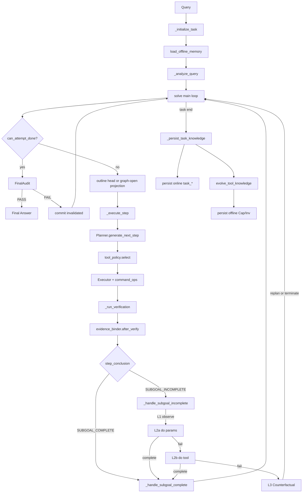

# EPC_AW Framework / Workflow 工程技术规格书

> **文档类型**：工程技术规格书（算法伪代码 + 模块/文件对照 + Schema）  
> **代码根目录**：`MAS/epc_aw/`  
> **权威来源**：以当前运行时代码为准；与旧文档冲突时，**以本文 + 代码为准**  
> **对齐参考**：[`WORKFLOW_AND_MEMORY_DESIGN.md`](WORKFLOW_AND_MEMORY_DESIGN.md)、[`MEMORY_TECHNICAL_REPORT.md`](MEMORY_TECHNICAL_REPORT.md)、[`CoreIdea.md`](CoreIdea.md)  
> **版本锚点**：Intervention v6（Observation → Intervention → Counterfactual）+ Memory schema `tool_knowledge_memory_v2` + StructAgent verified ledger

---

## 1. 文档元信息与术语表

### 1.1 本文定位

| 文档 | 角色 |
|------|------|
| **本文** | Framework / Workflow **工程契约**：算法、预算、门控、Memory schema、模块对照 |
| `WORKFLOW_AND_MEMORY_DESIGN.md` | 设计说明（含论文创新映射与诚实边界） |
| `MAS_Workflow.md` | 历史演进笔记（含 v2/v3 变更日志）；与本文冲突时废弃旧命名 |
| `MEMORY_TECHNICAL_REPORT.md` / `MEMORY_SYSTEM_DESIGN.md` | Memory 专项细节；本文 §5 为其 workflow 视角压缩版 |
| `CoreIdea.md` | 论文叙事（Operational World Model）；本文不替代论文主张 |

### 1.2 命名对照（必须先读）

代码与历史文档存在 **三套 L1/L2/L3**。**本文与实现一律采用 v6**：

| 体系 | L1 | L2 | L3 |
|------|----|----|-----|
| **v6 代码（权威）** | **Observation** 观察（0 LLM） | **Intervention**：L2a 改参 / L2b 换工具 | **Counterfactual**：Planner 侧 replan |
| Pearl 因果阶梯 | Association \(P(Y\|X)\) | Intervention \(P(Y\|do(X))\) | Counterfactuals \(Y_x\) |
| 旧 `abstract.md`（过时） | 改参 retry | switch_tool | decompose / modify_state |

对应关系：旧 abstract 的「L1 改参 / L2 换工具」≈ 本文的 **L2a / L2b**；旧「观察」阶段在 v6 被显式提升为独立的 **Layer 1 Observation**。

### 1.3 核心符号

| 符号 | 含义 | 代码载体 |
|------|------|----------|
| \(s\) State | 当前已有信息态 | `CausalMemoryGraph` `State` 节点 |
| \(g\) Subgoal | 还需补充的信息目标 | outline step / `Subgoal` 节点 |
| \(y\) Tool | 选定工具 | `Tool` 节点 / `tool_policy.select` |
| \(p\) Parameter | 工具调用参数 | `Parameter` 节点 / Executor command |
| \(o\) Outcome | 工具返回结果 | `Outcome` 节点 |
| \(r \in \{0,1\}\) | 子目标是否达成 | Diagnoser `step_conclusion` |
| `do(target_variable)` | 干预对象 | `INTERVENTION_TARGET_VARIABLE` |

执行因果序（canonical chain）：

```
State → Subgoal → Tool → Parameter → Outcome → NextState
         ↑___________________________________|
              失败时在同一 Subgoal 下换 Parameter / Tool
```

### 1.4 一句话系统定位

**EPC_AW** = Harness 构造的 **Observation → Intervention(L2a/L2b) → Counterfactual(L3)** 失败阶梯  
+ **角色分离的双离线 Memory**（Capability ↔ Planner，Invocation ↔ Executor）  
+ **在线因果 DAG + verified 事实账本** + **多门控验证 / STOP 治理**。

Solver **不是**第四个 LLM 角色，而是 mixin 组合的薄编排状态机。

---

## 2. 系统总览与模块/文件对照

### 2.1 端到端数据流



### 2.2 角色与 Mixin

| 角色 / 模块 | 职责 | 文件 | 关键类 / 方法 |
|-------------|------|------|----------------|
| **Solver** | 薄编排；生命周期；主循环 | `solver.py` | `Solver.solve`, `_initialize_task`, `_execute_step`, `_run_verification`, `_handle_subgoal_complete`, `_persist_task_knowledge` |
| **Planner** | Step0 分析；每步选 subgoal/tool；L3 replan | `models/planner.py` | `analyze_query`, `generate_next_step`, `update_outline`, `_build_memory_query_hint` |
| **Executor** | 生成并执行工具命令；L2a/L2b 候选命令 | `models/executor.py` | `generate_tool_command`, `execute_tool_command`, `_build_parameter_memory_hint` |
| **Diagnoser** | 子目标验证 + 诊断信号；介入建议 | `models/diagnoser.py` | `verificate_context`, `_generate_causal_signal`, `_suggest_intervention`, `_classify_root_cause` |
| **Initializer** | 装载工具元数据 | `models/initializer.py` | `Initializer` |
| **InterventionMixin** | L1→L2a→L2b→L3 阶梯 | `models/intervention.py` | `_handle_subgoal_incomplete`, `_observe_failure`, `_run_intervention_level2a/b`, `_run_counterfactual` |
| **EvidenceBinderMixin** | 验证后唯一写 evidence/slot | `models/evidence_binder.py` | `after_verify` → `commit_progress` |
| **ToolPolicyMixin** | 唯一工具裁决出口 | `models/tool_policy.py` | `_select_tool_for_step` |
| **PlanControllerMixin** | DONE / outline 投影 | `models/plan_controller.py` | `can_attempt_done`, `next_outline` |
| **AnswerGateMixin** | 答案格式 / sanity | `models/answer_gate.py` | `_answer_sanity_pass` 等 |
| **CommandOpsMixin** | 命令对齐 / perturb / inject | `models/command_ops.py` | `_align_command_with_subgoal`, perturb helpers |
| **SystemMemory** | 在线/离线统一入口 | `models/memory.py` | `append_causal_effect`, `commit_progress`, `evolve_tool_knowledge`, `persist_*` |
| **CausalMemoryGraph** | 在线 canonical DAG | `models/causal_memory_graph.py` | `record_execution`, `record_parameter_contrast`, `export_*` |
| **VerifiedTaskMemory** | 任务内真值账本 | `models/verified_memory.py` | `CommitKind`, `apply_event` |
| **Tool Knowledge** | 离线 Cap / Inv | `models/tool_knowledge_memory.py` | `ToolCapabilityMemory`, `ToolInvocationMemory`, `MemoryRefiner` |
| **SlotGate / TaskProfile** | 槽驱动 STOP | `models/task_profile.py` | `SlotGate.infer_profile`, `extract_final_answer` |
| **ToolRouter** | subgoal kind 硬隔离 | `models/tool_router.py` | `validate`, `infer_subgoal_kind` |
| **AblationConfig** | 论文/产品消融开关 | `models/ablation.py` | presets: `full`, `no_intervention`, `product_no_l2a/b/l3`, … |

Solver 组合（`solver.py`）：

```python
class Solver(
    CommandOpsMixin,
    AnswerGateMixin,
    InterventionMixin,
    ToolPolicyMixin,
    PlanControllerMixin,
    EvidenceBinderMixin,
):
    ...
```

### 2.3 单一决策出口

| 出口 | 模块 | 职责 |
|------|------|------|
| 工具选择 | `tool_policy` | kind → forbidden → failed → diagnostic → outline |
| STOP / DONE | `plan_controller` + `answer_gate` | live verified SlotGate ∧ 无开放 acquisition ∧ FinalAudit |
| Evidence / Fact 写入 | `evidence_binder` → `commit_progress` | 唯一 live 事实通道 |
| 失败介入 | `intervention` | FailureAttribution → L1→L2a→L2b→L3 |
| 命令形态 | `command_ops` | query/url inject、perturb、align |

---

## 3. 主工作流规格（Algorithm 1）

### 3.1 计数器语义

| 计数器 | 含义 | 何时 +1 |
|--------|------|---------|
| `outline_attempt` | 从 outline 取步并启动新 exec | 主循环取到非空 step |
| `exec_step` | 主循环工具执行序号（受 `max_steps` 约束） | 与 `outline_attempt` 同步 |
| `tracker.intervention_attempts` | 介入内候选验证次数 | L2a/L2b 候选验证 |

**契约**：L2a/L2b 内的候选执行 **不计入** `exec_step`。`max_steps` 限制主循环步数，而非全部真实工具调用次数。

### 3.2 Algorithm 1 — `SOLVE`

```
Algorithm 1: SOLVE(question, image)
────────────────────────────────────────────────────────────────
Input:  query q, optional image x, max_steps T, max_time τ
Output: json_data（含 direct_output / layer_telemetry / traces）

1:  task_id ← INIT_TASK(q)                    ▷ _initialize_task
2:  LOAD_OFFLINE_MEMORY()                     ▷ Cap + Inv（受 Ablation 控制）
3:  INIT_CAUSAL_GRAPH(task_id)
4:  (analysis, outline) ← PLANNER.analyze_query(q, x)
5:  profile ← SlotGate.infer_profile(q)
6:  MEMORY.set_task_profile(profile); set_outline(outline)
7:  SEED_SUBGOAL_CONTRACTS_FROM_OUTLINE()     ▷ Subgoal.required_fact_names
8:  if outline = ∅ then ANALYZE_QUERY once more

9:  diagnostic_prev ← ∅; trackers ← {}; exec_step ← 0
10: _last_planner_action ← ∅; _no_op_penalty ← 0

11: while exec_step < T and elapsed < τ do
12:     if IS_ANSWER_READY(q) then break
13:     if CAN_ATTEMPT_DONE(q) and ANSWER_SANITY_PASS(q) then
14:         if FINAL_AUDIT_PASS then break else CONTINUE  ▷ invalidate 后继续

15:     (step_key, target) ← GET_FIRST_OUTLINE_STEP()
16:     if step_key = ∅ then
17:         SYNC_OUTLINE_FROM_GRAPH_OPEN_ACQUISITION()
18:         if still empty and CAN_STOP then break
19:         else INJECT_RECOVERY_OUTLINE() / re-analyze; continue

20:     outline_attempt++; exec_step++
21:     tracker ← trackers[step_id]

22:     ▷ Propose + Act
23:     step_ctx ← EXECUTE_STEP(q, x, step_key, target, diagnostic_prev, tracker)
24:         ▷ Planner.generate_next_step
25:         ▷ tool_policy.select（ToolRouter kind 硬隔离）
26:         ▷ Executor.generate_tool_command + execute
27:         ▷ Planner 读 Capability hint；Executor 读 Invocation + blacklist

28:     ▷ Verify + Commit
29:     ver ← RUN_VERIFICATION(step_ctx, tracker.to_context())
30:         ▷ Diagnoser.verificate_context
31:         ▷ evidence_binder.after_verify → commit_progress

32:     if ver.step_conclusion = SUBGOAL_INCOMPLETE then
33:         (action, step_ctx, ver, exec_step, diagnostic_prev) ←
34:             HANDLE_SUBGOAL_INCOMPLETE(...)                 ▷ Algorithm 2
35:         if action = complete then
36:             if HANDLE_SUBGOAL_COMPLETE(...) = stop and CAN_ATTEMPT_DONE
37:                 then break
38:         if action = terminate then break                   ▷ Cause-Changed 等
39:         continue                                          ▷ replan

40:     if HANDLE_SUBGOAL_COMPLETE(...) = stop and CAN_ATTEMPT_DONE then break
41:     diagnostic_prev ← ∅; trackers.pop(step_id)

42: direct_output ← NORMALIZE_FINAL_ANSWER / Executor.generate_direct_output
43: PERSIST_TASK_KNOWLEDGE(task_id)                           ▷ Algorithm 3 + persist
44: return json_data
```

**代码锚点**：

| 阶段 | 位置 |
|------|------|
| `solve` | `solver.py` → `Solver.solve` |
| init / analyze / persist | `_initialize_task`, `_analyze_query`, `_persist_task_knowledge` |
| execute / verify | `_execute_step`, `_run_verification` |
| complete / incomplete | `_handle_subgoal_complete`, `InterventionMixin._handle_subgoal_incomplete` |

### 3.3 Step 0：全局分析

```
_analyze_query(q, x):
  (analysis, outline) ← Planner.analyze_query(q, x)   ▷ 含 how-many 自检
  profile ← SlotGate.infer_profile(q)
  MEMORY.set_task_profile(profile); set_outline(outline)
  SEED_SUBGOAL_CONTRACTS_FROM_OUTLINE()
```

产出：`analysis`、有序 `execution_outline`、`TaskProfile`（required slots、phase、exhaustive 等）。

### 3.4 正常一步：`_execute_step`

1. 读取 `diagnostic_signal_prev`（`forbidden_tools` → tracker）
2. **Planner LLM**：`generate_next_step` → `(context, sub_goal, tool_name)`
3. **工具裁决**：`tool_policy._select_tool_for_step`
   - `ToolRouter.validate`（compute / acquisition / visual 硬隔离）
   - acquisition 禁止强制 Python（防幻觉编造事实）
   - 尊重 `failed_tools`、switch 建议、capability 边界
4. **Executor LLM**：`generate_tool_command` → align / validate → execute
5. 返回 `StepContext`

### 3.5 验证：`_run_verification`

Diagnoser 是 **因果介入的唯一触发判定点**。

输出关键字段：

| 字段 | 含义 |
|------|------|
| `step_conclusion` | `SUBGOAL_COMPLETE` \| `SUBGOAL_INCOMPLETE` |
| `diagnostic_signal` | `failure_patterns`, `recommendation`, `suggested_tool`, `causal_hypothesis`, … |
| `slot_updates` / `evidence_type` | 槽更新与证据类型 |
| `tool_appropriate` | 工具类是否匹配 |

随后 `evidence_binder.after_verify` 写入；候选验证路径使用 `record_obtained=False`，避免污染 live evidence。

Diagnoser 内含 **reconciliation 规则链**（硬修正 LLM 误判），例如：Base_Generator 不能做 acquisition；ABSENCE 无 slot fill 降级；claim 冲突降级；exhaustive 任务 snippet-only 降级。

### 3.6 成功路径：`_handle_subgoal_complete`

1. `_record_success_trace` → 因果图（含 failed→success `parameter_contrasts`）
2. `_record_obtained_information` → `commit_progress` 写 live facts
3. 弹出 outline 头步；`can_attempt_done`
4. `_answer_sanity_pass` + `FinalAudit`（FAIL → `invalidated`）
5. 未 DONE：同步 outline 投影 / `update_outline`
6. 返回 `"stop"` \| `"continue"`

**契约**：即使 Diagnoser 判 COMPLETE，也必须经 `can_attempt_done` + sanity + FinalAudit 才允许 STOP；主循环不在验证后直接 break。

---

## 4. 三层因果机制（核心）

### 4.1 设计原则

1. **层次化归因**：默认信任 Planner；先质疑 Executor（参数 → 工具）；Executor 穷尽后才升级 Planner。
2. **Harness 提供阶梯，LLM 只做 reasoning**：不新增独立反事实估计器 / potential-outcome 数值模块。
3. **形式化干预对象**：每个 recommendation 映射到 `do(target_variable)`。
4. **成本可控**：L1 = 0 LLM；L2a = 1 Executor（N 候选）+ ≤3 Diagnoser；L2b ≤ 2×(1 Exec + verify)；L3 复用既有 Planner replan。

### 4.2 阶梯常量与预算

实现：`models/intervention.py`

```
INTERVENTION_LADDER = [
  "retry_with_different_parameters",  # L2a
  "switch_tool",                       # L2b
  "revise_belief",                     # L3
  "decompose_goal",                    # L3
  "modify_state",                      # L3
]
```

| recommendation | 层 | `do(target_variable)` | 默认预算 | 执行者 |
|----------------|----|----------------------|----------|--------|
| `retry_with_different_parameters` | L2a | `executor`（params/query） | 3 轮候选集 | Executor + Diagnoser |
| `switch_tool` | L2b | `tool` | 2 | Executor + Diagnoser |
| `revise_belief` | L3 | `planner_belief` | 1 | Planner |
| `decompose_goal` | L3 | `task_graph` | 1 | Planner |
| `modify_state` | L3 | `environment` | 1 | Planner |

其他常量：

| 常量 | 值 | 含义 |
|------|----|------|
| `CANDIDATE_SET_SIZE` | 3 | L2a 每轮候选数（1 LLM 返回） |
| `MAX_PROGRAMMATIC_PERTURBS` | 2 | 程序化扰动补齐上限 |
| `MAX_VERIFY_PER_ROUND` | 3 | 每轮 Diagnoser 验证上限 |
| `MAX_RECOVERY_OUTLINE_INJECTIONS` | 1 | 空 outline 恢复注入上限 |

`StepInterventionState.resolve(raw)`：当前 recommendation 预算耗尽时，沿 `INTERVENTION_LADDER` 升级到下一未耗尽档。

StructAgent 归因 → 首跳 rung：

| `attributed_to` | 首跳 recommendation |
|-----------------|---------------------|
| `actor` | `retry_with_different_parameters` |
| `tool_environment` | `switch_tool` |
| `planner` | `decompose_goal`（并跳过 L2a/L2b） |
| `verifier` | `revise_belief`（跳过 L2a/L2b） |

### 4.3 Layer 1 — Observation（Pearl Level 1）

**入口**：`_observe_failure(step_ctx, verification, tracker)`  
**成本**：0 LLM  
**职责**：结构化失败现场；**不做决策、不 `do()`**。

`FailureContext` 字段：

| 字段 | 来源 |
|------|------|
| `step_key`, `target_information`, `subgoal` | StepContext |
| `tool`, `parameters`, `tool_output` | StepContext |
| `verification_analysis` | VerificationResult |
| `failure_patterns`, `evidence_type`, `tool_appropriate` | diagnostic_signal / verification |
| `exhausted`, `failed_tools` | `StepInterventionState` |

理论对应：\(P(Y \mid X)\)，其中 \(X\) = 执行现场，\(Y\) = 失败模式。

Diagnoser 已产出的 `causal_hypothesis` 结构（供 L2/L3 消费）：

```
causal_hypothesis = {
  failure_type:   Tool | Execution | Environment | External | Command | Retrieval | ...,
  target_variable: tool | executor | planner_belief | task_graph | environment | query | coverage | ...,
  reason:         capability_mismatch | low_recall | thread_context | ...,
  confidence:     LOW | MEDIUM | HIGH,   ▷ 只影响诊断优先级，不直接 terminate
  description:    "..."
}
```

### 4.4 Layer 2a — Parameter Intervention `do(params)`

**因果假设**：工具能力足够；失败来自参数/query 未落在能力边界内。  
**入口**：`_run_intervention_level2a`

```
Algorithm L2a: PARAMETER_CANDIDATE_SET
──────────────────────────────────────
1:  tried ← COLLECT_TRIED_PARAMS(step_ctx)
2:  candidates ← GENERATE_PARAMETER_CANDIDATE_SET(N=3)
       ▷ 1× Executor LLM (n_candidates=3) + ≤2 programmatic perturb
3:  results ← EXECUTE_CANDIDATE_SET(candidates)   ▷ 主线程串行（SIGALRM）
4:  ordered ← PREFILTER_PASSING(results) + failing
5:  for (cmd, res) in ordered, up to MAX_VERIFY=3 do
6:      ver ← DIAGNOSER.verify(cmd, res)
7:      if SUBGOAL_COMPLETE then
8:          RECORD_SUCCESS_PATH; return complete
9:  tracker.record(retry_with_different_parameters)
10: escalate → L2b
```

**跳过 L2a 的硬条件**（参数改不了）：

- Ablation `enable_l2a=False`
- Attribution ∈ `{planner, tool_environment, verifier}`（struct routing 开启时）
- `tool_appropriate=False` / `wrong_tool_class`
- Infrastructure / External / CapabilityMismatch / Command schema / PDF access / 网络错误文本
- `failure_type=Execution` 且 `reason=thread_context`
- Soft Retrieval/coverage ABSENCE **不**跳过 L2a（同工具先改参）

### 4.5 Layer 2b — Tool Switch `do(tool)`

**因果假设**：改参无效 → 当前工具对 subgoal 无能，或需换工具类。  
**入口**：`_run_intervention_level2b`

```
Algorithm L2b: TOOL_CANDIDATE_SET
─────────────────────────────────
1:  tools ← SELECT_ALTERNATIVES(≤2)
       ▷ suggested_tool + _suggest_alternative_tool
       ▷ compute → 优先 Python_Coder_Tool
       ▷ synthesis → 禁止检索类工具
2:  if tools = ∅ then escalate → L3
3:  for new_tool in tools, up to MAX_VERIFY do
4:      cmd ← Executor.generate_tool_command(new_tool, n_candidates=1)
5:      cmd ← sanitize + align + validate
6:      res ← execute(new_tool, cmd)
7:      if not PREFILTER(res) then continue
8:      ver ← DIAGNOSER.verify(...)
9:      if SUBGOAL_COMPLETE then return complete
10: tracker.record(switch_tool, failed_tool)
11: escalate → L3
```

### 4.6 Layer 3 — Counterfactual（规则驱动 replan）

**入口**：`_run_counterfactual`  
**成本中性**：不新增独立反事实 LLM；规则路由 + 复用 `revise_belief` / `decompose_goal` / `modify_state`。

| recommendation | 行为 | 近似 `do()` |
|----------------|------|-------------|
| `revise_belief` | 撤回冲突 claim；可能重 `analyze_query` | \(do(\text{Belief})\) |
| `decompose_goal` | `update_outline` 分解子目标 | \(do(\text{TaskGraph})\) |
| `modify_state` | 环境/前置修复信号后 replan | \(do(\text{Environment})\) |

**诚实边界**：名为 Counterfactual，实为「改参无效 ∧ 换工具无效 ⇒ 必须改 plan」的阶梯推断近似，**不是** Pearl potential-outcome 估计器。

### 4.7 门控（防止死循环）

| 门控 | 触发时机 | 行为 |
|------|----------|------|
| **Knowledge Gain** | L2 派发前 | 连续 2 次零知识增益（无 ΔEvidence / ΔSlot / ΔCause）→ `force_escalate` 下一档 |
| **Hypothesis Drift** | 记录 root cause 前 | evidence_type / slots / hypothesis 任一变化 → 清空 cause history，重新诊断 |
| **LOW confidence** | L3 入口 | **不 terminate**；强制 `replan` 再诊断（confidence 只影响诊断优先级） |
| **Cause-Changed** | L3 开火前 | 同一 `(root_cause, target_variable)` 重复 → `terminate`；软原因（`low_recall` 等）soft-continue |
| **Action Variable** | Planner 侧干预 | 未改 tool/query/url：1st warn；2nd 强制 `decompose_goal`；再无变化则 terminate |

`SOFT_REPEATED_CAUSES` = `{low_recall, no_match, over_constrained, source_not_indexed}`。

### 4.8 Algorithm 2 — `HANDLE_SUBGOAL_INCOMPLETE`

```
Algorithm 2: HANDLE_SUBGOAL_INCOMPLETE(step_ctx, ver, tracker)
──────────────────────────────────────────────────────────────
Returns: action ∈ {complete, replan, terminate}

1:  if ablation.enable_intervention = False then
2:      RECORD_FAILURE; return replan                ▷ naive retry

3:  RECORD_OBTAINED_INFORMATION(ver)
4:  signal ← ver.diagnostic_signal

5:  ▷ Knowledge Gain Gate
6:  (exploration, knowledge) ← COMPUTE_INTERVENTION_GAINS(...)
7:  if knowledge = 0 then
8:      n ← bump_no_knowledge_gain()
9:      if n ≥ 2 then signal.recommendation ← force_escalate(...)
10: else reset_no_knowledge_gain()
11: RECORD_EXPLORATION(command, tool)

12: signal ← APPLY_ESCALATION(signal, tracker)
13: signal ← ENRICH(signal)
14: signal ← APPLY_FAILURE_ATTRIBUTION_ROUTING(signal)
15: MEMORY.set_diagnostic_signal(signal)

16: ▷ Hypothesis Drift
17: if hypothesis_changed(evidence/slots/reason) then INVALIDATE_HYPOTHESIS()
18: SNAPSHOT_HYPOTHESIS(); RECORD_ROOT_CAUSE(reason, target_variable)
19: RECORD_FAILURE_TRACE → CausalMemoryGraph

20: if signal = ∅ then return replan
21: if recommendation = continue_to_next_subgoal or subgoal_complete then
22:     return complete

23: ▷ Layer 1 Observation（0 LLM）
24: fc ← OBSERVE_FAILURE(step_ctx, ver, tracker)

25: ▷ Layer 2a
26: if not SKIP_L2A(hard_errors, attribution, ablation) and budget(retry) > 0 then
27:     action ← RUN_L2A(...)
28:     if action = complete then return complete
29: else
30:     signal.recommendation ← switch_tool

31: ▷ Layer 2b
32: if enable_l2b and budget(switch_tool) > 0 then
33:     action ← RUN_L2B(...)
34:     if action = complete then return complete

35: ▷ Layer 3
36: if not enable_l3 then return replan
37: return RUN_COUNTERFACTUAL(...)   ▷ may return replan | terminate
```

### 4.9 层间数据流小结

```
Planner.next_step → Executor.command → Tool Result
        ↓
Diagnoser.verificate_context
  → failure_patterns + causal_hypothesis + recommendation
        ↓
SUBGOAL_INCOMPLETE?
  NO  → EvidenceBinder.commit + 因果图 success + outline 推进
  YES → Algorithm 2
          ├─ L1 FailureContext
          ├─ L2a do(params) ──成功──► complete
          ├─ L2b do(tool)   ──成功──► complete
          └─ L3 do(belief|task|env) → replan / terminate
                ↓
          diagnostic_signal_prev 注入下一轮 Planner / Executor
```

---

## 5. Memory 设计（核心）

### 5.1 双层架构

| 层级 | 存储 | Canonical? | 消费者 | 语义 |
|------|------|------------|--------|------|
| Online | `causal_graph.json` | **是** | Diagnoser / Intervention / evolve | 节点-边 DAG |
| Online | `causal_execution_traces.json` | 导出视图 | Debug / 阅读 | factor→effects 线性化 |
| Online | `task_local_parameters.json` | 导出视图 | Executor 黑名单 / evolve 输入 | 失败/成功参数对照 |
| Online | `verified_memory.json` | 任务内真值账本 | Planner/Diagnoser/STOP/evolve gate | facts / events / failures |
| Online | `evidence_records.json` | claim 辅助 | SlotGate / Diagnoser | `live` + `verification_status` |
| Online | `evolve_telemetry.json` / `metadata.json` | 运维 | 消融分析 | evolve 候选/接受/拒绝 |
| Offline | `tool_capability_memory.json` | **是** | **Planner** | 何时选该工具（Applicability） |
| Offline | `tool_invocation_memory.json` | **是** | **Executor** | 如何构造参数（Decision Dimensions） |

**核心原则**：

1. 在线 canonical = `CausalMemoryGraph`；traces / task_local 由 `_sync_denormalized_from_graph()` 导出。
2. 离线 = 纯文本 Tool Knowledge；**禁止** scores / counts / confidence / embeddings / 具体任务例。
3. **Verified-only 提交**：任务内事实只经 `commit_progress` / `commit_verified_memory`。
4. **演化而非累积**：规模与任务数 \(T\) 解耦。

### 5.2 在线因果图 Schema

实现：`models/causal_memory_graph.py`

**节点类型**（`GraphNodeType`）：

| 类型 | ID 格式 | 含义 |
|------|---------|------|
| `State` | `st:{task_id}:{t}` | 信息态 |
| `Subgoal` | `sg:{hash(text)}` | outline 信息目标 |
| `Tool` | `tool:{tool_name}` | 全局单例 |
| `Parameter` | `pm:{hash(fingerprint)}` | 结构化参数 |
| `Outcome` | `oc:{exec_step}` | 单次执行结果 |
| `Evidence` | `ev:{ev_id}` | 结构化 claim |
| `Intervention` | `iv:{outline}:{exec}` | 介入节点 |

**边类型**（`ExecutionEdgeType`）：

| 边 | 语义 |
|----|------|
| `state_requires_subgoal` | State → Subgoal |
| `subgoal_selects_tool` | Subgoal → Tool |
| `tool_invokes_parameter` | Tool → Parameter |
| `parameter_yields_outcome` | Parameter → Outcome |
| `outcome_transitions_state` | Outcome → NextState（成功 finalize） |
| `outcome_extracts_evidence` | Outcome → Evidence |
| `evidence_contributes_state` | Evidence → State |
| `parameter_contrasts` | 失败 Parameter → 成功 Parameter |
| `outcome_diagnoses` | 失败 Outcome → Intervention |

**写入路径**：

```
InterventionMixin._record_causal_effect / _record_failure_trace / _record_success_trace
  → SystemMemory.append_causal_effect
      → CausalMemoryGraph.record_execution(...)
      → (成功且先前失败) record_parameter_contrast
      → (finalize 成功) transition_state_on_success
      → _sync_denormalized_from_graph()  ▷ traces + task_local
```

**与顺序日志的区别**：一个 outline step = 一个 factor（state, subgoal），下游挂多个 effects（改参/换工具尝试）——**因→多果**。

导出 traces 结构（精简样例）：

```json
{
  "outline_step": "1",
  "factor": {
    "state": "初始状态_无已知信息",
    "state_type": "initial_no_info",
    "subgoal": "...",
    "subgoal_type": "verify_fact"
  },
  "effects": [{
    "attempt_seq": 1,
    "tool": "Google_Search_Tool",
    "parameter": "execution = tool.execute(query=...)",
    "parameter_struct": { "query": "...", "fingerprint": "Tool|..." },
    "result": { "success": true, "preview": "..." },
    "L1_diagnosis": "成功"
  }],
  "L2_diagnosis": { "root_cause": "success", "recommendation": "CONTINUE" },
  "status": "completed"
}
```

`task_local_parameters` 键：`"{state_label}::{subgoal_text}"` → `{ tool: { failed_parameters, successful_parameters, parameter_pairs } }`。

### 5.3 Verified Memory

实现：`models/verified_memory.py` + `SystemMemory.commit_progress`

| `CommitKind` | 语义 |
|--------------|------|
| `satisfied` | 子目标满足；写/确认 facts |
| `value_committed` | 槽值提交 |
| `rejected` | 拒绝；记入 `recent_failures` |
| `invalidated` | 撤回先前事实（FinalAudit FAIL 等） |

`LIVE_VERIFICATION_STATUSES` = `{satisfied, value_committed}`。

**契约**：

- 唯一 live 事实通道：`commit_progress` / `commit_verified_memory`
- `add_evidence_record` 可写原始 claim，默认 **不** dual-write ledger
- STOP / SlotGate / compact prompt / evolve gate 优先读 verified ledger

`verified_memory.json` 顶层：`facts` / `events` / `recent_failures`。

### 5.4 离线 Tool Knowledge + 角色隔离

| Memory | 消费者 | 内容 | 检索入口 |
|--------|--------|------|----------|
| `ToolCapabilityMemory` | **仅 Planner** | `capability_summary` + `subgoals[{subgoal, context_summary[]}]` | `planner._build_memory_query_hint` |
| `ToolInvocationMemory` | **仅 Executor** | `subgoals[{subgoal, factors{Dim → instruction}}]` | `executor._build_parameter_memory_hint` |

**硬上限**（`tool_knowledge_memory.py`）：

| 常量 | 值 |
|------|----|
| `MAX_SUBGOALS_PER_TOOL` | 5 |
| `MAX_CONTEXT_SUMMARIES` | 5 |
| `MAX_FACTORS_PER_SUBGOAL` | 4 |
| `MEMORY_SCHEMA_VERSION` | `tool_knowledge_memory_v2` |

schema 不匹配 → reset seed。规模上界约 \(O(K \times 5 \times 5)\)，与任务数无关。

### 5.5 Algorithm 3 — `EVOLVE_TOOL_KNOWLEDGE`

```
Algorithm 3: EVOLVE_TOOL_KNOWLEDGE()
────────────────────────────────────
Called once at task end. Does NOT mutate online memory.

1:  SYNC_DENORMALIZED_FROM_GRAPH()
2:  telemetry ← {candidates:0, accepted:0, rejected:[]}
3:  per_tool ← ∅

4:  for each (state, subgoal) → tools in task_local_parameters do
5:      for each tool with successful_parameters do
6:          telemetry.candidates++
7:          if enable_verified_only_evolve then
8:              ok ← HAS_LIVE_VERIFIED_EVIDENCE(tool, subgoal)
9:                    OR HAS_PARAMETER_CONTRAST(tool)
10:             if not ok then REJECT("no_verified_evidence_or_contrast"); continue
11:         ACCEPT; per_tool[tool].append(experience)

12: for each tool in per_tool (parallel, ≤4 workers) do
13:     abst_list ← MemoryRefiner.abstract_experiences_batch(...)
14:         ▷ concrete → abstract_subgoal + context_summaries + factors
15:     for abst in abst_list do
16:         Cap.evolve(tool, abstract_subgoal, context_summaries)
17:         Inv.evolve(tool, abstract_subgoal, factors)
18:             ▷ retrieve → merge → generalize → rewrite；超 cap 合并

19: BOUNDARY_REFINEMENT()   ▷ 跨工具区分 capability_summary（Differentiate）
20: return
```

设计口号：**Generalize（批抽象）→ merge → Differentiate（跨工具边界）**；泄漏实体/URL/具体 query 的抽象结果丢弃，回退 canonical defaults。

### 5.6 目录与持久化契约

```
memory/
├── offline_manifest.json
├── offline/
│   ├── tool_capability_memory.json
│   └── tool_invocation_memory.json
└── online/
    └── task_{YYYYMMDD_HHMMSS}_{uuid8}/
        ├── causal_graph.json
        ├── causal_execution_traces.json
        ├── task_local_parameters.json
        ├── evidence_records.json
        ├── verified_memory.json
        ├── evolve_telemetry.json
        └── metadata.json
```

生命周期：

```
_initialize_task
  → init_causal_graph_for_task
  → load_offline_memory
主循环写入
  → CausalMemoryGraph + verified ledger + evidence
_persist_task_knowledge
  → evolve_tool_knowledge（若 enable_evolve）
  → persist_offline_memory（非 evaluation_mode）
  → persist_online_memory
```

---

## 6. 跨模块调用契约

### 6.1 读/写矩阵

| 数据 | 写者 | 读者 | 时机 |
|------|------|------|------|
| Offline Capability | `evolve_tool_knowledge` | Planner hint | 每步 propose |
| Offline Invocation | `evolve_tool_knowledge` | Executor hint | 每步 act / L2a/L2b |
| Failed-param blacklist | 图 sync / task_local | Executor | 参数生成 |
| CausalMemoryGraph | `append_causal_effect` | Knowledge Gain / evolve / persist | 每次成功/失败尝试 |
| verified ledger | `commit_progress` | SlotGate / compact view / STOP / evolve gate | 每次 verify 后 |
| evidence_records | EvidenceBinder | Diagnoser 冲突检测 / SlotGate | 每次 verify 后 |
| diagnostic_signal | Diagnoser / Intervention | 下轮 Planner/Executor | incomplete 后 |
| layer_telemetry | InterventionMixin | 消融分析 | 各层进出 |

### 6.2 职责隔离（硬约束）

| 约束 | 说明 |
|------|------|
| Planner **永不**读 Invocation | 选工具只看 Capability + 当前状态 |
| Executor **不靠** Capability 选工具 | 工具已由 Planner/tool_policy 决定 |
| Solver 主循环 **不含** 任务特化规则 | grounding / slot 闸门落在 command_ops / SlotGate / evidence_binder |
| Live 事实 **只经** commit_progress | 禁止旁路写 valid_facts |

### 6.3 消融开关（`models/ablation.py`）

**Paper track**：

| Preset | 效果 |
|--------|------|
| `full` | 全开 |
| `no_intervention` | 跳过整梯；失败直接 naive replan |
| `no_capability` | 不读 Capability |
| `no_invocation` | 不读 Invocation（默认可保留 blacklist） |
| `no_memory` | 双离线都不读、不 evolve、关 blacklist |

**Product track**：

| Preset / 字段 | 效果 |
|---------------|------|
| `product_no_l2a` | `enable_l2a=False` |
| `product_no_l2b` | `enable_l2b=False` |
| `product_no_l3` | `enable_l3=False` |
| `no_verified_memory` | 关 commit / verified-only evolve / compact view |
| `enable_evolve` | 控制是否 evolve + persist offline |
| `emit_layer_telemetry` | 层遥测开关 |

---

## 7. 附录

### 7.1 关键常量一览

| 常量 | 文件 | 默认值 |
|------|------|--------|
| `MAX_PARAMETER_RETRIES` | `intervention.py` | 3 |
| `MAX_SWITCH_TOOL_ATTEMPTS` | `intervention.py` | 2 |
| `MAX_REVISE_BELIEF_ATTEMPTS` | `intervention.py` | 1 |
| `MAX_DECOMPOSE_GOAL_ATTEMPTS` | `intervention.py` | 1 |
| `MAX_MODIFY_STATE_ATTEMPTS` | `intervention.py` | 1 |
| `CANDIDATE_SET_SIZE` | `intervention.py` | 3 |
| `MAX_VERIFY_PER_ROUND` | `intervention.py` | 3 |
| `MAX_SUBGOALS_PER_TOOL` | `tool_knowledge_memory.py` | 5 |
| `MAX_CONTEXT_SUMMARIES` | `tool_knowledge_memory.py` | 5 |
| `MAX_FACTORS_PER_SUBGOAL` | `tool_knowledge_memory.py` | 4 |
| `MEMORY_SCHEMA_VERSION` | `tool_knowledge_memory.py` | `tool_knowledge_memory_v2` |

### 7.2 与旧文档差异清单

| 旧表述 | 当前权威表述 |
|--------|--------------|
| abstract L1=改参, L2=换工具, L3=decompose | Observation → L2a/L2b → L3 Counterfactual |
| `tool_ability_boundary` / `tool_parameter_graphs` | `ToolCapabilityMemory` / `ToolInvocationMemory` |
| `upgrade_online_to_offline` | `evolve_tool_knowledge`（Generalize + Differentiate） |
| Planner 读 offline ⏳ 未接入 | 已接入 `_build_memory_query_hint` |
| L2a 并行 ThreadPool 执行 | **主线程串行执行**（SIGALRM）；并行仅用于 evolve 多工具管线 |
| 在线 traces 为 canonical | **CausalMemoryGraph** 为 canonical；traces 为导出视图 |
| verified memory 未强调 | StructAgent ledger 为一等公民；verified-only evolve |

### 7.3 实现诚实边界

| 已落地 | 未落地 / 术语过强 |
|--------|-------------------|
| 层次化 `do(target_variable)` 阶梯 | 显式 potential-outcome / do-calculus 数值估计 |
| 在线因果 DAG + parameter_contrasts | 执行前 forward model / rollout（Operational World Model 预测） |
| 双离线角色隔离 + evolve 压缩 | Planner 侧一等 epistemic uncertainty 表示 |
| 多门控防循环 + SlotGate 防假成功 | 独立 Counterfactual LLM 模块 |
| L2a 候选集 + 规则预筛 | L2a 工具执行并行（当前串行） |

### 7.4 关键入口速查

```
python -m MAS.epc_aw.solver
  → construct_solver(...) → Solver.solve(question, image_path)

消融示例：
  --ablation full | no_intervention | no_memory
  --ablation product_no_l2a | product_no_l2b | product_no_l3
```

---

## 8. 规格书修订记录

| 日期 | 说明 |
|------|------|
| 2026-08-04 | 初版：对齐 v6 Intervention + Memory v2 + verified ledger；供论文 Framework/Workflow 章节工程对照 |
