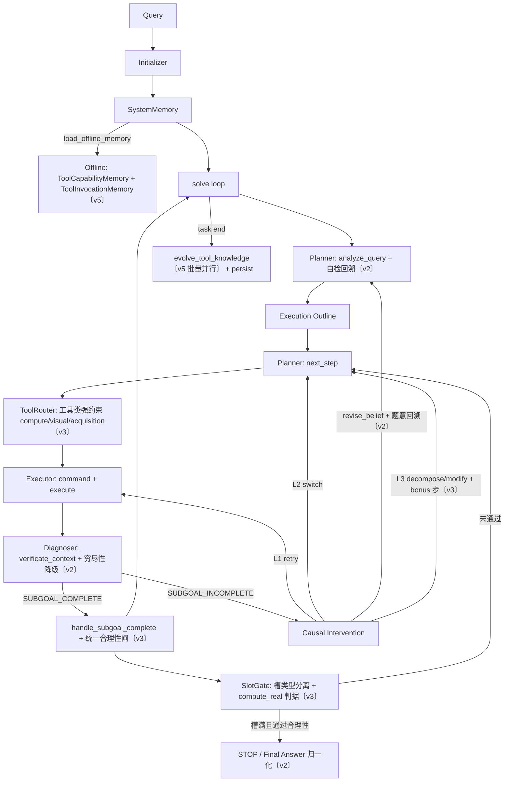
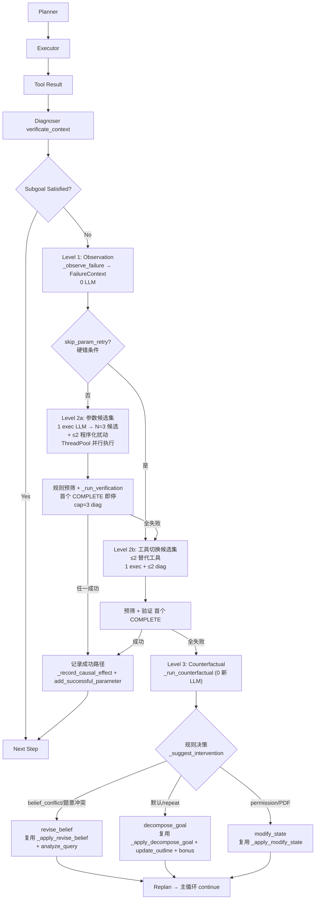
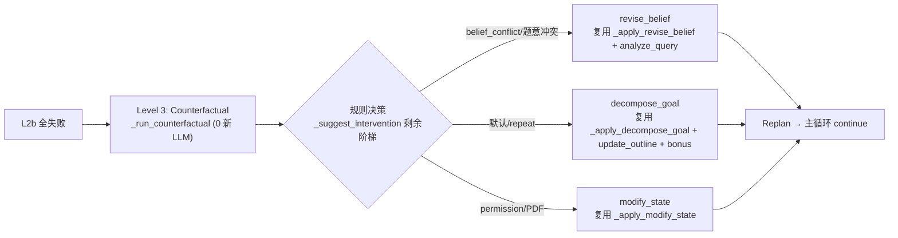
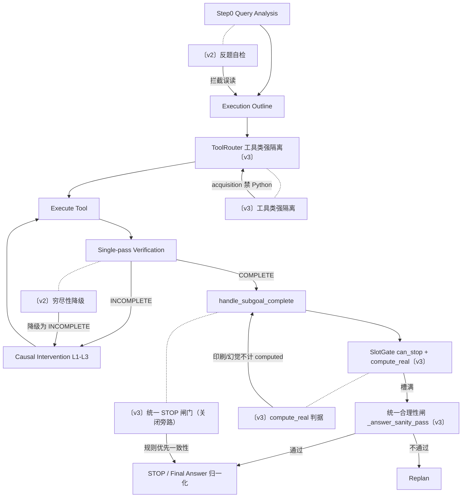

# EPC_AW 多智能体工作流技术报告

> **版本**：v3 + v5 + v6（2026-07-03，与 `solver.py` 当前实现同步）  
> **依据**：`MAS/epc_aw/solver.py`、`models/planner.py`、`models/diagnoser.py`、`models/task_profile.py`、`models/tool_router.py`、`models/memory.py`、`models/tool_knowledge_memory.py`、`models/executor.py`、`models/formatters.py`  
> **变更说明**：  
> - **v3（精炼层）**：在 v2 基础上做**精炼式高强度优化**——不扩充框架、不新增 LLM 调用点，转而（1）关闭 v2 控制流旁路让既有合理性闸真正生效，（2）用三组纯规则判据（计算vs印刷、计算输入引用、工具类强约束）替代可被覆盖的 LLM 机制。v2 原方案的 F3（幻觉验证器降级）、F4-LLM（计算正确性 LLM 复核）、F5（多跳自检）、F6（查询多样化）被舍弃或被纯规则覆盖。  
> - **v5（知识演化层）**：用 `ToolCapabilityMemory` + `ToolInvocationMemory` 两独立纯文本内存替换 v4 的 skill 画像；`evolve_tool_knowledge` 改为**批量抽象 + 并行**管线（`abstract_experiences_batch` 为规范入口，`_derive_factor_instructions` 降级为遗留诊断 helper）。  
> - **v6（因果介入重构层）**：把因果介入从"串行单候选重试 + 阶梯升级"重构为 **Observation → Intervention → Counterfactual** 三层范式。层次化归因（Executor 先、Planner 后）；Level 2a 由串行 3 attempts 改为"1 executor LLM 返 N=3 候选 + ThreadPool 并行执行 + 规则预筛 + ≤3 diag 验证、首个 COMPLETE 即停"；Level 2b 由"仅记录 failed_tool 下轮换"改为主动替代工具候选集；Level 3 复用既有 replanning（`_route_post_intervention` 重命名为 `_run_counterfactual`）。**严格 LLM 成本中性**：单失败步最坏 ≤8 LLM（现状 ≤10），典型成功 2 LLM = 现状。详见 §4、§9.8。  
> 各节以 **〔v3 新增/变更〕** / **〔v5 新增/变更〕** / **〔v6 新增/变更〕** 标注差异，第 9 节给出完整差异清单。

---

## 1. 整体架构




**角色分工**


| 模块           | 职责                                                  | v3 变化                                           | v5 变化                                           |
| ------------ | --------------------------------------------------- | ----------------------------------------------- | ----------------------------------------------- |
| Planner      | Step 0 分析；每步选工具/子目标；接收 `diagnostic_signal` 做 replan | —（沿用 v2 自检）                                     | 接 `retrieve_tool_capability` hint               |
| Executor     | 生成并执行工具命令；L1 重试时跳过 Planner，直接改参                     | —                                               | 接 `retrieve_tool_invocation` hint              |
| Diagnoser    | L1 子目标验证 + L2 任务完成；失败时生成诊断信号                        | —（沿用 v2 穷尽性降级）                                  | —                                               |
| SystemMemory | 在线因果轨迹 + 任务内参数；离线工具知识内存；持久化                         | 证据记录新增 `compute_real` 字段                        | 离线内存改为 `ToolCapabilityMemory` + `ToolInvocationMemory`；`evolve_tool_knowledge` 批量并行 |
| SlotGate     | 槽驱动的 STOP/合成/工具限制门                                  | `_record_is_computed` 改看 `compute_real`         | —                                               |
| ToolRouter   | 子目标分类与工具校验/重定向                                      | **新增 visual kind、工具类强隔离、acquisition 剔除 Python** | —                                               |


---


## 2. 主循环

```
Algorithm 1: SOLVE(question, image)
────────────────────────────────────────────────────────
Input:  query q, optional image x, max_steps T, max_time τ
Output: json_data with direct_output

1:  task_id ← INIT_TASK(q); LOAD_OFFLINE_MEMORY()
2:  (analysis, outline) ← PLANNER.analyze_query(q, x)
    ▷ 〔v2〕analyze_query 内部追加 _self_criticize_analysis
    ▷   对 how-many 题检测"纯推理封闭误读"并重生成 outline
3:  profile ← SlotGate.infer_profile(q)        ▷ 〔v2〕推断 exhaustive 标志
4:  SYSTEM_MEMORY.set_task_profile(profile); set_outline(outline)
5:  diagnostic_prev ← ∅; trackers ← {}; exec_step ← 0
    ▷ 〔v3〕decompose_bonus ← 0（每任务重置）

6:  while exec_step < T + decompose_bonus and elapsed < τ do
7:      ▷ 〔v3〕早停旁路关闭：IS_ANSWER_READY 恒为 False，STOP 只由完成处理/空 outline 决定
8:      (step_key, target) ← GET_FIRST_OUTLINE_STEP()
9:      if step_key = ∅ then
10:         if CAN_STOP_EXECUTION(q) and ANSWER_SANITY_PASS(q) then break
          ▷ 〔v3〕空 outline 也走统一合理性闸；闸门拦截时已注入 revise 步，跳过 recovery
11:         if OUTLINE still empty then INJECT_RECOVERY_OUTLINE()
12:         continue
13:     outline_attempt++; exec_step++
14:     tracker ← trackers[step_key]            ▷ per-outline-step 预算

15:     ctx ← EXECUTE_STEP(q, x, step_key, target, diagnostic_prev)
        ▷ 〔v3〕EXECUTE_STEP 内 ToolRouter 对 compute/visual/acquisition 做工具类强隔离
16:     ver ← DIAGNOSER.verificate_context(ctx, tracker)
        ▷ 〔v2〕reconciliation 链含穷尽性降级
17:     ▷ 〔v3〕删除验证后直接 break 的旁路：COMPLETE 必须下落到完成处理走合理性闸
18:     if ver.step_conclusion = SUBGOAL_INCOMPLETE then
19:         (action, ctx, ver, exec_step, diagnostic_prev) ←
                HANDLE_SUBGOAL_INCOMPLETE(ctx, ver, tracker)
20:         if action = complete then
21:             if HANDLE_SUBGOAL_COMPLETE(ctx, ver) = stop then break
22:         continue
23:     if HANDLE_SUBGOAL_COMPLETE(ctx, ver) = stop then break
        ▷ 〔v3〕完成处理内调用统一 ANSWER_SANITY_PASS（规则优先），不通过则注入 revise 步并 continue
24:     diagnostic_prev ← ∅; trackers.pop(step_key)
25:     ▷ 〔v3〕decompose_goal 注入修正 outline 时置 decompose_bonus ← 1，保证修正步至少执行 1 次

26: direct_output ← NORMALIZE_FINAL_ANSWER(q, SlotGate.extract_final_answer)
    ▷ 〔v2〕slot 答案归一化为最短答案；否则 EXECUTOR.generate_direct_output
27: UPGRADE_ONLINE_TO_OFFLINE(); PERSIST_OFFLINE(); PERSIST_ONLINE(task_id)
28: return json_data
```

**两个计数器**：`outline_attempt`（从 outline 取步并启动新 exec 的次数）与 `exec_step`（含 L1 retry 的全局工具执行次数，受 `max_steps + decompose_bonus` 约束，bonus 每任务最多 +1）。

**〔v3〕统一 STOP 闸门**：v2 的合理性闸在 `_handle_subgoal_complete` 内，但主循环存在两处旁路（`_is_answer_ready` 早停、验证后 `_can_stop_execution` 直接 break），导致闸门 15 次正确拦截全被绕过。v3 关闭两处旁路，把闸门抽成 `_answer_sanity_pass(q) → bool`，让所有 STOP 决策（完成处理 + 空 outline）统一流经此闸。闸门本身规则优先（`_answer_format_mismatch` 字段匹配在前，LLM 仅对 freeform 长答案兜底），不通过则注入 1 个 revise 步并 continue，由 `max_steps` 兜底，不引入计数器或升级状态机。

---


## 3. 两层验证 + SlotGate


### 3.1 验证流程

```
Algorithm 2: VERIFICATE_CONTEXT(ctx, intervention_context)
────────────────────────────────────────────────────────
1:  (analysis, subgoal_conc, info_flag, info, slot_updates,
     evidence_type, tool_appropriate) ← LLM(prompt_v2 + TaskState)
2:  subgoal_conc ← RECONCILE(subgoal_conc, executor_result, subgoal_kind)
3:  if subgoal_conc = SUBGOAL_INCOMPLETE then
4:      failure_patterns ← EXTRACT_FAILURE_PATTERNS(...)
5:      signal ← GENERATE_CAUSAL_SIGNAL(failure_patterns, exhausted)
6:      return (analysis, SUBGOAL_INCOMPLETE, signal)
7:  else
8:      task_conc ← RECONCILE_TASK_CONCLUSION(slot-driven via SlotGate)
9:      return (analysis, SUBGOAL_COMPLETE, task_conc, slot_updates)
```

**L1 触发条件**：`Subgoal_Conclusion = SUBGOAL_INCOMPLETE`（含 acquisition 无结构化字段、ABSENCE 未填槽、Base_Generator 错类、claim 冲突等）。

**L2 触发条件**：仅当 L1 通过；`Task_Conclusion` 由 SlotGate 校正，Verifier 默认 CONTINUE。

### 3.2 Reconciliation 降级链（v2 扩展）

LLM 单次验证后，Diagnoser 按顺序硬修正：

1. Base_Generator 不能完成 acquisition → 降级。
2. ABSENCE/EMPTY 无 slot fill → 降级。
3. claim 冲突 → 降级 + `belief_conflict`。
4. 负检索结果 → 降级。
5. **〔v2 新增〕穷尽性降级**：对 `exhaustive` 计数/枚举任务，若结果为 snippet-only（含 "Please use the URL to get the full text"）或 analysis 自述 "not exhaustively listed / not fully structured / at least one" → 强制降级为 `SUBGOAL_INCOMPLETE` 并置 `failure_patterns.exhaustiveness_unmet = True`。


### 3.3 SlotGate STOP 门（v3 重写）

**v1**：`can_stop` 仅检查所有 required 槽被填充；`needs_compute_step` 用"槽是否已满"判断，会被错误填槽绕过。

**v2**：`_can_stop_execution` 改为三段守门：

1. `SlotGate.can_stop` — 所有 required 槽已填充。
2. **〔v2 新增〕**`has_compute_slot` **+** `compute_slot_filled_by_computed` — 若 profile 含 `min_source="computed"` 的槽，则该槽必须由 `Python_Coder_Tool` 或 `source_quality="computed"` 的证据填充；检索值（如配速 20.94）不得满足计算槽。
3. `needs_compute_step` — 计算槽未填且 outline 含 `Python_Coder_Tool` 步时不准 STOP。

**〔v2 新增〕槽来源分离**：`_record_qualifies` 的绑定路径加入守卫——`min_source="computed"` 的槽只接受 computed 来源的绑定，杜绝验证器把检索量错绑到计算槽。

**〔v2 新增〕compute 步注入**：`_sanitize_outline_update` 检测到计算槽未由 computed 填充且 outline 无 `Python_Coder_Tool` 步时，自动注入一步计算 outline（携带已检索输入量）。

**〔v3 新增〕compute_real 判据（纯规则，替代 v2 工具名兜底）**：v2 的 `_record_is_computed` 只要 `tool=="Python_Coder_Tool"` 即判 computed，使"印刷机"步（仅 print 一个检索/凭空常量）和"幻觉计算"步（对凭空常量做运算）也满足计算槽。v3 改为：

- `add_evidence_record` 新增 `compute_real: Optional[bool]` 字段；`_record_obtained_information` 对 `Python_Coder_Tool` 步调用 `_python_execution_is_real_computation` 判定，True 才置 `source_quality="computed"`，否则降为 `"secondary"`。
- `_python_execution_is_real_computation`（纯正则，无 LLM）：剥除注释后，代码须含真实算术/聚合运算（`[-+*/%]`、`**`、`//`、`sum/len/max/min/round/math.ceil/math.floor/numpy` 等）**且**引用 ≥1 个已在 `evidence_records` 中出现的数值 token。命中失败即"印刷/凭空"→ `compute_real=False`。解析失败保守判 True。
- `_record_is_computed` 删除 `tool=="Python_Coder_Tool"` 兜底，改为 `compute_real is True` 或 `source_quality=="computed"`；`compute_slot_filled_by_computed` 经此受益。
- 这一条同时覆盖原 F4"计算必须用已检索输入"规则，无需 LLM 复核。


### 3.4 TaskProfile 推断（v2 扩展）

`infer_profile` 在原槽推断基础上新增 `exhaustive` 标志：题面含 "how many ... between YEAR and YEAR"、"discography / studio albums / papers / articles"、"published by ... YEAR" 之一即置位，供穷尽性降级与深检索使用。

---


## 4. 因果介入

EPC-AW 的因果介入遵循 **Observation → Intervention → Counterfactual** 三层范式（Pearl 因果阶梯的工程映射），核心是**层次化归因**：默认信任 Planner，失败时先质疑 Executor（参数/工具），Executor 干预穷尽后才升级到 Planner（保留/修改 subgoal）。本节重构为工作流重组 + 复用既有模块，**不新增任何 LLM 推理 prompt**——新能力靠"让现有 executor LLM 调用一次返回 N 个候选命令"实现，验证复用 `verificate_context`，反事实复用现有 replanning。



### 4.1 干预阶梯与预算


| 层级   | `recommendation`                  | 上限/步 | 行为                                     | v6 变化                                   |
| ---- | --------------------------------- | ---- | -------------------------------------- | --------------------------------------- |
| L1   | Observation                       | —    | `_observe_failure` 组装 `FailureContext`，纯数据，0 LLM | **新增（三层范式入口）**                          |
| L2a  | `retry_with_different_parameters` | 1 轮  | 参数候选集：1 exec LLM 返 N=3 候选 + ≤2 程序化扰动，ThreadPool 并行执行，规则预筛 + ≤3 diag 验证，首个 COMPLETE 即停 | **由串行单候选改为候选集**                         |
| L2b  | `switch_tool`                     | 2 轮  | 替代工具候选集：≤2 替代工具，每个 1 exec + ≤2 diag，首个 COMPLETE 即停 | **由"仅记录 failed_tool 下轮换"改为主动候选集**       |
| L3   | `revise_belief`                   | 1    | retract 冲突 inferred claim + inject 验证步 | 复用既有 `_apply_revise_belief`             |
| L3   | `decompose_goal`                  | 1    | `update_outline` 分解子目标                 | 复用既有 `_apply_decompose_goal`            |
| L3   | `modify_state`                    | 1    | 环境/前置条件修复信号 → replan                   | 复用既有 `_apply_modify_state`             |


预算按 **outline step**（`step_key`）追踪，非全局 exec_step；step 完成或 outline 切换时 pop 重置。`StepInterventionState.counts` 的语义自 v6 起改为**候选集轮数**（一轮 = 一次候选集扇出 + 验证），而非单个 attempt——L2a 默认 1 轮即消费全部 `retry_with_different_parameters` 预算。

### 4.2 干预选择

```
Algorithm 3: SUGGEST_INTERVENTION(failure_patterns, exhausted)
──────────────────────────────────────────────────────────────
1:  C ← ∅
2:  if belief_conflict ∨ absence_unfilled then C ∪= {revise_belief}
3:  if wrong_tool_class ∨ url_client_error then C ∪= {switch_tool}
4:  if permission_denied then C ∪= {modify_state}
5:  if no_results ∨ error ∨ timeout then C ∪= {switch_tool}
6:  if exhaustiveness_unmet then C ∪= {switch_tool}     ▷ 〔v2 新增〕
7:  if same_tool_repeat ≥ 2 then C ∪= {decompose_goal}
8:  if irrelevant_results then C ∪= {retry_with_different_parameters}
9:  if C = ∅ then C ← {retry_with_different_parameters}
10: for c in dedupe(C) do if c ∉ exhausted then return c
11: for r in LADDER do if r ∉ exhausted then return r
12: return decompose_goal
```

Diagnoser 给原始建议；Solver 的 `StepInterventionState.resolve()` 在预算耗尽时沿阶梯升级。

### 4.3 Level 2a：参数候选集（候选集化，1 LLM 返 N 候选）

```
Algorithm 4: RUN_INTERVENTION_LEVEL2A(fc, signal, tracker)
──────────────────────────────────────────────────────────────
1:  tried ← COLLECT_TRIED_PARAM_FINGERPRINTS(fc)
2:  C ← GENERATE_PARAMETER_CANDIDATE_SET(fc, signal, tried, N=3)
      ▷ 1 次 executor LLM（n_candidates=3）返 ≤3 候选 + ≤2 程序化 perturb
      ▷ _perturb_query_param / _perturb_web_search_command（0 LLM）
3:  R ← EXECUTE_CANDIDATE_SET(C)        ▷ ThreadPool(max_workers=3) 并行，IO-bound
4:  w ← VERIFY_CANDIDATE_SET(R, cap=3)   ▷ 规则预筛（_has_usable_result）+ _run_verification 逐个，首个 COMPLETE 即停
5:  tracker.record(retry_with_different_parameters)   ▷ 1 轮 = 1 预算
6:  if w ≠ ∅ then
7:      RECORD_CAUSAL_EFFECT(success=True); ADD_SUCCESSFUL_PARAMETER
8:      return "complete"
9:  next ← tracker.resolve(retry_with_different_parameters)
10: return "escalate" → Level 2b，带 replan_signal = next
```

**候选集生成（成本中性核心）**：旧实现串行 3 attempts × (1 exec + 1 diag) = 6 LLM；新实现 1 exec（返 N=3 候选）+ ≤3 diag（预筛后逐个验证，首个 COMPLETE 即停，cap=3）= **最坏 4 LLM**，典型成功 2 LLM = 现状。

**参数去重**：正则提取 `query="..."`，指纹 `normalize(query)|tool`；重复则程序化 perturb。Executor 多候选模式（`n_candidates>1`）在 prompt 末尾追加 conditional block，`response_format=ToolCommandSet`，单次调用返 `List[ToolCommand]`。

**并行执行**：`ThreadPoolExecutor(max_workers=3)`，镜像 `evolve_tool_knowledge` 的并行模式（工具 IO-bound）；池失败回退串行。候选写入 `tool_result_{step_count}_cand{idx}`，避免共享键竞争。

**规则预筛（0 LLM）**：`Diagnoser._has_usable_result` + `_is_pdf_access_error` + 非 "error" 前缀 → 仅通过预筛的候选进 LLM 验证，按预筛质量排序（usable 优先）。

**跳过 Level 2a 的条件**：`!tool_appropriate`、`wrong_tool_class`、`url_client_error`、PDF error、缺参 error、同工具重复 error——直接升级 Level 2b。

**Level 2b：工具切换候选集**：`failed_tool` 加入 `tracker.failed_tools`；用 `_suggest_alternative_tool` + diagnostic_signal 的 `suggested_tool` 选 ≤2 替代工具。每个替代工具 1 次 executor LLM（`n_candidates=1`）+ 执行 + 预筛 + 验证，首个 COMPLETE 即成功。全失败 → `tracker.record("switch_tool")` + 升级 Level 3。复用 `_enrich_diagnostic_signal`（含 Wikipedia 深抓取 URL 注入）。

### 4.4 Level 3：Counterfactual（复用 replanning，0 新 LLM）

Counterfactual 仅在 Level 2a/2b 全部穷尽后触发——即"修改 Executor 已被证明不足"，开始质疑 Planner。决策只回答一个问题：**保留当前 subgoal 还是让 Planner 重生成**。决策规则复用 `_suggest_intervention` 在剩余阶梯上的映射（0 LLM）；"如何修改"复用既有 replanning 模块，无独立反事实推理 LLM。




**switch_tool 信号增强**：Solver 的 `_enrich_diagnostic_signal` 附加 `suggested_tool` / `web_search_url`，Planner prompt 强制换工具。

**〔v2 新增〕深抓取 URL 注入**：当 `exhaustiveness_unmet` 且失败工具为 `Wikipedia_Search_Tool` 时，从结果中抽取 Wikipedia URL 作为 `web_search_url`；`_ensure_web_search_command` 消费该字段，自动以 `Web_Search_Tool` 抓取全文，替代仅返回摘要的 Wikipedia 检索。

**〔v6〕层次化归因**：Counterfactual 由原 `_route_post_intervention` 重命名为 `_run_counterfactual`，逻辑保留，仅重新组织为 "keep vs modify subgoal" 决策框架。归因顺序固定为 Executor → Planner，避免一次执行失败就修改全局 plan。

### 4.5 revise_belief 题意回溯（v2 新增）

v1 的 `revise_belief` 只处理证据-证据冲突（`detect_conflicts`）。v2 在无 claim 冲突时新增**题意冲突**分支：

- `_detect_question_intent_conflict`：how-many/quantity 题若 `evidence_records` 中无任何外部检索工具记录，即判定为"用纯推理回答了检索型问题"。
- 触发后重新调用 `planner.analyze_query`（含自检），用新 outline 覆盖当前 outline，把 Step 0 思考回溯接入因果介入阶梯。


### 4.6 诊断信号结构


| 字段                                        | 类型           | 说明                                                                                                                                                                                                                                                                                                        |
| ----------------------------------------- | ------------ | --------------------------------------------------------------------------------------------------------------------------------------------------------------------------------------------------------------------------------------------------------------------------------------------------------- |
| `triggered` / `reason` / `recommendation` | bool/str/str | 触发与建议                                                                                                                                                                                                                                                                                                     |
| `tool` / `sub_goal` / `analysis`          | str          | 上下文                                                                                                                                                                                                                                                                                                       |
| `failure_patterns`                        | dict         | `no_results`, `timeout`, `permission_denied`, `error_occurred`, `irrelevant_results`, `evidence_type`, `tool_appropriate`, `slot_delta_empty`, `wrong_tool_class`, `absence_unfilled`, `hallucination_risk`, `premature_synthesis`, `url_client_error`, `exhaustiveness_unmet`**〔v2〕**, `belief_conflict` |
| `parameter_guidance`                      | dict         | 仅 retry 时：`explanation`, `directions`, `avoid_patterns`, `examples`, `failed_parameter`, `tried_queries`                                                                                                                                                                                                  |
| `suggested_tool` / `web_search_url`       | str          | switch_tool 时 enrich                                                                                                                                                                                                                                                                                      |
| `escalated_from`                          | str          | 预算升级时                                                                                                                                                                                                                                                                                                     |


### 4.7 工具类强约束（v3 新增，纯字段匹配）

v2 的 `ToolRouter.allowed_tools` 对所有 kind 都返回 `ACQUISITION_TOOLS | COMPUTE_TOOLS`，仅对 `Base_Generator` 做软重定向。实测中 `Python_Coder_Tool` 被用于 acquisition（凭参数知识编造事实）和"印刷机"两种滥用，验证器却接受其输出为合法检索证据（FM3）。v3 把工具类做成**硬隔离**：


| kind          | allowed_tools                           | 效果                                           |
| ------------- | --------------------------------------- | -------------------------------------------- |
| `compute`     | `COMPUTE_TOOLS`（仅 Python）               | 计算子目标不得用检索工具绕过                               |
| `acquisition` | `ACQUISITION_TOOLS`（**剔除 Python**）      | Python 无法被选做 acquisition → 幻觉回退从源头封死（覆盖原 F3） |
| `visual`      | `VISUAL_TOOLS`（Screenshot / Vision_OCR） | 视觉子目标强制走截图/OCR                               |
| `synthesis`   | `GENERATOR_TOOLS | COMPUTE_TOOLS`（不变）   | —                                            |


- `infer_subgoal_kind` 新增 `visual` kind：命中 `VISUAL_MARKERS`（screenshot/image/figure/photo/video/on camera/ocr/diagram/chart/plot）且非 compute 时返回 `visual`。
- `validate` 对 compute/visual kind 的任何非 allowed 工具硬重定向到该类首选工具；`_pick_alternative` 为 visual 优先 `Screenshot_Tool`。
- `_resolve_tool_for_step` 在 ToolRouter 之上加**任务级 backstop**（仅对 compute/visual kind 触发，不干扰 retrieval 步）：compute 槽未由 real computation 填充时强制 `Python_Coder_Tool`；`image_path` 非空且 visual kind 时强制 `Screenshot_Tool`。
- `_enforce_tool_policy` 在 blocked 集中按 kind 预置 forbidden，防止后续 outline-tool/switch 规则把工具改回被禁类别。
- 全程字段匹配，无 LLM。

---

### 4.8 Tool Knowledge Memory（v5：替换 v4 skill 画像）

**动机**：v4 的 `tool_skills.json` / `tool_ability_boundary.json` 以 `intent_affinity` 数值、`success/failure` 计数、`confidence` 表征工具能力，违背"离线内存只存抽象知识、不存数值指标"的设计原则，且为 append-only，随经验线性膨胀。v5 用两个**独立、纯文本、可演化**的内存替换它们，对应 Planner 与 Executor 的两个不同问题：

| 内存 | 回答 | 消费者 | 结构 |
|---|---|---|---|
| `ToolCapabilityMemory` | 选**哪个**工具 | Planner | `{tool: {capability_summary, subgoals: [{subgoal, context_summary}]}}` |
| `ToolInvocationMemory` | **如何**调用 | Executor（Planner 永不访问） | `{tool: {subgoals: [{subgoal, factors: {Factor: {instruction}}}]}}` |

**强制约束（设计原则）**：
1. 永不存 scores / probabilities / confidence / frequencies / counts / timestamps / embeddings。
2. 永不存具体任务例，只存泛化模式（"Retrieve external factual information"，而非 "Search papers about GPT-5"）。
3. **subgoal 词表冻结（canonical vocabulary）**：`subgoal` 文本来自 seed 的规范集，evolve 永不新增/删除 subgoal 槽、永不改写 subgoal 文本；只改写 `capability_summary` 与 `context_summary` / factor `instruction`。内存大小近似恒定（压缩而非增长）。
4. 硬上限：每 tool ≤5 subgoals；capability 每 subgoal ≤5 context_summary；invocation 每 subgoal ≤4 factors，每 factor 恰好 1 条 instruction。

**实现**：`MAS/epc_aw/models/tool_knowledge_memory.py`（自包含单文件）
- `MemoryRetriever`（抽象接口）/ `LLMMemoryRetriever`（复用 `create_llm_engine`，纯文本语义检索，无 embedding）/ `KeywordMemoryRetriever`（无 LLM 时的可测回退，提供 `_score` 关键词 Jaccard）。
- `MemoryRefiner`：
  - **规范入口** `abstract_experience` / `abstract_experiences_batch`：ingest 抽象闸（Generalize）——把具体 `(subgoal, params, question)` 抽象为规范 subgoal + `context_summaries` + 正交决策维度（factor）→ instruction 对。`abstract_experiences_batch` 是批处理版本，对一整个 tool 的所有成功轨迹一次 LLM 调用，O(tool) 而非 O((tool,subgoal))。
  - `generalize_context_summaries` / `rewrite_instruction`：把新轨迹的 context/instruction 合并进命中的规范槽，重写为更一般的描述。
  - `boundary_refinement`：跨工具 **`capability_summary` 行**的可分性精修（Differentiate）。subgoal 文本**冻结不动**；仅当两工具 summary 关键词 Jaccard ≥ 0.20 时，将所有涉及工具打包进**一次** LLM 调用重写 summary，最大化工具间区分度；无重叠则 0 LLM 调用；批调用解析失败回退到逐对 `_differentiate_capability`。
  - `factor_refinement`：同 subgoal 内合并语义等价 factor（如 Time/Freshness/Date → Freshness），保持决策维度正交。
- `ToolCapabilityMemory.evolve(tool, subgoal, context_summary_list)` / `ToolInvocationMemory.evolve(tool, subgoal, factor_instruction_pairs)`：merge 进命中的规范槽，不 append subgoal。
- 序列化：`save/load` 支持 JSON（必备）与 YAML（PyYAML 在则支持）。

**种子**：`ToolCapabilityMemory.seed_default_capabilities()` 为 7 个启用工具（`Base_Generator_Tool / Python_Coder_Tool / Wikipedia_Search_Tool / Web_Search_Tool / Google_Search_Tool / Screenshot_Tool / Vision_OCR_Tool`）注入**抽象级** `capability_summary` + `subgoals`（符合原则 2）。`ToolInvocationMemory` 起空，由 `evolve()` 从成功轨迹填充。

**SystemMemory 集成**（`memory.py`）：
- `offline_memory = {"tool_capability": ToolCapabilityMemory, "tool_invocation": ToolInvocationMemory}`；`_init_tool_knowledge_memory()` 构造 retriever/refiner（优先 LLM，失败回退 keyword）。
- `load_offline_memory` 读 `offline/tool_capability_memory.json` + `offline/tool_invocation_memory.json`；capability 为空时自动 seed。
- `persist_offline_memory` 写两份 JSON + `offline_manifest.json`（`schema: tool_knowledge_memory_v1`）。
- Planner hint：`retrieve_tool_capability(tool, subgoal)` → 注入 `capability_summary` + 命中 subgoal + context_summary（无数值）。
- Executor hint：`retrieve_tool_invocation(tool, subgoal)` → 注入 factor → instruction；在线失败参数黑名单仍附加。
- 任务结束：`evolve_tool_knowledge()` 取代旧 `upgrade_online_to_offline()`——**批量 + 并行**管线（详见下方算法）。
- Solver 工具切换：用 `retrieve_tool_capability` 做纯文本边界检查——若当前工具无匹配 subgoal 而另一工具有，则建议切换（取代旧 `failure_count/confidence` 阈值）。

**`evolve_tool_knowledge` 管线（Generalize → Differentiate）**：

```
Algorithm 7: EVOLVE_TOOL_KNOWLEDGE()
──────────────────────────────────────────────────────────────
1:  按 tool 分组所有 successful (subgoal, params) → per_tool[tool] = items[]
2:  if len(per_tool) <= 1:
3:      for tool in per_tool: 串行 _run_tool_pipeline(tool)
4:  else:
5:      ThreadPoolExecutor(max_workers = min(len(per_tool), 4))
6:        并行提交 _run_tool_pipeline(tool) for each tool   ▷ IO-bound，降墙钟时间不降 token
7:  boundary_refinement(cap)  ▷ 全部 tool 管线完成后做一次跨工具 summary 可分性精修

_run_tool_pipeline(tool):
  a: canonical = cap.data[tool].subgoals[*].subgoal     ▷ 冻结规范词表
  b: abst_list = refiner.abstract_experiences_batch(
        tool, cap_summary, canonical, items)            ▷ 单次 LLM 批抽象
  c: for abst in abst_list:
        cap.evolve(tool, abst.abstract_subgoal, abst.context_summaries)
        inv.evolve(tool, abst.abstract_subgoal, abst.factors)
```

- **批处理省 token**：`abstract_experiences_batch` 把一整个 tool 的所有成功轨迹一次 LLM 调用抽象，把 O((tool,subgoal)) 调用数压成 O(tool)。
- **并行省墙钟**：各 tool 管线相互隔离（只读写各自 `cap.data[tool]` / `inv.data[tool]`，refiner/retriever 无状态），用 `ThreadPoolExecutor`（≤4 workers）并行；LLM 调用 IO-bound，并行只降墙钟不降 token。
- **抽象失败兜底**：若抽象泄露具体实体/URL/任务例，被丢弃并回退到规范默认；`_is_garbage_subgoal` 过滤执行状态标记（"NO VALID TOOL ACTION" / "部分完成_..."）等非 subgoal 字符串。
- **`_derive_factor_instructions` 已降级为遗留诊断 helper**（保留 `parse_parameter_command` 派生的 Entity/Source/Scope/Breadth/Latency 维度，但不再是 `evolve_tool_knowledge` 的规范入口；规范入口是 `abstract_experiences_batch`）。

**已移除（v5）**：`offline_memory_schema.py`、`memory/offline/tool_skills.json`、`tool_ability_boundary.json`、`tool_parameter_graphs.json`，及 `memory.py` 中 `query_tool_skill_rankings / query_tool_skill_hint / query_tool_recipes / query_successor_hint / query_tool_ability* / get_tool_parameter_patterns / update_tool_parameter_graphs / upgrade_online_to_offline` 等旧函数。

**与 v3 工具类硬隔离的关系**：`ToolRouter.allowed_tools` 仍是硬约束（compute kind 不得用检索工具）；`ToolCapabilityMemory` 的 `retrieve` 在 allowed 集内提供**语义软提示**，不绕过 kind 隔离。

**工具集扩充**（基于 GAIA Tools 频次缺口，新增 7 个工具目录）：

| 工具 | 路径 | 覆盖缺口 |
|---|---|---|
| `Browser_Tool` | `tools/browser/tool.py` | "Web browser" 交互（翻页/下拉/Ctrl-F/View history） |
| `PDF_Reader_Tool` | `tools/pdf_reader/tool.py` | PDF 按页/检索/计数/取图（取代 Web_Search_Tool 内嵌 `_pdf_flow`） |
| `YouTube_Tool` | `tools/youtube/tool.py` | 视频 transcript/keyframes/audio |
| `Audio_Tool` | `tools/audio/tool.py` | 语音转文字 |
| `Wayback_Tool` | `tools/wayback/tool.py` | archive.org 历史快照 |
| `Maps_Tool` | `tools/maps/tool.py` | geocoding/邮编/坐标 |
| `File_Reader_Tool` | `tools/file_reader/tool.py` | GAIA 附件读取（按类型分发到 PDF/OCR/Audio） |

**现有工具修复**：

- `Wikipedia_Search_Tool`：恢复多关键词逗号拆分（原 `replace(", ","_")` hack 生成非法 wiki 标题）；`search_wikipedia` `max_length` 100 → 4000。
- `Web_Search_Tool`：`_get_website_content` 新增 `raw=True`，`execute` 改用 raw 段落交给 embedding 排序，消除"TF-cosine 预摘要 → embedding 再排"的双路径不一致；`max_len` 硬上限 1000 → 4000。
- `Google_Search_Tool`：`excluded_keywords` 改为可配置（env `GOOGLE_SEARCH_EXCLUDED_KEYWORDS`），默认仅 `gaia`/`bamboogle`，不再误杀 openai/hugging 学术结果。
- `Python_Coder_Tool`：import 白名单（`math/statistics/datetime/re/collections/itertools/json/decimal/fractions` + `numpy/sympy`）+ 运行时正则校验 + 30s 超时（原 10s）；同步更新 `LIMITATION`/`BEST_PRACTICE` 与生成 prompt，覆盖 counting/百分比/CAS/日期差需求。

---


## 5. 思考回溯与答案合理性（v2 新增）

本节集中描述 v2 为修补"错误成功"路径新增的四个机制。它们共同把守 v1 中"验证判 COMPLETE → SlotGate 放行 → STOP"这条无介入通道。

### 5.1 Step 0 反题自检（Scheme A，主攻误读类）

**问题**：v1 的 `analyze_query` 是单次 LLM 调用，整个任务期间从不重新分析题目；how-many 题被误读为"纯推理可得固定值（含 0）"后，所有 subgoal 在错误前提下"成功完成"，因果介入永不触发。

**机制**：`analyze_query` 返回前调用 `_self_criticize_analysis`：

- 仅对 how-many / quantity 题启用。
- 检测 outline 是否含外部检索工具步骤，以及 analysis 是否出现封闭词（"by definition / no external data / fundamental misconception / the answer is 0" 等）。
- 命中则调用 `analyze_query_self_check.txt` prompt 做怀疑式复核，要求重生成"第一步必须检索外部基数、末步必须计算"的 outline。
- 用 `analyze_query_self_check.txt`（新增 prompt）落地。


### 5.2 槽类型分离与 compute 强制（Scheme B，主攻跳步类）

详见 §3.3。核心：`computed_*` 槽只接受 computed 来源证据；计算槽未由 computed 填充时不准 STOP；必要时注入 `Python_Coder_Tool` 计算步。

### 5.3 穷尽性验证与深检索（Scheme C，主攻计数类）

详见 §3.2、§4.4。核心：`exhaustive` 任务收到 snippet-only/部分证据强制降级；降级后 `switch_tool` 路由到 `Web_Search_Tool` 深抓取 Wikipedia 全文。

### 5.4 答案合理性主动介入（Scheme D，跨案例兜底）

**问题**：v1 介入阶梯只在 `SUBGOAL_INCOMPLETE` 触发，对"验证误判 COMPLETE"无机制。

**机制**：`_handle_subgoal_complete` 在 `_can_stop_execution` 通过后、return "stop" 前，加一道答案合理性闸：

- `_answer_format_mismatch`（规则快检）：how-many 题答案必含数字；character/name 类答案应短；hours 类答案必为数字。
- `_normalize_final_answer`（LLM 归一化）：`final_answer` 槽若为长文本，调用 LLM 抽取题面所问的最短答案（如 Unlambda 题的长解释 → `backtick`）。
- `_answer_consistency_check`（规则 + LLM）：free-form 长答案再做一次 LLM 一致性复核。
- 不通过则注入 revise 步并 `continue`，把"错误成功"路由回执行链，复用现有 L1–L3 阶梯。

终答处对 slot 答案统一做归一化，避免长文本原样输出。

**〔v3 变更〕统一 STOP 闸门** `_answer_sanity_pass`：v2 此闸仅在 `_handle_subgoal_complete` 内，被主循环两处早停旁路绕过（实测 15 次拦截全失效）。v3 把闸门抽成 `_answer_sanity_pass(q) → bool` 复用于"空 outline + can_stop"分支，并关闭 `_is_answer_ready` 早停与验证后直接 break。闸门判定顺序不变（`_answer_format_mismatch` 字段匹配在前，LLM 仅 freeform 长答案兜底），即**规则优先、不新增 LLM**。`_handle_subgoal_complete` 内的闸门代码同步改为调用此 helper，避免双份逻辑。

---


## 6. 成功路径与记忆写入

```
Algorithm 5: HANDLE_SUBGOAL_COMPLETE(ctx, ver)
──────────────────────────────────────────────
1:  APPEND_CAUSAL_EFFECT(success=True, finalize=True)
2:  ADD_SUCCESSFUL_PARAMETER(failed→successful pair if retries occurred)
3:  ADD_EVIDENCE_RECORD(if ver.info_flag)
    ▷ 〔v3〕Python 步据 _python_execution_is_real_computation 写 compute_real / source_quality
4:  outline ← DIAGNOSER.update_outline(...)
    ▷ 〔v2〕_sanitize_outline_update 内含 compute 步注入与 premature synthesis 拦截
5:  if CAN_STOP_EXECUTION(q) then
6:      〔v3〕if not ANSWER_SANITY_PASS(q) then return continue   ▷ 统一合理性闸（规则优先）
7:  return stop | continue
```

同一 `(outline_step, subgoal)` 的多次尝试共享一个 **factor** 节点，effects 列表记录因果链；`finalize=True` 时 trace 标记为 `completed`。

---


## 7. 持久化

```
Algorithm 6: PERSIST_TASK_KNOWLEDGE(task_id)
───────────────────────────────────────────
1:  EVOLVE_TOOL_KNOWLEDGE()
       ▷ 〔v5〕Generalize → Differentiate：per_tool 分组 →
         abstract_experiences_batch（每 tool 1 次批 LLM 抽象）→
         cap.evolve / inv.evolve（merge 进冻结规范 subgoal 槽）→
         并行 ThreadPoolExecutor(≤4) 跑各 tool 管线 →
         boundary_refinement 一次跨工具 capability_summary 可分性精修
2:  PERSIST_OFFLINE_MEMORY()   → memory/offline/  (tool_capability/invocation + manifest)
3:  PERSIST_ONLINE_MEMORY()    → memory/online/{task_id}/
```

**磁盘结构**

```
memory/
├── offline/
│   ├── tool_capability_memory.json
│   ├── tool_invocation_memory.json
│   └── offline_manifest.json
├── online/{task_id}/
│   ├── causal_execution_traces.json
│   ├── task_local_parameters.json
│   ├── evidence_records.json
│   └── metadata.json
└── screenshots/{task_id}/ + index_global.json
```

---


## 8. 代码索引


| 流程              | 文件                                             | 符号                                                                                                                     | v3 新增/变更                                  |
| --------------- | ---------------------------------------------- | ---------------------------------------------------------------------------------------------------------------------- | ----------------------------------------- |
| 主循环             | `solver.py`                                    | `solve`, `_execute_step`, `_is_answer_ready`                                                                           | 关闭早停旁路、decompose_bonus                    |
| STOP 门          | `solver.py`                                    | `_can_stop_execution`, `_answer_sanity_pass`                                                                           | 统一合理性闸 helper（v3）                         |
| Outline 后处理     | `solver.py`                                    | `_sanitize_outline_update`, `_outline_compute_step`                                                                    | compute 步注入                               |
| 答案合理性           | `solver.py`                                    | `_candidate_final_answer`, `_answer_format_mismatch`, `_normalize_final_answer`, `_answer_consistency_check`           | 复用 v2，闸门抽成 helper                         |
| 题意回溯            | `solver.py`                                    | `_detect_question_intent_conflict`, `_apply_revise_belief`                                                             | 题意冲突分支                                    |
| 深抓取             | `solver.py`                                    | `_enrich_diagnostic_signal`, `_extract_wikipedia_url`, `_ensure_web_search_command`                                    | Wikipedia URL 注入                          |
| 计算vs印刷          | `solver.py`                                    | `_python_execution_is_real_computation`, `_record_obtained_information`                                                | 纯正则判 compute_real（v3）                     |
| 工具解析与强制         | `solver.py`                                    | `_resolve_tool_for_step`, `_enforce_tool_policy`                                                                       | 任务级 compute/visual backstop（v3）           |
| decompose bonus | `solver.py`                                    | `_apply_decompose_goal`                                                                                                | 注入修正 outline 后 +1 步预算（v3）                 |
| Step 0 自检       | `planner.py`                                   | `analyze_query`, `_self_criticize_analysis`                                                                            | 自检与重生成                                    |
| 自检 prompt       | `prompts/planner/analyze_query_self_check.txt` | —                                                                                                                      | 新增文件                                      |
| 干预预算            | `solver.py`                                    | `StepInterventionState`, `INTERVENTION_LADDER`, `INTERVENTION_LIMITS`                                                  | counts 语义改为候选集轮数（v6）                      |
| L1 Observation  | `solver.py`                                    | `FailureContext`, `_observe_failure`                                                                                   | 新增，纯数据组装 0 LLM（v6）                       |
| L2a 参数候选集       | `solver.py`                                    | `_generate_parameter_candidate_set`, `_execute_candidate_set`, `_candidate_passes_prefilter`, `_verify_candidate_set`, `_run_intervention_level2a` | 1 LLM 返 N 候选 + ThreadPool 并行 + 规则预筛 + cap=3 验证（v6） |
| L2b 工具切换候选集     | `solver.py`                                    | `_run_intervention_level2b`                                                                                            | ≤2 替代工具候选集（v6）                            |
| L3 Counterfactual | `solver.py`                                    | `_run_counterfactual`（原 `_route_post_intervention`，重命名）, `_apply_revise_belief`, `_apply_decompose_goal`, `_apply_modify_state` | 复用 replanning，0 新 LLM（v6 重命名）            |
| 失败分发            | `solver.py`                                    | `_handle_subgoal_incomplete`                                                                                           | 重构为 L1→L2a→L2b→L3 控制流（v6）                |
| 〔弃用〕 L1 串行改参    | `solver.py`                                    | `_retry_with_parameter_variation`（薄 shim 委托 `_run_intervention_level2a`）, `_resolve_unique_retry_command`, `_apply_parameter_guidance` | 已弃用，逻辑被 L2a 取代（v6）                       |
| 两层验证            | `diagnoser.py`                                 | `verificate_context`                                                                                                   | 穷尽性降级                                     |
| 穷尽性检测           | `diagnoser.py`                                 | `_is_exhaustive_count_task`, `_analysis_admits_partial`, `_result_is_snippet_only`                                     | 全部新增                                      |
| 干预建议            | `diagnoser.py`                                 | `_suggest_intervention`, `_generate_parameter_guidance`                                                                | `exhaustiveness_unmet` 分支                 |
| 槽门              | `task_profile.py`                              | `SlotGate.can_stop`, `_record_qualifies`, `has_compute_slot`, `compute_slot_filled_by_computed`, `_record_is_computed` | `_record_is_computed` 改看 compute_real（v3） |
| Profile         | `task_profile.py`                              | `TaskProfile.exhaustive`, `infer_profile`                                                                              | exhaustive 标志                             |
| 工具路由            | `tool_router.py`                               | `infer_subgoal_kind`, `allowed_tools`, `validate`, `_pick_alternative`                                                 | visual kind + 工具类硬隔离（v3）                  |
| 命令生成            | `executor.py`, `formatters.py`                  | `generate_tool_command`(`n_candidates`), `_extract_multiple_commands`, `ToolCommandSet`                                | 1 LLM 返 N 候选（v6）                          |
| Replan 提示       | `planner.py`                                   | `generate_next_step`                                                                                                   | —                                         |
| 因果轨迹            | `memory.py`                                    | `append_causal_effect`, `add_failed/successful_parameter`                                                              | —                                         |
| 证据记录            | `memory.py`                                    | `add_evidence_record`                                                                                                  | 新增 `compute_real` 字段（v3）                  |
| 知识演化            | `memory.py`                                    | `evolve_tool_knowledge`, `abstract_experiences_batch`（规范入口）, `_derive_factor_instructions`（遗留诊断）, `_is_garbage_subgoal`                                                                 | 取代 `upgrade_online_to_offline`；批量+并行管线（v5）        |
| 工具能力/调用内存查询 | `memory.py`                                    | `retrieve_tool_capability`, `get_tool_capability_summary`, `list_capability_tools`, `retrieve_tool_invocation`        | Planner/Executor hint 切到 retrieve（v5）    |
| Tool Knowledge Memory | `tool_knowledge_memory.py`                  | `ToolCapabilityMemory`, `ToolInvocationMemory`, `MemoryRetriever`, `LLMMemoryRetriever`, `KeywordMemoryRetriever`, `MemoryRefiner`（`abstract_experience`/`abstract_experiences_batch`/`boundary_refinement`/`factor_refinement`/`generalize_context_summaries`/`rewrite_instruction`）              | 两独立内存 + 批量并行 evolve + 冻结 subgoal 词表（v5）                      |
| 能力内存数据        | `memory/offline/tool_capability_memory.json`   | 7 启用工具的 capability_summary + subgoals + context_summary                                                           | seed_default_capabilities + evolve 填充（v5） |
| 调用内存数据        | `memory/offline/tool_invocation_memory.json`   | tool → subgoal → factor → instruction                                                                                  | evolve_tool_knowledge 从成功轨迹填充（v5）     |
| 交互浏览            | `tools/browser/tool.py`                        | `Browser_Tool`                                                                                                         | 新增（v4）                                    |
| PDF 解析           | `tools/pdf_reader/tool.py`                     | `PDF_Reader_Tool`                                                                                                      | 新增（v4）                                    |
| YouTube         | `tools/youtube/tool.py`                        | `YouTube_Tool`                                                                                                         | 新增（v4）                                    |
| 音频              | `tools/audio/tool.py`                          | `Audio_Tool`                                                                                                           | 新增（v4）                                    |
| Wayback         | `tools/wayback/tool.py`                        | `Wayback_Tool`                                                                                                         | 新增（v4）                                    |
| 地理              | `tools/maps/tool.py`                           | `Maps_Tool`                                                                                                            | 新增（v4）                                    |
| 附件读取            | `tools/file_reader/tool.py`                    | `File_Reader_Tool`                                                                                                     | 新增（v4）                                    |


**遗留说明**：`CausalInference` / `BayesianInference` / `HistoryAnalyzer` 已在 Solver 初始化并注入各模块，但主路径干预决策仍由 Diagnoser 规则 + Solver 预算阶梯完成；离线 Tool Knowledge Memory 的 `retrieve_tool_capability` / `retrieve_tool_invocation` 已接入 Planner/Executor hint 与 Solver 工具切换（v5）。

---


## 9. 版本差异

**v3 vs v2**：v2 在"错误成功"路径上加了四道守门，但实测（`test_gaia_20260630_112542.log`，30 题仅 4 对）显示这些守门**多数被控制流旁路**：答案合理性闸 15 次正确拦截全部被 `_is_answer_ready` 早停和验证后直接 break 绕过；`Python_Coder_Tool` 被当作"印刷机/幻觉生成器"却仍被标 `computed` 满足计算槽；检索失败时 Python/Base_Generator 凭参数知识编造事实被验证器接受。v3 的目标是**精炼而非扩充**：关闭旁路让 v2 既有闸门生效，并用纯规则判据替代可被覆盖的 LLM 机制。**v3 不新增任何 LLM 调用点。**

**v5 vs v4**：v4 的数值画像被两独立纯文本内存 + 批量并行演化管线取代，subgoal 词表冻结。详见 §9.7。

### 9.1 v3 取舍决策


| v3 项                      | 决策             | 理由                                                                        |
| ------------------------- | -------------- | ------------------------------------------------------------------------- |
| 关闭早停旁路（F1）                | **保留（简化）**     | 根因，~15 题。删 2 个 break + 抽 `_answer_sanity_pass` helper，不加状态机/计数器           |
| 计算 vs 印刷 + 输入引用（F2/F4-规则） | **保留（纯正则）**    | 检 execution_code 是否真运算且引用已检索输入数值；替代 v2 工具名兜底与原 F4 LLM 复核                  |
| 工具类强约束（F7）                | **保留（纯字段匹配）**  | compute→Python、visual→Screenshot、acquisition 剔除 Python                    |
| 幻觉验证器降级（F3）               | **舍弃，被 F7 覆盖** | acquisition 不含 Python → Python 无法被选做 acquisition → 幻觉回退从源头封死，无需验证器 LLM 规则 |
| 计算正确性 LLM 复核（F4-LLM）      | **改纯规则，并入 F2** | "execution_code 须引用已检索输入数值"用字段匹配判                                         |
| decompose bonus 步         | **保留（1 行）**    | 修正 outline 后 +1 步预算，保证修正步至少执行 1 次                                         |
| 多跳自检（F5）                  | **舍弃**         | LLM 重、ROI 低（2 题）；v2 自检保留原状                                                |
| 查询多样化（F6）                 | **舍弃**         | 下游检索质量问题，待上游闸门稳后再处理                                                       |


**净效果**：删 3 个 LLM 新增点（F3 验证器、F4 复核、F5 自检扩展），加 3 组纯规则判据 + 1 行 bonus。框架不增反减。

### 9.2 v3 新增机制


| 机制                               | 守门位置                                                   | 主攻失败类型                                          | 对应 GAIA 案例                                            |
| -------------------------------- | ------------------------------------------------------ | ----------------------------------------------- | ----------------------------------------------------- |
| 统一 STOP 闸门 `_answer_sanity_pass` | `_handle_subgoal_complete` + 空 outline 分支              | 早停旁路绕过合理性闸（FM1）                                 | Unlambda、Nature、Kipchoge 等 ~15 题                      |
| compute_real 判据                  | `_record_obtained_information` + `_record_is_computed` | Python 印刷机/幻觉计算满足计算槽（FM2）                       | Kipchoge 363300、Mercedes Sosa 专辑、Nassa gibbosula 12.0 |
| 工具类强隔离                           | `ToolRouter.allowed_tools` + `_resolve_tool_for_step`  | Python 做 acquisition 凭空编造（FM3）、视觉题不调 Screenshot | 视频题、专辑/年龄幻觉                                           |
| decompose bonus 步                | `_apply_decompose_goal` + 主循环步数上界                      | 修正 outline 未及执行即 max_steps 耗尽（FM5）              | Nature p=0.04 修正公式从未运行                                |


### 9.3 v3 变更明细

`solver.py`

- `_is_answer_ready` 改为恒 `False`，关闭主循环早停旁路。
- 删除主循环"验证后 `_can_stop_execution` → break"块，COMPLETE 必须下落至 `_handle_subgoal_complete`。
- 新增 `_answer_sanity_pass(q) → bool`：规则优先（`_answer_format_mismatch` 字段匹配在前，LLM 仅 freeform 长答案兜底），不通过则注入 1 个 revise 步并返回 False；`_handle_subgoal_complete` 与空 outline 分支统一调用此 helper。
- 新增 `_python_execution_is_real_computation`（纯正则）：剥注释后检算术/聚合运算 + 引用已检索输入数值；`_record_obtained_information` 对 Python 步据此置 `source_quality` 与 `compute_real`。
- `_resolve_tool_for_step` 新增 `image_path` 参数与任务级 backstop（仅 compute/visual kind 触发）；`_enforce_tool_policy` 按 kind 预置 forbidden。
- `_apply_decompose_goal` 注入修正 outline 后置 `_decompose_bonus = 1`；主循环步数上界改为 `max_steps + _decompose_bonus`，每任务重置。

`models/tool_router.py`

- 新增 `VISUAL_MARKERS`、`VISUAL_TOOLS`；`infer_subgoal_kind` 新增 `visual` kind。
- `allowed_tools` 改为硬隔离：compute→`COMPUTE_TOOLS`、acquisition→`ACQUISITION_TOOLS`（剔除 Python）、visual→`VISUAL_TOOLS`、synthesis 不变。
- `validate` 对 compute/visual kind 的非 allowed 工具硬重定向；`_pick_alternative` 为 visual 优先 `Screenshot_Tool`。

`models/task_profile.py`

- `_record_is_computed` 删除 `tool=="Python_Coder_Tool"` 兜底，改为 `compute_real is True` 或 `source_quality=="computed"`。

`models/memory.py`

- `add_evidence_record` 新增 `compute_real: Optional[bool]` 参数与字段。


### 9.4 未变更（相对 v2）

Planner 自检、Diagnoser 穷尽性降级、L1 参数变体算法、L2/L3 阶梯预算、磁盘结构、因果轨迹写入均与 v2 一致。v2 的答案合理性套件（`_answer_format_mismatch`/`_normalize_final_answer`/`_answer_consistency_check`）保留，仅其调用入口被统一进 `_answer_sanity_pass`。

> **例外（v5）**：持久化流程的**演化环节**已被 v5 重写——`upgrade_online_to_offline` → `evolve_tool_knowledge`（批量 + 并行 + 冻结 subgoal 词表），详见 §4.8 与 §9.7。`PERSIST_OFFLINE_MEMORY` / `PERSIST_ONLINE_MEMORY` 的磁盘写入部分不变。

### 9.5 v3 失败路径对照




v2 中 `V → COMPLETE → HC → SG(槽满) → STOP` 通道虽加了合理性闸，却被两处早停旁路绕过；v3 由 D1（关闭旁路 + 统一闸门）、B1（compute_real）、E1（工具类强隔离）三点把守，全部为纯规则，不新增 LLM。

### 9.6 v2 改动回顾（相对 v1，保留备查）

v2 在 v1 失败驱动骨架上补齐"错误成功"路径四道守门：Step 0 反题自检、槽类型分离 + compute 强制、穷尽性验证 + 深检索、答案合理性主动介入。详见 `task_profile.py`（`exhaustive`、`_record_is_computed`、`has_compute_slot`）、`diagnoser.py`（穷尽性降级三检测器）、`planner.py`（`_self_criticize_analysis`）、`solver.py`（`_outline_compute_step`、答案合理性套件、题意回溯、Wikipedia 深抓取）。v3 的 compute_real 与统一闸门即建立在这些 v2 机制之上。

### 9.7 v5 改动回顾（相对 v4，知识演化层重写）

v4 用 `tool_skills.json` / `tool_ability_boundary.json` 的数值画像（`intent_affinity`、`success/failure` 计数、`confidence`）表征工具能力，违背"离线内存只存抽象知识"原则且 append-only 膨胀。v5 重写为 `ToolCapabilityMemory` + `ToolInvocationMemory` 两独立纯文本内存，并把演化从"遍历每条成功轨迹逐条 evolve"改为**批量 + 并行**管线：

| v5 项 | 决策 | 理由 |
|---|---|---|
| 两独立内存（capability / invocation） | **保留** | 回答"选哪个工具"与"如何调用"是不同问题，消费者不同（Planner vs Executor） |
| subgoal 词表冻结（canonical vocabulary） | **新增** | evolve 永不新增/删除/改写 subgoal 文本，只改 `capability_summary` / `context_summary` / `instruction`，保证内存大小近似恒定 |
| `abstract_experiences_batch` 批抽象 | **新增（规范入口）** | 把 O((tool,subgoal)) LLM 调用压成 O(tool)；一整个 tool 的所有成功轨迹一次批抽象 |
| 并行 ThreadPoolExecutor(≤4) | **新增** | 各 tool 管线相互隔离，IO-bound LLM 调用并行只降墙钟不降 token |
| `boundary_refinement` 改写 `capability_summary` | **重写** | subgoal 冻结后，跨工具可分性精修只能改 summary 行；关键词 Jaccard ≥ 0.20 预筛 → 单次批 LLM 调用 |
| `_derive_factor_instructions` | **降级为遗留诊断 helper** | 被 `abstract_experiences_batch` 取代；保留 `parse_parameter_command` 派生的维度作为诊断回退 |
| `upgrade_online_to_offline` | **删除** | 被 `evolve_tool_knowledge` 取代 |

**已移除**：`offline_memory_schema.py`、`tool_skills.json`、`tool_ability_boundary.json`、`tool_parameter_graphs.json` 及 `memory.py` 中所有 `query_tool_skill*` / `query_tool_ability*` / `get_tool_parameter_graphs` 等旧函数。详见 §4.8 与 §8 代码索引。

### 9.8 v6 改动回顾（相对 v5，因果介入重构层）

v3/v5 的因果介入是"串行单候选重试 + 预算阶梯升级"：L1 串行 3 attempts（每 attempt 1 exec + 1 diag = 6 LLM），L2 仅记录 `failed_tool` 让下轮 Planner 换工具，反事实推理模块（`CausalInference.counterfactual_analysis` / `mediate_failure`）虽定义但主路径从未调用。v6 把它重构为 **Observation → Intervention → Counterfactual** 三层范式，核心是工作流重组 + 复用既有模块，**严格 LLM 成本中性**：

| v6 项 | 决策 | 理由 |
|---|---|---|
| Observation（L1，`FailureContext` + `_observe_failure`） | **新增** | 把"收集失败上下文"显式化为一层，纯数据组装（复用 `verification.diagnostic_signal` + `tracker`），0 LLM。明确 Observation 不做决策 |
| Level 2a 参数候选集 | **重写** | 串行单候选 → 1 executor LLM 返 N=3 候选（`ToolCommandSet` / `n_candidates`）+ ≤2 程序化扰动 + `ThreadPoolExecutor` 并行执行 + 规则预筛（`_has_usable_result`）+ ≤3 diag 验证（首个 COMPLETE 即停，cap=3）。最坏 4 LLM vs 旧 6 LLM |
| Level 2b 工具切换候选集 | **重写** | 由"仅记录 failed_tool 下轮换"改为主动候选集：≤2 替代工具，每个 1 exec + ≤2 diag，首个 COMPLETE 即停。复用 `_suggest_alternative_tool` + `_enrich_diagnostic_signal` |
| Counterfactual（L3，`_run_counterfactual`） | **重命名 + 重框** | `_route_post_intervention` 重命名为 `_run_counterfactual`，逻辑保留，重新组织为 "keep vs modify subgoal" 决策框架。决策规则复用 `_suggest_intervention` 剩余阶梯映射（0 LLM）；修改复用 `revise_belief` / `decompose_goal` / `modify_state` |
| 层次化归因（Executor → Planner） | **新增（控制流）** | `_handle_subgoal_incomplete` 重构为 L1→L2a→L2b→L3 固定控制流；默认信任 Planner，先穷尽 Executor 干预才升级 |
| `_retry_with_parameter_variation` | **弃用为薄 shim** | 逻辑被 `_run_intervention_level2a` 取代；保留 shim 委托 L2a 以维持向后兼容 |
| `CausalInference.counterfactual_analysis` / `mediate_failure` | **保持 dead code** | v6 不复活 Pearl Level-3 推理——新设计里 Counterfactual 是控制器决策 + 复用 replanning，不是新推理模块 |
| Executor 多候选（`ToolCommandSet` / `n_candidates` / `_extract_multiple_commands`） | **新增** | 让现有 executor LLM 调用一次返回更结构化信息（N 候选），而非增加调用次数——成本中性的关键手段 |

**成本核算**：

| 阶段 | 旧最坏 | v6 最坏 |
|---|---|---|
| L2a（参数候选集） | 3 × (1 exec + 1 diag) = 6 | 1 exec + ≤3 diag = **4** |
| L2b（工具切换） | 1 planner + 1 exec + 1 diag = 3 | 1 exec + ≤2 diag = **3** |
| L3 Counterfactual | revise_belief(1) 或 decompose(1) = 1 | 同左 = **1** |
| **单失败步合计** | ≤ 10 | ≤ **8** |

典型成功（L2a 第 1 候选即满足）：1 exec + 1 diag = 2 = 现状。**成本中性满足。**

**未变更**：`diagnoser.py` / `planner.py` / `task_profile.py` / `tool_router.py` / `memory.py` / `tool_knowledge_memory.py` 的签名与内部逻辑；磁盘结构、memory schema、工具集；不新增 prompt 文件（executor 多候选用 conditional block 拼接进现有 prompt）。详见 §4 与 §8 代码索引。