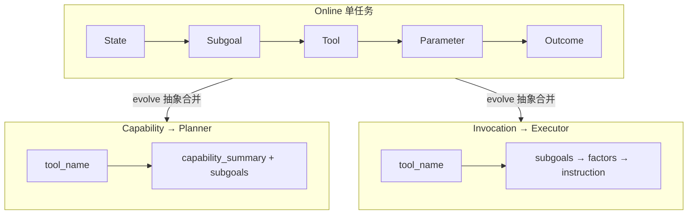

# EPC_AW Memory System Design

> 实现：`MAS/epc_aw/models/memory.py`、`causal_memory_graph.py`、`tool_knowledge_memory.py`  
> 写入：`solver.py` · 消费：`planner.py`（Tool Capability Memory）、`executor.py`（Tool Invocation Memory）

---

## 0. 总览

Memory 分为 **在线（单任务、细粒度）** 与 **离线（跨任务、高度抽象）** 两层，共五类存储：


| 层级  | 存储                             | Canonical? | 消费者              | 语义                                |
| --- | ------------------------------ | ---------- | ---------------- | --------------------------------- |
| 在线  | `causal_graph.json`            | **是**      | Diagnoser / 演化离线 | 显式节点-边 DAG                        |
| 在线  | `causal_execution_traces.json` | 导出视图       | Debug / 人工阅读     | factor→effects 线性化                |
| 在线  | `task_local_parameters.json`   | 导出视图       | Executor（本任务）    | 失败/成功参数对照                         |
| 在线  | `verified_memory.json`         | **任务内真值**  | Planner / Diagnoser / evolve gate | StructAgent 风格验证账本（facts/events/failures） |
| 在线  | `evidence_records.json`        | 辅助 claim   | SlotGate / Diagnoser | 含 `verification_status` / `live` / `fact_names` |
| 离线  | `tool_capability_memory.json`  | **是**      | **Planner**      | 工具能力边界（subgoal + context_summary） |
| 离线  | `tool_invocation_memory.json`  | **是**      | **Executor**     | 工具调用因子（factor → instruction）      |


**核心设计原则**

1. **在线 canonical 是因果图**（nodes + typed edges），不是嵌套 JSON 日志。
2. **离线是 Tool Knowledge Memory**：两个独立纯文本内存（capability → Planner / invocation → Executor），顶层键为 `tool_name`，**不存 scores / counts / confidence / embeddings / 具体任务例**。
3. **state** = 当前已有什么信息；**subgoal** = 还需补充什么信息。
4. **演化而非累积**：每次 `evolve()` 检索相似条目 → merge → rewrite 为更一般/更可分的描述，硬上限保证内存与任务数 T 解耦（见 §2.3）。
5. **Verified-only 提交（StructAgent）**：任务内事实经 `commit_verified_memory`；离线 evolve 默认只消费 live verified evidence 或 `parameter_contrasts` 成功对照（见 `models/verified_memory.py`）。
6. 执行因果序（与 Planner/Executor 分工一致）：

```
State → Subgoal → Tool → Parameter → Outcome → NextState
         ↑___________________________________|
              L1 失败时在同一 Subgoal 下换 Parameter
```

**统一图引擎**：`SystemMemory.causal_graph`（`CausalMemoryGraph`）是在线唯一 canonical；Solver / Planner 共享同一实例，不再维护并行空图。

---


## 1. 在线因果图（Online Causal Graph）


### 1.1 本体定义（Graph Ontology）


#### 节点类型


| 类型               | ID 格式                    | 关键字段                                                                                    | 含义                                              |
| ---------------- | ------------------------ | --------------------------------------------------------------------------------------- | ----------------------------------------------- |
| **State**        | `st:{task_id}:{t}`       | `state_type`, `state_label`, `evidence_ids[]`, `outline_remaining`, `valid_facts` | 某时刻的信息态；`valid_facts` 来自验证账本摘要 |
| **Subgoal**      | `sg:{hash(text)}`        | `subgoal_type`, `text`                                                                  | 当前 outline step 需补充的信息目标                        |
| **Tool**         | `tool:{tool_name}`       | `tool_name`                                                                             | 全局单例，Planner 选定的工具                              |
| **Parameter**    | `pm:{hash(fingerprint)}` | `query`, `url`, `fingerprint`, `raw_command`                                            | Executor 生成的结构化参数                               |
| **Outcome**      | `oc:{exec_step}`         | `success`, `symptom`, `preview`, `attempt_seq`                                          | 单次工具执行结果                                        |
| **Evidence**     | `ev:{ev_id}`             | `evidence_id`, `claim_type`, `verification_status`, `live`, `fact_names[]`, `source_quality` | 结构化 claim；仅 `live+satisfied/value_committed` 可贡献 State / evolve |
| **Intervention** | `iv:{outline}:{exec}`    | `recommendation`                                                                        | L1/L2 介入（retry / switch_tool / revise_belief 等） |


**Keyword 抽象**（在线保留原文 + 生成短标签，供离线索引）：


| 字段             | 规则函数                      | 示例值                                                                   |
| -------------- | ------------------------- | --------------------------------------------------------------------- |
| `state_type`   | `abstract_state_type()`   | `initial_no_info`, `partial_first_evidence`, `complete_pending_final` |
| `subgoal_type` | `abstract_subgoal_type()` | `identify_species`, `fetch_usgs_occurrence`, `extract_field`          |


#### 边类型


| 边                            | 语义              | 写入时机                                    |
| ---------------------------- | --------------- | --------------------------------------- |
| `state_requires_subgoal`     | S → SG          | outline step 开始                         |
| `subgoal_selects_tool`       | SG → T          | Planner 输出 tool                         |
| `tool_invokes_parameter`     | T → P           | Executor 生成 command                     |
| `parameter_yields_outcome`   | P → O           | 工具返回                                    |
| `outcome_transitions_state`  | O → S'          | subgoal 成功，状态转移                         |
| `outcome_extracts_evidence`  | O → EV          | 证据写入                                    |
| `evidence_contributes_state` | EV → S'         | 证据纳入新状态                                 |
| `evidence_conflicts_with`    | EV → EV         | 同 entity_key 矛盾 claim（detect_conflicts） |
| `parameter_contrasts`        | P_fail → P_succ | L1 重试成功                                 |
| `outcome_diagnoses`          | O → IV          | 失败时连到介入节点                               |


#### 倒排索引（`indexes`）

```json
{
  "by_tool": { "Google_Search_Tool": ["pm:abc"] },
  "by_subgoal_type": { "identify_species": ["sg:1234"] },
  "by_state_type": { "initial_no_info": ["st:task:0"] },
  "by_parameter_fingerprint": { "Google_Search_Tool|fish": ["pm:xyz"] }
}
```


### 1.2 单步与跨步链

**同一 outline step（含 L1 重试）**

```
S_t ─requires─► G ─selects─► T ─invokes─► P1 ─yields─► O1(fail)
                              └─invokes─► P2 ─yields─► O2(ok) ─transitions─► S_{t+1}
                                    ▲ parameter_contrasts ─┘
```

**跨 outline step（任务级）**：各 step 经 `outcome_transitions_state` 串成状态转移 DAG。

### 1.3 在线图 JSON 示例

`memory/online/{task_id}/causal_graph.json`

```json
{
  "task_id": "task_20260626_162217_05f2b0ec",
  "current_state_id": "st:task_20260626_162217_05f2b0ec:0",
  "nodes": {
    "st:task_20260626_162217_05f2b0ec:0": {
      "type": "State",
      "state_type": "partial_first_evidence",
      "state_label": "部分完成_已获首条证据_剩余3步",
      "evidence_ids": ["ev_1"],
      "outline_remaining": 3
    },
    "sg:b0840268": {
      "type": "Subgoal",
      "subgoal_type": "extract_field",
      "text": "Capture a full-page screenshot of https://example.com ..."
    },
    "tool:Screenshot_Tool": { "type": "Tool", "tool_name": "Screenshot_Tool" },
    "pm:b4ff5095": {
      "type": "Parameter",
      "fingerprint": "Screenshot_Tool|https://example.com",
      "url": "https://example.com"
    },
    "oc:1": { "type": "Outcome", "success": false, "symptom": "error_occurred" }
  },
  "edges": [
    { "src": "st:...", "dst": "sg:b0840268", "type": "state_requires_subgoal", "outline_step": "1" },
    { "src": "sg:b0840268", "dst": "tool:Screenshot_Tool", "type": "subgoal_selects_tool" },
    { "src": "tool:Screenshot_Tool", "dst": "pm:b4ff5095", "type": "tool_invokes_parameter" },
    { "src": "pm:b4ff5095", "dst": "oc:1", "type": "parameter_yields_outcome", "success": false },
    { "src": "oc:1", "dst": "iv:1:1", "type": "outcome_diagnoses" }
  ]
}
```


### 1.4 构建在线因果图（Algorithm 1）

```
Algorithm 1: RECORD_EXECUTION(step_ctx, success, attempt_seq, finalize)
──────────────────────────────────────────────────────────────────────
state_label ← INFER_STATE_TYPE(outline, evidence_count)
evidence_ids ← evidence_records[].id

node_ids ← causal_graph.record_execution(...)

if success and prior_fail_param:
    record_parameter_contrast(P_fail, P_succ)

if finalize and success:
    causal_graph.transition_state_on_success(oc_id, new_state, evidence_ids)

SYNC_DENORMALIZED_FROM_GRAPH()
    ▷ causal_execution_traces + task_local_parameters
```


| 事件         | 代码路径                                                           |
| ---------- | -------------------------------------------------------------- |
| 每次 exec 结束 | `solver._record_causal_effect` → `memory.append_causal_effect` |
| 失败         | `solver._record_failure_trace`                                 |
| 成功         | `solver._record_success_trace`（`contrast_failed_parameter`）    |
| 证据         | `add_evidence_record` → `link_evidence_to_outcome`             |


### 1.5 ClaimStore + TaskProfile（SlotGate）

**TaskProfile**（Step 0 由 `SlotGate.infer_profile(question)` 推断）定义 `required_slots` 与 `phase`（RETRIEVE → TRANSFORM → SYNTHESIZE → VERIFY）。

**evidence_records** 扩展字段：


| 字段               | 含义                                                |
| ---------------- | ------------------------------------------------- |
| `claim_type`     | `fact` / `absence` / `hypothesis`                 |
| `source_quality` | `primary` / `secondary` / `inferred` / `computed` |
| `entity_keys`    | 如 `arxiv:2207.01510`                              |
| `slot_bindings`  | `{slot_name: value}`                              |
| `status`         | `active` / `disputed`（retract）                    |


**写入规则**：`Base_Generator_Tool` 最高 `inferred` + `hypothesis`；不得单独填满 required slot。

**SlotGate.can_stop(profile, records, valid_facts=..., require_live_verified=True)** 只认 live verified evidence（及同名 `valid_facts` 补强）。完整 DONE 谓词为 `can_attempt_done`（SlotGate ∧ 无开放 contracted acquisition ∧ FinalAudit）。

**task_progress**：`completed_outline_steps`, `step_attempts`, `phase` — 与 outline 分离，检测同 step 无 slot_delta 重复执行。

**离线 anti-pattern**：`hallucination`, `wrong_tool_class`, `premature_synthesis` → Planner `FORBID` hint。

**导出视图** `causal_execution_traces.json`（`export_linear_traces()`）：

```json
[{
  "outline_step": "1",
  "factor": {
    "state": "初始状态_无已知信息",
    "state_type": "initial_no_info",
    "subgoal": "Find scientific name of clownfish species",
    "subgoal_type": "identify_species"
  },
  "effects": [
    { "attempt_seq": 1, "tool": "Google_Search_Tool",
      "parameter_struct": { "query": "fish" },
      "result": { "success": false }, "symptom": "empty" },
    { "attempt_seq": 2, "tool": "Google_Search_Tool",
      "parameter_struct": { "query": "Amphiprion ocellaris scientific name" },
      "result": { "success": true } }
  ],
  "status": "completed"
}]
```

---


## 2. Tool Knowledge Memory（离线，v5）

离线 memory **高度抽象、纯文本**，由两个相互独立的内存组成，分别回答 Planner 与 Executor 的两个不同问题。**永不存** scores / probabilities / confidence / frequencies / counts / timestamps / embeddings / 具体任务例。


| 内存                     | 回答        | 消费者                    | 顶层键         |
| ---------------------- | --------- | ---------------------- | ----------- |
| `ToolCapabilityMemory` | 选**哪个**工具 | Planner                | `tool_name` |
| `ToolInvocationMemory` | **如何**调用  | Executor（Planner 永不访问） | `tool_name` |


### 2.1 Tool Capability Memory → Planner

**Schema**

```python
ToolCapabilityMemory: Dict[tool_name, {
    "capability_summary": str,
    "subgoals": [
        {"subgoal": str, "context_summary": [str, ...]}
    ]
}]
```

**磁盘示例**（`memory/offline/tool_capability_memory.json`）

```json
{
  "Google_Search_Tool": {
    "capability_summary": "Retrieve open-domain factual information via web search.",
    "subgoals": [
      {"subgoal": "Retrieve external knowledge",
       "context_summary": ["Missing external knowledge", "Open-domain question"]},
      {"subgoal": "Identify an ambiguous entity",
       "context_summary": ["Entity not yet pinned down", "Disambiguation needed"]}
    ]
  }
}
```

**Planner 消费**：`retrieve_tool_capability(tool, current_subgoal)` → 语义最相似的 subgoal 条目（或 None）；`_build_memory_query_hint` 注入 `capability_summary` + 命中 subgoal + context_summary，**无数值**。

### 2.2 Tool Invocation Memory → Executor

**Schema**

```python
ToolInvocationMemory: Dict[tool_name, {
    "subgoals": [
        {"subgoal": str,
         "factors": {FactorName: {"instruction": str}}}
    ]
}]
```

**磁盘示例**（`memory/offline/tool_invocation_memory.json`）

```json
{
  "Google_Search_Tool": {
    "subgoals": [
      {"subgoal": "Retrieve external knowledge",
       "factors": {
         "Entity":   {"instruction": "Include sufficient identifiers to uniquely specify the target."},
         "Breadth":  {"instruction": "Adjust the number of returned results to the task need."}
       }}
    ]
  }
}
```

**Executor 消费**：`retrieve_tool_invocation(tool, subgoal)` → 命中 subgoal 的 factors；`_build_parameter_memory_hint` 注入每个 factor → instruction（每 factor 恰好 1 条），并附加本任务在线失败参数黑名单。

### 2.3 防爆炸：evolve 而非 append

硬上限保证内存与任务数 T 解耦：


| 常量                        | 值   | 含义                                                       |
| ------------------------- | --- | -------------------------------------------------------- |
| `MAX_SUBGOALS_PER_TOOL`   | 5   | 每 tool 最多 subgoal                                        |
| `MAX_CONTEXT_SUMMARIES`   | 5   | capability 每 subgoal 最多 context_summary                  |
| `MAX_FACTORS_PER_SUBGOAL` | 4   | invocation 每 subgoal 最多 factor（每 factor 1 条 instruction） |


```
evolve(tool, subgoal, context_summary_list | factor_instruction_pairs):
    entry ← RETRIEVE_SIMILAR_SUBGOAL(tool.subgoals, subgoal)
    if entry:
        MERGE context_summary / factor（generalize + rewrite）
    else:
        CREATE new subgoal
        if 超 cap → MERGE 最相似两 subgoal → rewrite 为更一般描述
    if 新建 subgoal:  BOUNDARY_REFINEMENT（跨 tool 改写使边界更可分）
    FACTOR_REFINEMENT（同 subgoal 内合并语义等价 factor）
```

- **Generalization**：合并 context_summary / instruction 后由 LLM 改写为更一般描述（无 LLM 时退化为去重 + 截断）。
- **Boundary refinement**：仅在新建 subgoal 时触发，跨工具比较，高度重叠则改写两者使能力边界更可分（不新增条目）。
- **Factor refinement**：同 subgoal 内合并语义等价 factor（Time/Freshness/Date → Freshness；Object/Entity/Target → Entity），instruction 经 `rewrite_instruction` 合并。

**检索**：`MemoryRetriever` 抽象接口；`LLMMemoryRetriever` 复用 `create_llm_engine`，纯文本语义判断，**无 embedding**；`KeywordMemoryRetriever` 为无 LLM 时的可测回退。

**规模**：每 tool ≤5 subgoals，每 subgoal ≤5 context / ≤4 factors → 存储上界 `O(K × 5 × 5)`，**与任务数 T 无关**。

### 2.4 两内存关系


| 维度   | Tool Capability Memory                  | Tool Invocation Memory                      |
| ---- | --------------------------------------- | ------------------------------------------- |
| 消费者  | Planner                                 | Executor（Planner 不访问）                       |
| 核心问题 | 选哪个工具？                                  | 如何调用？                                       |
| 演化输入 | `(tool, subgoal, context_summary_list)` | `(tool, subgoal, factor_instruction_pairs)` |
| 相似任务 | merge context_summary + generalize      | merge factor instruction + generalize       |
| 新任务  | 新建 subgoal（超 cap 则合并）                   | 新建 subgoal（超 cap 则合并）                       |





---


## 3. 演化流程（Algorithm 2）

```
EVOLVE_TOOL_KNOWLEDGE():   # 任务结束取代 upgrade_online_to_offline
SYNC_DENORMALIZED_FROM_GRAPH()
state_summary ← INFER_STATE_TYPE()

for each (state, subgoal_text), tool in task_local_parameters:
    successful ← data.successful_parameters
    if not successful: continue

    # Capability: 抽象 state 作为 context
    cap.evolve(tool, subgoal_text, [state_summary])

    # Invocation: 从结构化参数模式派生抽象 factor → instruction
    pairs ← DERIVE_FACTOR_INSTRUCTIONS(tool, successful)   # 不存原始 query
    if pairs: inv.evolve(tool, subgoal_text, pairs)
```

**factor 派生规则**（`_derive_factor_instructions`，从 `parse_parameter_command` 的结构化键映射到抽象 factor，保持抽象、不存具体值）：


| 参数键出现         | 派生 factor | 通用 instruction                                                 |
| ------------- | --------- | -------------------------------------------------------------- |
| `query`       | Entity    | Include sufficient identifiers to uniquely specify the target. |
| `url`         | Source    | Use a direct URL when the target page is already known.        |
| `site`        | Scope     | Restrict the search to the requested domain.                   |
| `max_results` | Breadth   | Adjust the number of returned results to the task need.        |
| `timeout`     | Latency   | Set a timeout that tolerates slow responses.                   |


---


## 4. 场景示例


### 4.1 成功检索 → invocation 演化

Task t：`Google_Search_Tool` 以 `query="salmon scientific name", max_results=5` 成功。

任务结束 `evolve_tool_knowledge()` 后 `tool_invocation_memory.json`：

```json
"Google_Search_Tool": {"subgoals": [
  {"subgoal": "Retrieve external knowledge",
   "factors": {
     "Entity":  {"instruction": "Include sufficient identifiers to uniquely specify the target."},
     "Breadth": {"instruction": "Adjust the number of returned results to the task need."}
   }}]}
```

Task t+1（相似 subgoal）：命中同一 subgoal → 对 Entity/Breadth 做 `rewrite_instruction` 合并，**不新增条目**。

### 4.2 工具切换 → capability 边界

Solver 在选工具时用 `retrieve_tool_capability` 做纯文本边界检查：若当前工具对该 subgoal 无匹配条目，而另一启用工具有匹配 subgoal，则建议切换（取代旧 `failure_count/confidence` 阈值）。

---


## 5. 持久化与生命周期（Algorithm 3）

```
INIT:
    LOAD_OFFLINE_MEMORY
      → 读 tool_capability_memory.json / tool_invocation_memory.json
      → capability 为空时 seed_default_capabilities()（7 启用工具，抽象级）

RUNTIME:
    append_causal_effect → causal_graph
    sync → traces + task_local

END_OF_TASK:
    EVOLVE_TOOL_KNOWLEDGE()
    PERSIST_OFFLINE_MEMORY()   # 写两份 JSON + offline_manifest.json (schema: tool_knowledge_memory_v1)
    PERSIST_ONLINE_MEMORY(task_id)
```

**目录结构**

```
memory/
├── offline/
│   ├── tool_capability_memory.json     # tool → {capability_summary, subgoals}
│   ├── tool_invocation_memory.json     # tool → {subgoals: [{subgoal, factors}]}
│   └── offline_manifest.json
├── online/{task_id}/
│   ├── causal_graph.json               # canonical
│   ├── causal_execution_traces.json    # 导出
│   ├── task_local_parameters.json      # 导出
│   ├── evidence_records.json
│   └── metadata.json
└── screenshots/...
```

---


## 6. 查询接口

```python
# Planner — Tool Capability Memory
memory.list_capability_tools()                         # → [tool_name]
memory.get_tool_capability_summary(tool)               # → str
memory.retrieve_tool_capability(tool, current_subgoal) # → {subgoal, context_summary} | None

# Executor — Tool Invocation Memory
memory.retrieve_tool_invocation(tool, subgoal)         # → {subgoal, factors:{F:{instruction}}} | None

# Online（不变）
memory.query_failed_parameters(state, subgoal, tool)   # 在线图优先
memory.get_failed_parameter_blacklist(...)             # 本任务在线
memory.causal_graph.get_tools_for_context(state_type, subgoal_type)
memory.get_causal_traces(state=..., subgoal=...)
```

**Prompt 注入**


| 模块       | 方法                               | 注入内容                                                       |
| -------- | -------------------------------- | ---------------------------------------------------------- |
| Planner  | `_build_memory_query_hint()`     | capability_summary + 命中 subgoal + context_summary（纯文本，无数值） |
| Executor | `_build_parameter_memory_hint()` | factor → instruction + 本任务失败参数 blacklist                   |


---


## 7. 模块消费关系

```
SystemMemory
├── causal_graph (CausalMemoryGraph)        ← 在线 canonical
│     └── sync → traces / task_local
├── offline.tool_capability  (ToolCapabilityMemory)  ← Planner
└── offline.tool_invocation  (ToolInvocationMemory)  ← Executor

evolve_tool_knowledge: causal_graph exports → evolve into Tool Knowledge Memory
```


| 层                      | 读取方             | 写入方                           | 状态  |
| ---------------------- | --------------- | ----------------------------- | --- |
| 在线 causal_graph        | Diagnoser / 演化  | `append_causal_effect`        | ✓   |
| 在线 traces / task_local | Debug / 本任务     | graph 导出                      | ✓   |
| 离线 capability          | Planner prompt  | `ToolCapabilityMemory.evolve` | ✓   |
| 离线 invocation          | Executor prompt | `ToolInvocationMemory.evolve` | ✓   |
| evidence               | LLM prompt      | `add_evidence_record`         | ✓   |


---


## 8. Workflow 衔接


| 事件                 | Memory 操作                                                |
| ------------------ | -------------------------------------------------------- |
| outline step 开始    | `state_requires_subgoal`                                 |
| Planner 选 tool     | `subgoal_selects_tool` + `retrieve_tool_capability` 提示   |
| Executor 产 command | `tool_invokes_parameter` + `retrieve_tool_invocation` 提示 |
| 工具返回               | `parameter_yields_outcome`                               |
| L1 retry 失败        | 追加 P'→O'；`outcome_diagnoses`                             |
| L1 retry 成功        | `parameter_contrasts` + `outcome_transitions_state`      |
| switch_tool        | 新 `subgoal_selects_tool`，共享 Subgoal；capability 边界检查      |
| subgoal complete   | `add_evidence_record` + state 转移                         |
| task end           | `evolve_tool_knowledge` → persist                        |


详见 `MAS_Workflow.md`。

---


## 9. 实现文件索引


| 文件                                | 职责                                                                                      |
| --------------------------------- | --------------------------------------------------------------------------------------- |
| `models/causal_memory_graph.py`   | 在线节点/边/索引/record/query/export；Evidence.`verification_status`/`live`/`fact_names` |
| `models/tool_knowledge_memory.py` | 离线 Tool Knowledge Memory：capability/invocation 两内存、MemoryRetriever、MemoryRefiner、evolve |
| `models/verified_memory.py`       | StructAgent 验证账本：`MemoryCommitEvent` / `VerifiedTaskMemory` / commit kind 映射 |
| `models/memory.py`                | SystemMemory：`commit_verified_memory`、`compact_task_view`、verified-only evolve |
| `solver.py`                       | 运行时写入；`apply_ablation_memory_flags` 同步 verified-memory 开关 |
| `planner.py`                      | 消费 Tool Capability Memory + compact obtained view |
| `executor.py`                     | 消费 Tool Invocation Memory                                                               |


