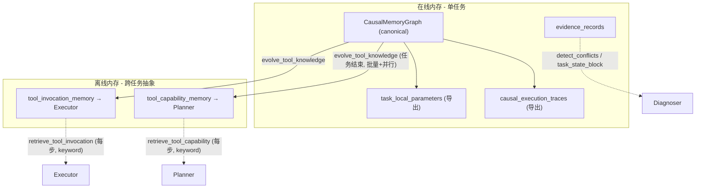
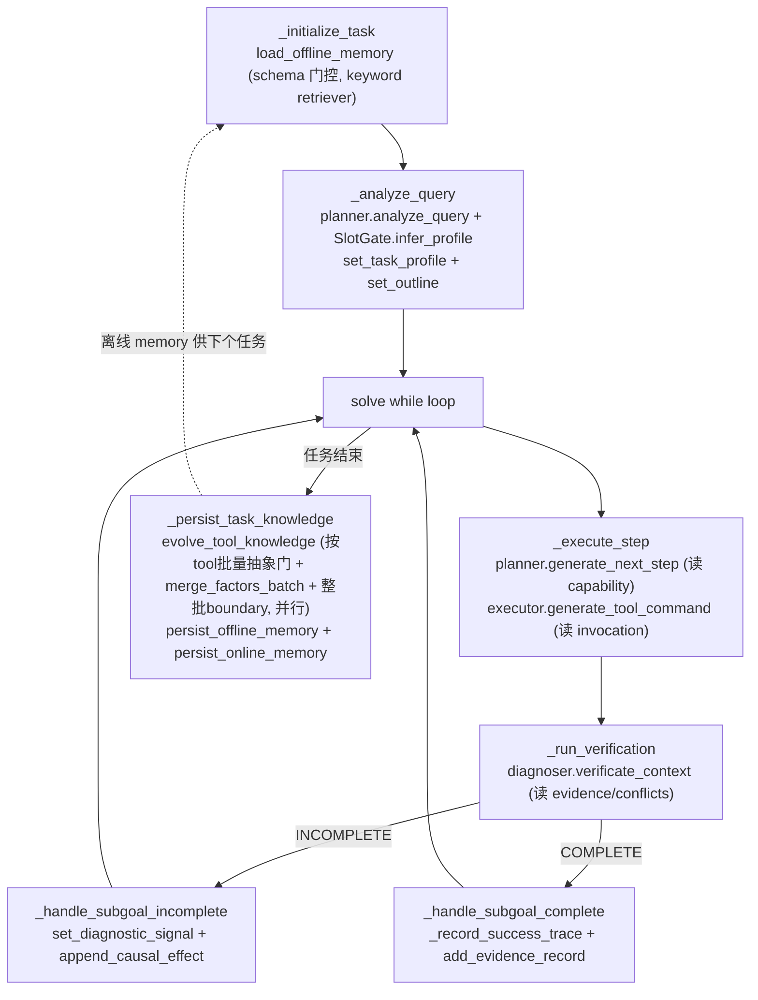

# EPC_AW Memory 系统技术报告

> 代码根目录：`MAS/epc_aw/`
> 关键文件：`models/memory.py`、`models/causal_memory_graph.py`、`models/tool_knowledge_memory.py`、`solver.py`、`models/planner.py`、`models/executor.py`、`models/diagnoser.py`、`models/task_profile.py`
> schema 版本：`tool_knowledge_memory_v2`

---

## 0. 总览

Memory 分为**在线（单任务、细粒度、因果图）**与**离线（跨任务、高度抽象、纯文本）**两层，共五类存储：

| 层级 | 存储 | Canonical? | 消费者 | 语义 |
|---|---|---|---|---|
| 在线 | `causal_graph.json` | 是 | Diagnoser / 演化离线 | 显式节点-边 DAG |
| 在线 | `causal_execution_traces.json` | 导出视图 | Debug / 人工阅读 | factor→effects 线性化 |
| 在线 | `task_local_parameters.json` | 导出视图 | Executor（本任务）/ 演化离线 | 失败/成功参数对照 |
| 在线 | `evidence_records.json` | 是 | Diagnoser / SlotGate | 结构化 claim（fact/absence/hypothesis） |
| 离线 | `tool_capability_memory.json` | 是 | **Planner** | 工具能力边界（subgoal + Applicability Conditions） |
| 离线 | `tool_invocation_memory.json` | 是 | **Executor** | 工具调用知识（Decision Dimension → Instruction） |

**规范术语（贯穿注释/prompt/docstring）**

| 术语 | 含义 |
|---|---|
| State | 当前已有什么信息（在线） |
| Subgoal | 还需补充什么信息 |
| Capability | 何时应选此工具 |
| Applicability Condition | 在何种条件下该能力适用（= `context_summary`） |
| Invocation | 如何调用此工具 |
| Decision Dimension（Factor） | 影响参数构造的哪一个独立维度 |
| Instruction | 在该维度下应如何构造参数（每维恰好一条） |

**核心设计原则**

1. 在线 canonical 是**因果图**（`CausalMemoryGraph`），不是嵌套 JSON 日志；`causal_execution_traces` 与 `task_local_parameters` 都是从图导出的视图。
2. 离线是 **Tool Knowledge Memory**：两个独立纯文本内存，顶层键为 `tool_name`，**不存 scores/counts/confidence/embeddings/metadata/具体任务例**。schema 保持极简，**禁止随意新增字段**（Memory Compression 是核心卖点）。
3. **演化而非累积**：离线 memory 采用 *Memory Compression through Generalization + Differentiation*——每次更新是「泛化 + 差异化」，不是 append；硬上限保证内存规模与任务数 T 解耦。
4. **离线演化时机**：当前任务产出最终答案后（任务结束）；在线 memory 在任务处理过程中更新。在线因果图/证据/轨迹/任务本地参数视为稳定，不在本次重构范围内。
5. 执行因果序：`State → Subgoal → Tool → Parameter → Outcome → NextState`。



---

## 1. 在线因果图（Online Causal Graph）

实现：`models/causal_memory_graph.py`，由 `SystemMemory.causal_graph` 持有，Solver/Planner 共享同一实例。

### 1.1 节点类型（`GraphNodeType`）

| 类型 | ID 格式 | 含义 |
|---|---|---|
| `STATE` | `st:{task_id}:{t}` | 某时刻的信息态 |
| `SUBGOAL` | `sg:{hash(text)}` | 当前 outline step 需补充的信息目标 |
| `TOOL` | `tool:{tool_name}` | 全局单例，Planner 选定工具 |
| `PARAMETER` | `pm:{hash(fingerprint)}` | Executor 生成的结构化参数（query/url/...） |
| `OUTCOME` | `oc:{exec_step}` | 单次工具执行结果（success/symptom/preview） |
| `EVIDENCE` | `ev:{ev_id}` | 结构化 claim（fact/absence/hypothesis） |
| `INTERVENTION` | `iv:{outline}:{exec}` | L1/L2 介入（retry/switch_tool/revise_belief/...） |

### 1.2 边类型（`ExecutionEdgeType`）

| 边 | 语义 | 写入时机 |
|---|---|---|
| `state_requires_subgoal` | State → Subgoal | outline step 开始 |
| `subgoal_selects_tool` | Subgoal → Tool | Planner 选工具 |
| `tool_invokes_parameter` | Tool → Parameter | Executor 生成命令 |
| `parameter_yields_outcome` | Parameter → Outcome | 工具执行 |
| `outcome_transitions_state` | Outcome(success) → NextState | 成功后状态转移 |
| `outcome_extracts_evidence` | Outcome → Evidence | 提取证据 |
| `evidence_contributes_state` | Evidence → State | 证据累积成新状态 |
| `parameter_contrasts` | failed Parameter → success Parameter | 同 subgoal 失败→成功对照 |
| `outcome_diagnoses` | Outcome → Intervention | 失败诊断 |

### 1.3 Keyword 抽象（在线保留原文 + 生成短标签供离线索引）

| 函数 | 文件:行 | 作用 |
|---|---|---|
| `abstract_subgoal_type` | `causal_memory_graph.py:42` | subgoal 文本 → keyword（如 `retrieve_information`） |
| `abstract_state_type` | `causal_memory_graph.py:62` | 中文状态标签 → keyword（如 `initial_no_info`） |
| `infer_state_type` | `memory.py:428` | 由 evidence 数 + outline 剩余步数推出状态标签 |
| `infer_state_keyword` / `infer_subgoal_keyword` | `memory.py:443/446` | 对外查询封装 |

### 1.4 图关键方法

| 函数 | 文件:行 | 作用 |
|---|---|---|
| `record_execution` | `causal_memory_graph.py:251` | 记录 State→Subgoal→Tool→Parameter→Outcome 链；失败时可选 Intervention 边 |
| `record_parameter_contrast` | `causal_memory_graph.py:342` | failed→success 参数对比边 |
| `transition_state_on_success` | `causal_memory_graph.py:348` | 成功 Outcome 触发新 State + Evidence 链接 |
| `get_tools_for_context` | `causal_memory_graph.py:414` | 按 subgoal_type 汇总本任务工具尝试/成功率 |
| `get_failed_parameters` / `get_successful_parameters` | `causal_memory_graph.py:455/497` | 图内失败/成功参数列表 |
| `export_linear_traces` | `causal_memory_graph.py:547` | 导出兼容旧格式的 factor/effects 线性 trace |
| `export_task_local_parameters` | `causal_memory_graph.py:627` | 导出 `state::subgoal → {tool: {failed/successful/pairs}}` |
| `append_causal_effect` | `memory.py:534` | **统一写入口**：调 `record_execution` + contrast + `transition_state_on_success` + `_sync_denormalized_from_graph` |
| `_sync_denormalized_from_graph` | `memory.py:467` | 用 graph export 刷新 `causal_execution_traces` 与 `task_local_parameters` |

> 设计要点：在线图保留**原文**（细粒度、可追溯），同时生成**抽象 keyword**（供离线演化索引）。`task_local_parameters` 与 `causal_execution_traces` 不是独立存储，而是图导出视图，避免双写不一致。

---

## 2. 在线结构化证据（evidence_records）

实现：`SystemMemory.evidence_records`，由 `add_evidence_record`（`memory.py:303`）写入。

每条 record 字段：`id, outline_step, exec_step, subgoal, tool, content, content_hash, source_quality(primary/secondary/inferred/computed), subgoal_complete, confidence, claim_type(fact/absence/hypothesis), slot_bindings, entity_keys, status, timestamp`，Python_Coder_Tool 记录可带 `compute_real`。

- **去重**：按 `content_hash`（前 500 字符 md5）去重。
- **冲突检测**：`detect_conflicts`（`memory.py:367`）按 `entity_keys` 聚合，检测同实体的矛盾 claim。
- **撤回**：`retract_evidence` / `retract_inferred_for_entity` 把 `status` 置 `disputed`。
- **Slot 查询**：`claims_for_slot` 按 slot 名检索支持证据。
- **entity_keys 解析**：`_parse_entity_keys`（`memory.py:294`）从内容抽取 arxiv ID 等 canonical 实体键。

> 写入方是 **Solver**（`_harvest_slots_from_executor`、`_persist_slot_deltas`、`_record_obtained_information`），Diagnoser/SlotGate 只读。

---

## 3. 离线 Tool Knowledge Memory

实现：`models/tool_knowledge_memory.py`。两个独立内存，纯文本，无数值型指标。**schema 极简，不新增字段**——通过改进现有字段语义而非增加 schema 复杂度来提升表达力。

### 3.1 Tool Capability Memory（Planner 消费）

`context_summary` 语义 = **Applicability Conditions**：每条句子回答「在何种条件下应选此工具？」。**禁止**执行进度（"部分完成_已获3条证据"）、任务状态（"三个实体未解"）、已检索证据、参数配置、步数。

Schema：
```json
{
  "Google_Search_Tool": {
    "capability_summary": "Retrieve open-domain factual information via web search.",
    "subgoals": [
      {"subgoal": "Retrieve external factual knowledge",
       "context_summary": ["External knowledge is unavailable.", "Open-domain question"]},
      {"subgoal": "Disambiguate an ambiguous entity", "context_summary": [...]},
      {"subgoal": "Retrieve time-sensitive information", "context_summary": [...]},
      {"subgoal": "Verify a contested claim", "context_summary": [...]}
    ]
  }
}
```

- **固定正交 subgoal 词表**：每个 tool 预定义 3-4 个抽象 subgoal 槽位，由 `seed_default_capabilities`（`ToolCapabilityMemory` 类方法）初始化。这些 subgoal 文本在演化中**冻结**——不被改写、不新增、不被 boundary refinement 触碰。
- 硬上限：`MAX_SUBGOALS_PER_TOOL=5`、`MAX_CONTEXT_SUMMARIES=5`。

### 3.2 Tool Invocation Memory（Executor 消费，Planner 永不访问）

`factors` 键名保留，语义 = **Decision Dimensions**：每个 key 是影响参数构造的一个**独立**维度（如 Entity/Freshness/Scope/Source）。每个维度**恰好一条** instruction，描述在该维度下如何构造参数。语义等价维度由 `factor_refinement` / `merge_factors_batch` 积极合并（Time→Freshness、Object→Entity）。

Schema：
```json
{
  "Google_Search_Tool": {
    "subgoals": [
      {"subgoal": "Retrieve external factual knowledge",
       "factors": {
         "Entity": {"instruction": "Include sufficient identifiers to uniquely specify the target."},
         "Freshness": {"instruction": "Prefer recent sources when temporal relevance affects the answer."},
         "Scope": {"instruction": "Restrict the search to the requested domain or topic."},
         "Source": {"instruction": "Prefer authoritative sources when reliability is critical."}
       }}
    ]
  }
}
```

- subgoal 槽位与 capability memory 共享同一冻结词表。
- 由 `seed_default_invocations`（`ToolInvocationMemory` 类方法）用正交 dimension→instruction 对初始化。
- 建议正交维度名 `CANONICAL_FACTOR_NAMES`（`Entity/Freshness/Scope/Source/Breadth/Latency/Format`），LLM 抽象时优先复用。
- 硬上限：`MAX_FACTORS_PER_SUBGOAL=4`，每维恰好 1 条 instruction。

### 3.3 检索接口（Retriever，与存储解耦）

`MemoryRetriever` 抽象（`tool_knowledge_memory.py`），两实现：
- `KeywordMemoryRetriever`：**默认**，无 LLM，token Jaccard ≥0.15 视为相似。匹配对象是 ≤4 个短 canonical 名，Jaccard 完全够用，**检索零 LLM 调用**。
- `LLMMemoryRetriever`：LLM 语义匹配，失败回退 keyword。**opt-in**（默认不启用，仅 `SystemMemory.__init__` 显式构造时才用）。

关键检索方法：
| 方法 | 作用 |
|---|---|
| `find_similar_subgoal` | 在 subgoal 列表里找最相似条目（`_find_slot` 内 verbatim 精确匹配优先，本就不触发检索 LLM） |
| `find_similar_factor` | 在 dimension 名里找语义等价 |
| `find_similar_subgoal_across_tools` | 跨 tool subgoal 匹配 |

> 设计契约（spec Mod 8）：检索与存储解耦，实现可互换，无结构变更。默认 keyword 是 LLM 成本优化的关键一环（见 §5）。

---

## 4. Memory Evolution：批量 Generalize + Differentiate

本系统相对传统 append 式 Agent Memory 的核心创新点：**memory 规模近似恒定，知识密度持续提升**。演化路径已全面**批量化**以压低 LLM 调用数与 token 成本（见 §5 成本账）。

### 4.1 演化总流程（`SystemMemory.evolve_tool_knowledge`，`memory.py`）

任务结束 → `_persist_task_knowledge`（`solver.py:1368`）调用 `evolve_tool_knowledge`：

```
1. _sync_denormalized_from_graph()                         # 从因果图导出 task_local_parameters
2. 按 tool 聚合所有成功的 (subgoal, params)                  # per_tool: Dict[tool, List[item]]
3. 并行（ThreadPoolExecutor, max_workers=min(T,4)）各 tool pipeline：
     a. refiner.abstract_experiences_batch(tool, ...)       # 1 次 LLM：整 tool 经验→抽象数组
     b. for abst in abst_list:
          cap.evolve(tool, abst.subgoal, abst.context)      # 合并进冻结槽位（多数 0 LLM）
          inv.evolve(tool, abst.subgoal, abst.factors)      # 1 次 LLM：merge_factors_batch
4. refiner.boundary_refinement(cap)                         # 0 或 1 次 LLM：整批跨 tool 差异化
```

各 tool pipeline 相互独立（仅触碰 `cap.data[tool]`/`inv.data[tool]`，refiner 方法无状态），故可安全并行——**并行只降延迟、不改 token 总量**。

### 4.2 ingest 抽象门（Generalize，按 tool 批量）

`MemoryRefiner.abstract_experiences_batch`（`tool_knowledge_memory.py`）：把一个 tool 的**全部**成功经验在一次 LLM 调用里映射到抽象词表。

```
输入: (tool, capability_summary, canonical_subgoals, items: List[{concrete_subgoal, question, successful_params}])
输出: List[{abstract_subgoal ∈ 词表(verbatim), context_summaries(≤3, Applicability Conditions),
            factors(≤4, 正交 Decision Dimension → instruction)}]   # 与输入等长、同序
```

- 共享 `_ABSTRACT_SYSTEM_PROMPT` 常量（单条 `_abstract_with_llm` 与批量共用同一套规则）。
- LLM 规则：abstract_subgoal 必须**逐字复制**自 canonical_subgoals；context_summary 必须是 Applicability Condition（给出 Good/Bad 例句，禁止执行进度/任务状态）；factors 是 ≤4 正交 Decision Dimension；ABSTRACTION IS MANDATORY（禁实体/URL/paper/人名/物种/编目号）；不得输出除三字段外的任何字段。
- 解析失败或某元素 `abstract_subgoal` ∉ canonical 时，**仅对该元素**回退 `_abstract_with_llm` 单条调用（局部回退，不浪费整批）。
- 无 LLM 时退化为 per-item `_abstract_fallback`（keyword 最近邻 subgoal + `_FALLBACK_FACTORS` 默认正交维度）。
- **防泄漏 guard**（`_strip_task_leakage` + `_suspicious_tokens`）：后处理 LLM 输出，剔除含任务实体/专有名词/编号 token 的 context 或 instruction；全被剔则回退 tool-typed 默认维度。保证 memory 永远抽象。

> 单条版 `abstract_experience` 保留供单点调用/测试；主路径用批量版。

### 4.3 evolve（合并进冻结槽位）

`ToolCapabilityMemory.evolve` / `ToolInvocationMemory.evolve`（`tool_knowledge_memory.py`）：

- `_find_slot`：先 verbatim 精确匹配（abstract_subgoal 来自词表，常态命中），再检索语义匹配。
- 若无匹配但已有槽位：`_nearest_existing_slot` 强制映射到最近槽位（**绝不新增 subgoal**，冻结词表契约）。
- 仅当 tool 完全无槽位（未 seed）才创建一个槽位（7 个 seeded tool 不可达）。
- **Capability**：`generalize_context_summaries` 合并 + 泛化 Applicability Conditions（subgoal 文本冻结）。
- **Invocation**：`merge_factors_batch` 单次 LLM 合并新维度进冻结槽位（见 §4.4）。

### 4.4 factor 批量合并（Invocation，每对 1 次 LLM）

`MemoryRefiner.merge_factors_batch(existing_factors, new_pairs)`：单次 LLM 调用，输入「现有 dimensions+instructions」与「新 pairs」，输出合并后的 `{Dimension: {instruction}}`——≤4 维、每维**恰好一条**更一般化 instruction（保留所有先前含义）、语义等价维度已折叠（Time+Freshness→Freshness、Object+Entity+Target→Entity）、保持 task-abstract。

- 合并了旧版「per-factor `find_similar_factor` + `rewrite_instruction` + 末尾 `factor_refinement`」三步（旧版每对最多 ~9 次调用）为 1 次。
- 解析失败或无 LLM 时回退 `_merge_factors_fallback`（keyword 匹配 + `rewrite_instruction` + `factor_refinement`，即旧路径）。
- `rewrite_instruction` / `factor_refinement` 保留不删（cap 强制裁剪路径、无 LLM fallback、单条抽象回退仍用）。

### 4.5 context 泛化的早退（跳过无信号）

`MemoryRefiner.generalize_context_summaries`：当**无新内容需泛化**时不调 LLM——
- `new` 为空，或
- `new` 每条已 verbatim ∈ `existing`，或
- 去重后 ≤ cap 且无重叠（keyword Jaccard < 0.3 视为无重叠）

→ 直接 dedup+cap 返回，0 LLM。仅当确有重叠需合并或触顶时才调 LLM。

### 4.6 Differentiate（跨 tool 边界细化，整批 1 次）

`MemoryRefiner.boundary_refinement`：subgoal 文本冻结不动，仅差异化 `capability_summary`：
1. keyword 两两预筛重叠对（Jaccard ≥0.20），收集涉及的工具集。
2. 若无重叠 → 0 LLM 调用。
3. 否则 `_differentiate_capabilities_batch` 单次 LLM 调用，输入所有涉及 tool 的 summary，输出 `{tool: new_summary}`，最大化跨工具区分度（如 "Retrieve information" → "Retrieve open-domain factual information." vs "Interact with webpage content requiring user interaction."），不增加规模、不新增字段。
4. 解析失败回退 per-pair `_differentiate_capability`（旧版逐对路径）。

---

## 5. LLM 调用成本与 ICLR 防御

### 5.1 优化前后对比（单任务离线演化）

| 阶段 | 优化前（per-pair/per-factor） | 优化后（批量+跳过） |
|---|---|---|
| 检索（factor/subgoal 匹配） | 8-16（`LLMMemoryRetriever`） | **0**（默认 keyword） |
| 抽象门 | P（每对 1 次） | T_tools（**按 tool 批量**，典型 1-3） |
| context 泛化 | P（engine 在场必调） | 0-1（**无新内容即跳过**） |
| factor 合并+去重 | ~5-9×P（匹配+重写+分组） | P（**`merge_factors_batch` 每对 1 次**） |
| boundary 差异化 | 2-5（逐对） | 0 或 1（**整批**） |
| **合计（典型 T=2, P=3）** | **~19-35** | **~4-7** |

token 降幅 > 调用数降幅：批量共享 system prompt、合并重叠上下文。

### 5.2 成本计数单测（`test_evolve_cost.py`）

mock 引擎计数，2 tools × 3 对（P=3）：
- 复制版 pipeline：**7 次**（abstract_batch 2 + merge_factors_batch 3 + generalize_context 1 + abstract_single 1 fallback）
- 真实 `SystemMemory.evolve_tool_knowledge`（含并行路径）：**7 次**
- 断言 ≤7/≤8 通过；不变量（subgoal≤5、context≤5、factor≤4、每维 1 instruction）通过；无任务实体泄漏。

### 5.3 端到端验收（pid 2-4，GAIA）

- exit_code 0，三任务全跑完，每任务结束均成功 persist 离线 memory。
- 无 `⚠️ evolve pipeline failed` / `⚠️ boundary_refinement skipped` / memory-code Traceback。
- **泄漏检查通过**：`unlambda`/`penguin`/`nature 2020`/`p-value`/`perigee`/`moon` 等任务实体均未进入离线 memory（含 pid=3 Unlambda 防泄漏硬测）。
- **不变量全通过**：每 tool ≤4 subgoals、每 subgoal ≤3 context、≤4 dimensions、每维 1 instruction；subgoal 词表冻结不变。

### 5.4 ICLR 防御要点

1. **检索零 LLM**（keyword Jaccard，匹配 ≤4 个短 canonical 名），演化用廉价模型（`os.getenv("MODEL_Name", "gpt-4o-mini")`），非主求解模型。
2. 演化是「**按 tool 批量 + 跳过无信号**」的压缩操作，非每经验一次调用；单任务 ~4-7 次廉价调用（旧版 ~19-35）。
3. memory 规模**恒定**（压缩非累积），长期边际成本不随任务数增长。
4. 独立 tool pipeline **并行化**（ThreadPoolExecutor）压低延迟，不改 token 总量。
5. 可报告「每任务演化 token / 主求解 token」比值作为成本-效益指标。

---

## 6. MAS 如何更新 Memory（写路径）

### 6.1 生命周期锚点（`solver.py`）

| 函数 | 行 | 作用 |
|---|---|---|
| `_initialize_task` | 1327 | `init_causal_graph_for_task` + `set_query` + **`load_offline_memory`** |
| `_analyze_query` | 1349 | `planner.analyze_query` + `SlotGate.infer_profile` → `set_task_profile`/`set_outline` |
| `solve` | 2898 | 主循环：outline 步 → execute → verify → complete/incomplete |
| `_persist_task_knowledge` | 1368 | `evolve_tool_knowledge` → `persist_offline_memory` → `persist_online_memory` |

### 6.2 在线写路径（任务处理过程中）

| 写入目标 | 入口函数 | 调用链 |
|---|---|---|
| 因果图 / task_local_parameters | `_record_causal_effect`（`solver.py:1839`） | → `append_causal_effect` → `record_execution` + contrast + `transition_state_on_success` + `_sync_denormalized_from_graph` |
| 失败轨迹 | `_record_failure_trace`（`solver.py:2000`） | `append_causal_effect(finalize=False)` |
| 成功轨迹 | `_record_success_trace`（`solver.py:2019`） | `append_causal_effect(finalize=True, contrast_failed_parameter)` |
| 证据 | `add_evidence_record`（`memory.py:303`） | 由 `_harvest_slots_from_executor`/`_persist_slot_deltas`/`_record_obtained_information` 调用 |
| 诊断信号 | `set_diagnostic_signal`（`memory.py:838`） | 由 `_handle_subgoal_incomplete` 调用，追加 history |

> 参数记忆（`add_failed_parameter`/`add_successful_parameter`）在主路径不直接调用，由 `append_causal_effect` → graph export → `_sync_denormalized_from_graph` 间接维护。

### 6.3 离线写路径（演化，任务结束）

任务结束 → `_persist_task_knowledge`（`solver.py:1368`）：
1. `evolve_tool_knowledge`（见 §4.1）：按 tool 聚合 → 批量抽象门 → evolve 合并 → 整批 boundary，各 tool pipeline 并行。
2. `persist_offline_memory`（`memory.py:1076`）：写 `tool_capability_memory.json` + `tool_invocation_memory.json` + `offline_manifest.json`（含 `schema`）。
3. `persist_online_memory`（`memory.py:1044`）：写 `online/{task_id}/` 下 `causal_graph.json`、`causal_execution_traces.json`、`task_local_parameters.json`、`evidence_records.json`、`metadata.json`。

### 6.4 加载与 schema 门控

`load_offline_memory`（`memory.py:1091`）：
- 读 `offline_manifest.json` 的 `schema`。
- 若 ≠ `MEMORY_SCHEMA_VERSION`（`tool_knowledge_memory_v2`），打印提示并 `_seed_offline_memory_from_defaults()` **全量重置为冻结 seed**（清理污染的旧文件，无需手动删）。
- schema 匹配则加载磁盘两份 JSON；仍为空则补 seed。
- 构造：retriever 固定 `KeywordMemoryRetriever`（0 LLM），`MemoryRefiner` 带 LLM engine 用于抽象/合并/boundary。

---

## 7. MAS 如何利用 Memory（读路径）

### 7.1 Planner 读 Tool Capability Memory

| 函数 | 文件:行 | 作用 |
|---|---|---|
| `_build_memory_query_hint` | `planner.py:466` | **唯一 Planner 侧消费点**：遍历 `list_capability_tools()`，对每 tool 取 `get_tool_capability_summary` + `retrieve_tool_capability(tool, subgoal)`，构建 `🧰 TOOL CAPABILITIES:` 块（`summary \| subgoal \| when: context_summary`，≤8 行） |
| `generate_next_step` | `planner.py:336` | 调 `_build_memory_query_hint(target_information)`，结果前缀注入 `generate_next_step.txt` prompt |
| `_enforce_tool_policy` | `solver.py:885` | Solver 侧：当前工具无 capability 匹配时建议切换工具 |

> `analyze_query` / `_self_criticize_analysis` **不**读 capability memory——Step-0 分析与数量自省不依赖历史工具知识。

### 7.2 Executor 读 Tool Invocation Memory

| 函数 | 文件:行 | 作用 |
|---|---|---|
| `_build_parameter_memory_hint` | `executor.py:222` | 调 `retrieve_tool_invocation(tool, sub_goal)` + `get_failed_parameter_blacklist(state, sub_goal, tool)`，构建 `🧰 TOOL INVOCATION (tool):` + 每 dimension `• dname: instruction` + 黑名单（≤8 行） |
| `generate_tool_command` | `executor.py:124` | 把 hint 追加到 `diagnostic_hint_prefix`，与 `generate_tool_command.txt` 模板拼装，`llm_generate_tool_command(response_format=ToolCommand)` 生成命令 |
| `_retry_with_parameter_variation` | `solver.py:2206` | L1 干预：带 enriched diagnostic_signal 重新生成命令（同样经 memory hint） |

### 7.3 Diagnoser 读在线 Memory / 产出诊断信号

| 函数 | 文件:行 | 作用 |
|---|---|---|
| `verificate_context` | `diagnoser.py:952` | 读 `evidence_records` + `get_task_profile()` → `task_state_block` 注入验证 prompt；读 `step_attempts` 算 `same_tool_repeat`；调 `detect_conflicts()`，有冲突则降级 SUBGOAL_COMPLETE |
| `_reconcile_task_conclusion` | `diagnoser.py:921` | 读 evidence + `SlotGate.can_stop` |
| `update_outline` | `diagnoser.py:1723` | 读 evidence + profile → `TaskState` 注入 `update_outline.txt` |
| `_generate_causal_signal` | `diagnoser.py:1224` | SUBGOAL_INCOMPLETE 时构建 `diagnostic_signal_t`（triggered/recommendation/failure_patterns/可选 parameter_guidance） |
| `_suggest_intervention` | `diagnoser.py:1375` | 干预阶梯：retry → switch_tool → revise_belief → decompose_goal → modify_state |
| `_generate_parameter_guidance` | `diagnoser.py:1284` | 为 Executor 生成参数变体方向/禁止模式 |

**诊断信号回馈路径**：
```
verificate_context → _generate_causal_signal
  → Solver _handle_subgoal_incomplete: set_diagnostic_signal
  → 下一轮 _execute_step: diagnostic_signal_prev
  → Planner generate_next_step(diagnostic_signal) + Executor generate_tool_command(diagnostic_signal)
```

### 7.4 SlotGate / TaskProfile（`models/task_profile.py`）

| 函数 | 作用 |
|---|---|
| `SlotGate.infer_profile` | 从 question 推断 TaskProfile（phase, slots） |
| `SlotGate.can_stop` / `forbidden_tools` / `extract_final_answer` | 控制 STOP、禁工具、最终答案抽取 |
| `task_state_block(evidence)` | 把 evidence 压成状态块注入 planner/diagnoser prompt |

`_analyze_query`（`solver.py:1349`）处 `infer_profile → set_task_profile`；`_can_stop_execution`（`solver.py:1121`）用 SlotGate 硬门控 STOP。

---

## 8. 端到端数据流



**单步内存读写的时序**：
1. Planner `generate_next_step`：读 capability memory hint + diagnostic_signal + SlotGate forbidden tools → 选 tool/sub_goal/context。
2. Executor `generate_tool_command`：读 invocation memory hint（dimension→instruction）+ 失败参数黑名单 + diagnostic parameter_guidance → 生成结构化命令。
3. 工具执行 → `_record_causal_effect` → `append_causal_effect` 写因果图（含失败→成功 contrast）。
4. Diagnoser `verificate_context`：读 evidence_records + detect_conflicts → 产出 diagnostic_signal。
5. 成功 → `add_evidence_record` + `_record_success_trace`；失败 → `set_diagnostic_signal` + `_record_failure_trace`。
6. 任务结束 → `evolve_tool_knowledge`：按 tool 聚合成功经验 → `abstract_experiences_batch` 批量抽象 → `cap.evolve`/`inv.evolve`（`merge_factors_batch`）合并进冻结槽位 → `boundary_refinement` 整批差异化 → persist。

---

## 9. 规模与不变量

| 不变量 | 保证机制 |
|---|---|
| 离线 subgoal 数 = 冻结词表（3-4/tool） | `evolve` 不 append，`_find_slot` + `_nearest_existing_slot` 强制映射 |
| context_summary ≤ 5（Applicability Conditions） | `MAX_CONTEXT_SUMMARIES` + `generalize_context_summaries` 合并/早退 |
| factor ≤ 4（Decision Dimensions） | `MAX_FACTORS_PER_SUBGOAL` + `merge_factors_batch` / `factor_refinement` 折叠 |
| 每维恰好 1 条 instruction | `merge_factors_batch` 输出契约 + `_normalize_abst_obj` |
| 无具体任务实体/编号 | `abstract_experiences_batch` prompt Rule 4 + `_strip_task_leakage` guard |
| 无执行进度混入 context | `evolve_tool_knowledge` 不传 `infer_state_type()`；`_is_garbage_subgoal` 过滤 |
| schema 极简、不新增字段 | 模块 docstring 硬约束 + `to_dict` 仅深拷贝、零字段添加 |
| schema 升级自动清理 | `load_offline_memory` schema 门控 → `_seed_offline_memory_from_defaults` |
| 检索零 LLM | 默认 `KeywordMemoryRetriever`，`LLMMemoryRetriever` 仅 opt-in |

**核心论点**：随着经验积累，离线 memory 的**知识密度持续提升**（Applicability Conditions 更泛化、Decision Dimensions 更正交、capability_summary 更可分），而**存储规模近似恒定**——这是相对传统 append 式 Agent Memory 的主要辨识度与创新点。

---

## 10. 关键文件索引

| 文件 | 职责 |
|---|---|
| `models/memory.py` | `SystemMemory`：在线因果图操作、证据、诊断信号、演化入口（`evolve_tool_knowledge` 批量+并行）、持久化/加载 |
| `models/causal_memory_graph.py` | `CausalMemoryGraph`：节点/边/抽象 keyword/导出视图 |
| `models/tool_knowledge_memory.py` | `ToolCapabilityMemory`/`ToolInvocationMemory`/`MemoryRefiner`/Retriever：离线抽象内存与批量演化（`abstract_experiences_batch`/`merge_factors_batch`/`_differentiate_capabilities_batch`） |
| `solver.py` | 主循环、内存读写编排、`_persist_task_knowledge` |
| `models/planner.py` | 消费 capability memory（`_build_memory_query_hint`） |
| `models/executor.py` | 消费 invocation memory（`_build_parameter_memory_hint`） |
| `models/diagnoser.py` | 消费 evidence/conflicts，产出 diagnostic_signal |
| `models/task_profile.py` | `SlotGate`/`TaskProfile`：槽位驱动任务画像与门控 |
| `test_evolve_cost.py` | LLM 调用成本计数单测（mock 引擎，断言 ≤7） |
| `memory/offline/*.json` | 离线 memory 持久化（schema v2） |
| `memory/online/{task_id}/*.json` | 在线 memory 持久化（每任务一份） |
