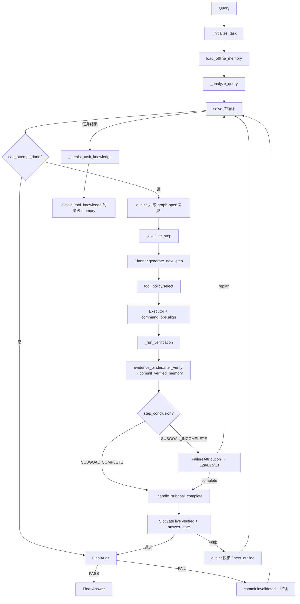
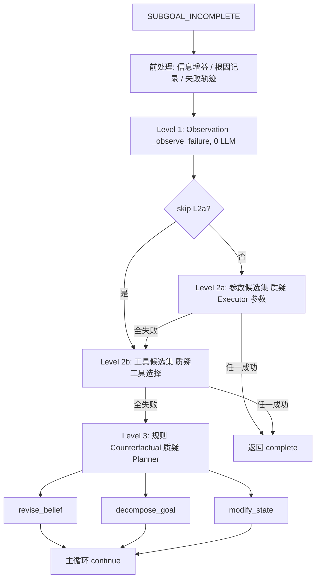
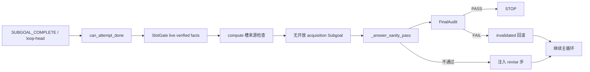
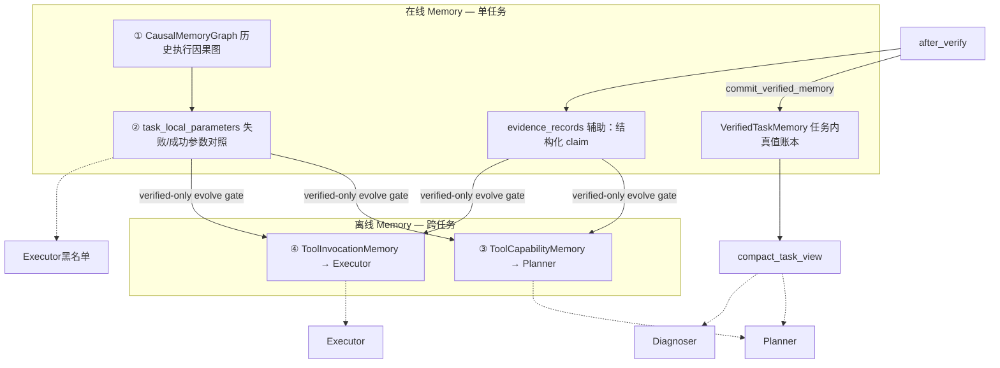

# EPC_AW Workflow 与 Memory 设计说明

> **依据**：`MAS/epc_aw/solver.py`（薄编排器，约 **1311** 行）+ mixin 决策出口  
> **配套模块**：`models/planner.py`、`models/executor.py`、`models/diagnoser.py`、`models/memory.py`、`models/verified_memory.py`、`models/command_ops.py`、`models/tool_policy.py`、`models/plan_controller.py`、`models/evidence_binder.py`、`models/intervention.py`、`models/answer_gate.py`、`models/task_profile.py`、`models/causal_memory_graph.py`、`models/tool_knowledge_memory.py`  
> **版本**：与 mixin 拆分后的控制流 + Memory schema v2 + StructAgent verified ledger 对齐  
> **论文叙事**：[`CoreIdea.md`](CoreIdea.md)（Operational World Model 三问）  
> **说明**：本文以**当前代码行为**为准；与旧版 [`MAS_Workflow.md`](MAS_Workflow.md) 冲突时，**以本文为准**。Solver 只做编排，决策出口见 §1.2。

---

## 0. 设计哲学（与早期工程笔记的对应）

你最初的设计强调三点，当前实现基本遵循，但在表述和存储形态上做了工程化收敛：

| 你的原始意图 | 当前实现中的对应 |
|---|---|
| 用**形式与名词**表述因果与记忆，不用概率/score | 离线 memory 禁止 scores/counts/confidence；诊断用 `failure_type`、`target_variable`、`recommendation` 等枚举/文本字段 |
| 失败时先质疑 **Executor 参数**，再质疑 **工具**，最后才质疑 **Planner subgoal** | L2a（参数候选）→ L2b（工具切换）→ L3（revise_belief / decompose_goal / modify_state） |
| 参数扰动支持**多候选并行** | L2a：1 次 Executor LLM 返回 N=3 候选 + ≤2 程序化扰动；**工具执行当前为串行**（SIGALRM 约束，见 §3.4 / §7） |
| 离线 memory 只要**两个**：Planner 看能力边界，Executor 看参数设计 | `ToolCapabilityMemory` + `ToolInvocationMemory` |
| 在线 memory 要**两个**：历史因果图 + 任务内失败/成功参数对照 | `CausalMemoryGraph` + `task_local_parameters`（图导出视图） |

核心语义不变：

```
State  = 当前已有什么信息
Subgoal = 还需补充什么信息
Tool   = 选哪个工具去补
Parameter = Executor 如何构造调用参数
Outcome  = 工具返回结果
```

执行因果序：

```
State → Subgoal → Tool → Parameter → Outcome → NextState
         ↑___________________________________|
              失败时在同一 Subgoal 下换 Parameter / Tool
```

### 0.1 与 CoreIdea 三问的对照（实现强度）

统一命题见 [`CoreIdea.md`](CoreIdea.md)：*Learning the Operational World Model for LLM-based Multi-Agent Systems*。本文是工程契约文档，不替代论文叙事；下表标明**当前代码**对三问的支撑强度：

| CoreIdea 问题 | 实现强度 | 当前主要载体 |
|---|---|---|
| 1. Planner 如何知道自己可能错？（Epistemic Calibration） | **弱** | Diagnoser 判定 + 多层纠错门控；**无一等 epistemic uncertainty 信号** |
| 2. 为何成功/失败？MAS 能力边界？（Causal Mechanism） | **强** | L1→L2a→L2b→L3、`do(target_variable)`、在线因果图、双离线 Capability/Invocation |
| 3. 执行前如何预测 MAS 动态？（Operational World Model） | **未落地** | 仅有轨迹记录 + 任务结束 evolve 压缩；**无 forward model / rollout** |

详细映射与诚实边界见 **§0.5**。

---

## 0.5 论文创新点 ↔ 机制映射

> 本节把 [`CoreIdea.md`](CoreIdea.md) 的主张落到可检验的 Harness 机制，并划清「已实现 / 术语过强 / 仍是目标」。

### 0.5.1 当前系统一句话定位

**已实现的系统** = Harness 构造的 **Observation → Intervention →（规则驱动）Counterfactual** 失败阶梯  
+ **角色分离的双离线 Memory**（Capability ↔ Planner，Invocation ↔ Executor）  
+ **多门控验证 / STOP 治理**。

**尚未作为一等模块存在**：显式 Epistemic Calibration；预测式 Operational World Model（`P(Result | Plan, MAS)`）。

### 0.5.2 三创新对照表

| 创新 | 论文主张 | 对应机制与文件 | 诚实边界 |
|---|---|---|---|
| **A. Epistemic Calibration** | Planner 知道「自己可能错」，建立 epistemic awareness | Diagnoser `verificate_context`；SlotGate / answer_sanity 拦截假成功；Hypothesis Drift / Knowledge Gain 等门控 | 多为**事后纠错**，不是 Planner 侧的一等不确定性表示；diagnostic 仍有 `confidence` 枚举，与「形式不用概率」哲学有张力 |
| **B. Causal Mechanism / Capability** | 学机制而非相关；建立 MAS 能力边界 | `intervention.py` 阶梯 + `INTERVENTION_TARGET_VARIABLE`；`CausalMemoryGraph` + `parameter_contrasts`；`ToolCapabilityMemory` / `ToolInvocationMemory` + evolve | **当前最强落地**；L3 名为 Counterfactual，实为规则 replan（非 Pearl 估计器） |
| **C. Operational World Model** | 建模 MAS 内部动态，执行前预测将会发生什么 | 在线因果 DAG 记录轨迹；离线 evolve 压缩为能力/参数知识，供下一步 hint | **记录 + 压缩 ≠ 预测**；无 mental simulation / 执行前 rollout |

### 0.5.3 Harness 构造因果（应写进论文导论的工程观点）

CoreIdea 强调：因果不是 LLM 内部 emergent，而是 Harness 提供 Observation / Intervention / Counterfactual，LLM 只做 reasoning。当前代码的对应：

| Harness 层 | 实现 | LLM 角色 |
|---|---|---|
| Observation | `_observe_failure`（0 LLM）结构化失败现场 | 无 |
| Intervention | L2a 参数候选 / L2b 工具切换 + Diagnoser 验证 | Executor + Diagnoser |
| Counterfactual（规则） | L3 `revise_belief` / `decompose_goal` / `modify_state` | 复用 Planner / Diagnoser，无独立 CF 模块 |

### 0.5.4 已成型、可写进论文的机制贡献

1. **层次化归因 + 形式化 `do(·)`**：默认信任 Planner；先质疑 executor 参数 → tool → planner_belief / task_graph / environment。相对 ReAct「再 Think」的核心差异。  
2. **双离线 Memory 职责隔离**：Planner 永不读 Invocation；Executor 不靠 Capability 选工具。  
3. **在线因果 DAG + 失败/成功对照边**：`parameter_contrasts` + 任务内黑名单。  
4. **多门控治理**：防循环（Hypothesis Drift / Knowledge Gain / Cause-Changed / Action Variable）+ 防假成功（SlotGate / `compute_real` / answer_sanity / 工具类硬隔离）。  
5. **Memory 写策略**：在线 canonical 经 `append_causal_effect`；离线 evolve = Generalize + Differentiate，无 scores、去实体泄漏、规模硬上限。

---

## 1. 整体架构



### 1.1 三角色 + 薄编排器

| 角色 | 职责 | 主要 LLM 调用点 | Memory 消费 |
|---|---|---|---|
| **Planner** | Step 0 全局分析；每步选 subgoal/tool；L3 时 replan outline | `analyze_query`、`generate_next_step` | **Tool Capability Memory**（每步 hint） |
| **Executor** | 生成结构化工具命令并执行；L2a/L2b 生成候选命令 | `generate_tool_command` | **Tool Invocation Memory** + 本任务失败参数黑名单 |
| **Diagnoser** | L1 子目标验证 + 任务完成判断；失败时产出诊断信号 | `verificate_context` | `evidence_records`、冲突检测、SlotGate |

**Solver** 不是第四个 LLM 角色，而是 mixin 组合的状态机：

```python
# solver.py:39
class Solver(
    CommandOpsMixin,      # models/command_ops.py
    AnswerGateMixin,      # models/answer_gate.py
    InterventionMixin,    # models/intervention.py  — L1→L2a→L2b→L3
    ToolPolicyMixin,      # models/tool_policy.py
    PlanControllerMixin,  # models/plan_controller.py
    EvidenceBinderMixin,  # models/evidence_binder.py
):
    ...
```

### 1.2 单一决策出口

| 出口 | 模块 | 职责 |
|---|---|---|
| `tool_policy.select` / `_select_tool_for_step` | `models/tool_policy.py` | 唯一工具裁决（kind → forbidden → failed → diagnostic → outline） |
| `plan_controller.can_attempt_done` / `can_stop` / `next_outline` | `models/plan_controller.py` | DONE = live verified SlotGate ∧ 无开放 acquisition ∧（可选 FinalAudit）；outline 仅为投影 |
| `evidence_binder.after_verify` | `models/evidence_binder.py` | 验证后唯一写 evidence/slot → `commit_verified_memory` |
| `intervention` FailureAttribution→L2a/L2b/L3 | `models/intervention.py` | 归因路由阶梯；Knowledge Gain 读因果图 ΔEvidence/ΔState |
| `command_ops` | `models/command_ops.py` | query/url inject、perturb、align、domain grounding hooks |
| `answer_gate` | `models/answer_gate.py` | 最终答案格式 / sanity |

任务特化规则（检索 grounding、slot 闸门）落在 `command_ops` / `SlotGate` / `evidence_binder`，**不进** `solver.py` 主循环逻辑。

---

## 2. 主 Workflow（`Solver.solve`）

### 2.1 阶段概览

```
Algorithm: SOLVE(question, image)
────────────────────────────────────────────────────────
1:  task_id ← _initialize_task(q)
2:  load_offline_memory()                    ▷ 跨任务 Tool Knowledge
3:  (analysis, outline) ← _analyze_query(q)  ▷ Step 0 + TaskProfile
4:  diagnostic_prev ← ∅; trackers ← {}; exec_step ← 0

5:  while exec_step < max_steps and elapsed < max_time do
6:      (step_key, target) ← GET_FIRST_OUTLINE_STEP()
7:      if outline empty then
8:          if CAN_STOP and ANSWER_SANITY_PASS then break
9:          else INJECT_RECOVERY_OUTLINE(); continue
10:     exec_step++; tracker ← trackers[step_id]

11:     step_ctx ← _execute_step(...)           ▷ Planner + tool_policy + Executor
12:     ver ← _run_verification(step_ctx)       ▷ Diagnoser + evidence_binder

13:     if ver.step_conclusion = SUBGOAL_INCOMPLETE then
14:         (action, ...) ← _handle_subgoal_incomplete(...)
15:         if action = complete then _handle_subgoal_complete(...); continue
16:         if action = terminate then break
17:         continue                            ▷ replan 后回到主循环

18:     if _handle_subgoal_complete(...) = stop then break

19: direct_output ← NORMALIZE / generate_direct_output
20: evolve_tool_knowledge(); persist offline + online
21: return json_data
```

**关键代码锚点**：

| 阶段 | 位置 |
|---|---|
| `solve` 主循环 | `solver.py:772` |
| `_initialize_task` / `_analyze_query` / `_persist_task_knowledge` | `solver.py:207` / `236` / `255` |
| `_execute_step` / `_run_verification` | `solver.py:384` / `481` |
| `_handle_subgoal_complete` | `solver.py:668` |
| `_handle_subgoal_incomplete` 及 L1/L2/L3 | `intervention.py:1324` 等（见 §3 / §8） |

### 2.2 一步（Step）的定义

在概念上，**一步 = 一次 Planner–Executor 配对 + 一次 Diagnoser 验证**。

代码中进一步区分两个计数器：

| 计数器 | 含义 | 何时 +1 |
|---|---|---|
| `outline_attempt` | 从 outline 取出一个 step 并启动新 exec | 主循环每次取到非空 step |
| `exec_step` | 主循环层面的工具执行序号 | 同上，与 `outline_attempt` 同步 +1 |

**注意**：L2a/L2b 内的候选工具执行**不计入** `exec_step`，因此 `max_steps` 限制的是主循环步数，而非全部真实工具调用次数。

### 2.3 Step 0：全局分析

```python
# solver.py:_analyze_query (236+)
analysis, execution_outline = planner.analyze_query(question, image_path)
profile = SlotGate.infer_profile(question)
system_memory.set_task_profile(profile)
system_memory.set_outline(execution_outline)
```

产出：

- `analysis`：题意理解
- `execution_outline`：有序子目标计划（dict，`"1"`, `"2"`, ... → target_information 文本）
- `TaskProfile`：required slots、phase（RETRIEVE→TRANSFORM→SYNTHESIZE→VERIFY）、exhaustive 等

Planner 内部的 how-many 自检（`_self_criticize_analysis`）在 `planner.py` 中实现，Solver 不直接调用。

### 2.4 正常执行路径：`_execute_step`

每一步的执行链（`solver.py:384+`）：

1. **读取诊断信号**：上一轮 `diagnostic_signal_prev` 中的 `forbidden_tools` 记入 tracker  
2. **Planner LLM**：`_run_planner` → `generate_next_step` → `(context, sub_goal, tool_name)`（`solver.py:289+`）  
3. **工具裁决**（`tool_policy._select_tool_for_step`，`tool_policy.py:197+`）：  
   - `ToolRouter.validate`（subgoal kind 硬隔离：compute/acquisition/visual）  
   - acquisition 子目标禁止强制 Python（防幻觉编造事实）  
   - `_enforce_tool_policy`（failed_tools、capability 边界、switch_tool 建议）  
4. **Executor LLM**：`_run_executor` → `generate_tool_command` → `_align_command_with_subgoal` → validate → execute（`solver.py:315+`）  
5. 返回 `StepContext`（step_key, sub_goal, tool, command, result）

Executor 读取 **Tool Invocation Memory** hint 和本任务**失败参数黑名单**（`executor.py:_build_parameter_memory_hint`）。

Planner 读取 **Tool Capability Memory** hint（`planner.py:_build_memory_query_hint`）。

### 2.5 验证路径：`_run_verification`

Diagnoser 是**因果介入的唯一触发判定点**（`solver.py:481+`）：

- 输入：outline、executor 结果、obtained_info、intervention_context
- 输出：
  - `step_conclusion` ∈ {`SUBGOAL_COMPLETE`, `SUBGOAL_INCOMPLETE`}
  - `diagnostic_signal`（failure_patterns、recommendation、suggested_tool、causal_hypothesis 等）
  - `slot_updates`、`evidence_type`、`tool_appropriate`

随后调用 **`after_verify`**（`evidence_binder.py:20+`）作为验证后唯一 slot/evidence 写出口；候选验证路径使用 `record_obtained=False`，避免污染 evidence。

Diagnoser 还会做 **reconciliation 规则链**（在 `diagnoser.py` 内），硬修正 LLM 误判：

- Base_Generator 不能做 acquisition
- ABSENCE 无 slot fill → 降级
- claim 冲突 → 降级
- exhaustive 任务 snippet-only → 降级

### 2.6 成功路径：`_handle_subgoal_complete`

子目标达成后的处理：

1. `_record_success_trace` → 在线因果图（含 failed→success parameter contrast）
2. `_record_obtained_information` → 经 `commit_verified_memory` 写 live evidence / valid_facts
3. 弹出 outline 头步；`can_attempt_done`（live verified SlotGate + 无开放 contracted acquisition）
4. `_answer_sanity_pass` + `FinalAudit`（FAIL → `invalidated` 回滚责任 evidence）
5. 若未 DONE：`_sync_outline_projection_from_graph` + `diagnoser.update_outline`
6. 返回 `"stop"` 或 `"continue"`

**关键设计**：即使 Diagnoser 判 COMPLETE，也必须经过 `can_attempt_done` + sanity + FinalAudit 才允许 STOP；主循环不在验证后直接 break。

---

## 3. 因果介入 Workflow（核心）

> 实现入口：`InterventionMixin`（`models/intervention.py`）。Solver 注释中仍写「候选 parallel」，**以本模块实现为准：串行**。

### 3.1 触发条件

**唯一入口**：`verification.step_conclusion == "SUBGOAL_INCOMPLETE"`

即：Executor 的执行结果**不满足** Planner 为当前 outline step 制定的 subgoal。

### 3.2 三层范式：Observation → Intervention → Counterfactual（规则）



**FailureAttribution 路由**（`enable_struct_intervention_routing`，默认开）：

| attributed_to | 首跳 recommendation | 行为 |
|---|---|---|
| `actor` | `retry_with_different_parameters` | L2a actor_burst（默认 3）后升 L2b |
| `tool_environment` | `switch_tool` | 跳过 L2a → L2b |
| `planner` | `decompose_goal` | 跳过 L2a/L2b → L3 |
| `verifier` | `revise_belief` | 复验/收紧合约，不硬升 L3 modify_state |

Knowledge Gain / Cause-Changed 优先读因果图：Δ live Evidence 节点、Δ `valid_facts` 键、Δ diagnosis 边；连续两次 KG=0 仍强制升级。

术语说明：L3 在代码与历史文档中称 *Counterfactual*，**实现上是规则驱动的 replanning 控制器**，不是独立 Pearl 反事实推理模块；论文表述宜称「层次化失败控制器」或「规则 Counterfactual」。

### 3.3 Level 1：Observation（观察）

**函数**：`_observe_failure`（`intervention.py:519+`）

**成本**：0 LLM

**产出**：`FailureContext` 结构体，汇总 subgoal / tool / parameters / tool_output / failure_patterns / exhausted / failed_tools 等。

Observation **不做决策**，只把失败现场结构化，供 L2/L3 复用。

### 3.4 Level 2a：参数候选集（Executor 侧 — 质疑参数）

**函数**：`_run_intervention_level2a`（`intervention.py:1110+`）

**意图**：扰动参数，用多候选尝试同一 tool。

**当前算法**：

```
1. tried ← 已尝试参数指纹集合
2. candidates ← _generate_parameter_candidate_set(N=3)
   ▷ 1 次 Executor LLM（n_candidates=3）+ ≤2 程序化 perturb
3. results ← _execute_candidate_set(candidates)    ▷ 主线程串行（SIGALRM）
4. winner ← _verify_candidate_set(results, cap=3)  ▷ 规则预筛排序 + Diagnoser 验证
5. tracker.record("retry_with_different_parameters")
6. if winner: return "complete"
7. else: escalate → L2b
```

**串行原因**（`intervention.py:999-1037`）：Executor 用 `SIGALRM` 做超时，Python signal 只能在主线程注册，故不能用 `ThreadPoolExecutor` 扇出。常量 `CANDIDATE_PARALLEL_WORKERS`（solver / intervention 中仍保留）**名实不符**——仅历史命名，执行路径为串行。

**跳过 L2a 的条件**（硬错误，参数扰动无法修复）：

- `tool_appropriate = False` / `wrong_tool_class`
- 网络/基础设施错误（urlopen error、timeout、SSL 等）
- command schema 错误（缺参、unexpected keyword）
- PDF 访问错误
- 特定 retrieval coverage 问题且已建议 switch_tool

**预算**：`MAX_PARAMETER_RETRIES = 3`（候选集**轮数**，非单候选次数；默认一次 L2a 消费 1 轮）。

### 3.5 Level 2b：工具切换候选集（Executor 侧 — 质疑工具）

**函数**：`_run_intervention_level2b`（`intervention.py:1186+`）

**当前算法**：

```
1. candidates_tools ← suggested_tool + _suggest_alternative_tool，封顶 2 个
2. for each new_tool:
     a. Executor LLM 生成 1 条命令
     b. 执行 + 预筛
     c. Diagnoser 验证
     d. 首个 COMPLETE 即成功
3. tracker.record("switch_tool")
4. 全失败 → escalate L3
```

**预算**：`MAX_SWITCH_TOOL_ATTEMPTS = 2`

### 3.6 Level 3：规则 Counterfactual（Planner 侧）

**函数**：`_run_counterfactual`（`intervention.py:1643+`）

| recommendation | 行为 | 是否新 LLM 阶段 |
|---|---|---|
| `revise_belief` | 撤回冲突 claim + 可选重新 `analyze_query` | 复用 planner LLM |
| `decompose_goal` | `diagnoser.update_outline` 分解子目标；设 `_decompose_bonus = 1`（**主循环未消费**，见 §7） | 复用 diagnoser LLM |
| `modify_state` | 注入 state_mutations（如 PDF→abs URL） | 无独立 LLM |

**防循环 Gate**：

1. **Hypothesis Drift Gate**：evidence/slot/reason 变化 → 作废旧 hypothesis  
2. **Knowledge Gain Gate**：连续 2 次零知识增益 → 强制升级介入层级  
3. **Cause-Changed Gate**：同一 `(root_cause, target_variable)` 重复 → terminate  
4. **Action Variable Gate**：Planner 侧干预未改变 tool/query/url → 强制 decompose 或 terminate  

### 3.7 介入预算与升级阶梯

```python
# intervention.py:22-42
INTERVENTION_LADDER = [
    "retry_with_different_parameters",  # L2a → target: executor
    "switch_tool",                       # L2b → target: tool
    "revise_belief",                     # L3  → target: planner_belief
    "decompose_goal",                    # L3  → target: task_graph
    "modify_state",                      # L3  → target: environment
]

INTERVENTION_TARGET_VARIABLE = {
    "retry_with_different_parameters": "executor",
    "switch_tool": "tool",
    "revise_belief": "planner_belief",
    "decompose_goal": "task_graph",
    "modify_state": "environment",
}
```

每个 outline step 有独立的 `StepInterventionState` tracker（`intervention.py:57+`），按 `step_key + target hash` 索引。

Diagnoser 产出的 `causal_hypothesis` 包含 `target_variable`、`reason`、`confidence`（HIGH/MEDIUM/LOW，仅影响 L3 是否立即行动，LOW 强制重新诊断）。

### 3.8 介入成功后的路径建立

当 L2a/L2b 任一候选验证为 `SUBGOAL_COMPLETE`：

1. 返回 `action="complete"` 到主循环  
2. 主循环调用 `_handle_subgoal_complete`  
3. `_record_success_trace` 写入 **parameter_contrast** 边（failed param → success param）  
4. 成功参数记入 `task_local_parameters` 和离线演化输入  

---

## 4. STOP 门控 Workflow

除失败介入外，系统还有一套**成功路径守门**，防止「错误成功」。权威谓词为 `can_attempt_done`：

```text
DONE = SlotGate.can_stop(live verified) ∧ compute来源OK
     ∧ ¬open_contracted_acquisition_subgoals
     ∧ answer_sanity ∧ FinalAudit.PASS
```



| 闸门 | 作用 | 实现 |
|---|---|---|
| SlotGate（verified） | 仅 `live` + `verification_status∈{satisfied,value_committed}` 可填槽；`valid_facts` 同名键补强 | `task_profile.py` + `slot_evidence_records` |
| compute 来源 | computed 槽必须来自真实计算 | `compute_real` + `compute_slot_filled_by_computed` |
| 因果图开放子目标 | 带 `required_fact_names` 的 acquisition 未满足则拒 STOP | `open_acquisition_subgoals` |
| FinalAudit | 答案须 grounded 于 compact/valid_facts；FAIL 回滚 | `diagnoser.audit_final_answer` |
| 工具类硬隔离 | acquisition 禁 Python 等 | `tool_router.py` + `tool_policy.py` |
| 统一 sanity gate | 答案格式/一致性 | `_answer_sanity_pass`（`answer_gate.py`） |
| 早停旁路关闭 | 防止绕过 sanity | `_is_answer_ready` 恒返回 `False` |

Ablation：`enable_struct_stop_gate` / `enable_final_audit`；preset `no_struct_control` 关闭二者并恢复 outline 硬否决。

---

## 5. Memory 设计

### 5.1 总体：在线两个核心 + 离线两个 + 验证账本



> **说明**：`evidence_records` 和导出的 `causal_execution_traces` 是在线层的辅助/canonical 存储，不影响「两个核心」的分工逻辑。`causal_execution_traces` 是从因果图导出的线性视图，不是独立 canonical。
>
> **StructAgent 强化不变量**（`models/verified_memory.py` + `SystemMemory.commit_verified_memory`）：
> 1. 任务内事实只能经 `commit_verified_memory(MemoryCommitEvent)` 提交；`kind ∈ {satisfied, rejected, invalidated, value_committed}`。
> 2. `status=active` 且 `verification_status ∈ {satisfied, value_committed}` 的 evidence 才算 live fact；absence/hypothesis 不进 compact facts。
> 3. `invalidated/disputed` 使关联 facts 的 `valid=False`，并从 `compact_task_view` 消失。
> 4. 离线 evolve 在 `enable_verified_only_evolve` 开启时，只消费 live verified evidence 或带 `parameter_contrasts` 的成功对照。
> 5. Capability / Invocation 职责分离与「无 scores / 去实体泄漏」约束不变。
>
> Ablation（产品轨）：
> - `no_verified_memory` 关闭 `enable_verified_memory_commit` / `enable_verified_only_evolve` / `enable_compact_task_view`
> - `no_struct_control` 关闭 `enable_struct_stop_gate` / `enable_struct_intervention_routing` / `enable_final_audit`（旧 SlotGate/阶梯）

### 5.2 在线 Memory ①：CausalMemoryGraph

**Canonical 存储**：`memory/online/{task_id}/causal_graph.json`

**节点类型**：

| 节点 | ID 格式 | 含义 |
|---|---|---|
| State | `st:{task_id}:{t}` | 某时刻信息态 |
| Subgoal | `sg:{hash(text)}` | 需补充的信息目标；含 `required_fact_names` / `preferred_tools` / `acquisition` |
| Tool | `tool:{tool_name}` | 选定工具 |
| Parameter | `pm:{hash(fingerprint)}` | Executor 生成的命令/参数 |
| Outcome | `oc:{exec_step}` | 单次执行结果 |
| Evidence | `ev:{ev_id}` | 结构化 claim |
| Intervention | `iv:{outline}:{exec}` | 介入记录 |

**关键边**：

| 边 | 语义 |
|---|---|
| `state_requires_subgoal` | State → Subgoal |
| `subgoal_selects_tool` | Subgoal → Tool |
| `tool_invokes_parameter` | Tool → Parameter |
| `parameter_yields_outcome` | Parameter → Outcome |
| `parameter_contrasts` | **failed Parameter → success Parameter** |
| `outcome_diagnoses` | Outcome → Intervention（失败诊断） |
| `outcome_transitions_state` | 成功 → 下一 State |

**写入入口**（均在 `InterventionMixin`，经 `SystemMemory.append_causal_effect`）：

| 事件 | 函数 | 位置 |
|---|---|---|
| 每次 exec 结束 | `_record_causal_effect` | `intervention.py:577+` |
| 失败 | `_record_failure_trace` | `intervention.py:703+` |
| 成功 | `_record_success_trace` | `intervention.py:722+` |
| 证据 | `add_evidence_record` | 经 `_record_obtained_information` / `after_verify` |

统一写入 `SystemMemory.append_causal_effect`（`memory.py:546+`）→ `causal_graph.record_execution`。

**查询 API（Struct 控制面）**：`open_acquisition_subgoals(valid_facts)`、`subgoal_requirements_met(sg_id)`、`project_outline_from_open_subgoals`；State 节点维护 `valid_facts`（commit 后同步）。

### 5.3 在线 Memory ②：task_local_parameters

**存储形态**：从因果图导出的视图 `task_local_parameters.json`

**Key 结构**：

```
(state_keyword, subgoal_text) → {
    tool_name: {
        "failed_parameters": [...],
        "successful_parameters": [...],
        "pairs": [(failed, successful), ...]
    }
}
```

**消费方式**：

- **Executor 本任务内**：`get_failed_parameter_blacklist(state, subgoal, tool)` → 注入 prompt，避免重复无效参数  
- **任务结束演化**：`evolve_tool_knowledge` 读取 successful pairs → 抽象进离线 Invocation Memory  

**与因果图的关系**：不是独立双写；每次 `append_causal_effect` 后 `_sync_denormalized_from_graph` 刷新导出视图。

### 5.4 离线 Memory ③：ToolCapabilityMemory（→ Planner）

**Schema**（纯文本，无数值指标）：

```json
{
  "Google_Search_Tool": {
    "capability_summary": "Retrieve open-domain factual information via web search.",
    "subgoals": [
      {
        "subgoal": "Retrieve external factual knowledge",
        "context_summary": [
          "External knowledge is unavailable.",
          "Open-domain question"
        ]
      }
    ]
  }
}
```

| 字段 | 语义 |
|---|---|
| `capability_summary` | 该工具整体能力描述 |
| `subgoal` | 冻结的规范词表条目（evolve 不新增/不改写） |
| `context_summary` | **Applicability Conditions**：在什么状态下应选此工具 |

**Planner 消费**：`retrieve_tool_capability(tool, current_subgoal)` → 注入 prompt（≤8 行）

**Policy 消费**：`_enforce_tool_policy` 中，若当前工具无匹配 subgoal 而另一工具有，则建议切换。

### 5.5 离线 Memory ④：ToolInvocationMemory（→ Executor）

**Schema**：

```json
{
  "Google_Search_Tool": {
    "subgoals": [
      {
        "subgoal": "Retrieve external factual knowledge",
        "factors": {
          "Entity": {"instruction": "Include sufficient identifiers to uniquely specify the target."},
          "Freshness": {"instruction": "Prefer recent sources when temporal relevance affects the answer."},
          "Scope": {"instruction": "Restrict the search to the requested domain or topic."},
          "Source": {"instruction": "Prefer authoritative sources when reliability is critical."}
        }
      }
    ]
  }
}
```

| 字段 | 语义 |
|---|---|
| `subgoal` | 与 Capability Memory 共享的冻结词表 |
| `factors` | **Decision Dimensions**（正交参数设计维度） |
| `instruction` | 该维度下如何构造参数（每维恰好 1 条） |

**Executor 消费**：`retrieve_tool_invocation(tool, subgoal)` → 注入 prompt

**Planner 永不访问** Invocation Memory——职责严格分离。

### 5.6 离线演化：Generalize + Differentiate

任务结束时（`_persist_task_knowledge` → `evolve_tool_knowledge`，`memory.py:882+`）：

```
1. 从在线图导出 task_local_parameters
2. 按 tool 聚合所有成功 (subgoal, params)
3. 并行各 tool pipeline（此处可用 ThreadPool；与 L2a 在线串行无关）:
   a. abstract_experiences_batch  → 1 次 LLM 批量抽象
   b. cap.evolve  → 合并 Applicability Conditions
   c. inv.evolve  → merge_factors_batch 合并 Decision Dimensions
4. boundary_refinement → 跨 tool 差异化 capability_summary
5. persist → tool_capability_memory.json + tool_invocation_memory.json
```

**设计约束**：

- 不存具体任务实体/URL/编号（`_strip_task_leakage` guard）
- 不存 scores/counts/confidence
- subgoal 词表冻结，规模有硬上限（≤5 subgoals/tool，≤4 factors/subgoal）
- 演化是**压缩合并**，不是 append

### 5.7 概念映射

| 概念 | 当前实现 | 在线/离线 |
|---|---|---|
| 具体历史执行步骤的状态转移图 | `CausalMemoryGraph` | 在线 |
| 抽象的可行/不可行 executor-tool 能力边界 | `ToolCapabilityMemory` + `ToolInvocationMemory` | 离线 |
| 任务内失败/成功参数对照 | `task_local_parameters` + `parameter_contrasts` 边 | 在线 |

早期「三个离线 memory」已收敛为**两个**（Capability + Invocation）。

---

## 6. Memory 读写时序（与 Workflow 的衔接）

### 6.1 单步读写时序

```
1. Planner generate_next_step
   READ: ToolCapabilityMemory hint + diagnostic_signal + SlotGate forbidden tools
        + compact_task_view（valid facts / live evidence / recent_failures）

2. tool_policy._select_tool_for_step
   READ: failed_tools / capability / diagnostic suggestions

3. Executor generate_tool_command
   READ: ToolInvocationMemory hint + failed_parameter_blacklist + parameter_guidance

4. 工具执行
   WRITE: append_causal_effect → CausalMemoryGraph（轨迹写口；非事实真值写口）

5. Diagnoser verificate_context
   READ: evidence_records + detect_conflicts + task_profile + compact_task_view
   WRITE: after_verify → commit_verified_memory（事实唯一写出口）
         → evidence_records / VerifiedTaskMemory / graph Evidence 元数据

6. 成功 → _record_success_trace（含 parameter_contrast）
   失败 → set_diagnostic_signal + _record_failure_trace → intervention ladder
         （rejected 事件进入 verified.recent_failures，不提交 fact）

7. 任务结束 → evolve_tool_knowledge（verified-only gate）→ 离线 memory 更新
```

### 6.2 持久化目录

```
memory/
├── offline/
│   ├── tool_capability_memory.json      # ③ Planner
│   ├── tool_invocation_memory.json      # ④ Executor
│   └── offline_manifest.json            # schema: tool_knowledge_memory_v2
├── online/{task_id}/
│   ├── causal_graph.json                # ① canonical（Evidence 含 verification_status/live/fact_names）
│   ├── causal_execution_traces.json     # ① 导出视图
│   ├── task_local_parameters.json       # ② 导出视图
│   ├── evidence_records.json
│   ├── verified_memory.json             # StructAgent 验证账本
│   ├── evolve_telemetry.json            # evolve_candidates/accepted/rejected_reason
│   └── metadata.json
└── screenshots/...
```

---

## 7. 与早期设计笔记的差异说明（已知偏差）

以下列出当前实现与原始设想之间的**已知偏差**，便于论文表述与后续对齐。与旧版 `MAS_Workflow.md`（曾写 L2a ThreadPool 并行、`max_steps + decompose_bonus`）冲突时，**以本节为准**。

| 设想 | 当前实现 | 影响 |
|---|---|---|
| 参数/工具调用**并行执行** | L2a 候选在主线程**串行**（`SIGALRM`）；`CANDIDATE_PARALLEL_WORKERS` 名存实亡 | 墙钟时间随候选数线性增长 |
| 预筛失败候选不进 LLM 验证 | 预筛只做**排序**（passing 优先），仍可能验证 failing 候选 | 可能浪费 Diagnoser 调用 |
| decompose 后 +1 步预算 | `_decompose_bonus = 1` 已赋值（`intervention.py:436`），主循环只用 `self.max_steps`，**从未加 bonus** | 修正 outline 可能在 max_steps 前未执行 |
| L2a/L2b 重试计入 exec_step | 候选执行不计入 `exec_step` | max_steps 不能限制真实工具调用总数 |
| 严格 Pearl 反事实推理 | L3 为**规则 replanning 控制器**；宜称「层次化失败控制器 / 规则 Counterfactual」 | 术语过强则夸大贡献 |
| 离线 memory 三个 | 已收敛为两个（Capability + Invocation） | 与设计意图一致 |
| 用形式不用概率 | 离线 memory 无数值；diagnostic 仍有 confidence 枚举 | confidence 仅影响 L3 是否立即行动 |
| 预测式 Operational WM | 仅有轨迹 + evolve 压缩 hint | CoreIdea 第三问**未落地** |
| 显式 Epistemic Calibration | 纠错门控多，无一等 uncertainty 信号给 Planner | CoreIdea 第一问**叙事弱** |

---

## 8. 关键代码索引

| 流程 | 文件 | 符号 |
|---|---|---|
| 类组合 / 主循环 | `solver.py` | `Solver` (39), `solve` (772) |
| 初始化 / 分析 / 持久化 | `solver.py` | `_initialize_task` (207), `_analyze_query` (236), `_persist_task_knowledge` (255) |
| 单步执行 | `solver.py` | `_execute_step` (384), `_run_planner` (289), `_run_executor` (315) |
| 验证 | `solver.py` | `_run_verification` (481) |
| 成功 / STOP | `solver.py` | `_handle_subgoal_complete` (668) |
| 介入常量 / tracker | `intervention.py` | `INTERVENTION_LADDER` (22), `INTERVENTION_TARGET_VARIABLE` (36), `StepInterventionState` (57) |
| L1 观察 | `intervention.py` | `_observe_failure` (519) |
| L2a 参数候选 | `intervention.py` | `_run_intervention_level2a` (1110), `_execute_candidate_set` (999) |
| L2b 工具切换 | `intervention.py` | `_run_intervention_level2b` (1186) |
| L3 规则 CF / replan | `intervention.py` | `_run_counterfactual` (1643) |
| 失败总控 | `intervention.py` | `_handle_subgoal_incomplete` (1324) |
| 因果写入 | `intervention.py` | `_record_causal_effect` (577), `_record_failure_trace` (703), `_record_success_trace` (722) |
| 工具裁决 | `tool_policy.py` | `_select_tool_for_step` (197), `_enforce_tool_policy` (53) |
| STOP / outline | `plan_controller.py` | `_can_stop_execution` (120), `_is_answer_ready` (268) |
| Evidence 写出口 | `evidence_binder.py` | `after_verify` → `commit_verified_memory` |
| Answer sanity | `answer_gate.py` | `_answer_sanity_pass` (161) |
| 在线因果图 | `causal_memory_graph.py` | `CausalMemoryGraph`；Evidence.`verification_status`/`live`/`fact_names` |
| 验证账本 | `verified_memory.py` | `VerifiedTaskMemory`, `MemoryCommitEvent`, `CommitKind` |
| 离线 memory | `tool_knowledge_memory.py` | `ToolCapabilityMemory`, `ToolInvocationMemory` |
| 统一 memory 入口 | `memory.py` | `SystemMemory`, `commit_verified_memory`, `compact_task_view`, `append_causal_effect`, `evolve_tool_knowledge` |
| 槽门控 | `task_profile.py` | `SlotGate`, `TaskProfile` |
| 工具硬隔离 | `tool_router.py` | `ToolRouter` |
| 消融 / 双轨开关 | `ablation.py` | `AblationConfig`（含 verified-memory 开关）、`no_verified_memory` preset |

---

## 9. 总结

### 9.1 工程闭环

EPC_AW 的 Workflow 是一条 **Plan → Execute → Verify →（失败则）Observe → Intervene → 规则 Counterfactual → Complete → STOP** 的闭环；Memory 是 **在线因果图记录具体执行轨迹与失败/成功对照，离线双 memory 压缩跨任务的 tool 能力边界与参数设计知识**，分别服务 Planner 选工具和 Executor 调参数。Solver 作为 mixin 编排器，把介入预算、多层门控和记忆读写串在同一条状态机里。

### 9.2 论文贡献边界（对照 CoreIdea）

| 强度 | 内容 |
|---|---|
| **强（可写）** | 层次化因果介入阶梯 + 形式化 `do(target_variable)`；Capability / Invocation 职责分离与 evolve 压缩；多门控验证与 STOP 治理；在线 `parameter_contrasts` |
| **弱（需补叙事或模块）** | Epistemic Calibration——现有纠错门控可作素材，但缺少 Planner 侧一等「知道自己可能错」的信号设计 |
| **未落地（勿夸大）** | 预测式 Operational World Model；真 Pearl 反事实估计；L2a 并行执行；`decompose_bonus` 预算扩展 |

读者用本文应能直接回答：系统**实际怎么跑**；哪些机制支撑「因果 / Capability」故事；哪些 CoreIdea 主张仍是目标而非现状。

---

## 10. 双轨验证：论文消融 × 产品分层有效性

> 实现：[`models/ablation.py`](MAS/epc_aw/models/ablation.py)、`construct_solver(..., ablation=...)`、CLI `--ablation` / `--offline_memory_dir`。  
> 脚本：[`scripts/run_ablation.py`](scripts/run_ablation.py)、[`scripts/aggregate_dual_track.py`](scripts/aggregate_dual_track.py)、[`scripts/replay_layer_rescue.py`](scripts/replay_layer_rescue.py)。  
> 单测：[`tests/test_ablation_presets.py`](MAS/epc_aw/tests/test_ablation_presets.py)。

### 10.1 Paper Track（ICLR 主表）

**只消融两类模块**——不把 L1/L2a/L2b/L3 拆开做 leave-one-out（有序归因链会引入 confounding）。

| Preset | 开关 | 含义 |
|---|---|---|
| `full` | 全部默认开 | 完整系统 |
| `no_intervention` | `enable_intervention=False` | Diagnoser 仍验证；INCOMPLETE 后**跳过**阶梯，naive `replan` |
| `no_capability` | `read_capability_memory=False` | Planner/Diagnoser 不读 Capability hint |
| `no_invocation` | `read_invocation_memory=False` | Executor 不读离线 factors；**任务内 blacklist 仍开** |
| `no_memory` | Cap+Inv 都不读，`enable_evolve=False`，blacklist 关 | 双离线下界 |

示例：

```bash
python scripts/run_ablation.py --preset no_capability \
  --questions experiments/ablation/sample_questions.jsonl \
  --out experiments/ablation/runs/no_capability_s0 \
  --offline_memory_dir memory
python scripts/aggregate_dual_track.py \
  --runs_dir experiments/ablation/runs \
  --out experiments/ablation/aggregate
```

### 10.2 Product Track（证明每一层有效）

不靠拆层 EM 消融，而靠 **Full 下的分层挽救率 + kill-switch 灰度**：

| 机制 | 说明 |
|---|---|
| `layer_telemetry` | 每次介入写 `l2a_enter/complete/fail/skip`、`l2b_*`、`l3_enter/skip` 等 |
| `product_no_l2a/l2b/l3` | 内部 kill-switch，供灰度/止血；**不进论文主表** |
| `no_verified_memory` | 关闭 verified commit / compact view / verified-only evolve；对照 StructAgent memory 强化 |
| `no_struct_control` | 关闭 struct STOP / FailureAttribution 路由 / FinalAudit；回到旧 SlotGate+阶梯 |
| `replay_layer_rescue.py` | 从 Full 的 telemetry 聚合 rescue rate（诊断分析，非 leave-one-out） |

有效性门槛（工程示例）：`L2a_rescue_rate`、`cost_per_rescue`、`wrong_tool_class_rate` 等水位线；长期低于阈值可灰度关层。

### 10.3 接线锚点

| Flag | 挂载 |
|---|---|
| `enable_intervention` | `intervention._handle_subgoal_incomplete` 早退 |
| `enable_l2a/l2b/l3` | 同文件阶梯短路 |
| `read_capability_memory` | `planner._build_memory_query_hint`、`diagnoser._build_capability_hint` |
| `read_invocation_memory` / `use_param_blacklist` | `executor._build_parameter_memory_hint` |
| `enable_evolve` / `offline_memory_dir` | `solver._persist_task_knowledge` / `_initialize_task` |
| `enable_struct_stop_gate` | `plan_controller.can_attempt_done` / outline 投影 |
| `enable_struct_intervention_routing` | `intervention._apply_failure_attribution_routing` |
| `enable_final_audit` | `plan_controller._audit_and_maybe_invalidate_final` |
