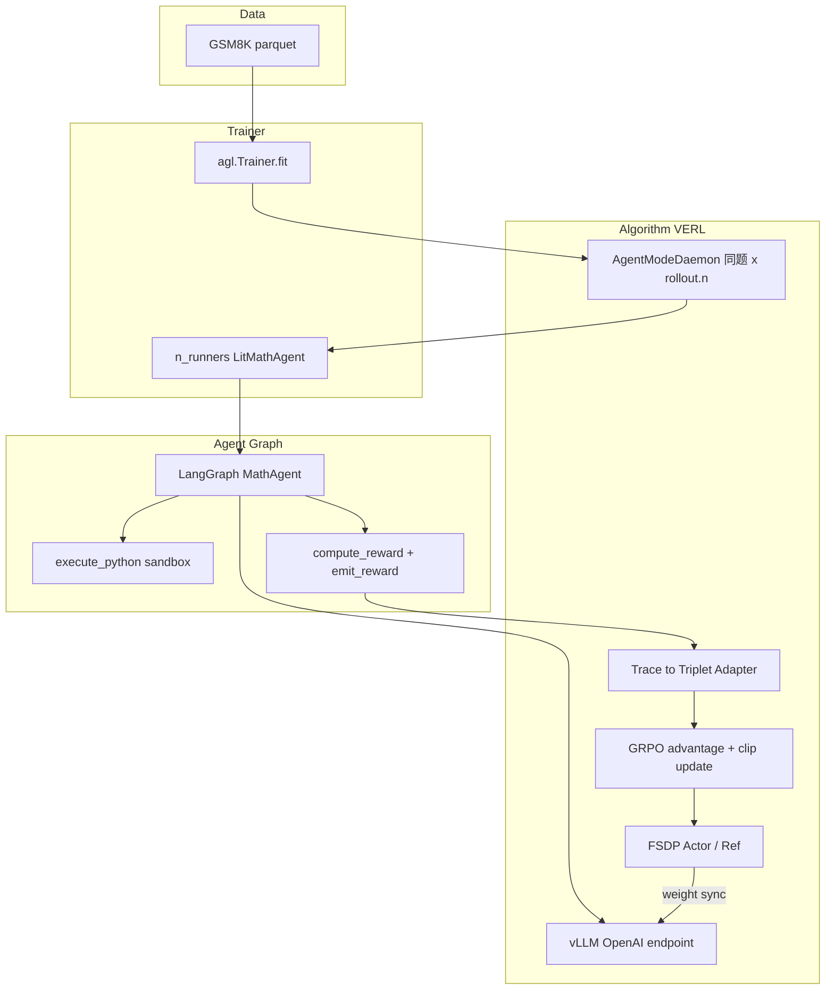
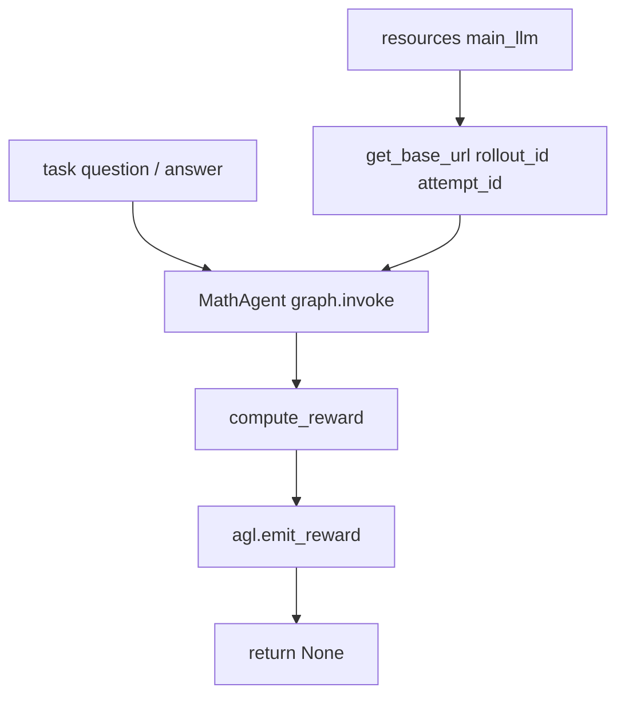
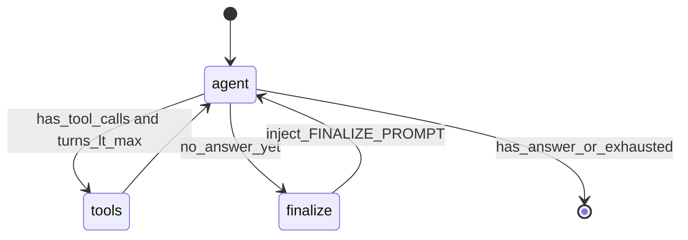
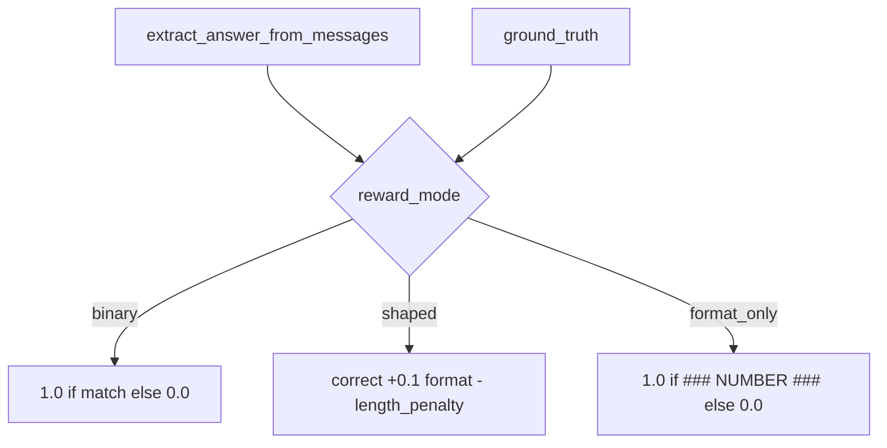
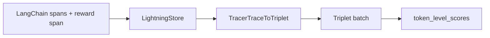
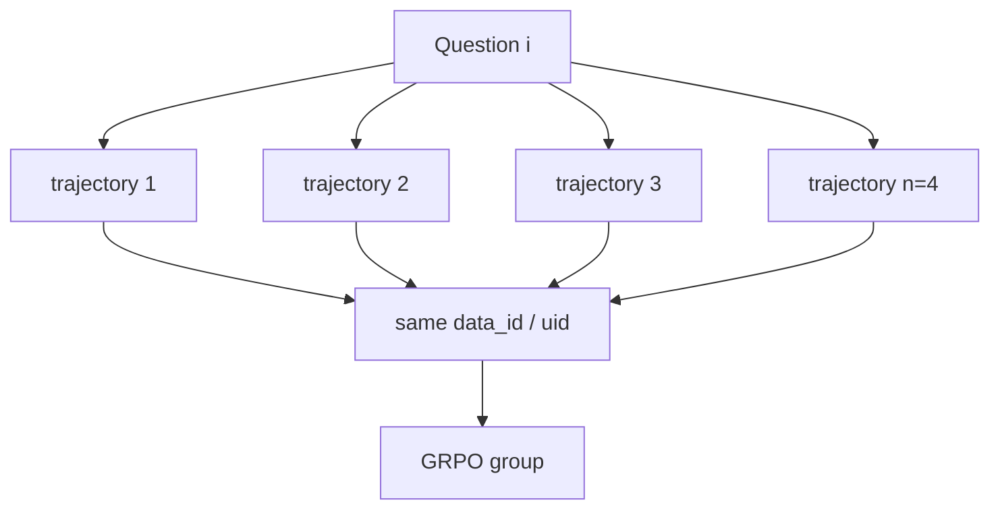
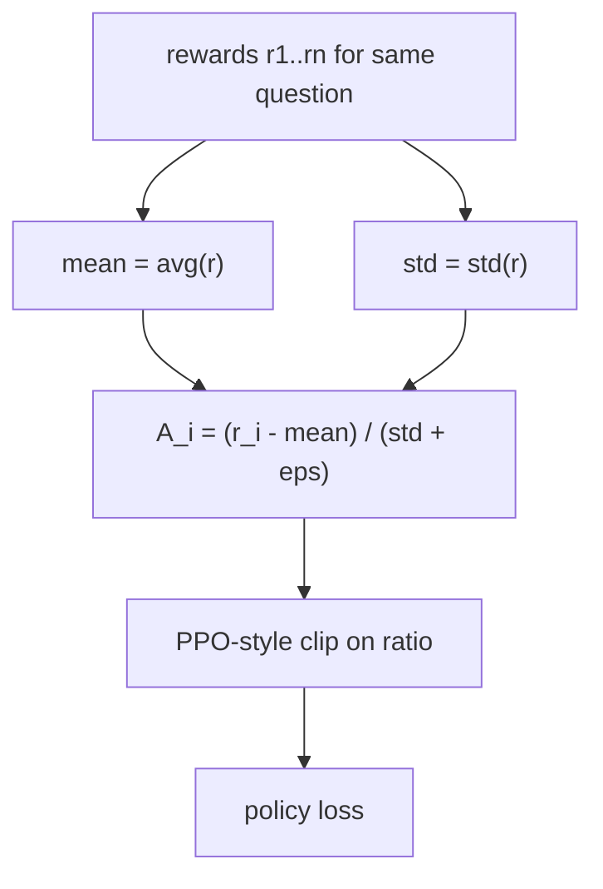
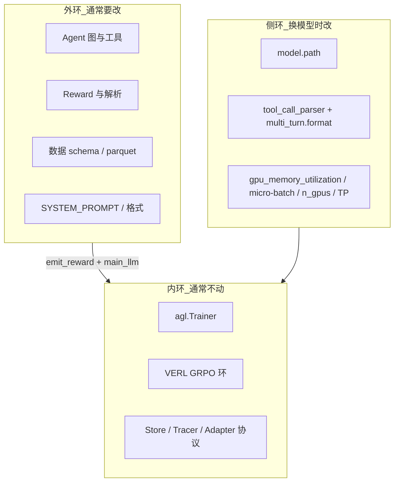

# math_gsm 技术报告

> 基于 Agent-Lightning + VERL 的 GSM8K Tool-Augmented Math Agent（online GRPO）  
> 参数口径以 `[train_math_agent.py](../train_math_agent.py)` 的 `RL_TRAINING_CONFIG` / `a800_2gpu` 为准。  
> 口述 FAQ、公式追问见 [interview/](interview/README.md)；本报告负责「对照代码讲清系统」。

---

## 1. 项目定位与一句话架构

**任务**：在 GSM8K 上训练一个可调用受限 Python 工具的多轮数学 Agent，用可验证规则奖励（RLVR）做 **online GRPO**。

**默认模型**：本地 `Qwen3-4B`（`/root/autodl-tmp/LLM/Qwen3-4B`）。  
**推荐硬件**：2×A800-80GB（完整超参）；单卡仅为冒烟/回退。

**一句话栈**：

```text
LangGraph MathAgent
  → Agent-Lightning（Trainer / Runner / Store / Tracer / Adapter）
  → VERL（GRPO advantage + clip policy loss）
  → vLLM 异步采样（当前策略权重）
```

**训练入口**：

```bash
CUDA_VISIBLE_DEVICES=0,1 bash scripts/train_2gpu.sh
# 等价于
python train_math_agent.py a800_2gpu
```

核心接线：

```python
agent = LitMathAgent()
algorithm = agl.VERL(config)           # adv_estimator=grpo, rollout.n=4, ...
trainer = agl.Trainer(n_runners=..., algorithm=algorithm)
trainer.fit(agent, train_dataset=..., val_dataset=...)
```

---


## 2. 端到端数据流（一次 GRPO step）




### 逐步说明


| 步骤           | 发生什么                                                       | 代码锚点                                         |
| ------------ | ---------------------------------------------------------- | -------------------------------------------- |
| 1. 读题        | `train/val.parquet` → `{id, question, answer}`             | `prepare_data.py`、`train_math_agent.train`   |
| 2. 排队        | Daemon 对每道题复制 `rollout.n` 次（同 `data_id`/`uid`）             | `agentlightning/verl/daemon.py`              |
| 3. Rollout   | Runner 调 `LitMathAgent.rollout`：拿 `main_llm` URL → 跑图 → 打分 | `math_agent.py`                              |
| 4. Trace     | LangChain spans + `emit_reward` 进 Store                    | Tracer / `agl.emit_reward`                   |
| 5. Adapter   | spans → Triplet；outcome reward 落在 response 末 token         | `adapter/triplet.py`                         |
| 6. Advantage | GRPO 组内相对优势（无 Critic）                                      | VERL `compute_advantage(adv_estimator=grpo)` |
| 7. Update    | 非对称 clip 的 policy loss；FSDP 更新 Actor                       | `agentlightning/verl/trainer.py`             |
| 8. Sync      | 新权重同步回 vLLM，进入下一步                                          | VERL actor_rollout 权重同步                      |


**面试一句话**：`train_batch_size` = 每步题数，`rollout.n` = 每题轨迹数，真实采样量 ≈ 二者乘积（如 32×4=128）。

---


## 3. 面试常考模块

每一节按 **职责 → 逻辑图 → 关键函数/参数** 组织。

### 3.1 系统五块积木

```mermaid
flowchart LR
  runner[Runner LitMathAgent.rollout]
  graph[Agent Graph LangGraph]
  engine[Rollout Engine vLLM]
  adapt[Adapter Trace to Triplet]
  learn[Learner GRPO + FSDP]

  runner --> graph
  graph --> engine
  runner --> adapt
  adapt --> learn
  learn -->|"weight sync"| engine
```


| 积木          | 职责                     | 与单轮 LLM RL 的差别       |
| ----------- | ---------------------- | -------------------- |
| Runner      | 拿题、跑图、给分               | 多轮 + tool，失败模式更多     |
| Agent Graph | 任务逻辑与训练框架解耦            | 环境是 Python 解释器       |
| vLLM        | 高速采样当前策略               | 与 FSDP colocated 抢显存 |
| Adapter     | 只把该训的 token 变成 Triplet | tool 输出通常不进策略 loss   |
| Learner     | 组内相对优势 + clip 更新       | 本项目无 Critic（GRPO）    |


对照口述稿：[interview/06_architecture_and_star_story.md](interview/06_architecture_and_star_story.md)

---


### 3.2 LitAgent / Rollout

**职责**：把「一道题」变成「一条带 reward 的轨迹」。训练时 LLM endpoint 由框架注入，不要写死 URL。




| 项         | 说明                                                            |
| --------- | ------------------------------------------------------------- |
| 类         | `LitMathAgent(agl.LitAgent)`                                  |
| 入口        | `rollout(task, resources, rollout)`                           |
| LLM       | `resources["main_llm"]`；`llm.model` + `get_base_url(...)`     |
| 温度        | train：`sampling_parameters` 默认偏 0.7；val：`val_temperature=0.0` |
| Reward 上报 | **必须** `agl.emit_reward(reward)`，**不要**再 `return float`（防双计）  |
| 开关        | `MATH_REWARD_MODE` 或 `LitMathAgent(reward_mode=...)`          |


---


### 3.3 Agent Graph（LangGraph）

**职责**：多轮 tool-calling 状态机；与 VERL 无关，可单独 `debug_math_agent` 调试。

LangChain 消息/工具/ChatModel 与 LangGraph 节点如何拼成 workflow、以及 `LitMathAgent.rollout` 里 `graph().invoke(..., callbacks=...)` 的逐步对照，见 [LANGCHAIN_WORKFLOW.md](LANGCHAIN_WORKFLOW.md)。




| 节点/方法              | 功能                                                |
| ------------------ | ------------------------------------------------- |
| `call_model`       | 调带 tool 的 LLM；若已 finalize 则用低温短输出的 `llm_finalize` |
| `call_tools`       | 执行 `execute_python_tool`，写 `ToolMessage`          |
| `request_finalize` | 注入「只输出 `### NUMBER ###`」用户提示                      |
| `should_continue`  | 路由：`tools` / `finalize` / `end`                   |
| `max_turns`        | 默认 8；`recursion_limit=40`                         |
| Prompt             | `SYSTEM_PROMPT` 要求最终格式 `### NUMBER ###`           |


---


### 3.4 Tool / 环境（Python 沙箱）

**职责**：给 Agent 一个可验证的计算环境，同时限制危险操作。


| 项   | 说明                                                       |
| --- | -------------------------------------------------------- |
| 文件  | `[python_tool.py](../python_tool.py)`                    |
| 入口  | `@tool execute_python_tool` → `execute_python(code)`     |
| 安全  | AST 禁 import / 危险名（`os`/`eval`/`open` 等）；白名单 builtins；超时 |
| 约定  | 优先把终值赋给变量 `result`；stdout/`result` 回传                    |
| 预置  | `math`、`operator` 已注入命名空间                                |


面试常问：**为什么要沙箱？** — Agent RL 的「环境」必须可重复、可计分、不可变成任意代码执行漏洞。

---


### 3.5 Reward（RLVR）

**职责**：从轨迹解析最终数字，与金标比对，发出标量 reward。本项目默认 **binary 0/1**。




| 模式            | 公式直觉                            | 用途                      |
| ------------- | ------------------------------- | ----------------------- |
| `binary`（默认）  | 答对 1，否则 0                       | 正式训练                    |
| `shaped`      | 正确 + 格式 bonus − 超长惩罚（裁到 0, 1.2） | 研究 shaping              |
| `format_only` | 只看是否出现 `### NUMBER ###`         | **故意演示 reward hacking** |


**解析优先级**（`extract_final_answer` / `extract_answer_from_messages`）：

1. `#### ans`（GSM8K）
2. `### ans ###`
3. `<answer>...</answer>`
4. “the answer is / final answer”
5. 文本中最后一个数字
6. 回退 tool 输出里的 `result=...`

**归一化**：去逗号/`$`/`%`；数值用 `np.isclose`，否则字符串忽略大小写比较。

离线消融：`python scripts/reward_ablation_dryrun.py`  
协议见 [interview/05_experiment_reward_ablation.md](interview/05_experiment_reward_ablation.md)

---


### 3.6 Tracer + Adapter

**职责**：把「多轮对话 + reward span」变成 VERL 能吃的 `(state, action, reward)` Triplet。




| 概念             | 说明                                                |
| -------------- | ------------------------------------------------- |
| Outcome reward | 整条轨迹共享终局分；通常落到 response 最后一个 token                |
| Mask 直觉        | tool 返回文本一般是环境观测，不应对策略算 logprob/loss              |
| `agent_match`  | `--active-agent` 可过滤只训某个 agent 名的 span（多 agent 时） |


---


### 3.7 Daemon / 组采样（GRPO 的数据前提）

**职责**：保证同一题有 `n` 条独立轨迹，供组内相对比较。




| 参数          | 本仓库值                            | 含义                            |
| ----------- | ------------------------------- | ----------------------------- |
| `rollout.n` | `4`（`fast` 为 `2`）               | GRPO group size               |
| `n_runners` | `8`（2gpu）/ `4`（1gpu）/ `2`（fast） | 并行 Agent worker，不是 group size |


---


### 3.8 GRPO Advantage（无 Critic）

**职责**：用同题多条轨迹的相对奖励估 advantage，省掉 Value Net。




| 配置                        | 值                                      | 含义            |
| ------------------------- | -------------------------------------- | ------------- |
| `algorithm.adv_estimator` | `"grpo"`                               | 组内相对；无 Critic |
| `use_kl_in_reward`        | `False`                                | KL 不进 reward  |
| 归一化                       | VERL 侧常 `norm_adv_by_std_in_grpo=True` | 组内标准差缩放       |


手推与对比：[interview/03_ppo_grpo_dpo.md](interview/03_ppo_grpo_dpo.md)、[interview/04_algorithm_self_qa.md](interview/04_algorithm_self_qa.md)

---


### 3.9 Policy Update（Clip / KL）


| 参数                             | `a800_2gpu` | 作用                       |
| ------------------------------ | ----------- | ------------------------ |
| `clip_ratio_low`               | `0.2`       | ratio 下界相关，抑制过猛下调        |
| `clip_ratio_high`              | `0.3`       | 非对称上界，允许好样本推得稍猛          |
| `use_kl_loss`                  | `False`     | 本配置无 KL loss             |
| `kl_loss_coef`                 | `0.0`       | —                        |
| `entropy_coeff`                | `0`         | 探索靠采样温度，不靠熵奖金            |
| `optim.lr`                     | `1e-6`      | 策略学习率（Agent RL 通常很小）     |
| `ppo_mini_batch_size`          | `32`        | 步内更新用的 mini-batch        |
| `ppo_micro_batch_size_per_gpu` | `4`         | 反传 micro-batch；OOM 时优先降它 |


训练环实现：`agentlightning/verl/trainer.py`（`AgentLightningTrainer`）→ VERL `update_actor` / `compute_policy_loss`。

---


### 3.10 Serving 与显存（colocated FSDP + vLLM）

**关键事实**：VERL 在每张卡上同时驻留 **FSDP 训练** 与 **vLLM 推理**。  
`gpu_memory_utilization` 是相对 **整卡容量** 的 vLLM KV 预留比例，不是「剩余显存比例」。


| 现象         | 直觉处置                                                  |
| ---------- | ----------------------------------------------------- |
| 启动阶段 OOM   | 降 `gpu_memory_utilization`、确认没残留 Ray 进程               |
| 训练反传 OOM   | 降 `ppo_micro_batch_size_per_gpu`、开/保持 offload、必要时降序列长 |
| 想跑完整 batch | **加第二块 A800**，而不是先砍语义长度                               |


本仓库 `a800_2gpu`：`gpu_memory_utilization=0.35`（FSDP 约占 ~49GB，留给 vLLM 约 28GB 量级）。  
详解：[interview/08_gpu_memory_oom_hyperparams.md](interview/08_gpu_memory_oom_hyperparams.md)

---


## 4. 参数与配置详解


### 4.1 基线：`RL_TRAINING_CONFIG` / `a800_2gpu`


#### algorithm


| Key                | 默认      | 功能                         |
| ------------------ | ------- | -------------------------- |
| `adv_estimator`    | `grpo`  | 组内相对 advantage，无 value net |
| `use_kl_in_reward` | `False` | 是否把 KL 惩罚加进 reward         |


#### data


| Key                         | 默认               | 功能                    |
| --------------------------- | ---------------- | --------------------- |
| `train_files` / `val_files` | `data/*.parquet` | 训练集/验证集               |
| `train_batch_size`          | `32`             | 每步题数（再 × `rollout.n`） |
| `max_prompt_length`         | `4096`           | prompt 截断上限           |
| `max_response_length`       | `2048`           | 单段生成上限                |
| `truncation`                | `error`          | 超长直接报错（避免静默丢上下文）      |


#### actor_rollout_ref.rollout


| Key                                          | 默认       | 功能                        |
| -------------------------------------------- | -------- | ------------------------- |
| `n`                                          | `4`      | **GRPO group size**       |
| `name`                                       | `vllm`   | online 采样引擎               |
| `gpu_memory_utilization`                     | `0.35`   | vLLM 相对整卡的 KV 预留          |
| `tensor_model_parallel_size`                 | `1`      | 推理 TP（4B 保持 1）            |
| `log_prob_micro_batch_size_per_gpu`          | `4`      | 重算 logprob 的 micro-batch  |
| `multi_turn.format`                          | `hermes` | chat/tool 格式，须与 parser 一致 |
| `engine_kwargs.vllm.enable_auto_tool_choice` | `True`   | 允许自动选 tool                |
| `engine_kwargs.vllm.tool_call_parser`        | `hermes` | Qwen 系 tool-call 解析       |


#### actor_rollout_ref.actor


| Key                             | 默认              | 功能              |
| ------------------------------- | --------------- | --------------- |
| `ppo_mini_batch_size`           | `32`            | 策略更新 mini-batch |
| `ppo_micro_batch_size_per_gpu`  | `4`             | 反传 micro-batch  |
| `optim.lr`                      | `1e-6`          | 学习率             |
| `use_kl_loss` / `kl_loss_coef`  | `False` / `0.0` | 本配置关闭 KL loss   |
| `entropy_coeff`                 | `0`             | 熵系数             |
| `clip_ratio_low` / `high`       | `0.2` / `0.3`   | 非对称 clip        |
| `fsdp_config.param_offload`     | `True`          | 参数卸 CPU         |
| `fsdp_config.optimizer_offload` | `True`          | 优化器状态卸 CPU      |


#### actor_rollout_ref.ref / model


| Key                                     | 默认            | 功能                          |
| --------------------------------------- | ------------- | --------------------------- |
| `ref.log_prob_micro_batch_size_per_gpu` | `8`           | ref logprob batch（开 KL 时必需） |
| `ref.fsdp_config.param_offload`         | `True`        | ref 省显存                     |
| `model.path`                            | Qwen3-4B 本地路径 | 策略初始化权重                     |
| `use_remove_padding`                    | `True`        | 变长去 padding                 |
| `enable_gradient_checkpointing`         | `True`        | 用算力换显存                      |


#### trainer / Trainer 进程


| Key                                | 默认                                      | 功能                |
| ---------------------------------- | --------------------------------------- | ----------------- |
| `n_gpus_per_node`                  | `2`                                     | 推荐卡数              |
| `total_epochs`                     | `2`                                     | 扫数据轮数             |
| `test_freq`                        | `16`                                    | 验证频率              |
| `val_before_train`                 | `True`                                  | 训前基线              |
| `save_freq`                        | `32`                                    | checkpoint 频率     |
| `project_name` / `experiment_name` | `AgentLightning` / `math_gsm_a800_2gpu` | 日志与 ckpt 目录       |
| `n_runners`（`Trainer` 参数）          | `8`                                     | 并行 rollout worker |


改大/改小影响词典：[interview/01_hyperparam_dictionary.md](interview/01_hyperparam_dictionary.md)

### 4.2 三档配置对比


| 模式          | 用途        | 相对 `a800_2gpu` 的变化                                            |
| ----------- | --------- | ------------------------------------------------------------- |
| `a800_2gpu` | 正式训练      | 基线：2 卡、batch=32、n=4、序列 4096/2048、vLLM mem=0.35、`n_runners=8`  |
| `a800`      | 1 卡回退     | batch/mini=8、micro=1、vLLM mem=0.45、`n_runners=4`；**序列长度保持完整** |
| `fast`      | 1-step 冒烟 | 1 卡、n=2、短序列、batch=2、1 step、关 `save_freq`、`n_runners=2`        |


CLI 覆盖：

```bash
python train_math_agent.py a800_2gpu --model /path/to/model --n-runners 8
MATH_REWARD_MODE=shaped python train_math_agent.py fast
```

环境：`VLLM_USE_V1=1`（verl 0.5 + vllm 0.9 async 必需，训练脚本已 `setdefault`）。

### 4.3 关键函数一览


| 函数/类                                  | 文件                    | 功能                             |
| ------------------------------------- | --------------------- | ------------------------------ |
| `parse_gsm8k_answer`                  | `prepare_data.py`     | 从 GSM8K solution 抽 `####` 后答案  |
| `extract_final_answer`                | `math_agent.py`       | 多格式解析最终数字                      |
| `extract_answer_from_messages`        | 同上                    | 优先 assistant，回退 tool `result=` |
| `normalize_answer` / `_answers_match` | 同上                    | 归一化与数值/字符串匹配                   |
| `compute_reward`                      | 同上                    | binary / shaped / format_only  |
| `MathAgent.*`                         | 同上                    | LangGraph 节点与路由                |
| `LitMathAgent.rollout`                | 同上                    | 训练时 rollout + `emit_reward`    |
| `execute_python`                      | `python_tool.py`      | 沙箱执行                           |
| `config_train_*` / `train`            | `train_math_agent.py` | 配置变体与 `Trainer.fit`            |
| `agl.VERL`                            | 框架                    | 合并 Hydra 配置并启动 PPO/GRPO 环      |
| `agl.emit_reward`                     | 框架                    | 写 reward span                  |


---


## 5. 替换 Agent / 不同尺寸 LLM




### 5.1 换 Agent（任务 / 图 / 工具 / 奖励）

模式与 spider SQL 示例相同：**只换任务层，不改 GRPO 训练环**。对照 `[docs/SPIDER_WALKTHROUGH.md](SPIDER_WALKTHROUGH.md)`、`[examples/spider](../../spider)`。


| 步骤  | 改什么       | 怎么改                                                                        |
| --- | --------- | -------------------------------------------------------------------------- |
| 1   | Agent 图   | 新建 `XxxAgent`（仿 `MathAgent` / `SQLAgent`）：状态、节点、条件边                        |
| 2   | 工具        | 换 `TOOLS` / `bind_tools`；实现环境执行（沙箱、DB、API…）                                |
| 3   | Reward    | 重写打分函数与金标字段；**仍调用** `agl.emit_reward`                                      |
| 4   | Lit 包装    | `LitXxxAgent.rollout`：读 task schema、挂 `resources["main_llm"]`、train/val 温度 |
| 5   | 数据        | `prepare_data` + parquet 列与 `task[...]` 字段一致                               |
| 6   | 训练入口      | `train_*.py` 里 `agent = LitXxxAgent()`；必要时改 `experiment_name`              |
| 7   | Prompt/解析 | `SYSTEM_PROMPT`、finalize 文案、答案解析器与评测口径对齐                                   |


**通常不必改**：`agl.Trainer`、`agl.VERL`、Adapter/Store 协议、GRPO advantage 实现。

### 5.2 换 LLM 尺寸或模型家族

`LitMathAgent` 走 OpenAI 兼容 API，**不必改 Agent 代码来换权重**；改配置与显存即可。


| 改动项                | 位置                                                                                             | 操作要点                                                                         |
| ------------------ | ---------------------------------------------------------------------------------------------- | ---------------------------------------------------------------------------- |
| 权重路径               | `actor_rollout_ref.model.path` 或 `--model`                                                     | 指向新 checkpoint / HF 路径                                                       |
| Tool-call 格式       | `multi_turn.format` + `tool_call_parser`                                                       | **Qwen →** `hermes`；**LLaMA →** `llama3_json`（见 spider `config_train_llama`） |
| 显存与并行              | `gpu_memory_utilization`、micro-batch、offload、`n_gpus_per_node`、可选 `tensor_model_parallel_size` | 更大模型优先 **加卡 / 加强 offload / 开 TP**，再考虑降 batch                                 |
| 采样量与长度             | `train_batch_size`、`rollout.n`、`max_prompt/response_length`                                    | 与 KV/激活显存强耦合；OOM 时按 [08](interview/08_gpu_memory_oom_hyperparams.md) 决策树调    |
| 调试一致性              | `scripts/debug_math_agent.sh` 的 `MODEL_PATH` / `OPENAI_MODEL`                                  | 与训练 `model.path` 一致                                                          |
| Chat template 行为差异 | Prompt / finalize                                                                              | 若新模型不遵守 `### NUMBER ###`，收紧 prompt 或加强 finalize                              |


**尺寸升级经验顺序（4B → 更大）**：

1. 改 `model.path`，确认 vLLM 能加载且 tool parser 正确
2. 2 卡不够则加卡或提高 TP；保持 `param_offload` / `optimizer_offload`
3. 下调 `ppo_micro_batch_size_per_gpu` 与 `gpu_memory_utilization` 做二分，直到能跑通 1 step
4. 再恢复 `train_batch_size` / `rollout.n`（影响统计效率，优先于无脑砍序列语义）

**尺寸降级 / 冒烟**：直接用 `fast` 或 `a800`，不必改 Agent。

### 5.3 换模型家族最小 diff 示例（对照 spider）

```python
# Qwen（本仓库默认）
config["actor_rollout_ref"]["rollout"]["multi_turn"]["format"] = "hermes"
config["actor_rollout_ref"]["rollout"]["engine_kwargs"]["vllm"]["tool_call_parser"] = "hermes"
config["actor_rollout_ref"]["model"]["path"] = "/root/autodl-tmp/LLM/Qwen3-4B"

# LLaMA（spider config_train_llama 同款思路）
config["actor_rollout_ref"]["rollout"]["multi_turn"]["format"] = "llama3_json"
config["actor_rollout_ref"]["rollout"]["engine_kwargs"]["vllm"]["tool_call_parser"] = "llama3_json"
config["actor_rollout_ref"]["model"]["path"] = "meta-llama/Llama-3.2-1B-Instruct"
```

parser 与 format **必须成对一致**，否则工具调用解析失败 → 轨迹退化 → reward 噪声爆炸。

---


## 6. 目录与产物索引


| 路径                                              | 说明                                  |
| ----------------------------------------------- | ----------------------------------- |
| `[math_agent.py](../math_agent.py)`             | LangGraph + LitMathAgent + reward   |
| `[python_tool.py](../python_tool.py)`           | Python 沙箱                           |
| `[train_math_agent.py](../train_math_agent.py)` | VERL 配置与入口                          |
| `[prepare_data.py](../prepare_data.py)`         | GSM8K → parquet                     |
| `[scripts/](../scripts/)`                       | 环境 / 数据 / 调试 / 训练 / reward 消融       |
| `data/*.parquet`                                | `{id, question, answer}`            |
| `checkpoints/.../global_step_*/actor/`          | FSDP 分 shard 的 model/optim          |
| [interview/](interview/README.md)               | 面试口述与 FAQ                           |
| [LANGCHAIN_WORKFLOW.md](LANGCHAIN_WORKFLOW.md)  | LangChain / LangGraph 构图与 invoke 对照 |
| [SPIDER_WALKTHROUGH.md](SPIDER_WALKTHROUGH.md)  | 与 SQL agent 对照                      |


框架侧（面试常提）：


| 组件             | 路径                                           |
| -------------- | -------------------------------------------- |
| Trainer        | `agentlightning/trainer/trainer.py`          |
| VERL 接口        | `agentlightning/algorithm/verl/interface.py` |
| Agent 训练环      | `agentlightning/verl/trainer.py`             |
| Daemon         | `agentlightning/verl/daemon.py`              |
| Adapter        | `agentlightning/adapter/triplet.py`          |
| Reward emitter | `agentlightning/emitter/reward.py`           |


---


## 7. 面试口述检查点

能对着本报告白板讲清以下 5 点即可过第一轮技术面：

1. `rollout.n` **vs** `train_batch_size` **vs** `n_runners` 各自是什么
2. **手推 GRPO 组内 advantage**（无 Critic、相对均值/标准差）
3. **完整一步**：数据 → Daemon 组采样 → Agent+tool → reward → Adapter → update → sync
4. **一种 reward hacking**：例如 `format_only` 只学「像答案」而不求正确
5. **启动 OOM vs 训练 OOM**：`gpu_memory_utilization` 按整卡算，与 micro-batch 耦合

延伸材料：

- 5 分钟稿：[02_five_minute_walkthrough.md](interview/02_five_minute_walkthrough.md)  
- 算法对比：[03_ppo_grpo_dpo.md](interview/03_ppo_grpo_dpo.md)  
- FAQ：[07_interview_faq.md](interview/07_interview_faq.md)  
- 显存实战：[08_gpu_memory_oom_hyperparams.md](interview/08_gpu_memory_oom_hyperparams.md)

