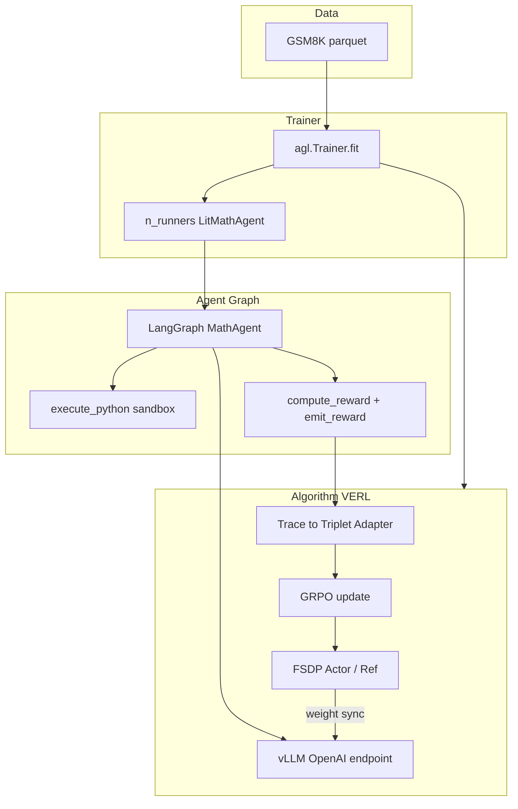

# 系统架构 + 星形故事（Week 4）

## 架构图（面试白板版）

### 五块积木（背诵）

1. **Runner**：`LitMathAgent.rollout` —— 拿题、跑图、给分
2. **Agent Graph**：LangGraph 多轮 tool —— 与训练框架解耦
3. **Rollout Engine**：vLLM —— 高速采样当前策略
4. **Adapter**：trace → triplets —— 只训该训的 token
5. **Learner**：GRPO + FSDP —— 组内相对优势更新 Actor

### 与单轮 LLM RL 的差别（常追问）

|      | 单轮补全 | 本项目 Agent RL        |
| ---- | ---- | ------------------- |
| 轨迹长度 | 一次生成 | 多轮 + tool 消息        |
| 环境   | 无    | Python 解释器          |
| Mask | 较简单  | tool 输出通常不计入策略 loss |
| 失败模式 | 胡言   | 解析失败、工具滥用、异步超时      |
| 吞吐   | 偏计算  | 常卡在 runner/工具/调度    |

---

## 星形故事（STAR）

**Situation**  
想用 RL 提升小模型做 GSM8K 的能力，且必须支持 **调用计算器工具** 的多轮 agent，而不是单轮 CoT。

**Task**  
在 Agent-Lightning + VERL 上跑通 **online GRPO**：可验证 0/1 奖励、稳定 rollout、能说清每个超参。

**Action**  

1. 实现 LangGraph agent + 沙箱 Python tool + 答案解析
2. `LitMathAgent` 对接 `main_llm` endpoint 与 `emit_reward`
3. 配置 GRPO（`n=4`）、2×A800 全量超参，并保留 1-card / smoke 回退
4. 做 **reward 消融**（binary / shaped / format_only）证明自己理解 hacking

**Result**  

- 冒烟：1 个 GRPO step 跑通  
- 面试材料：超参词典、架构讲解、离线消融表（`reward_ablation_dryrun.json`）  
- 可讲述结论：优化目标≠评测口径；format_only 会学「像答案」

**失败与修复（加分）**  
举例准备：单卡 OOM → 降 `gpu_memory_utilization` / micro-batch，而不是先砍序列语义；解析过宽导致假正例 → 收紧格式并监控解析失败率。

---

## 30 秒自我介绍（可贴开场）

「我做过 Tool-Augmented Math Agent 的 GRPO 训练：用规则可验证奖励，把 LangGraph 多轮工具轨迹接到 VERL 的异步 rollout。我不仅跑通 pipeline，还做了 reward shaping 消融，能说明为什么错误的奖励会让模型 reward hacking。」