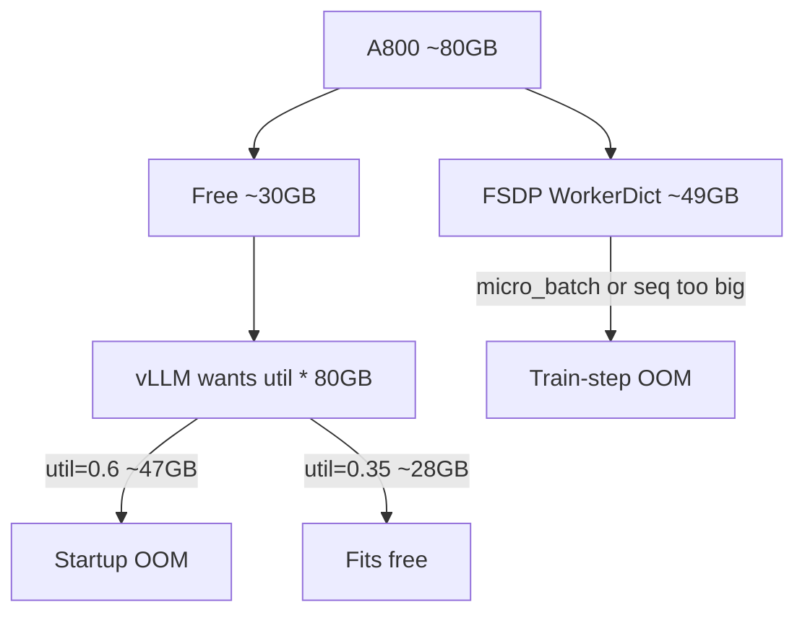

# GPU 显存估算、OOM 排查与超参实验影响（math_gsm 实战）

对照配置：[`train_math_agent.py`](../../train_math_agent.py) 的 `a800_2gpu`（Qwen3-4B，2×A800-80GB，VERL GRPO）。  
参数速查表见 [01_hyperparam_dictionary.md](01_hyperparam_dictionary.md)；本文讲 **显存怎么算、OOM 先动谁、每个旋钮对实验意味着什么**。

---

## 0. 一句话架构（显存为什么难算）

VERL 在本示例里是 **FSDP Actor 与 vLLM 同卡 colocated**：

1. 先加载 FSDP（训练权重 / 梯度路径 / 可能 offload 的优化器）
2. 再在同一张卡上启动 vLLM（按 `gpu_memory_utilization × 整卡容量` **预留** KV）
3. Runner 通过 OpenAI endpoint 做多轮 tool rollout，再回 FSDP 做 GRPO 更新

因此：**启动 OOM** 和 **训练 step OOM** 是两类问题，调错旋钮只会白白伤害实验。



---

## 1. 显存由谁吃掉（分阶段）

| 阶段 | 主要消费者 | 相关配置 | 量级直觉（本机） |
|------|------------|----------|------------------|
| 启动 FSDP | 分片参数、梯度缓冲、Adam 状态（可 offload） | `n_gpus`、offload、模型大小 | ~**49GB/卡**（已观测） |
| 启动 vLLM | KV cache **预留** | `gpu_memory_utilization` | `util × 79.25GB`，须 **&lt; Free** |
| Rollout 中 | 并发序列占满已预留的 KV | `max_prompt/response`、并发、`n` | 预留不够 → 吞吐塌或二次 OOM |
| Logprob | Actor/Ref 前向 | `log_prob_micro_batch_size_per_gpu` | 激活随 micro-batch × 序列涨 |
| 反传更新 | 激活 + 反传 | `ppo_micro_batch_size_per_gpu`、序列、checkpointing | 最常见 **step OOM** 来源 |

### 1.1 Qwen3-4B 权重速算（面试口述）

BF16/FP16 单份权重：

\[
\sim 4\times 10^9 \times 2\ \mathrm{bytes} \approx 8\ \mathrm{GB}
\]

训练侧若 **不做 offload**，粗算还要叠加：

- 梯度 ≈ 再一份权重量级  
- Adam（m/v）≈ 再两份（常 FP32）→ 轻松到 **数十 GB**  

本配置开了 `param_offload` + `optimizer_offload`，把大头卸到 CPU，GPU 上仍会看到 FSDP worker 占很大一块（你机器上约 49GB），剩余才给 vLLM。

**GRPO 相对 PPO 的显存优势**：没有 Critic/value net，少一套大模型。

### 1.2 vLLM 预留公式（你踩过的坑）

\[
\text{vLLM desired} = \texttt{gpu\_memory\_utilization} \times \text{GPU total}
\]

**注意：分母是整卡容量，不是剩余显存。**

本机实例：

| util | 请求显存 | Free≈30.4GB 时 |
|------|----------|----------------|
| 0.60 | \(0.6\times 79.25 \approx 47.6\) GB | **失败**（你的报错） |
| 0.35 | \(0.35\times 79.25 \approx 27.7\) GB | **可启动**（当前默认） |

安全条件：

\[
\texttt{gpu\_memory\_utilization} \times \text{Total} \;\lt\; \text{Free after FSDP} - \text{余量(建议 1–3GB)}
\]

反推上限：

\[
\texttt{util}_{\max} \approx \frac{\text{Free} - \text{margin}}{\text{Total}}
\approx \frac{30.4 - 2}{79.25} \approx 0.36
\]

所以 0.35 是「同卡 colocated」下的工程选择，**不是**削减 `train_batch_size` / 序列长度。

### 1.3 一次 GRPO step 的「采样量」直觉

\[
N_{\text{trajectories}} \approx \texttt{train\_batch\_size} \times \texttt{rollout.n}
\]

`a800_2gpu`：\(32 \times 4 = 128\) 条轨迹/步（再由 `n_runners`、vLLM 并发消化）。  
这主要吃 **时间与 KV 并发**，不直接等于 FSDP 反传 micro-batch；反传显存看的是 **micro-batch × 序列长度**。

### 1.4 激活显存粗规则（训练 step）

在固定模型下，激活大致：

\[
\text{Act} \propto \texttt{micro\_batch} \times \texttt{seq\_len} \times \text{hidden} \times \text{layers}
\]

实操含义：

- 先把 `ppo_micro_batch_size_per_gpu` 从 4 → 2 → 1，往往立刻消除 step OOM  
- `max_prompt_length + max_response_length` 变长，激活近似线性变差  
- `enable_gradient_checkpointing=True`：用算力换显存（本配置已开）  
- `use_remove_padding=True`：变长序列少算 padding（本配置已开）

---

## 2. OOM 时优先怀疑顺序（决策树）

### 2.1 先分清是哪一种 OOM

| 信号 | 类型 | 优先动的旋钮 |
|------|------|--------------|
| `Free memory on device (...) < desired GPU memory utilization (...)` | **启动 / vLLM 预留** | 清残留 → ↓ `gpu_memory_utilization` |
| 反传 / `CUDA out of memory` 在 update / backward | **训练 step** | ↓ micro-batch → ↓ logprob mb → 再考虑序列 |
| Rollout 中途 KV / 生成失败 | **KV 预留不够或并发过高** | 略↑ util（若 Free 允许）或降并发/序列 |

### A. 启动 OOM（vLLM 起不来）

1. **查残留**：上一轮挂掉的 `ray::WorkerDict` / 旧 train 是否仍占 40GB+（`nvidia-smi`）。`train_2gpu.sh` 会尝试清理。  
2. **降 `gpu_memory_utilization`**（0.6 → 0.35 这类），**先不要砍 batch/seq**。  
3. 仍不够：确认 FSDP `param_offload` / `optimizer_offload`；或加卡；避免无意义地开大 `tensor_model_parallel_size`（4B 保持 TP=1）。  
4. 最后才考虑换小模型或拆分非 colocated 部署（超出本示例默认路径）。

### B. 训练 step / 反传 OOM

按「伤害实验从小到大」：

1. **`ppo_micro_batch_size_per_gpu`**（4→1）——几乎只降吞吐  
2. **`rollout.log_prob_micro_batch_size_per_gpu` / `ref.log_prob_...`**  
3. **`max_prompt_length` / `max_response_length`** —— 伤多轮 tool / 长 CoT 能力，后动  
4. **`train_batch_size` / `ppo_mini_batch_size`** —— 伤梯度稳定性与有效样本  
5. **`rollout.n`** —— 伤 GRPO advantage 方差与算力；**一般不先拿它救激活显存**  
6. 确认 checkpointing / remove_padding 已开

### 2.2 反例：调错旋钮

- 启动报 util 不够，却去砍 `train_batch_size` → vLLM 仍按 0.6×总容量申请，**照样起不来**  
- step OOM 时盲目把 `rollout.n` 从 4 砍到 2 → 激活未必明显下降，GRPO 信号却变噪  
- 为省事把 `max_response_length` 砍到 256 → 工具链答不完，reward 长期接近 0，看起来像「RL 无效」

---

## 3. 超参详解（含义 / 资源 / 实验影响 / 怎么调）

当前推荐默认：`n=4`，`train_batch_size=32`，`max_prompt/response=4096/2048`，`gpu_memory_utilization=0.35`，`lr=1e-6`，`use_kl_loss=False`，`n_runners=8`。

### 3.1 算法

| 参数 | 含义 | 显存/算力 | 实验影响 | 调试建议 |
|------|------|-----------|----------|----------|
| `adv_estimator=grpo` | 组内相对 advantage，无 Critic | 比 PPO 省一套 value | 同题对比；组内全对/全错则信号≈0 | 保持；换 PPO 需额外 Critic 显存 |
| `use_kl_in_reward` | KL 惩罚进 reward | 需 ref logprob | 更保守、少跑偏，可能抑探索 | 默认关；跑偏/格式崩再开 |
| `use_kl_loss` / `kl_loss_coef` | loss 里加 KL(π\|\|π_ref) | 同上 | 锚定基座；coef 过大学不动 | 不稳时 `use_kl_loss=True` 小 coef |
| `entropy_coeff` | 熵奖励 | 可忽略 | >0 鼓励探索，防熵塌缩 | 默认 0；塌缩时试小正数 |
| `clip_ratio_low/high` | 策略比 clip（可非对称） | 无 | 限制单步更新幅度；过紧学得慢，过松易抖 | 保持 0.2/0.3；不稳略收紧 |

### 3.2 数据与序列

| 参数 | 含义 | 显存/算力 | 实验影响 | 调试建议 |
|------|------|-----------|----------|----------|
| `train_batch_size` | 每步多少 prompt | 采样时间↑；与 micro-batch 解耦 | 大→梯度稳；小→噪 | OOM 时别最先砍；信号不稳可略增 |
| `max_prompt_length` | prompt 上限 | KV + 激活↑ | 多轮对话上下文；`truncation=error` 超长直接失败 | 启动 OOM 勿动；step OOM 在 micro-batch 之后再动 |
| `max_response_length` | 单段生成上限 | 同上 | 太短截断答案→reward 假 0 | Agent+tool 优先保长度 |
| `truncation` | 超长策略 | — | `error` 暴露问题；静默截断会藏 bug | 开发期保持 `error` |

### 3.3 Rollout（vLLM）

| 参数 | 含义 | 显存/算力 | 实验影响 | 调试建议 |
|------|------|-----------|----------|----------|
| `gpu_memory_utilization` | 相对**整卡**的 KV 预留比例 | 启动预留 = util×Total | 太高起不来；太低吞吐差、长上下文易挤爆 | **启动 OOM 第一调参**；按 Free 反推 |
| `rollout.n` | GRPO group size | 采样 ×n | 小→advantage 噪；大→稳但贵；全 0/1 无区分度 | 优先 4；为省激活别先砍 n |
| `tensor_model_parallel_size` | 推理 TP | 切卡通信 | 4B 用 1 即可；乱开可能更慢/更难配 | 保持 1 |
| `log_prob_micro_batch_size_per_gpu` | 重算 logπ 的 micro-batch | 前向激活 | 过大 step OOM；过小变慢 | step OOM 时第 2 优先降 |
| `multi_turn.format` / `tool_call_parser` | tool 协议 | — | 不一致→工具全废、reward 噪 | 与 Qwen hermes 对齐 |
| `name=vllm` | 采样引擎 | — | 吞吐核心 | — |

### 3.4 Actor 优化

| 参数 | 含义 | 显存/算力 | 实验影响 | 调试建议 |
|------|------|-----------|----------|----------|
| `ppo_mini_batch_size` | 每次更新的 mini-batch | 影响更新次数 | 与 train_batch 同量级常见 | 随 train_batch 对齐 |
| `ppo_micro_batch_size_per_gpu` | 反传切片 | **激活显存主开关** | 几乎只影响吞吐 | **step OOM 第一刀** |
| `optim.lr` | 学习率 | — | 过大崩/遗忘；过小「假不涨」 | 1e-6 起步；不稳再降 |
| `fsdp_config.*_offload` | 参数/优化器卸 CPU | GPU↓ CPU↔GPU 拷贝↑ | 能塞下 colocated vLLM | colocated 建议保持开 |
| `enable_gradient_checkpointing` | 重计算换显存 | 显存↓ 算力↑ | 便于长大序列 | 保持 True |
| `use_remove_padding` | 去 padding | 算力/显存更省 | 变长多轮更友好 | 保持 True |

### 3.5 Ref / Trainer / 并行

| 参数 | 含义 | 显存/算力 | 实验影响 | 调试建议 |
|------|------|-----------|----------|----------|
| `ref.log_prob_micro_batch_size_per_gpu` | ref 前向 batch | 激活 | 开 KL 时更关键 | OOM 时与 actor logprob 一起降 |
| `n_gpus_per_node` | 卡数 | FSDP 分片 | 2 卡可撑满 batch/seq | 1 卡走 `a800` 回退（缩 batch/mb） |
| `n_runners` | 并行 agent worker | CPU/调度/打 vLLM QPS | 过小 GPU 闲；过大排队/超时 | 2gpu 默认 8；看 GPU util 调 |
| `val_before_train` / `test_freq` | 评测节奏 | 时间 | 没有基线无法说「涨了」 | 正式训保持训前 val |
| 温度（agent） | train 探索 / val 贪婪 | — | train 过高更噪；val 过高虚高方差 | 本项目 val 倾向 0.0 |

### 3.6 温度与评测口径（常被忽略）

- **Train**：较高温度 → 组内多样性↑，GRPO 才有相对信号  
- **Val**：低温度 → 可复现的能力估计  
- 汇报能力时用 **binary 准确率**，不要用 shaped/format_only 训练分冒充能力（见 reward 消融文档）

---

## 4. 调参速查表

| 目标 | 先动 | 别先动 |
|------|------|--------|
| 降 **启动 OOM** | 清进程；↓ `gpu_memory_utilization` | `train_batch_size`、序列 |
| 降 **更新 OOM** | ↓ `ppo_micro_batch_size_per_gpu` → ↓ logprob mb | 先砍 `rollout.n` |
| 提高吞吐 | ↑ `n_runners`；在 Free 允许下略↑ util；↑ micro-batch | 盲目↑ seq |
| 稳住 GRPO 信号 | ↑ `n`；避免任务全 0/全 1；保证温度有多样性 | 只加 lr |
| 减少跑偏/格式崩 | 开 KL 小系数；↓ lr；查 reward hacking | 无脑加大 batch |
| 单卡先跑通 | 用 `a800`/`fast` 缩 batch 与 mb | 把 util 调回 0.6 |

### 4.1 本仓库三档配置对照

| 模式 | 卡数 | batch | n | util | 用途 |
|------|------|-------|---|------|------|
| `a800_2gpu` | 2 | 32 | 4 | **0.35** | 正式训（完整 seq） |
| `a800` | 1 | 8 | 4 | 0.45 | 单卡回退 |
| `fast` | 1 | 2 | 2 | 0.35 | 1-step 冒烟 |

---

## 5. 面试/排障口述模板（30 秒）

「我们是 FSDP 和 vLLM 同卡。FSDP 先占大约一半显存，vLLM 的 `gpu_memory_utilization` 却按整卡算预留，所以 0.6 会要 47GB，只剩 30GB 时必须降到约 0.35。启动 OOM 调 util；训练 OOM 先降 micro-batch，不要先砍 GRPO 的 `n` 或序列长度。」

### 现场自检命令

```bash
nvidia-smi
# 看 Free；算 util_max ≈ (Free - 2) / Total
# 若已有 ray::WorkerDict 占几十 GB，先停干净再训
```
