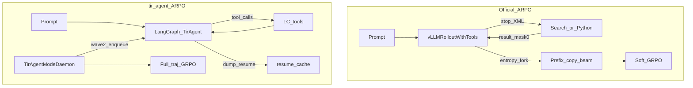
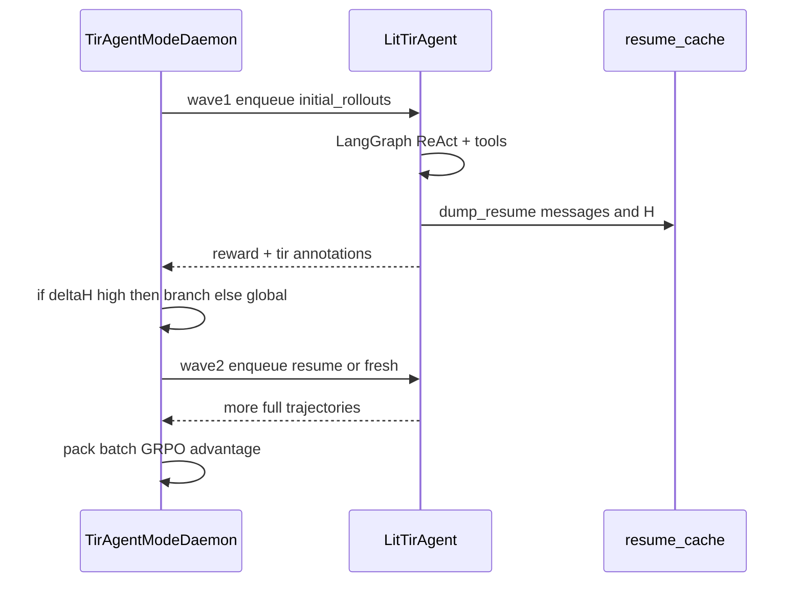

# 官方 ARPO 与 tir_agent 对比分析

本文对照两套实现：

| 侧 | 路径 | 一句话 |
|---|---|---|
| **官方 ARPO** | [`examples/ARPO`](../../ARPO/) | vendored VERL + XML-TIR + **rollout 内**熵自适应 fork |
| **tir_agent** | 本目录上一级 [`tir_agent.py`](../tir_agent.py) | Agent-lightning + LangGraph function-calling + **daemon 两阶段** ARPO 近似 |

两端都是 **单 Policy LLM 的 Tool-Integrated Reasoning（TIR）**，外层 advantage 都是 **GRPO（无 Critic）**。差异集中在：Agent 控制流、工具协议、以及 ARPO「高熵处多采样」落在哪一层。

**官方侧已有文档（本文不重复整仓 VERL 地图）：**

- [`ARPO_AGENT_ARCHITECTURE.md`](../../ARPO/ARPO_AGENT_ARCHITECTURE.md) — Agent / 工具 / workflow
- [`ARPO_ROLLOUT_SAMPLING.md`](../../ARPO/ARPO_ROLLOUT_SAMPLING.md) — 熵分支与采样
- [`ARPO_TECHNICAL_REPORT.md`](../../ARPO/ARPO_TECHNICAL_REPORT.md) — 训练链路总览

**本目录设计说明：** [`DESIGN.md`](DESIGN.md)（多算法钩子与诚实边界）。

论文：

- ARPO：[Agentic Reinforced Policy Optimization](https://arxiv.org/abs/2507.19849)
- AEPO：[Agentic Entropy-Balanced Policy Optimization](https://arxiv.org/abs/2510.14545)

---

## 1. 定位与读法

官方 ARPO 的论文创新 **几乎全在 Rollout**，不在 loss：在 tool 反馈后的高不确定步骤上 fork 前缀，把采样预算压到这些位置，组内仍走 GRPO。核心文件只有一个：`vLLMRolloutWithTools`。

tir_agent 的目标不是 100% 复现论文引擎，而是：

1. 用 LangGraph + 标准 tool-call 做可训 TIR Agent；
2. 通过 Agent-lightning 的 daemon / trainer 钩子挂上 GRPO / ARPO / AEPO-lite / IGPO / GiGPO；
3. **不 fork** 官方 veRL 仓库。

因此读对比时：把「协议与 Agent 形态」和「ARPO 采样保真度」分开看——前者 tir 更现代化，后者官方更接近论文。



---

## 2. Agent 架构对照

### 2.1 官方 ARPO：行为嵌在 vLLM rollout 循环里

官方训练脚本使用：

```bash
actor_rollout_ref.rollout.mode=sync_with_tool
```

此时 **没有** 独立的 `Agent` 类。Agent = `vLLMRolloutWithTools.generate_sequences` 里的 `while active_indices` 循环：

文件：[`ARPO/.../vllm_rollout_with_tools.py`](../../ARPO/ARPO/verl_arpo_entropy/verl/workers/rollout/vllm_rollout/vllm_rollout_with_tools.py)

| 步骤 | 行为 |
|---|---|
| 1 | 对 active 轨迹调用 vLLM，`stop=["</search>","</python>"]`，`n=1` |
| 2 | 本轮前若干 token 算标量熵（用于是否 fork） |
| 3 | 命中工具 tag → ThreadPool 执行 → 追加 `<result>...</result>`，`loss_mask=0` |
| 4 | EOS → 轨迹结束；否则按熵决定是否 copy 前缀 fork |
| 5 | 名额不足 → 可从裸 prompt 再开一条 |

备选路径 `mode=agent`（`ToolAgent` + `vLLMAgentRollout`）是 Gym 风格 `reset/step`，官方脚本 **未默认开启**，且 **没有** 熵自适应分支（只有随机 `branch_probability`）。改 ARPO 行为应改 `vllm_rollout_with_tools.py`，不要只改 `verl/workers/agent/`。

记忆模型：整段 token 上下文（prompt + 生成 + 工具结果），无独立向量记忆、无 LangGraph 节点。

### 2.2 tir_agent：显式 LangGraph ReAct

[`TirAgent`](../tir_agent.py) 把控制流拆成节点：

```text
START → agent → {tools | finalize | react | end}
              ↑_______|     |         |
              └─────────────┴─────────┘
```

| 节点 | 职责 |
|---|---|
| `agent` | `llm.invoke`；收口轮用无工具的 `llm_finalize`；更新 `h_root` / `h_tool` / `consecutive_high` |
| `tools` | 解析 `tool_calls`，调用 `TOOL_MAP`，写 `ToolMessage` + `turn_records` |
| `finalize` | 注入「只输出 `<answer>`」的 HumanMessage |
| `react` | finalize 仍无答案时，解除收口、提示继续 Thought→Action |

训练外壳 [`LitTirAgent`](../tir_agent.py) 继承 `agl.LitAgent`：

1. 从 `resources["main_llm"]` 取 endpoint / model / temperature；
2. `graph().invoke(...)` 跑完一条轨迹；
3. `compute_outcome_reward` → `agl.emit_reward`；
4. `agl.emit_annotation` 写入 `tir.*` 元数据；
5. ARPO/AEPO 时 `dump_resume` 到 `.resume_cache/`。

额外状态字段（供算法用，而非纯推理必需）：`turn_records`、`n_search`/`n_python`、`h_root`/`h_tool`、`branch_messages`、`resume_messages`。

### 2.3 架构对比表

| 维度 | 官方 ARPO | tir_agent |
|---|---|---|
| Agent 数量 | 单 policy LLM | 同左 |
| 控制流 | 单体 while + stop tag | LangGraph 条件边 |
| 截停方式 | vLLM `stop` 序列 | 模型自然停或发出 tool_calls |
| 收口 | 靠 prompt 教 `<answer>\boxed{}` | finalize nudge + resume react |
| 训练挂钩 | VERL Ray worker 内直接 generate | LitAgent rollout + span/triplet |
| 独立 Agent 类 | 主路径无；备选 `ToolAgent` | `TirAgent` + `LitTirAgent` |
| 多算法 | 主推 ARPO（同仓有 AEPO fork） | GRPO/ARPO/AEPO/IGPO/GiGPO 同目录 |

---

## 3. Tool 调用对照

### 3.1 协议

**官方 ARPO — XML 标签（非 OpenAI function calling）**

```text
<think>...</think>
<search>query</search>
<result>
  …工具返回…
</result>
<python>
code
</python>
<result>...</result>
<answer> ... \boxed{...} </answer>
```

- 触发：模型吐出 `</search>` / `</python>`，生成被 stop；
- 抽取：`_extract_content(text, tag)` 取标签内字符串；
- 回填：字符串拼接 ` <result>\n...\n</result>`，对应 token 的 `result_masks=0`（不进 policy loss）。

**tir_agent — Hermes / OpenAI tools**

- `init_chat_model(...).bind_tools(TOOLS)`；
- 工具定义在 [`tools/langchain_tools.py`](../tools/langchain_tools.py)：`web_search` / `wikipedia_search` / `execute_python`；
- 执行：`TOOL_MAP[name].invoke(args)` → `ToolMessage`；
- 最终答案协议：`<answer> YOUR_ANSWER </answer>`（无强制 `\boxed{}`）。

### 3.2 工具集合

| | 官方 ARPO | tir_agent |
|---|---|---|
| 搜索 | Bright Data → Bing SERP（评测可上 SDS：抓网页 + 摘要 LLM） | DuckDuckGo HTML（可选代理）；另有 Wikipedia API |
| 代码 | conda env 子进程 `python -c`（非强隔离） | [`python_tool.py`](../python_tool.py)：禁 import、timeout、`result=` |
| 注册 | yaml `rollout.tools.tool_instances` + `BaseTool.trigger_tag` | `@tool` + SYSTEM_PROMPT |
| 调用上限 | `tools.call_limit`（默认约 3～5，search/python 共用） | `max_turns`（默认 8 轮 agent 调用） |

### 3.3 协议优劣

| | 优势 | 代价 |
|---|---|---|
| **XML** | 与 decode stop 强绑定；格式奖励可极严（tag 不成对 / 无 boxed → -1）；不依赖 chat template 的 tool parser | 可移植性差；模型必须被 SFT/prompt 打稳标签；扩展工具要改 stop 与 prompt |
| **Function calling** | 生态标准、易加工具、与 OpenAI-compatible 端点兼容 | 依赖 Hermes/tool parser；训练侧要保证 vLLM 打开正确 parser；与论文 ARPO 原协议不一致 |

---

## 4. ARPO 算法实现对照（核心）

两端 **Advantage 都是组内 GRPO**。差别在「怎样凑满每题 `n` 条轨迹」。

### 4.1 官方：rollout 内熵自适应 fork（论文更近）

依据 [`vllm_rollout_with_tools.py`](../../ARPO/ARPO/verl_arpo_entropy/verl/workers/rollout/vllm_rollout/vllm_rollout_with_tools.py)：

| 超参 | 配置字段 | 典型值 |
|---|---|---|
| 最终组大小 | `rollout.n` | 16 |
| 初始并行 | `rollout.initial_rollouts` | 8 |
| 单源 fork 上限 | `rollout.beam_size` | 2（每次最多再复制 `beam_size-1`） |
| 分支阈值 | `rollout.branch_probability` | 0.5 |
| 熵权重 | `rollout.entropy_weight` | 0.2 |

流程：

1. 每个 prompt 复制 `initial_rollouts` 份（共享 prompt，不共享后续）。
2. 每轮生成后：取本轮 **前 20 个 token** 的 **top-10 logprob**，算熵再除以 `log(vocab_size)` 归一化；轨迹首次观测写入 `initial_entropy_dict`。
3. 工具执行并把 `<result>` 写回后，对仍 active 的轨迹：
   - `entropy_delta = H_now - H_init`
   - `prob = clamp(random() - entropy_weight * entropy_delta)`
   - 若 `prob <= branch_probability` 则 fork（ΔH 越大越容易过门槛）。
4. Fork = **`curr_inputs[source].copy()`**（真前缀共享，含已有 tool 交互），下一轮各自独立采样。
5. 已 EOS 但组未满：从 **原始 prompt** 重开（与熵无关）。
6. 凑满 `n` → reward → 组内 GRPO。共享前缀上 importance sampling 比率相同 → soft GRPO 设定。

关键实现片段位置：

- 超参读取：约 L82–86
- 熵计算：约 L172–177、L283–306
- fork：约 L434–508
- 工具 mask：约 L422–426

验证 / greedy 时 `beam_size` 强制为 1，整套熵分支关闭。

详细逐步说明见 [`ARPO_ROLLOUT_SAMPLING.md`](../../ARPO/ARPO_ROLLOUT_SAMPLING.md)。

### 4.2 tir：daemon 两阶段 enqueue + resume（工程近似）

涉及文件：

- Agent 侧：[`tir_agent.py`](../tir_agent.py)、[`algos/arpo_rollout.py`](../algos/arpo_rollout.py)
- 调度：[`algos/daemon.py`](../algos/daemon.py) `TirAgentModeDaemon`
- Advantage：[`algos/advantage.py`](../algos/advantage.py) — `tir_algo in ("grpo","arpo")` 时直接返回股票 GRPO

流程：

1. **第一波**：`_async_set_up` 临时把 `train_rollout_n` 降为 `tir.initial_rollouts`（默认 2，且 ≤ `n-1`），跑完整轨迹。
2. Agent 在第一次 tool 后把 messages 序列化进 `branch_messages`，通过 Archive 保存消息前缀及 h_* 兼容字段；不保存任意图恢复状态。
3. **不确定性兼容指标**（统一执行路径不再调用有固定回退值的旧 `estimate_turn_entropy`）：
   - 若 AIMessage 带 logprobs：用前 `entropy_tokens`（默认 8）个 chosen-token 的 `-mean log p`；
   - 缺失 logprobs 时保留中性零，并记录 `uncertainty_evidence=unavailable_neutral_zero`。上述 chosen-token surprisal 只是近似指标，不是词表分布熵；原始 provider logprobs 单独保存。
4. **第二波** `_enqueue_tree_branches`：
   - `ΔH = h_tool - h_root`；
   - ARPO：`p = branch_probability + entropy_weight * ΔH`，与 `entropy_threshold` 比较；
   - 通过则带 `resume_messages` 再 enqueue 最多 `beam_size` 条；剩余名额补 **全局**（无 resume）轨迹。
5. Agent 见 `resume_messages` 则从该前缀继续 ReAct；每条仍是 **完整新轨迹** 进 GRPO。



### 4.3 保真度：tir 相对论文 / 官方 **未对齐** 的点

| 论文 / 官方 | tir 实际 |
|---|---|
| decode 中途或轮次边界 **同序列** 前缀 fork | 第二波新 rollout；消息级 resume，非 token 级共享 |
| 工具后前 k token 的 **top-k 词表熵** | 有证据时使用 chosen-token surprisal 代理；缺失时明确标记，不伪造熵 |
| vLLM 内核 / partial rollout 省掉重复生成前缀 | 不改 vLLM；前缀可能被重新喂给 API |
| soft GRPO：共享前缀同一条 response 里 IS 相同 | M 条完整轨迹各自进 GRPO；「soft」仅概念近似 |
| fork 可发生在每一次 tool 后的 active 边界 | 主要用 **首次 tool 后** dump 的前缀做分支 |

[`advantage.py`](../algos/advantage.py) 对 `arpo` 不做额外 Â 变换——与官方一致（创新在采样）。AEPO-lite 才会在 advantage 上乘熵项。

---

## 5. 优劣与选型

### 5.1 分维度

| 维度 | 官方 ARPO | tir_agent |
|---|---|---|
| **ARPO 采样保真度** | 高：真前缀 fork + top-10 熵 | 中低：两波 enqueue 近似 |
| **工程成本** | 高：整仓 VERL fork、Bright Data、conda | 相对低：挂 Agent-lightning，不改 veRL 源码 |
| **工具可移植性** | XML 专用 | 标准 FC，易换检索/沙箱 |
| **信用分配丰富度** | 主路径偏 outcome GRPO | 同仓可切 IGPO / GiGPO / AEPO-lite |
| **训练吞吐（同 n）** | fork 后不必重跑前缀生成，tool 预算更省 | 第二波常重跑/重喂前缀，tool 可能重复 |
| **格式约束** | 极严（boxed + tag 成对） | `<answer>` + 层次 reward；有 finalize 兜底 |
| **Python 安全** | conda 任意代码风险高 | 禁 import 的受限执行器 |
| **评测深度** | 可配 SDS（网页正文 + 摘要模型） | 默认浅检索 snippet |

### 5.2 何时选哪边

**选官方 ARPO，当：**

- 要复现论文或刷 DeepResearch / 同类 benchmark；
- 能接受 Bright Data 密钥、conda 环境、维护 vendored VERL；
- 需要 rollout 内高效前缀 fork，把采样压在高熵 tool 步骤上。

**选 tir_agent，当：**

- 训练栈固定在 Agent-lightning，或要在同一套 Agent 上对比多种 GRPO 族算法；
- 需要标准 function calling、可替换搜索后端、更安全的 Python；
- 接受 ARPO 为 **工程近似**，优先可维护性与多算法实验速度。

### 5.3 不要混淆的两点

1. **官方 `mode=agent` 的 ToolAgent ≠ 论文 ARPO。** 熵分支只在 `sync_with_tool` / `vLLMRolloutWithTools`。
2. **tir 的 `--algo arpo` 不会改 `algorithm.adv_estimator`。** Hydra 里始终是 `grpo`；真实名字在 `algorithm.tir_algo`（见 [`overlay.py`](../algos/overlay.py)）。

---

## 6. 关键代码索引与阅读顺序

### 6.1 官方 ARPO（相对 `examples/ARPO/`）

| 想改什么 | 文件 |
|---|---|
| 训练主循环 / 熵 fork / tool mask | `ARPO/verl_arpo_entropy/verl/workers/rollout/vllm_rollout/vllm_rollout_with_tools.py` |
| 工具实现 | `.../rollout/tools/{search,python,base}_tool.py` |
| Gym 备选 Agent | `.../workers/agent/tool_agent.py`、`vllm_agent_rollout.py` |
| 训练 yaml / 超参 | `ARPO/scripts/config/ppo_trainer.yaml` + 各 `scripts/*.sh` |
| 格式奖励 | `.../utils/reward_score/deep_research.py` |
| 评测循环 | `evaluation/src/sample_processor.py`、`prompt_manager.py` |

推荐阅读顺序：`ARPO_AGENT_ARCHITECTURE.md` → `vllm_rollout_with_tools.py`（熵与 fork 段）→ `ARPO_ROLLOUT_SAMPLING.md` → `ARPO_TECHNICAL_REPORT.md`。

### 6.2 tir_agent（相对本目录上一级）

| 想改什么 | 文件 |
|---|---|
| ReAct 图 / finalize / 熵状态 | [`tir_agent.py`](../tir_agent.py) |
| 工具包装 | [`tools/langchain_tools.py`](../tools/langchain_tools.py)、`tools/search.py`、`python_tool.py` |
| ARPO 两波调度 | [`algos/daemon.py`](../algos/daemon.py) |
| resume / 熵 helper | [`algos/arpo_rollout.py`](../algos/arpo_rollout.py) |
| Advantage 分支 | [`algos/advantage.py`](../algos/advantage.py)、`gigpo_core.py` |
| 超参默认 | [`algos/overlay.py`](../algos/overlay.py) |
| Reward | [`algos/rewards.py`](../algos/rewards.py) |
| 训练入口 | [`train_tir_agent.py`](../train_tir_agent.py) |

推荐阅读顺序：`tir_agent.py`（TirAgent + LitTirAgent）→ `DESIGN.md` → `daemon.py` 的 `_enqueue_tree_branches` → 本文 §4 → 官方 `ARPO_ROLLOUT_SAMPLING.md`（对照差距）。

---

## 7. 附录：超参与环境变量对照

### 7.1 ARPO 采样相关

| 含义 | 官方配置 | tir `algorithm.tir.*`（[`DEFAULT_TIR`](../algos/overlay.py)） |
|---|---|---|
| 最终每题轨迹数 | `rollout.n` | `actor_rollout_ref.rollout.n`（由 train 配置档决定） |
| 第一波条数 | `rollout.initial_rollouts` | `tir.initial_rollouts`（默认 2） |
| 单源分支上限 | `rollout.beam_size` | `tir.beam_size`（默认 2） |
| 分支基准概率 / 阈值 | `rollout.branch_probability` | `tir.branch_probability`（默认 0.5） |
| 熵对分支的权重 | `rollout.entropy_weight` | `tir.entropy_weight`（默认 0.2） |
| 分支判定阈值 | （并入 random 公式） | `tir.entropy_threshold`（默认 0.15） |
| 熵用 token 数 | 固定前 20 + top-10 | `tir.entropy_tokens`（默认 8；需服务返回 logprobs） |

语义并不一一等价：官方用 `random - w·ΔH` 与 `branch_probability` 比较；tir ARPO 用 `α + γ·ΔH` 与 `entropy_threshold` 比较。调参时不要直接抄数值当同一公式。

### 7.2 tir 环境变量

| 变量 | 作用 |
|---|---|
| `TIR_ALGO` | 与 `--algo` 一致时影响是否 dump resume 等；训练主路径以 Hydra `tir_algo` 为准 |
| `TIR_REQUEST_LOGPROBS` | `1/true` 时请求 logprobs，保留原始证据并计算兼容代理值 |
| `TIR_DUMP_RESUME` | 强制 dump resume；`arpo`/`aepo` 时默认会 dump |
| `TIR_ARCHIVE_DIR` / `TIR_RESUME_DIR` | Archive 写入目录 / 旧 resume 缓存只读兼容目录 |
| `TIR_OFFLINE_SEARCH` | 离线检索占位 |

### 7.3 数据与奖励（tir）

- Schema：`id, question, answer, answers, source, split`；`source ∈ {gsm8k, hotpot, nq}`。
- Outcome：格式坏 → `-1`；格式好 Acc=0 → `0`；Acc>0 → Acc（+ 可选双工具 bonus `0.1`）。
- 官方 Deep Research 奖励另含 think/answer/tag 顺序与 `\boxed{}` 检查，尺度与 tir 不完全相同，不可直接比绝对 reward 数值。

---

## 8. 小结

| | 官方 ARPO | tir_agent |
|---|---|---|
| Agent | XML-TIR 嵌在 VERL vLLM rollout | LangGraph ReAct + FC |
| ARPO | **真**熵 fork + soft 前缀 | **近似**两波 resume enqueue |
| Loss | GRPO | GRPO（可切其他 tir_algo） |
| 适合 | 论文复现 / 深度工具 Agent RL | Agent-lightning 实验与多算法对比 |

若只记一句：**官方把 ARPO 做进了采样内核；tir 把 ARPO 的思想接到了可维护的 Agent 外壳上，并诚实标出差距。**
