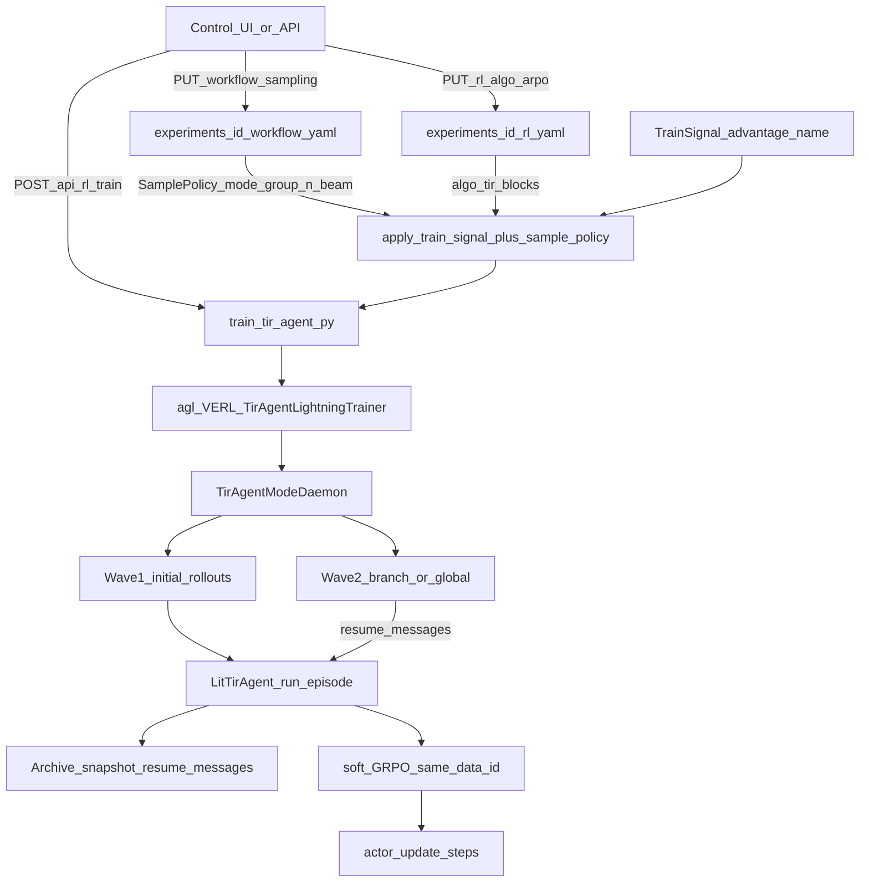
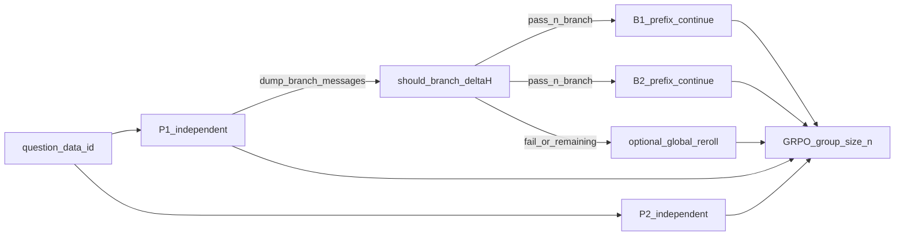

# MAS 执行 ARPO 训练：端到端测试手册

日期：2026-09-16

采样语义见 [ROLLOUT_SAMPLING.md](./ROLLOUT_SAMPLING.md)、[SAMPLING_ARPO_APPO.md](./SAMPLING_ARPO_APPO.md)；层边界见 [LAYER_LAYOUT.md](./LAYER_LAYOUT.md)。本页只讲 **怎么测通** MAS → ARPO 训练热路径。

从 Control UI 逐项验收 branch sites / RAE / Collect vs Train 假绿对照，见 [BRANCH_ROLLOUT_UI_TEST.md](./BRANCH_ROLLOUT_UI_TEST.md)（`./run.sh branch-ui-test`）。

实验 bundle：[`experiments/arpo_e2e/`](../experiments/arpo_e2e/)（`sampling.mode=arpo`，`group_n=4`，`total_training_steps=3`）。

---

## 0. 一句话验收

Control / CLI 启训后日志出现 `tir_algo=arpo`，同题先跑 `initial_rollouts` 条独立轨迹，再出现带 `resume_messages`（或 `reason=arpo_branch`）的第二波，且 metrics 至少写出 **3** 个 training step。

---

## 1. 端到端路径图



### 接线（已补）

| 入口 | 行为 |
|------|------|
| `POST /api/rl/train` | [`start_train`](../science_infra/control/services.py) 在写回 `rl.yaml` 前调用 `apply_sample_policy(workflow.sampling)`，同步 `algo` / `rollout.n` / `algorithm.tir.*` |
| CLI `--rl-yaml` | [`train_tir_agent.py`](../mas/train_tir_agent.py) 若同目录存在 `workflow.yaml`，再应用其 `sampling` |

Collect **不会**执行 branch（`beam_size` 只声明）；真正前缀续写只在 `tir_algo=arpo|aepo` 训练 Daemon。

---

## 2. ARPO 两波采样路径



代码落点：

- 映射：[`rl/hooks/overlay.py`](../rl/hooks/overlay.py)（`appo→arpo`）
- 两波：[`rl/hooks/daemon.py`](../rl/hooks/daemon.py)
- 续写：[`mas/lit_tir_agent.py`](../mas/lit_tir_agent.py) + `resume_messages`
- 默认只从该题 **第一条** 完成轨迹（`rids[0]`）分叉

---

## 3. 分层测试命令

### Phase 0 — 环境

```bash
nvidia-smi -L
ls LLM/Qwen3-4B data/train.parquet data/val.parquet
# 缺数据时：
cd mas && TRAIN_LIMIT=32 VAL_LIMIT=8 bash scripts/prepare_data.sh
```

建议 Python：仓库 `.venv` 或 `/root/autodl-tmp/AgentFlow/.venv/bin/python`。

### Phase 1 — 无 GPU 单测

```bash
cd mas
PYTHONPATH=..:. python -m unittest \
  tests.test_daemon_expand \
  tests.test_branch_policy_activeset \
  tests.test_stage7_e2e -v
```

验收：enqueue 含 `resume_messages` / `arpo_branch`；TrainSignal `advantage.name=arpo`。

### Phase 2 — Control UI / API

```bash
./run.sh ui --daemon
# 另开终端：
python scripts/ui_rl_check.py --experiment arpo_e2e --algo arpo --no-train
# 或短启停训练接线（不跑满 step）：
python scripts/ui_rl_check.py --experiment arpo_e2e --algo arpo
```

手工 curl 要点：

```bash
BASE=http://127.0.0.1:8787
EXP=arpo_e2e

# Collect → TrainSignal
curl -s -X POST "$BASE/api/mas/collect?experiment_id=$EXP" \
  -H 'Content-Type: application/json' \
  -d '{"mock":true,"n":1,"algo":"arpo"}' | jq '.train_signal.advantage.name'
# 期望: "arpo"

# 启训（会占用 GPU；测完 POST /api/rl/stop）
curl -s -X POST "$BASE/api/rl/train?experiment_id=$EXP" \
  -H 'Content-Type: application/json' \
  -d '{"stop_llm":true,"confirm_gpu":true}' | jq '{algo:.argv, cuda:.cuda_visible_devices, run:.run_id}'
```

验收：`argv` 含 `--algo arpo`、`--rl-yaml .../arpo_e2e/rl.yaml`；启训后磁盘 `rl.yaml` 的 `algorithm.tir_algo=arpo` 且 `rollout.n=4`。

### Phase 3 — 多步 GPU 训练

```bash
export CUDA_VISIBLE_DEVICES=0
export TIR_OFFLINE_SEARCH=1
export VLLM_USE_V1=1
cd mas
PYTHONPATH=..:. python train_tir_agent.py fast \
  --algo arpo \
  --n-runners 1 \
  --rl-yaml ../experiments/arpo_e2e/rl.yaml
```

或：

```bash
./run.sh train fast --gpu 0 --n-runners 1 --algo arpo \
  --rl-yaml experiments/arpo_e2e/rl.yaml
```

`experiments/arpo_e2e/rl.yaml` 已设 `total_training_steps: 3`。

### Phase 4 — 行为验收表

| 判据 | 期望 |
|------|------|
| 启动日志 | `tir_algo=arpo`（`adv_estimator` 仍为 `grpo`） |
| sibling sampling | 打印 `Applied sibling workflow.sampling → tir_algo=arpo rollout.n=4` |
| 波1 | 每题约 `initial_rollouts=2` 条独立轨迹 |
| Archive | `.tir_archives/**` 或 resume 缓存含 `messages` / `h_root` / `h_tool` |
| 波2 | 日志或 enqueue 元数据出现 `resume_messages` / `arpo_branch` / `tir_branch` |
| 组大小 | 同 `data_id` 凑近 `rollout.n=4` |
| 步进 | `AGL_METRICS_JSONL` / TensorBoard ≥ 3 steps |
| 对照 | `--algo grpo` **不应**出现第二波 `resume_messages` |

负例：把 `algorithm.tir.entropy_threshold` 抬到极大 → `n_branch=0`，剩余 global，仍应凑满 `group_n`。

---

## 4. 已知边界

- Collect / smoke / mock：**不**做中间点续写。
- `sampling.mode=appo` 经 overlay **映射为** `arpo` enqueue，尚无独立「分支 advantage 置零」实现。
- 分叉父轨迹固定为 `rids[0]`。
- Hydra `algorithm.adv_estimator` 永远是 `grpo`；真实名在 `algorithm.tir_algo`。

---

## 5. 实测结果

（执行 Phase 1–4 后填写）

| Phase | 结果 | 备注 |
|-------|------|------|
| 1 单测 | _pending_ | |
| 2 UI/API | _pending_ | |
| 3–4 训练 | _pending_ | 日志路径 / metrics 路径 |
