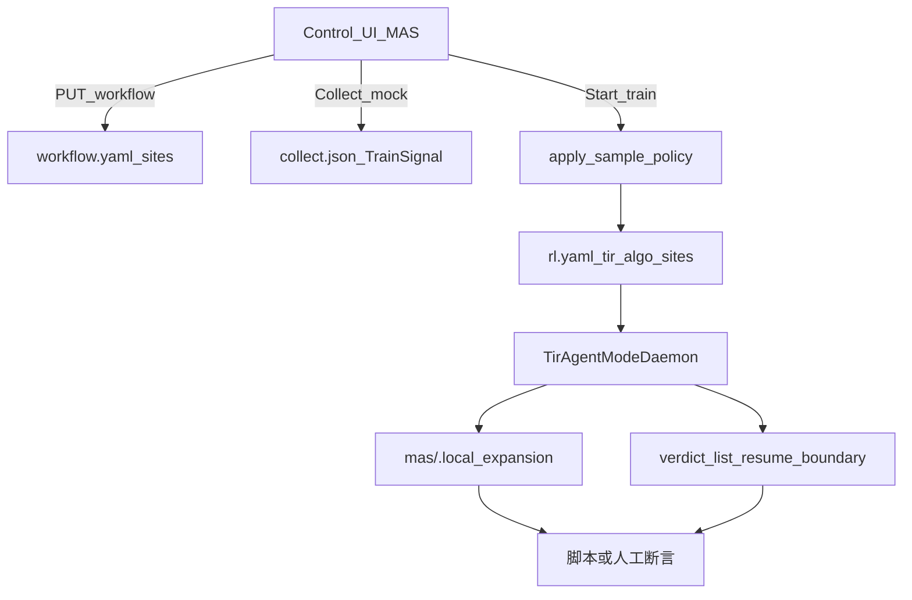

# Branch Rollout UI 验收测试手册

日期：2026-09-16

对照：[BRANCH_SITE_DESIGN.md](./BRANCH_SITE_DESIGN.md)、[ARPO_TRAIN_TEST.md](./ARPO_TRAIN_TEST.md)、[CONTROL_UI.md](./CONTROL_UI.md)、[ROLLOUT_SAMPLING.md](./ROLLOUT_SAMPLING.md)、[ROLLOUT_SAMPLING_UI_TEST.md](./ROLLOUT_SAMPLING_UI_TEST.md)（小窗 S0–S5 / `traj-test`）。

自动化脚本：`[scripts/branch_rollout_ui_test.py](../scripts/branch_rollout_ui_test.py)`（`./run.sh branch-ui-test`；可选 `--pev-fixture` / `--router-fixture`，agent-framework 路由锚点验收见 [MAS_AGENT_FRAMEWORK_TEST.md](./MAS_AGENT_FRAMEWORK_TEST.md)）。

实验基线：`[experiments/arpo_e2e/](../experiments/arpo_e2e/)`。

---


## 0. 原则（先读，防假绿）


| 真相                           | 说明                                                            |
| ---------------------------- | ------------------------------------------------------------- |
| Collect **不做**树分支            | `artifacts/collect.json` 绿 ≠ branch                           |
| 真 branch 只在 **Train Daemon** | `tir_algo∈{arpo,aepo,rae}` + `expand_in_runner`               |
| UI 声明绿 ≠ 运行时绿                | 必须查 `workflow.yaml` / `rl.yaml` / `mas/.local_expansion` / 日志 |
| `on_token` 勾选 ≈ 合同           | runtime 默认 `after_tool`，不发 `ON_TOKEN` 事件                      |
| `token_prefix` ≈ 合同          | 训练侧恒降级 messages（`resume_mode_downgraded`）                     |
| `ready_batch_size` 训练常为 0    | 默认 plan-only；以 Daemon **增量 enqueue** + L4 Scheduler 单测为准      |
| `rae_full_tgt` 无 UI          | 改 `rl.yaml` + 单测；L3 默认验 R1-lite / verdict 链                   |





---


## L0 — 环境


| 步骤    | 操作                                                                                                                 | Pass                  |
| ----- | ------------------------------------------------------------------------------------------------------------------ | --------------------- |
| L0.1  | `./run.sh ui --daemon` → 浏览器 `http://127.0.0.1:8787/`                                                              | 页可开、`/api/health` ok  |
| L0.1b | 代码更新后须 **重启 UI**（`./run.sh ui --stop && ./run.sh ui --daemon`），否则 palette 无 `rae`/`gate_types`、Collect 可能拒 `sites` | palette 含 `rae`       |
| L0.2  | 顶栏选实验 `arpo_e2e`                                                                                                   | bundle 加载             |
| L0.3  | （可选）`./run.sh ui-test --no-train`                                                                                  | Control GPU/RL API 活着 |
| L0.4  | 短训前按 [CONTROL_UI.md](./CONTROL_UI.md) 勾 GPU                                                                        | `rl.yaml` devices 已写  |


检查表：`[ ] Pass` `[ ] Fail` `[ ] Skip`

---


## L1 — UI 声明（每改必测）

路径：左栏 **MAS** → 下方 **Rollout Sampling** 小窗（主）/ Inspector Advanced（辅）→ **保存 workflow.yaml**。


| ID    | UI 操作                                                                            | 断言（磁盘）                                                                                 | 结果    |
| ----- | -------------------------------------------------------------------------------- | -------------------------------------------------------------------------------------- | ----- |
| L1.1  | **Rollout Sampling** 小窗：点选 agent 屏障 → 启用 branch；gate=`entropy_delta`；beam≥2 → 保存 | `workflow.yaml` 含 `sampling.sites`（脚本要求同时有 `after_tool` **与** `after_agent_turn`）；画布角标 | `[ ]` |
| L1.1b | 小窗顶栏设 mode / group_n / beam                                                      | 与 SamplePolicy 字段一致（已并入小窗）                                                             | `[ ]` |
| L1.2  | 同站点 `reward.scheme=rae_adjudicate`；mode=`rae`；`group_n=4`；`beam_size=2` → 保存     | `sampling.mode: rae`；site `reward.scheme: rae_adjudicate`                              | `[ ]` |
| L1.3  | Inspector Advanced 勾选 `on_token`；`resume_mode=token_prefix` → 保存                 | `anchor.kind: on_token`；`fork.resume_mode: token_prefix`（**行为见 L3.4**）                 | `[ ]` |
| L1.4  | mode 切回 `arpo` → 保存                                                              | `sampling.mode: arpo`，sites 仍在                                                         | `[ ]` |
| L1.5  | PEV：planner / executor / verifier 分别启用 branch                                    | YAML 含对应 `after_agent_turn` / `after_verifier`（脚本：`--pev-fixture`）                     | `[ ]` |
| L1.6  | Router：site 锚定 RouterSpec 节点（`anchor.agent_id = router id`）且持久化                  | 脚本：`--router-fixture`（planner + tool-agents + blank expert）                            | `[ ]` |


脚本等价：`PUT /api/experiments/arpo_e2e/workflow` 注入 sites 后 `GET` 回读。小窗手测表见 [ROLLOUT_SAMPLING_UI_TEST.md](./ROLLOUT_SAMPLING_UI_TEST.md)。

---


## L2 — Collect（wiring，非 branch）


| ID   | UI 操作                              | 断言                                                             | 假绿注意                                   | 结果    |
| ---- | ---------------------------------- | -------------------------------------------------------------- | -------------------------------------- | ----- |
| L2.1 | MAS **Collect (mock)**，algo=`arpo` | `artifacts/collect.json`；响应 `train_signal.advantage.name=arpo` | **无** expansion / `branch_local_count` | `[ ]` |
| L2.2 | algo=`rae` 再 Collect mock          | `name=rae`                                                     | **不**证明 verdict                        | `[ ]` |


---


## L3 — Train（真 branch / RAE）

短训：`arpo_e2e` 默认 `total_training_steps=3`；或脚本 `--train --max-wait N` 后 Stop。


| ID                    | 操作                                         | 通过标准                                                                                                                                           | 结果    |
| --------------------- | ------------------------------------------ | ---------------------------------------------------------------------------------------------------------------------------------------------- | ----- |
| L3.1 ARPO branch      | L1.1 + mode=`arpo` → 顶栏/RL **Start train** | `rl.yaml`：`tir_algo=arpo`；`mas/.local_expansion` 有 plans 或 `branch_local_count>0`；plan meta 可含 `event_kind`（`after_tool` / `after_agent_turn`） | `[ ]` |
| L3.2 RAE verdict      | L1.2 → 短训 ≥1 step                          | `tir_algo=rae`；expansion/plan meta 含子行 `action_key` / `resume_boundary>0`；组内若 k≥k_min 可见非 `none` 的 verdict（不足则允许 `abstain`，记 Skip 并注明）         | `[ ]` |
| L3.3 ready_batch / 增量 | arpo/rae 默认 `ready_batch`                  | 日志或 metrics 出现增量子 enqueue（`training/incremental_branch_count`）；**不**要求 `tir.ready_batch_size>0`                                                | `[ ]` |
| L3.4 token_prefix     | L1.3 后短训                                   | 子 sample / enqueue 路径 messages resume；可见 `resume_mode_downgraded` 或实际无 token 前缀引擎；**不**要求真 token 续写                                            | `[ ]` |
| L3.5 负例 fill          | YAML：`beam_size=1` 且难触发 fork，或极大 gate 阈值   | 仍凑满 `group_n`（global fill）；`n_plans` 可为 0                                                                                                      | `[ ]` |


产物路径：

- `experiments/<id>/rl.yaml` — overlay 后的 `tir_algo` / `sites`
- `mas/.local_expansion/<rollout_id>.json` — `plans[]`、`branch_local_count`、`meta`
- 训练 run 日志 — `GET /api/runs/{run_id}?tail=`

---


## L4 — 单测兜底（UI 不可见）

```bash
cd /path/to/MAS_Science_Infra
.venv/bin/python -m unittest \
  mas.tests.test_gates_and_rae \
  mas.tests.test_phase_abcd_rae_activeset \
  mas.tests.test_branch_policy_activeset -v
```

覆盖：延迟 tool ready-batch、R0 `resume_boundary`、探针 `h_branch`、`on_token` 匹配、`renorm` / `dead_end`。

结果：`[ ] Pass` `[ ] Fail`

---


## 自动化命令

```bash
# 需 UI 已起（或由 run.sh 临时拉起）
./run.sh branch-ui-test                 # L1+L2（默认不训）
./run.sh branch-ui-test --train         # 再短训并扫 expansion / rl.yaml
./run.sh branch-ui-test --algo rae --train
./run.sh branch-ui-test --port 8787 --include-on-token

# 直接调脚本
.venv/bin/python scripts/branch_rollout_ui_test.py \
  --base http://127.0.0.1:8787 \
  --experiment arpo_e2e
```

与 `./run.sh ui-test` 互补：后者偏 GPU/RL API smoke；本脚本偏 **sites + branch 产物**。

---


## 建议执行顺序

1. L0 起 UI → L1 **手点一遍**并保存
2. `./run.sh branch-ui-test` 复核 YAML / Collect
3. L4 单测全绿
4. L3 短训（GPU）→ 查 expansion + `rl.yaml`；RAE 再跑 `./run.sh branch-ui-test --algo rae --train`
5. 把上表勾成 Pass/Fail/Skip

---


## 假绿速查

- Collect 成功 ≠ branch  
- 勾选 `on_token` ≠ token 处分叉  
- `token_prefix` UI 选项 ≈ 合同；训练侧降级 messages  
- `ready_batch_size` 注解在训练默认路径常为 0  
- `rae_full_tgt` 无 UI；本手册 L3 默认验 R1-lite / verdict 链

