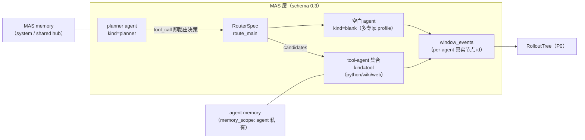

# MAS Agent 化重构 — 架构说明与测试矩阵

> 依据 `docs/NEW_FRAMEWORK_DESIGN.md` §2.1/2.2 与 `docs/NEW_FRAMEWORK_MIGRATION_PLAN.md` P1 收尾。
> 路由器走**适配器模式**（决策映射为 tool_calls，ARPO 熵估计零风险）；tool-agent 用**双模式注册表**（默认 `mas/tools` 纯函数，`profile.llm_required` 时切 `epc_aw` LLM-in-tool）。

---

## 1. 架构：一切皆 Agent



### 两类 Agent + 路由器

| 类别 | kind | 说明 |
|------|------|------|
| 打包 agent | `planner` / `tool` / `verifier` / `hub` | 由框架提供行为（ReAct、纯函数、校验） |
| 空白 agent | `blank` | `system_prompt` + `profile.skills` 自定义专家 |
| 路由器 | RouterSpec 节点 | 候选 = tool-agents + 空白 agents；LLM 发 tool_call 即路由决策 |

### 适配器模式（路由 = tool_calls 糖）

- 编译期：RouterSpec 候选中 `kind=tool` 的注册进 `tools_for[上游agent]`（`mas/workflow/compiler.py`），edge 语义与 `tool_call` 边完全一致——**纯糖**。
- 运行时：`TirAgent.bind_tools` 集合 = RouterSpec.candidates 中 kind=tool 的 agent id（经 `AgentRegistry` 解析）；LLM 发 tool_call 即路由决策，`ToolAgentInvoker` 照旧执行。
- **保护红线**：tool_calls 协议完整保留，ARPO 的 `h_tool`/`h_root` 熵估计与 `resume_boundary` 不动。

### 双模式 tool-agent

`mas/tools/tool_agents.py` 的 `ToolAgent` 增加双后端：

| 后端 | 触发 | 实现 |
|------|------|------|
| `pure`（默认） | 训练 / Collect / mock | `mas/tools/langchain_tools` 纯函数 |
| `llm` | 测试态 `llm.kind == "api"` 且 `profile.llm_required` | `epc_aw.tools.*`（惰性 import，不在注册时拉外部依赖） |

切换逻辑：`AgentRegistry.from_spec(spec, allow_llm_backends=...)`；runtime 在构造 TirAgent 时按 `spec.llm.kind == "api"` 设 `tool_agent_invoker.prefer_llm`。训练/Collect 路径**永远 pure**（`_PureOnlyView` 强制降级），RL worker 不会意外 import epc_aw。

### 两层 memory

- `memory_scope: "agent"` → 独立 buffer（按节点 id）
- `memory_scope: "shared"` → 共享 hub buffer（默认；MAS 层历史日志照旧写 system/hub）
- `profile.memory = {"policy": "append_latest", "max_items": N}` 截断策略
- API：`MemoryStore.read_agent(agent_id, memory_scope=..., policy=...)` / `write_agent(...)`

### per-agent window_events

`run_compiled_episode` 每个 hop 把该节点的 `window_events` / `window_snapshots` 合并进最终 `EpisodeRaw`（`agent_id` 用真实节点 id，不再是硬编码 `"hub"`）。路由决策事件携带 `metrics.router_id + candidates`。

---

## 2. 测试矩阵

| 层 | 命令 | 覆盖 | 结果 |
|----|------|------|------|
| **功能分组（推荐）** | `./run.sh feature-test --list` | 16 个功能域（下表），单域/多域/全量 | ✅ |
| 功能分组全量 | `./run.sh feature-test --all` | 14 单测域 + frontend = 146 例 | ✅ 15/15 域 |
| 单测（后端） | `.venv/bin/python -m unittest mas.tests.test_agent_framework` | registry 双后端 / RouterSpec 编译 / 两层 memory / PEV per-agent events（17 例） | ✅ |
| 单测（前端） | `./run.sh traj-test` | 轨迹推导 + router 节点候选（9 例） | ✅ |
| 全量回归 | `.venv/bin/python -m unittest discover -s mas/tests -t .` | 137 例（含旧 stage1-7 红线：旧 YAML 不变仍 Collect+Train） | ✅ |
| 冒烟 | `./run.sh smoke`（或 `feature-test smoke`） | doctor → 层依赖 → mock 采集 → diagnose → dashboard | ✅ |
| UI API 回归 | `./run.sh branch-ui-test --pev-fixture --router-fixture` | sites 持久化 + router 锚点 + 恢复红线 | ✅ |
| RolloutTree API | `.venv/bin/python scripts/rollout_tree_verify.py` | trees ≥ 1 + event_kind/h_tool（训练后） | 训练后跑 |
| ARPO 训练验收 | `./run.sh arpo-train-test` | 见 §3 判据表 | GPU 环境跑 |
| 前端构建 | `cd webui && npm run build` | TS 类型 + 打包 | ✅ |

### feature-test 功能域表（`./run.sh feature-test --list`）

| 域 | 覆盖 | 用例 |
|----|------|------|
| `mas-core` | spec/compiler/依赖红线/奖励/mock 采集/memory sockets | 18 |
| `rl` | TrainSignal overlay / Archive resume 边界 | 6 |
| `harness` | log/loss 波动/认知收敛/reward hacking | 17 |
| `branch` | gates/RAE/active set/plan_forks 轨迹站点/k-hop credit | 26 |
| `rollout-tree` | 建树/leaves/path/JSON round-trip | 5 |
| `agent-framework` | AgentRegistry 双后端/RouterSpec 运行时/两层 memory/PEV per-agent events | 17 |
| `schema03` | sugar 扩展/kind 推断/ToolAgentInvoker | 6 |
| `daemon` | expansion enqueue / _rollout_trees 存储 | 2 |
| `realtime` | stdout JSONL 帧/SSE 过滤/Diagnoser.consume | 7 |
| `cli` | status HTML / 子进程闭环 | 4 |
| `control-ui` | dashboard / API 端点 / rl.yaml CLI | 5 |
| `gpu-compiler` | compiler / compiled collect / api | 8 |
| `verifier` | registry / hop 反馈 | 7 |
| `e2e` | C1-C8 全链路（采集→reward→诊断→fork→CLI） | 9 |
| `frontend` | vitest trajectoryGraph（含 router 节点） | 9 |
| `smoke` | 无 GPU 冒烟（等价 `./run.sh smoke`） | 5 步 |

### 红线检查

- `git diff -- 'experiments/*/workflow.yaml'` 为空（旧 YAML 零改动）✅
- `mas/workflow/` 无 AGL/verl/ray import（smoke AST 把关）✅
- epc_aw 只在 `mas/tools/tool_agents.py` 惰性 import ✅

---

## 3. ARPO 10 轮训练判据表（`./run.sh arpo-train-test`）

对应 `docs/ARPO_TRAIN_TEST.md` Phase 4：

| 维度 | 判据 | 实现位置 |
|------|------|----------|
| **采样** | 日志出现 `Applied sibling workflow.sampling → tir_algo=arpo` | `scripts/arpo_train_verify.py` 轮询 run log |
| 采样 | wave-2 enqueue 含 `resume_messages` / `arpo_branch` | 同上 |
| 采样 | `branch_local_count ≥ 1`（expansion plans） | `mas/.local_expansion/*.json` 扫描 |
| 采样 | 同 data_id 组大小 ≈ 4（group_n 凑满） | plans data_id 分组 |
| **reward** | metrics JSONL 每 rollout reward 非 null | `checkpoints/**/metrics.jsonl` 解析 |
| reward | 同组有方差（GRPO 组基线生效） | 按 data_id 分组算 spread |
| reward 负例 | threshold 极大 → `n_branch=0` 仍凑满 group_n | `--negative` 可选 |
| **loss** | `training/loss` ≥ 10 steps | metrics 计数 |
| loss | `training/tir_algo` 有值（arpo id） | metrics |
| loss | actor lr > 0 | metrics |
| **恢复** | 原 rl.yaml / workflow.yaml 恢复（红线） | PUT 回写 |

运行：

```bash
./run.sh arpo-train-test                    # 10 步默认
./run.sh arpo-train-test --steps 10 --timeout 900
./run.sh arpo-train-test --negative         # 追加负例（n_branch=0）
```

训练后接着验收 RolloutTree：

```bash
.venv/bin/python scripts/rollout_tree_verify.py            # 经 API
.venv/bin/python scripts/rollout_tree_verify.py --offline  # 直扫本地 expansion
```

---

## 4. RolloutTree 手动 UI 步骤（B3）

1. `./run.sh ui --port 8787 --daemon`（若未运行）
2. 打开 `http://127.0.0.1:8787/#rollout-tree`
3. 左侧列表选一棵树 → React Flow 渲染 root/child 分层
4. 节点徽标显示 `event_kind` + `h_tool` metrics；RAE 树显示 verdict
5. 训练进行中 → 右上 LIVE 徽标（SSE `node_added` 事件，P3 已实现）

---

## 5. UI Router 节点（A5）

- 主画布：RouterSpec 渲染为**菱形路由节点**（紫色 `#8957e5`，显示 `strategy · N cands`），候选连线 `candidate`
- RolloutSampling 面板：路由边界出现在主路径条（kind=router），可挂 gate/beam（`after_agent_turn` 锚定 router id）
- `flowToWorkflow` 将 routers 原样 round-trip；`executableInfo` 跳过 router 边校验
- 手动验收：`./run.sh branch-ui-test --router-fixture`（断言 sites 锚定 router id 且持久化，之后恢复 hub workflow）

---

## 6. 相关文档

- 设计：`docs/new_framework.md` / `docs/NEW_FRAMEWORK_DESIGN.md` / `docs/NEW_FRAMEWORK_MIGRATION_PLAN.md`
- 分支训练：`docs/ARPO_TRAIN_TEST.md` / `docs/BRANCH_ROLLOUT_UI_TEST.md`
- 采样 UI：`docs/ROLLOUT_SAMPLING.md` / `docs/ROLLOUT_SAMPLING_UI_TEST.md`
