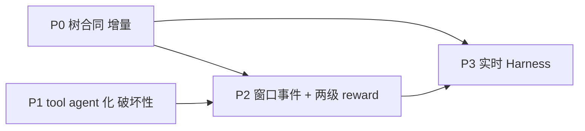

# MAS infra 修改实施方案（P0–P3）

日期：2026-09-17

依据：[NEW_FRAMEWORK_DESIGN.md](./NEW_FRAMEWORK_DESIGN.md)（最优架构与 §3 修改清单）。本文把设计文档的文件级清单展开为**函数级修改方案**：每个改动给出目标文件、插入点（现有代码锚点）、新代码骨架、测试与验收命令。

原则（同设计文档 §2.0）：层独立不破坏；合同先行；糖而非删；AGL 黑盒不动。**本文只是方案，不含已实施代码。**



| 阶段 | 主题 | 破坏性 | 回滚开关 |
|------|------|--------|---------|
| P0 | RolloutTree 合同 + daemon 写树 + UI 树页 | 无 | expansion JSON 的 `tree` 键可选，读方全部 fallback 到 `plans` |
| P1 | tool agent 化 + RouterSpec + 适配器 | 高 | `tools:` 糖展开开关 `spec_normalization: legacy`；`ToolMessage` 包装层保留 |
| P2 | WindowEndEvent + CreditAssignmentSpec | 中 | `raw.window_events` 缺失时 `plan_forks` 降级旧自匹配语义 |
| P3 | SSE 实时 Harness | 中 | 事件流旁路，`diagnose` 拉模式保留为兜底 |

---

## P0 — RolloutTree 合同（增量，先做）

目标：把散在 `ForkPlan.meta` 与 Daemon `non_tensor` 的树形信息收敛为显式 `RolloutTree` 合同；`.local_expansion` 升级双格式；UI 加树可视化页。

### P0.1 新合同（[mas/workflow/contracts.py](../mas/workflow/contracts.py) 末尾追加）

```python
class RolloutTreeNode(BaseModel):
    node_id: str                           # rollout_id 或 f"{parent}:{i}" 合成 id
    parent_id: Optional[str] = None        # None = root（query 级）
    depth: int = 0
    role: str = "root"                     # root | child | probe
    agent_path: List[str] = []             # root→该节点经过的 agent 序列
    boundary_snapshot_ref: Optional[str] = None
    metrics: Dict[str, Any] = {}           # h_root/h_tool/consecutive_high/event_kind...
    reward: Optional[float] = None         # P2 节点级 credit 挂靠点
    verdict: Optional[str] = None          # P2 RAE verdict 挂靠点


class RolloutTree(BaseModel):
    tree_id: str                           # f"{data_id}:{group}"
    query: str = ""
    nodes: List[RolloutTreeNode] = []
    outcomes: Dict[str, Any] = {}          # leaf node_id → {answer, reward}

    def leaves(self) -> List[str]:
        parents = {n.parent_id for n in self.nodes if n.parent_id}
        return [n.node_id for n in self.nodes if n.node_id not in parents]

    def path_to_root(self, node_id: str) -> List[str]:
        by_id = {n.node_id: n for n in self.nodes}
        out, cur = [], node_id
        while cur is not None:
            out.append(cur)
            cur = (by_id.get(cur).parent_id if by_id.get(cur) else None)
        return out  # [node, ..., root]


class RolloutTreeEvent(BaseModel):
    event: Literal["node_added", "outcome", "reward", "loss"] = "node_added"
    tree_id: str
    node_id: Optional[str] = None
    payload: Dict[str, Any] = {}
```

### P0.2 树构建辅助 + expansion 双格式（[mas/workflow/active_set.py](../mas/workflow/active_set.py)）

新函数（放在 `expansion_payload_from_result` 前）：

```python
def tree_from_plans(parent_id: str, plans: List[ForkPlan], *, task: Optional[Dict[str, Any]] = None) -> RolloutTree:
    root = RolloutTreeNode(node_id=str(parent_id), role="root", depth=0)
    nodes = [root]
    for i, p in enumerate(plans):
        m = p.meta or {}
        nodes.append(RolloutTreeNode(
            node_id=f"{parent_id}:{i}",
            parent_id=str(parent_id),
            depth=p.depth,
            role=p.role or "child",
            metrics={k: m[k] for k in ("h_root", "h_tool", "event_kind", "gate", "site_id") if k in m},
            boundary_snapshot_ref=m.get("action_key"),
        ))
    return RolloutTree(tree_id=str(parent_id), nodes=nodes)
```

改 `expansion_payload_from_result`（现 L498）——输出 dict 追加 `tree` 键：

```python
def expansion_payload_from_result(result: ActiveSetResult) -> Dict[str, Any]:
    plans = result.plans
    return {
        "branch_local_count": int(result.branch_local_count),   # 旧键全保留
        "global_fill_count": int(result.global_fill_count),
        "metrics": dict(result.metrics),
        "tree": tree_from_plans(...).model_dump(),              # 新增
        "plans": [ ...原有平铺... ],                             # 保留（scan_expansions 读它）
    }
```

兼容性已验证：`scripts/branch_rollout_ui_test.py` 的 `scan_expansions` 只读 `plans`/`branch_local_count`，加 `tree` 键不破坏。

### P0.3 Daemon 写树（[rl/hooks/daemon.py](../rl/hooks/daemon.py)）

`_enqueue_from_runner_expansions`（L255 起）三处改动：

1. `__init__` 加实例字典：`self._rollout_trees: Dict[str, RolloutTree] = {}`（data_id → 树）；
2. 读取 expansion 时（L304 附近）同时取树并按 store 返回的真实 rollout_id 重写节点 id：

```python
expansion = load_local_expansion(rid) or {}
plans = list(expansion.get("plans") or [])
tree = RolloutTree.model_validate(expansion["tree"]) if expansion.get("tree") else None
```

3. `enqueue_many_rollouts` 返回后（L370 附近）旁路更新：

```python
if tree is not None:
    # 把合成节点 id 替换为 store rollout_id（按 sample 顺序 zip）
    for node, rollout in zip([n for n in tree.nodes if n.role != "root"], rollouts):
        node.node_id = rollout.rollout_id
    self._rollout_trees[data_id] = tree   # 后续 wave 追加节点
```

`get_train_data_batch` 的 `non_tensor`（role/resume_boundary/verdict_list）**不动**——树是旁路写，训练路径零风险。

### P0.4 新 API（[science_infra/control/app.py](../science_infra/control/app.py)）

```python
@app.get("/api/mas/rollout-trees")
async def list_rollout_trees(experiment_id: str):
    # 扫 mas/.local_expansion/*.json，返回 [{"tree": {...}, "file": name}]
    # 只读，无状态；文件缺失返回 {"trees": []}
```

### P0.5 UI 树页（[webui/src/App.tsx](../webui/src/App.tsx) + 新 `pages/RolloutTree.tsx`）

- `App.tsx` tab 数组（L13 附近）加 `{ id: 'rollout-tree', label: 'RolloutTree' }`；
- 新页面（静态读取版）：`GET /api/mas/rollout-trees?experiment_id=` → React Flow 渲染节点（root 在左，child 按 depth 分层）；节点徽标显示 `event_kind`/`h_tool`；页头标注「Collect 产出为单链树；branch 见 [BRANCH_ROLLOUT_UI_TEST.md](./BRANCH_ROLLOUT_UI_TEST.md) L0 原则」（风险 R4）。

### P0.6 测试与验收

| 项 | 内容 |
|----|------|
| 新 `mas/tests/test_rollout_tree.py` | `leaves()`/`path_to_root()` 正确性；`expansion_payload_from_result` 含 `tree` 键且 `plans` 不变；JSON round-trip |
| 扩展 `test_phase_abcd_rae_activeset.py` | 断言 P0.2 payload 兼容 |
| 验收命令 | `./run.sh branch-ui-test --train` → `mas/.local_expansion/*.json` 含 `tree`；`.venv/bin/python -m unittest mas.tests.test_rollout_tree` 绿；UI 树页可渲染 |

---

## P1 — tool agent 化（破坏性最大，糖保兼容）

目标：`AgentNodeSpec` 统一容纳 tool-agent（schema 0.3）；新增 `RouterSpec`；`tir_agent` 用适配器调用 tool-agent 且对 AGL 仍序列化 tool 协议。**验收红线：旧 `experiments/*/workflow.yaml` 零改动仍可 Collect + Train。**

### P1.1 spec 扩展（[mas/workflow/spec.py](../mas/workflow/spec.py)）

`AgentNodeSpec`（现 L46）加两个字段（`extra: forbid` 下新增字段对旧 YAML 无影响——缺失走默认值）：

```python
class AgentNodeSpec(BaseModel):
    id: str
    kind: Literal["hub", "planner", "tool", "verifier", "blank"] = "blank"
    profile: Dict[str, Any] = Field(default_factory=dict)
    # ...现有字段全保留：role/skills/tools/memory_scope/system_prompt/model/trainable/meta
```

新增 `RouterSpec` 与 `MASSpec.routers`：

```python
class RouterSpec(BaseModel):
    id: str
    candidates: List[str] = []
    strategy: Literal["llm_choice", "score", "round_robin"] = "llm_choice"
    scorer: Optional[str] = None
    model_config = {"extra": "forbid"}

class MASSpec(BaseModel):
    schema_version: str = "0.3"     # 从 0.1.0 升
    routers: List[RouterSpec] = Field(default_factory=list)
    # tools: 保留为糖（见 load_spec 归一化）
```

`load_spec`（现 L106）加糖展开（在 `MASSpec.model_validate(raw)` 前）：

```python
# 糖：顶层 tools: [t1, t2] → 隐式 kind=tool 的 AgentNodeSpec（已存在同名 agent 则跳过）
agent_ids = {a.get("id") for a in (raw.get("agents") or [])}
for t in (raw.get("tools") or []):
    if t not in agent_ids:
        raw.setdefault("agents", []).append({"id": t, "kind": "tool", "trainable": False})
# 兼容：无 kind 的旧 agents 按 role 推断 kind（planner/verifier/hub→同名，其余 blank）
```

### P1.2 compiler（[mas/workflow/compiler.py](../mas/workflow/compiler.py)）

1. `KNOWN_TOOLS`（L17）→ 函数化：

```python
def tool_agent_ids(spec: MASSpec) -> set:
    return {a.id for a in spec.agents if a.kind == "tool"} | set(spec.tools)  # 糖集合并入
```

2. `tool_call` 边分支（L99）：**保留分支与告警语义**，但 `dst` 判定改用 `tool_agent_ids(spec)`；命中后写入 `tools_for[src]`（改语义注释：agent 可路由到的 tool-agent id），`CompiledWorkflow.tools_for` 字段保留旧名做 alias，新读方用属性 `routable_to`；
3. `_agent_map`（L47）：默认 hub 节点补 `kind="hub"`；`hub.verify` 造出的 verifier 补 `kind="verifier"`；
4. `compile_spec` 加校验：`RouterSpec.candidates ⊆ {a.id for a in agents}`，违者进 `issues`；路由器 id 也计入图节点（`multi_agent` 判定排除 router）。

### P1.3 tir_agent 适配器（[mas/tir_agent.py](../mas/tir_agent.py)）——AGL 兼容关键（风险 R1）

`call_tools`（L400 起）重构为**两层**：

```python
# 新：tool-agent 调用层（输入输出契约）
class ToolAgentInvoker:
    def __init__(self, spec: MASSpec, tool_map: Dict[str, Any]): ...
    def invoke(self, agent_id: str, args: Dict[str, Any]) -> str:
        # kind=tool 节点：走 agent 契约（profile.input_schema → 原函数/LLM-in-tool → output）
        # 未注册的 id：回退 self.tool_map（旧 @tool 路径，保底）

# call_tools 内部：tool_fn.invoke(args) → invoker.invoke(name, args)
# 输出仍包 ToolMessage(content, tool_call_id) —— LangGraph/AGL span/GRPO tokens 完全不变
```

`branch_messages`（L448–450）→ `window_snapshots` **双写**：

```python
window_snapshots = list(state.get("window_snapshots") or [])
if tool_messages and not branch:
    branch = serialize_messages(new_messages)                       # 旧字段保留（熵估计读它）
    window_snapshots.append({                                       # 新：通用窗口快照
        "agent_id": "hub", "turn": state.get("num_turns"), 
        "messages": branch, "kind": "post_first_tool",
    })
```

`should_continue` / 熵估计路径不动——`h_tool` 仍读 `branch_messages`（R1 缓解：双写过渡，P2 再切到 `WindowEndEvent.metrics`）。

### P1.4 runtime / lit_tir_agent / tools 注册表

- [mas/workflow/runtime.py](../mas/workflow/runtime.py)：`run_episode` 的 `tools_override` 参数保留，内部语义改为「可路由到的 tool-agent 子集」传给 `ToolAgentInvoker`；mock 路径（`run_mock_episode`）同步产出 `window_snapshots`；
- [mas/lit_tir_agent.py](../mas/lit_tir_agent.py)：dump 条件 `raw.branch_messages` → `raw.window_snapshots or raw.branch_messages`（兼容两代字段）；
- [mas/tools/langchain_tools.py](../mas/tools/langchain_tools.py)：加 `TOOL_AGENTS` 注册表（id → agent 契约壳：`{id, kind: "tool", invoke}`，内部仍调原函数；原 `TOOLS`/`TOOL_MAP` 导出不动）；`epc_aw/tools/python_coder` 同法包壳（内部 `create_llm_engine` 零改动）。

### P1.5 webui

- [webui/src/features/graph/workflowGraph.ts](../webui/src/features/graph/workflowGraph.ts)：节点渲染统一 Agent 形状 + `kind` 徽标；palette 去 Tool 分类（DragItem 只留 Agent）；
- `RolloutSamplingPanel` 的 `trajectoryGraph.ts`：`tool` 节点渲染保留（视觉），candidate 生成逻辑不变（`after_tool` anchor 在 P2 才归一化）。

### P1.6 测试与验收

| 项 | 内容 |
|----|------|
| compiler 0.3 round-trip | 旧 `experiments/arpo_e2e/workflow.yaml` 展开后：tool 糖 → 3 个 `kind: tool` agent；`tool_call` 边进 `tools_for` 不变 |
| tool-agent invoke | `ToolAgentInvoker.invoke("execute_python", {...})` round-trip == 旧 `tool_map` 结果 |
| 回归 | `./run.sh smoke`（含 `check_workflow_deps` AST 扫描，R6）+ `./run.sh ui-test` + `./run.sh traj-test` 全绿 |
| 验收红线 | 旧 YAML 零改动 Collect + Train 可跑（`./run.sh branch-ui-test --train`） |

---

## P2 — 工作窗口事件 + 两级 reward

目标：runtime 发真实 `WindowEndEvent`；`plan_forks` 从自匹配升级事件匹配（消除 [ROLLOUT_SAMPLING_UI_TEST.md](./ROLLOUT_SAMPLING_UI_TEST.md) 标注旧债）；节点级 credit 统一挂 `RolloutTreeNode`（R3 缓解）。

### P2.1 WindowEndEvent（[mas/workflow/contracts.py](../mas/workflow/contracts.py)）

```python
class WindowEndEvent(BaseModel):
    kind: Literal["window_end"] = "window_end"
    agent_id: str
    turn: int = 0
    output_digest: str = ""
    metrics: Dict[str, Any] = {}     # {h, ok, tool}
    snapshot_ref: Optional[str] = None
```

### P2.2 事件发射（[mas/tir_agent.py](../mas/tir_agent.py) / [runtime.py](../mas/workflow/runtime.py)）

- `call_tools` 组装 `window_snapshots` 时同步 emit：`state["window_events"].append(WindowEndEvent(agent_id="hub", turn=..., metrics={"h": last_entropy, "tool": tname}).model_dump())`；
- PEV 图路径（`runtime.py` mock/真实）在每个 agent 节点 return 前 emit `WindowEndEvent(agent_id=<该节点>)`；
- 事件同时写 Archive（`ExecutionEvent` 的 `payload` 复用现有事件通道，不新增存储）。

### P2.3 事件匹配（[mas/workflow/gates.py](../mas/workflow/gates.py) L107 `site_matches_event`）

签名扩展（**渐进迁移**，回滚开关在调用侧）：

```python
def site_matches_event(site, *, event_kind, agent_id=None, tool_id=None, edge_id=None, hit_count=0,
                       window_events: Optional[List[Dict]] = None) -> bool:
    if window_events:   # 新路径：真实事件匹配
        return any(
            (ev.get("agent_id") == (anchor.agent_id or ev.get("agent_id")))
            and _kind_matches(anchor.kind, ev)      # after_agent_turn/after_tool/after_verifier 统一
            for ev in window_events
        )
    # 旧路径：kind 字符串匹配（现有逻辑不动，fallback）
```

`after_tool` 归一化：`_kind_matches` 里 `after_tool` 与 `after_agent_turn` **同义**（tool-agent 的窗口即 agent 窗口）——在 gates 层完成别名，YAML 不改。

### P2.4 plan_forks 切换（[mas/workflow/active_set.py](../mas/workflow/active_set.py) L217 `plan_forks_from_raw`）

```python
window_events = list(getattr(raw, "window_events", None) or [])
# ek_site 自匹配块改为：
if window_events:
    matched = site_matches_event(site, event_kind="", window_events=window_events,
                                 agent_id=cfg.agent_id, tool_id=cfg.tool_id, hit_count=hits)
else:
    matched = site_matches_event(site, event_kind=ek_site, ...)   # 旧语义 fallback
```

`raw.window_events` 缺失（mock/旧测试）时行为与现状完全一致——`TestPlanForksTrajectorySites` 既有断言不改，**新增**事件匹配版用例。

### P2.5 两级 reward

- [rl/loss.py](../rl/loss.py) 新增：

```python
class CreditAssignmentSpec(BaseModel):
    level: Literal["rollout", "node"] = "node"
    method: Literal["node_state", "k_hop_cumulative"] = "node_state"
    k_hop: int = 3
    inherit_from_site: bool = True    # BranchSiteReward 作为节点默认策略
```

- [rl/hooks/rae_advantage.py](../rl/hooks/rae_advantage.py)：`adjudicate_action_group` / `apply_dead_end_backprop_verdicts` 结果写回 `RolloutTreeNode.verdict`；节点 `reward` 初值 = site reward 策略（`inherit_from_site=True`）；
- `k_hop_cumulative`（新纯函数）：`path_to_root(node)[:k_hop]` 等权平均节点 reward——v1 等权，v2 可学权重；
- Daemon `_rollout_trees[data_id]` 成为 verdict/reward 的读写载体（P0.3 已建）。

### P2.6 测试与验收

| 项 | 内容 |
|----|------|
| 事件匹配 | `TestPlanForksTrajectorySites` 新用例：`raw.window_events=[{agent_id:"hub", kind:"window_end"}]` + after_agent_turn site → plan 出且 `event_kind=after_agent_turn`；空 events 走旧 fallback |
| after_tool 别名 | `after_tool` site 匹配 tool-agent 的 `window_end` 事件（同构断言） |
| k-hop | `k_hop_cumulative` 等权均值单测 |
| RAE 挂树 | verdict 写回后 `RolloutTree` 节点带 `verdict`/`reward` |
| 验收命令 | `./run.sh traj-test` 绿；`.venv/bin/python -m unittest mas.tests.test_phase_abcd_rae_activeset` 绿；`branch-ui-test --train` 后树节点带 reward/verdict |

---

## P3 — 双态实时 Harness

目标：`RolloutTreeEvent` 流打通 Daemon→Control SSE→Diagnoser；测试态流式错误归因、训练态 reward hacking 监控。

### P3.1 事件通道（[science_infra/control/app.py](../science_infra/control/app.py)）

- Daemon 侧（[rl/hooks/daemon.py](../rl/hooks/daemon.py)）：树更新点（P0.3/P2.5）追加 `_emit_tree_event(RolloutTreeEvent(...))`——写到子进程 stdout 的 JSONL 行（`{"__rollout_tree_event__": {...}}` 标记前缀，复用现有 stdout 解析通道，无新依赖）；
- Control 侧：`/api/events` SSE 循环里透传该标记为 `event: rollout_tree` 帧；`ProcessManager` 已有子进程 stdout tail 机制，挂接点在 train 进程的日志泵；
- 兜底：SSE 不可用/事件丢失时，P0.4 的 `GET /api/mas/rollout-trees` 拉模式仍在（回滚开关）。

### P3.2 Diagnoser 订阅式接口（[mas/workflow/harness.py](../mas/workflow/harness.py)）

```python
class Diagnoser(Protocol):
    def diagnose(self, trajectories) -> List[Hypothesis]: ...    # 保留（拉模式兜底）
    def consume(self, event: RolloutTreeEvent) -> Optional[Hypothesis]: ...  # 新增，默认 no-op
```

- `log_error`：`consume` 里对 `event="node_added"` 且 `metrics.error` 的节点即时产出 Hypothesis；
- `loss_volatility`：消费 `event="loss"`（RL 回传的累计序列）；
- 新插件 `reward_hacking_monitor`：对 `event="reward"`，同 `parent_id` 兄弟节点 reward 序列做 z-score 异常检测（某节点持续高于同层兄弟而 outcome 不变）；
- `HARNESS.diagnose` 聚合改为：流式 Hypothesis 增量写 `artifacts/diagnose.json`（append-only jsonl + 读取时聚合）。

### P3.3 RL 回传

训练 loop（`rl/hooks/trainer.py` 或 Daemon `get_train_data_batch` 后）：每 step 末 emit `RolloutTreeEvent(event="loss", payload={"loss": ..., "step": ...})`——走 P3.1 同一 stdout JSONL 通道。

### P3.4 测试与验收

| 项 | 内容 |
|----|------|
| 端到端单测 | 合成 stdout JSONL → Control 解析 → Diagnoser `consume` 收到事件（不起真训练进程） |
| reward_hacking | 构造同层兄弟 reward 序列异常 → Hypothesis 产出 |
| 验收命令 | `./run.sh ui-test` 绿；手动：`./run.sh branch-ui-test --train` 期间 UI 树页节点实时新增、reward 更新；`diagnose.json` 训练中持续追加 |

---

## 5. 总验收矩阵与风险引用

| 阶段 | 命令 | 判据 |
|------|------|------|
| P0 | `./run.sh branch-ui-test --train`；`unittest mas.tests.test_rollout_tree` | expansion 含 `tree`；树页渲染 |
| P1 | `./run.sh smoke`；`./run.sh ui-test`；`./run.sh traj-test` | 旧 YAML 零改动可跑（红线） |
| P2 | `./run.sh traj-test`；`unittest mas.tests.test_phase_abcd_rae_activeset` | 事件匹配绿；树节点带 reward/verdict |
| P3 | `./run.sh ui-test`；手动树页实时 | SSE 事件流；`diagnose.json` 流式追加 |

风险引用（详见 [NEW_FRAMEWORK_DESIGN.md](./NEW_FRAMEWORK_DESIGN.md) §3.5）：R1 熵估计双写过渡（P1.3）；R2 executor_strategy 判据（后续可选）；R3 credit 单挂靠（P2.5）；R4 树页假绿标注（P0.5）；R5 路由 `agent_path` 分桶（P1 编译器校验 + P2 metrics）；R6 `check_workflow_deps` 把关（P1.6）。

每阶段独立可回滚（见开头回滚开关表）；P0 与 P1 可并行启动。


