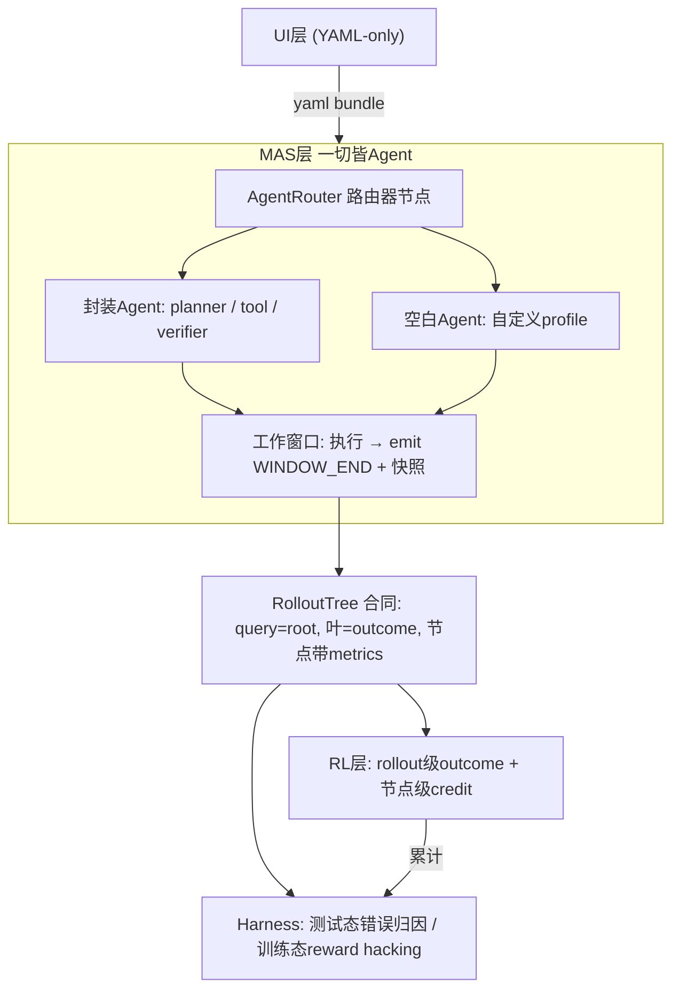
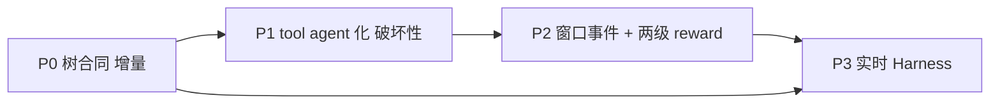

# new_framework 设计整理与最优架构

日期：2026-09-17

源构思：[new_framework.md](./new_framework.md)（原文不改）。本文将其结构化，并结合现有代码（`mas/workflow/`、`rl/hooks/`、`science_infra/control/`、`webui/`、`mas/MAS_structagent/epc_aw/`）给出**最优架构**与**文件级修改清单**。

对照文档：[TECHNICAL_FRAMEWORK.md](./TECHNICAL_FRAMEWORK.md)（现状权威）、[ROLLOUT_SAMPLING.md](./ROLLOUT_SAMPLING.md)、[BRANCH_SITE_DESIGN.md](./BRANCH_SITE_DESIGN.md)、[LAYER_LAYOUT.md](./LAYER_LAYOUT.md)、[CONTROL_UI.md](./CONTROL_UI.md)。

---

## 0. 一句话定位

`new_framework.md` 不是推翻重来，而是**把仓库已分别趟出的三条线收编进统一心智模型**：

1. **一切皆 agent（带工作窗口）** —— 统一通信与训练单元；
2. **branch = 工作窗口边界 + 指标 gate** —— 对现有 `sampling.sites` 的语义正名而非推翻；
3. **RolloutTree 为一等跨层合同** —— 让两级 reward、实时 Harness、树可视化三个欠账有共同地基。




---


## 1. new_framework.md 结构化整理

原文按层整理如下（每条附现状对照）。

### 1.1 UI 层：YAML-only，完全脱离

**设计**：UI 与下三层只通过 YAML 交互。

**现状**：✅ 基本已落地。`experiments/<id>/{llm,workflow,rl,harness}.yaml` + `PUT /api/experiments/{id}/{section}` 就是这个形态；Control 只发命令、写 YAML、启停进程，不持有 LangGraph 对象（[TECHNICAL_FRAMEWORK.md](./TECHNICAL_FRAMEWORK.md) §3.4）。

**新框架真正要改的**是 YAML 的**内容模型**：`tools:` 与 `agents[].tools` 失去意义（tool 变 agent）；`Rollout Sampling` 小窗轨迹推导中 `tool` 节点改写为 tool-agent 窗口节点；新增 **RolloutTree 可视化页**（现 UI 六页所无）。

### 1.2 MAS 层：三个核心决策


#### 决策 A：tool 全面 agent 化（"MAS 中不再出现 tool"）

动机：`wikipedia`、`google`、`web_search`、`python_coder`、思考这五个工具**本身也要调 LLM 做文本处理与分析**。现状是双轨制：


| 现状              | 代码落点                                                                                                                                        | 问题                                      |
| --------------- | ------------------------------------------------------------------------------------------------------------------------------------------- | --------------------------------------- |
| 轻量 tool：纯函数     | [mas/tools/langchain_tools.py](../mas/tools/langchain_tools.py)（`web_search` / `wikipedia_search` / `execute_python` 三个 `@tool`）            | 无 LLM 参与，能力弱                            |
| 重型 tool：内嵌 LLM  | [mas/MAS_structagent/epc_aw/tools/python_coder/tool.py](../mas/MAS_structagent/epc_aw/tools/python_coder/tool.py)（`create_llm_engine` 生成代码） | 是"披着 tool 皮的 agent"，但仍走 `tool_calls` 协议 |
| PEV 里的 executor | [mas/MAS_structagent/epc_aw/models/executor.py](../mas/MAS_structagent/epc_aw/models/executor.py)                                           | 持有 toolbox，本质是 tool 集合的代理               |


新设计：**每个 tool 是一个封装 agent，有自己的输入/输出契约**。收益：

1. **通信协议简化**——"Agent 之间的通信就是 Agent 的输入输出"，不再有 `tool_calls`/`ToolMessage` 与 agent-message 双轨协议；
2. **可训练单元统一**——tool-agent 也可挂 `trainable`（LLM-in-tool 可被 RL 优化）；
3. **与 EPC-AW 合流**——`epc_aw/solver.py` 的 Planner/Executor/Diagnoser 本来就是"每角色一个 LLM engine"，agent 化后两套实现有了共同抽象。


#### 决策 B：两类 agent + agent 路由器

```
Planner 输出 → agent 路由 → 从 tool-agent 集合选一个 → 执行 → 输出
```

新原语，两类：

1. **封装 agent**：planner / tool-agent / verifier，开箱即用；
2. **空白 agent**：自定义 profile（system prompt + skills + memory 策略）。

**Agent 路由器**两层含义：功能路由（planner 输出决定走 wikipedia-agent 还是 python-coder-agent）+ 多专家路由（多个同功能不同 profile 的 agent，如多个打分评估 agent，路由器做选择）。

现状：`topology: graph` 边是静态声明的（`EdgeSpec` route/message/feedback），无运行时动态选择。路由器本质是把 hub 的 `react_loop`（LLM 发 `tool_calls` → compiler 执行）**显式化为一个可配置的图节点**。路由决策点本身成为可观测、可分支的"工作窗口边界"。

#### 决策 C：两层 memory

- **MAS 层 memory**：默认记历史日志（对应 `memory.agent: messages` 全局面）；
- **agent 层 memory**：默认空，用户可加（对应 `AgentNodeSpec.memory_scope`，字段已有、语义未展开）。


### 1.3 训练状态：branch = agent 工作窗口，注意这里是可以在ui中选择对应的agent的，不是固定的

原文先对比官方 ARPO vs 当前 MAS（token list + 同 worker vs messages + Daemon 二波），然后给出**关键裁决**：

> 我建议仍然基于 ARPO 的逻辑来，灵活性通过下面的设置来实现

即：**不追 vLLM 同 worker 的 token-list 形态**，保持 messages + Store/Runner 二波架构，但把分支点语义化：

> 每个agent看成是有工作窗口的。rollout 就是 agent 执行结束后、要输入下一个 agent 前。

这把现有 `BranchSite.anchor.kind` 的五种值**收敛到统一心智模型：agent 工作窗口边界**：


| 现有 anchor.kind     | 新语义                                 |
| ------------------ | ----------------------------------- |
| `after_agent_turn` | agent 工作窗口结束                        |
| `after_tool`       | tool-agent 工作窗口结束（agent 化后与上一行完全同构） |
| `after_verifier`   | verifier-agent 工作窗口结束               |
| `on_edge`          | 窗口间路由边界                             |
| `on_token`         | 窗口内更细粒度（暂不做，现状也是合同级降级）              |


执行形态取舍判断链（原文）：

- **vLLM batch（token list）**：GPU 消耗增加 + batch 内等待，适合路径高度相似（执行时间相近）的 MAS；
- **MAS 入池 + rollout worker 动态分配**：GPU 不增量，但吞吐受 worker 数限制；
- **结论**：沿用 Store enqueue + `expand_in_runner` 路线；"路径相似度"判据值得进 `MASSpec` 作为采样策略选择依据。


### 1.4 MAS→RL 合同：RolloutTree

原文**最具新增价值**的部分：

```
每个 query = 树的 root
branch rollout = 树上分支路径
叶子 = outcome（root→leaf 完整执行路径的最终输出）
节点携带状态（熵、是否执行成功）
```

现状是**隐式、散装**的：`parent_id`/`depth`/`role` 散在 `ForkPlan.meta` 与 Daemon `non_tensor`（`role`/`resume_boundary`/`verdict_list`）里；`.local_expansion/*.json` 是平铺 plan 列表；RAE 的 `apply_dead_end_backprop_verdicts` 在算树形 credit，但"树"从未显式建模。

显式 RolloutTree 的收益：

1. 两级 reward 有了挂靠物（§1.5）；
2. Harness 有了监控对象（reward hacking = 看"树上节点状态"）；
3. UI 可视化有了数据源；
4. **Collect/Train 假绿问题被结构性缓解**——Collect 产出单链树，语义自洽。


### 1.5 RL 层：两级 reward


| 级别                     | 对象     | 计算                                       |
| ---------------------- | ------ | ---------------------------------------- |
| rollout level（树分支级）    | 完整执行路径 | 叶子 outcome 奖励整条 root→leaf 路径             |
| credit assignment（节点级） | 单个节点   | 节点自身状态，或同 branch 上截 k 个历史节点累积计算（"需额外设计"） |


现状：rollout 级 ≈ `rl/rewards/outcome.py` + GRPO 组基线（已有）；节点级 ≈ RAE verdict（`adjudicate_action_group` / `apply_dead_end_backprop_verdicts`）的半成品，只覆盖失败回溯，需泛化。

### 1.6 Harness 层：双态 + 实时

- **测试态**：作用于 MAS——实时接收 rollout 做错误归因（现 `HARNESS.diagnose` 是事后批处理）；
- **训练态**：作用于 RL——监控 reward hacking（看 rollout tree 节点状态）、loss 等；
- **数据通道**：RL 层实时向 Harness 传输累计 `<rollout, reward, loss>`。

现状缺口最大的一层：`log_error` / `loss_volatility` 是离线扫描；"实时"要求把拉模式改为事件流，依赖 §1.4 树合同先行。

### 1.7 现状差距总表


| 新框架要素             | 现状                            | 差距                                                        |
| ----------------- | ----------------------------- | --------------------------------------------------------- |
| UI YAML-only      | ✅ 已落地                         | 仅 YAML 内容模型要随 agent 化改                                    |
| tool → tool-agent | 🟡 双轨（纯函数 tool + LLM-in-tool） | `AgentNodeSpec` 容纳 tool-agent；compiler `tool_call` 边废弃或映射 |
| agent 路由器         | ❌ 无（hub `react_loop` 隐式路由）    | 新原语：路由节点 spec + 运行时选择                                     |
| 两层 memory         | 🟡 字段已有语义未展开                  | 文档化 + agent profile 扩展                                    |
| branch = 工作窗口     | 🟡 五种 anchor.kind 已覆盖         | 语义收敛 + `after_tool` 同构化                                   |
| RolloutTree 合同    | ❌ 隐式                          | 新 Pydantic 合同 + expansion 升级 + Daemon 写树                  |
| 两级 reward         | 🟡 outcome ✅ + RAE verdict 半个 | 节点级 credit 泛化、k-hop 累积                                    |
| Harness 双态实时      | ❌ 离线批处理                       | 事件流通道（依赖树合同）                                              |
| rollout tree 可视化  | ❌ 无                           | UI 新页（依赖树合同）                                              |


---


## 2. 最优架构设计（各部分详细实现）


### 2.0 总原则

1. **层独立不破坏**：`mas/workflow/` 依旧禁止 import AGL/VERL/Ray；Harness 只读合同；RL 消费 `TrainSignal`/`RolloutTree`。
2. **合同先行**：先冻结 `RolloutTree` + `WINDOW_END` 事件两个 Pydantic 合同，其余一切挂靠其上。
3. **糖而非删**：旧 `tools:` 字段、`after_tool` anchor、平铺 expansion 读法全部保留为向后兼容糖，编译/读取期映射到新模型。
4. **AGL 黑盒不动**：训练侧仍走 `TirAgentModeDaemon` 子类 + Store enqueue；窗口快照与续跑仍用可恢复 messages。

### 2.0.1 目标合同与当前实现边界

本节以后描述的是**目标模型**，不能仅凭 Pydantic 字段或 UI 候选存在就宣称运行时已经实现。当前最准确的状态是：

```text
通用 Sampling 合同与部分执行骨架
        +
ARPO Tool Result Window 纵向切片
```

| 能力 | 目标合同 | 当前实现 |
| --- | --- | --- |
| Tool Result Window | Tool-agent 工作窗口的一种 | 已有 messages Snapshot、entropy Gate 和 ARPO 二波 enqueue；待正式 Adapter 收口与服务器验收 |
| 普通 Agent Window | `agent_complete` | 未实现；旧 `after_agent_turn(hub)` 仅为 Tool Event 兼容输入 |
| Router Decision Window | `router_decision` | 仅有 Router schema/目标设计，没有可恢复运行窗口 |
| Verifier Window | `verification_complete` | Gate/credit 部分存在，没有完整 Window/Snapshot/Resume 闭环 |
| Edge Window | `on_edge` selector | 目前主要是声明 |
| Token Window | window 内细粒度前缀 | 当前 messages 执行路径不支持 |
| RolloutTree | run 级事实投影 | 基础合同与计划树存在，run 隔离和完整 outcome 回填未完成 |

Sampling 后续实施不再把所有目标 Window 同时开放，而采用：

```text
Sampling Core
→ Strategy Adapter
→ Adapter capability 驱动 UI
→ 运行事实进入 Rollout Tree
```

当前权威实施路线见 [Sampling 框架实施总览](../webui/plan/Sampling框架实施总览.md)：

1. [S0 窗口合同与适配器核心](../webui/plan/Sampling框架第一阶段-窗口合同与适配器核心.md)
2. [S1 ARPO Tool Result Window 适配](../webui/plan/Sampling框架第二阶段-ARPO工具窗口适配.md)
3. [S2 适配器驱动画布交互](../webui/plan/Sampling框架第三阶段-适配器驱动画布交互.md)

本轮到 ARPO 为止。AEPO、RAE、IGPO、GIGPO 作为后续独立 Adapter 实施；Rollout Tree 在 ARPO 纵向闭环之后建设。


### 2.1 统一 Agent 模型（schema 0.3）

扩展 [mas/workflow/spec.py](../mas/workflow/spec.py) 的 `AgentNodeSpec`：

```python
class AgentNodeSpec(BaseModel):
    id: str
    kind: Literal["hub", "planner", "tool", "verifier", "blank"] = "blank"
    role: str = "agent"                    # 保留，作为 kind 的细化标签
    skills: List[str] = []
    tools: List[str] = []                  # 仅 kind=hub/planner 有意义：可路由到的 tool-agent id
    memory_scope: str = "agent"            # agent 层 memory 策略（默认空，用户可加）
    system_prompt: str = ""
    model: str = "inherit"
    trainable: bool = True                 # tool-agent 也可训练（LLM-in-tool 可被 RL 优化）
    profile: Dict[str, Any] = {}           # 空白 agent 的自定义 profile（prompt/skills/memory 策略）
    meta: Dict[str, Any] = {}
```

规则：

- **tool 作为 agent 注册进** `agents[]`：`kind: tool` 的节点即原 tool；`epc_aw/tools/python_coder` 这类 LLM-in-tool 成为 tool-agent 的标准实现来源（迁移 `MAS_structagent/epc_aw` 时无需改内部逻辑，只包一层 agent 契约）。
- **顶层** `tools:` **字段保留为糖**：编译期展开为对 `kind: tool` 节点的引用（等价于隐式声明 tool-agent + `tool_call` 边），保证旧 YAML 不破坏。
- **空白 agent**：`kind: blank` + `profile`（system prompt + skills + memory 策略），即原文"可以自己定义 profile"。
- **两层 memory**：MAS 层 = `MemorySpec`（全局面，记历史日志，现状）；agent 层 = `memory_scope` + `profile.memory`（默认空，用户可加）。


### 2.2 AgentRouter

新 `RouterSpec`（进 `MASSpec`）：

```python
class RouterSpec(BaseModel):
    id: str                                # 路由器节点 id（图上一等节点）
    candidates: List[str]                  # 候选 agent id 集合（tool-agent 集合或多专家集合）
    strategy: Literal["llm_choice", "score", "round_robin"] = "llm_choice"
    scorer: Optional[str] = None           # strategy=score 时的打分 agent id
    output_contract: str = "json"         # planner 输出的路由决策格式
```

运行语义：

1. **llm_choice**：上游 agent（通常是 planner）输出结构化路由决策（`{"next": "wikipedia_agent", "args": {...}}`），路由器据此从 `candidates` 选一个；
2. **score**：每个候选 agent 对输入打分（多专家场景：多个同功能 profile，如多个评估 agent），scorer 汇总后选最高；
3. **round_robin**：负载均衡兜底。

**路由决策点本身是可观测、可分支的窗口边界**——`WINDOW_END(router_id)` 事件携带候选集合与选择结果，`BranchSite` 可在路由点声明 gate（对"模型选了哪条路"的熵做分叉）。

### 2.3 工作窗口事件协议

Runtime（GraphRunner / TirAgent）在每个 agent 节点完成时：

```python
class WindowEndEvent(BaseModel):
    kind: Literal["window_end"] = "window_end"
    agent_id: str
    turn: int
    output_digest: str                     # 输出摘要（hash）
    metrics: Dict[str, Any]                # {h: 代理熵, ok: bool, tool: name, ...}
    snapshot_ref: Optional[str]            # 指向 Archive Snapshot（可恢复前缀）
```

并与现有语义收敛：

- `after_tool` ⇒ `after_agent_turn(tool-agent)` 的**别名**（编译期归一化，旧 YAML 不动）；
- `plan_forks_from_raw` 从「`site.anchor.kind` 自匹配」升级为**真实事件匹配**（消费 `WindowEndEvent` 流），顺手消除 [ROLLOUT_SAMPLING_UI_TEST.md](./ROLLOUT_SAMPLING_UI_TEST.md) 标注的自匹配旧债；
- `tir_agent.call_tools` 的 `branch_messages`（首次 tool 写回快照）升级为通用"窗口快照"：每个窗口边界都存（受 `ArchiveSpec.window` 控制保留窗口），不再只锚定第一次 tool。


### 2.4 RolloutTree 合同（P0 核心）

新 Pydantic（[mas/workflow/contracts.py](../mas/workflow/contracts.py)）：

```python
class RolloutTreeNode(BaseModel):
    node_id: str                           # rollout_id 或合成 id
    parent_id: Optional[str]               # None = root（query 级）
    depth: int = 0
    role: str = "root"                    # root | child | probe
    agent_path: List[str]                 # root→该节点经过的 agent 序列
    boundary_snapshot_ref: Optional[str]   # 窗口快照 → Archive
    metrics: Dict[str, Any]               # {h_root, h_tool, consecutive_high, event_kind, ...}
    reward: Optional[float] = None        # 节点级 credit（§2.5）
    verdict: Optional[str] = None         # RAE validate/invalidate/abstain

class RolloutTree(BaseModel):
    tree_id: str                           # data_id + group
    query: str
    nodes: List[RolloutTreeNode]
    outcomes: Dict[str, Any]              # leaf_id → 最终输出/reward

    def leaves(self) -> List[str]: ...
    def path_to_root(self, node_id: str) -> List[str]: ...
```

写入点与兼容：

- `Daemon._enqueue_from_runner_expansions`（[rl/hooks/daemon.py](../rl/hooks/daemon.py)）materialize plan 时**同时写树**（吸收现散在 `ForkPlan.meta` 与 `non_tensor` 的 `role`/`resume_boundary`/`verdict_list` 字段）；
- `mas/.local_expansion/*.json` 升级为 `{tree: RolloutTree, plans: [...]}`，旧平铺读法（`branch_rollout_ui_test.py` 的 `scan_expansions`）向后兼容；
- Collect 产出的就是**单链树**（root→唯一 leaf），Collect/Train 假绿问题被结构性缓解。


### 2.5 两级 reward


| 级别        | 挂靠                       | 实现                                        |
| --------- | ------------------------ | ----------------------------------------- |
| rollout 级 | leaf outcome             | **不动**：`rl/rewards/outcome.py` + GRPO 组基线 |
| 节点级       | `RolloutTreeNode.reward` | 新 `CreditAssignmentSpec`                  |


```python
class CreditAssignmentSpec(BaseModel):
    level: Literal["rollout", "node"] = "node"
    method: Literal["node_state", "k_hop_cumulative"] = "node_state"
    k_hop: int = 3                         # method=k_hop_cumulative 时的窗口
    inherit_from_site: bool = True         # BranchSiteReward 降级为节点默认策略
```

- `BranchSiteReward`（site 级）**降级为节点 reward 的默认策略**，RAE verdict（`adjudicate_action_group` / `apply_dead_end_backprop_verdicts`）**并入同一挂靠点**（`RolloutTreeNode.verdict` / `.reward`），避免双重 credit 通道；
- `k_hop_cumulative`：同 branch 上截取最近 k 个历史节点累积计算（原文"需额外设计"的具体化——先用等权和，v2 再学权重）。


### 2.6 双态 Harness（实时）

基于 `RolloutTreeEvent` 流（复用 Control 的 SSE 通道 `/api/events`）：

```python
class RolloutTreeEvent(BaseModel):
    event: Literal["node_added", "outcome", "reward", "loss"]
    tree_id: str
    node_id: Optional[str]
    payload: Dict[str, Any]               # metrics / reward / loss 值
```

- **测试态（作用于 MAS）**：实时接收 rollout → 错误归因。现 `HARNESS.diagnose`（拉模式、事后批处理）改为**订阅推模式**；`log_error` 类 Diagnoser 逐节点消费而非扫描全量；
- **训练态（作用于 RL）**：监控 reward hacking——看树上节点 metrics 序列（如某节点 reward 持续高于同层兄弟而 outcome 不变）；`loss_volatility` 消费 RL 层实时回传的累计 `<rollout, reward, loss>`；
- 层独立保持：Harness 只依赖 `RolloutTree(Event)` 合同，**不 import TirAgent**。


### 2.7 UI

- 画布节点类型从 Agent/Tool 两类**收敛为单一 Agent 节点**（`kind` 作为标签）；
- `RolloutSamplingPanel` 轨迹条：tool 子节点升级为一级 agent 节点（`buildTrajectoryGraph` 的 `tool` kind 保留为渲染细节）；
- 新增 **RolloutTree 可视化页**：按 query（`tree_id`）查树、看节点 metrics / verdict / reward，复用 `GET /api/experiments/{id}` artifacts 读 `.local_expansion` 树。

---


## 3. 现有框架修改清单（文件级 + 分阶段）


### 3.0 阶段总览




依赖逻辑：P0 是根（reward/Harness/可视化都挂树上）；P1 与 P0 并行可开（spec/compiler 独立）；P2 依赖 P1 的窗口语义；P3 只依赖 P0。

### 3.1 P0 — RolloutTree 合同（增量，先做）


| 文件                                                          | 改动                                                                                                                 | 破坏性                                      |
| ----------------------------------------------------------- | ------------------------------------------------------------------------------------------------------------------ | ---------------------------------------- |
| [mas/workflow/contracts.py](../mas/workflow/contracts.py)   | 新增 `RolloutTreeNode` / `RolloutTree` / `RolloutTreeEvent`（§2.4/§2.6 定义）                                            | 无（纯新增）                                   |
| [rl/hooks/daemon.py](../rl/hooks/daemon.py)                 | `_enqueue_from_runner_expansions` materialize 时构建树；`_rollout_meta` 中 `role`/`resume_boundary`/`verdict_list` 同步进节点 | 无（附加写）                                   |
| [mas/workflow/active_set.py](../mas/workflow/active_set.py) | `dump_local_expansion` 输出 `{tree, plans}` 双格式（旧平铺读法保留）                                                             | 低（读方兼容已验证：`scan_expansions` 读 `plans` 键） |
| [webui/](../webui/)                                         | 新增 RolloutTree 页：`GET /api/experiments/{id}` → artifacts → `.local_expansion` 树渲染（React Flow 子图）                   | 无（新页）                                    |
| 单测                                                          | `mas/tests/test_rollout_tree.py`：树构建（root/child/probe、leaf、path_to_root）；daemon 写树 round-trip                      | —                                        |


验收：跑一次 `branch-ui-test --train` 后 `.local_expansion` 含 `tree` 键；UI 树页能画出来。

### 3.2 P1 — tool agent 化（破坏性最大）


| 文件                                                            | 改动                                                                                                                                                                      | 破坏性                                                                   |
| ------------------------------------------------------------- | ----------------------------------------------------------------------------------------------------------------------------------------------------------------------- | --------------------------------------------------------------------- |
| [mas/workflow/spec.py](../mas/workflow/spec.py)               | `AgentNodeSpec` 加 `kind` + `profile`（§2.1）；新增 `RouterSpec`；`schema_version → 0.3`；顶层 `tools:` 标记 deprecated（糖）                                                          | **高**（schema 变更；`extra: forbid` 需同步）                                  |
| [mas/workflow/compiler.py](../mas/workflow/compiler.py)       | ① `KNOWN_TOOLS` 硬编码 → agent 注册表（`kind: tool` 节点集合）；② `tool_call` 边 → 编译期映射为 agent-message 边（保留边类型作为糖，只告警不报错）；③ 路由器节点编译：`route_out` 扩展为动态候选解析                            | **高**（`tools_for` 语义反转：从"agent 拥有哪些 tool"变为"agent 可路由到哪些 tool-agent"） |
| [mas/tir_agent.py](../mas/tir_agent.py)                       | `call_tools` → tool-agent 调用（输入输出契约替代 `tool_calls`/`ToolMessage` 协议，内部对 AGL 仍可序列化为 tool 协议——**适配器模式**）；`branch_messages` 首次 tool 快照 → 通用窗口快照（受 `ArchiveSpec.window` 控制） | **高**（训练路径物理基础；见风险 R1）                                                |
| [mas/lit_tir_agent.py](../mas/lit_tir_agent.py)               | `dump_resume_with_archive` 的 dump 条件从 `raw.branch_messages` 改为窗口快照列表                                                                                                    | 中                                                                     |
| [mas/workflow/runtime.py](../mas/workflow/runtime.py)         | `run_episode` 的 `tools_override` → agent 子集 override；mock 路径同步                                                                                                          | 中                                                                     |
| [mas/tools/](../mas/tools/)                                   | 三个纯函数 tool 包一层 agent 契约（保留原函数导出）                                                                                                                                        | 低                                                                     |
| [mas/MAS_structagent/epc_aw/](../mas/MAS_structagent/epc_aw/) | `python_coder` 等 LLM-in-tool 迁移为标准 tool-agent（包 agent 契约，内部 `create_llm_engine` 不动）                                                                                     | 低（只加壳）                                                                |
| [webui/src/features/graph/](../webui/src/features/graph/)     | 画布节点类型收敛单一 Agent（`kind` 标签）；palette 去 Tool 类                                                                                                                            | 中                                                                     |
| 单测                                                            | compiler 0.3 round-trip（旧 YAML 糖展开正确）；tool-agent 调用 round-trip；`hub_react`/PEV 两种 topology 回归                                                                           | —                                                                     |


验收：旧 `experiments/*/workflow.yaml` 不改一字仍可 Collect + Train；新 YAML 可声明 `kind: tool` agent 与路由器。

### 3.3 P2 — 工作窗口事件 + 两级 reward


| 文件                                                                                 | 改动                                                                                              | 破坏性                  |
| ---------------------------------------------------------------------------------- | ----------------------------------------------------------------------------------------------- | -------------------- |
| [mas/workflow/contracts.py](../mas/workflow/contracts.py)                          | 新增 `WindowEndEvent`（§2.3）                                                                       | 无                    |
| [mas/tir_agent.py](../mas/tir_agent.py) / [runtime.py](../mas/workflow/runtime.py) | 每个 agent 节点完成时 emit `WindowEndEvent` + 快照                                                       | 中（事件流管线）             |
| [mas/workflow/gates.py](../mas/workflow/gates.py)                                  | `site_matches_event` 消费真实事件（`window_end` 匹配逻辑）；`after_tool` 编译期归一化为 `after_agent_turn(tool)` 别名 | 中（`plan_forks` 语义升级） |
| [mas/workflow/active_set.py](../mas/workflow/active_set.py)                        | `plan_forks_from_raw` 从自匹配 → 事件匹配（`ROLLOUT_SAMPLING_UI_TEST.md` 旧债消除）                           | 中（测试同步改）             |
| [rl/loss.py](../rl/loss.py)                                                        | 新增 `CreditAssignmentSpec`（§2.5）                                                                 | 无                    |
| [rl/hooks/rae_advantage.py](../rl/hooks/rae_advantage.py)                          | verdict 写回 `RolloutTreeNode.verdict/reward`；`BranchSiteReward` 降级为节点默认策略                        | 中                    |
| 单测                                                                                 | `window_end` 事件匹配回归（替换自匹配断言）；`k_hop_cumulative` credit；RAE verdict 挂树                           | —                    |


验收：`traj-test` + `TestPlanForksTrajectorySites` 全绿（断言改为事件匹配后）；expansion 树节点带 `reward`/`verdict`。

### 3.4 P3 — 双态实时 Harness


| 文件                                                              | 改动                                                                                            | 破坏性 |
| --------------------------------------------------------------- | --------------------------------------------------------------------------------------------- | --- |
| [science_infra/control/app.py](../science_infra/control/app.py) | SSE `/api/events` 增发 `RolloutTreeEvent`（Daemon → Control 回传通道，走子进程 stdout JSONL 或轻量 callback） | 中   |
| [mas/workflow/harness.py](../mas/workflow/harness.py)           | Diagnoser 增加订阅式 `consume(event)`；`log_error` 改流式                                              | 中   |
| rl 侧                                                            | 训练 loop 增量回传累计 `<rollout, reward, loss>`（`RolloutTreeEvent{event: loss}`）                     | 中   |
| 新插件                                                             | `reward_hacking_monitor`：树上节点 metrics/reward 序列异常检测（同层兄弟对比）                                   | 低   |
| 单测                                                              | 事件流端到端：daemon → control SSE → Diagnoser 消费                                                    | —   |


验收：训练中 UI 能实时看到树节点新增与 reward；`diagnose.json` 由流式聚合生成。

### 3.5 风险专节


| #   | 风险                                                                                                                                 | 缓解                                                                                    |
| --- | ---------------------------------------------------------------------------------------------------------------------------------- | ------------------------------------------------------------------------------------- |
| R1  | `tool_calls` **协议是 ARPO 熵估计的物理基础**：`h_tool` 依赖"首次 tool 后"这个时间点；agent 化后 `after_tool` 屏障变成 agent 间消息边界，熵代理与 `resume_boundary` 都要重定义 | P1 用**适配器模式**：内部对 AGL 仍序列化为 tool 协议，窗口快照机制双写一个版本；熵估计改为按 `WindowEndEvent.metrics` 计算   |
| R2  | **vLLM 同 worker 吞吐优势放弃**是有代价的（原文自认"时间较长"）                                                                                          | 判据进 `MASSpec`（`sampling.executor_strategy: store_pool                                 |
| R3  | **双重 credit 通道**：`BranchSiteReward` 与节点级 credit 并存会语义冲突                                                                            | P2 统一挂靠 `RolloutTreeNode`，site reward = 默认策略（§2.5 已定）                                 |
| R4  | **Collect/Train 假绿**：P0 后 Collect 产出单链树，语义自洽，但 UI 要明示"树≠branch"                                                                    | 树页标注 root-only 单链；沿用 [BRANCH_ROLLOUT_UI_TEST.md](./BRANCH_ROLLOUT_UI_TEST.md) 的 L0 原则 |
| R5  | **路由器与 AGL 训练路径交互**：动态选择使 batch 内轨迹形状发散，可能影响 GRPO 组内可比性                                                                            | 路由决策进 `agent_path`，组内按 `agent_path` 分桶算基线（v1）；`round_robin` 兜底保证形状一致                  |
| R6  | **层独立回归**：改 `tir_agent.py` 时容易把 AGL import 泄进 `workflow/`                                                                          | `./run.sh smoke` 的 `check_workflow_deps` AST 扫描继续把关                                   |


### 3.6 阶段与现有验收命令的对应


| 阶段  | 完成判据（现有命令）                                                                        |
| --- | --------------------------------------------------------------------------------- |
| P0  | `./run.sh branch-ui-test --train` → expansion 含 `tree`；新 `test_rollout_tree.py` 绿 |
| P1  | `./run.sh smoke` + `./run.sh ui-test` 全绿（旧 YAML 不改仍过）；compiler 0.3 round-trip 单测绿 |
| P2  | `./run.sh traj-test` 绿（事件匹配版）；`mas.tests.*rae*` 绿（verdict 挂树）                     |
| P3  | SSE 事件流端到端单测绿；UI 树页实时更新（手动验收）                                                     |


---


## 4. 结论

`new_framework.md` 的本质是**把现有仓库三条成熟度不同的线（EPC-AW agent 化、BranchSite 采样、RAE 树形 credit）统一进"一切皆带工作窗口的 agent"心智模型**。最优架构 = 现有四层不动 + 三个新合同（`AgentNodeSpec(kind)`/`RouterSpec`、`WindowEndEvent`、`RolloutTree`）+ 一个降级（`BranchSiteReward` → 节点默认策略）。

迁移路径对现有代码最友好：**P0 纯增量（树合同）→ P1 破坏性收敛（tool agent 化，糖保兼容）→ P2 语义升级（事件匹配 + 两级 reward）→ P3 实时化（Harness 双态）**。P0/P1 可并行启动；全部完成后，[ROLLOUT_SAMPLING_UI_TEST.md](./ROLLOUT_SAMPLING_UI_TEST.md) 标注的"自匹配 vs 真实事件"旧债与 Collect/Train 假绿问题被结构性消除。

> **函数级实施方案**（插入点、代码骨架、测试与验收命令）见 [NEW_FRAMEWORK_MIGRATION_PLAN.md](./NEW_FRAMEWORK_MIGRATION_PLAN.md)。