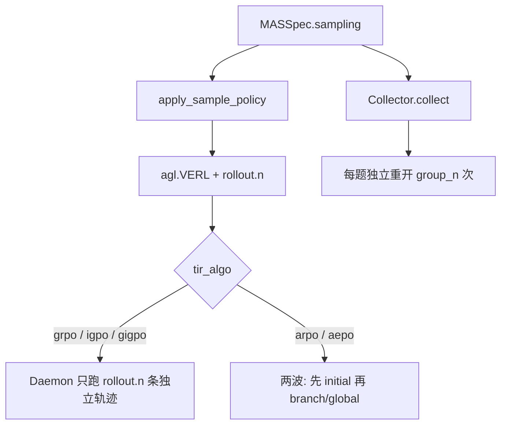
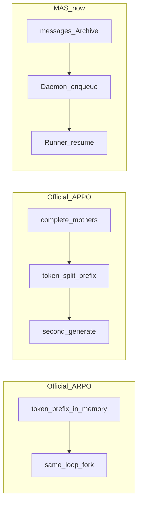
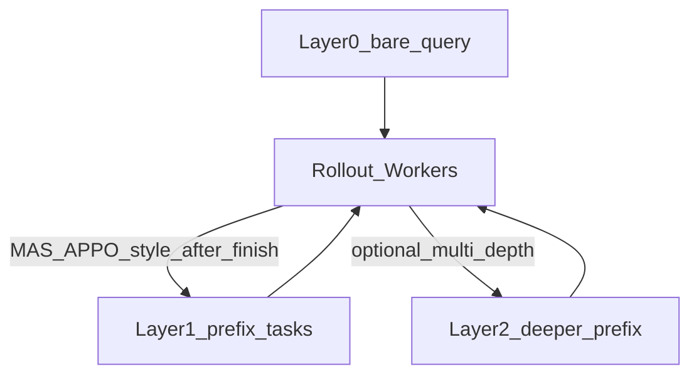
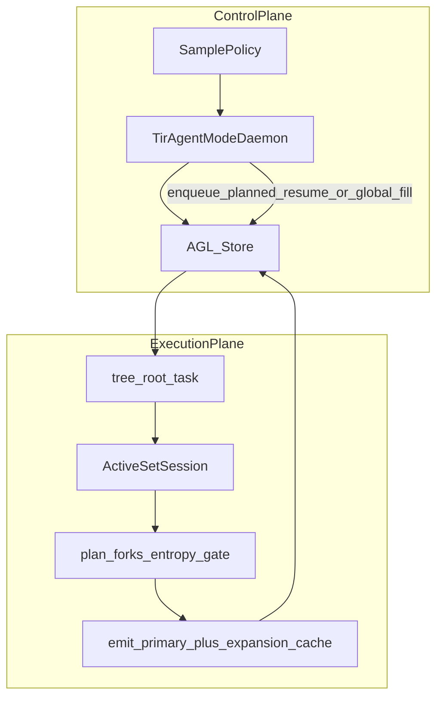

# 本仓库 Rollout / Branch 采样说明

日期：2026-09-15（§8 任务池心智模型增补：2026-09-16）

本文讲 **MAS_Science_Infra 当前实现**，并对照官方 ARPO/APPO 的 prefix / 调度形态。官方采样细节另见 [SAMPLING_ARPO_APPO.md](SAMPLING_ARPO_APPO.md)；层边界见 [LAYER_LAYOUT.md](LAYER_LAYOUT.md)。「多层任务池」抽象与纠偏见 **§8**。端到端 ARPO 训练测试步骤与路径图见 [ARPO_TRAIN_TEST.md](ARPO_TRAIN_TEST.md)。UI 声明多站点分叉与 RAE 见 [BRANCH_SITE_DESIGN.md](BRANCH_SITE_DESIGN.md)。

**P1 ready-batch 能力边界：** Runner 内 `ActiveSetScheduler` / 并行 tool + Daemon 增量 enqueue；LLM 为伪 batch（多 prompt 并发），非官方 vLLM Worker 共置 ActiveSet。`on_token` / `token_prefix` 合同与 UI 已开，无 token 引擎时 resume 降级为 messages。

**Control UI：** MAS 页 **Rollout Sampling** 小窗是 `SamplePolicy.sites` 的轨迹可视化（非第二条配置源）；见 [BRANCH_SITE_DESIGN.md](BRANCH_SITE_DESIGN.md) §3、[BRANCH_ROLLOUT_UI_TEST.md](BRANCH_ROLLOUT_UI_TEST.md)、验收小窗 [ROLLOUT_SAMPLING_UI_TEST.md](ROLLOUT_SAMPLING_UI_TEST.md)（`./run.sh traj-test`）。

---


## 0. 一句话

- **独立 rollout**：同一道题从裸 prompt 再开一条完整轨迹。
- **Branch rollout**：在某条已跑轨迹的**中间屏障**（当前实现：第一次 tool 返回之后）拷贝对话前缀，换随机性只采样**后面路径**。
- `beam_size`：从一个 snapshot **最多再开几条后续轨迹的上限**。不是 HuggingFace / vLLM 的 decode beam search 宽度。

物理机制一律是：

> **可恢复前缀（LangGraph** `messages` **Snapshot）+ 继续采样**

不是 OS 进程 fork，也不是 vLLM worker 内拷贝 token list。

---


## 1. 术语


| 词                       | 含义                                       | 代码落点                                                     |
| ----------------------- | ---------------------------------------- | -------------------------------------------------------- |
| `group_n` / `rollout.n` | 每题最终希望凑满的完整轨迹条数（GRPO 组大小）                | `SamplePolicy.group_n`；训练侧 `actor_rollout_ref.rollout.n` |
| `initial_rollouts`      | ARPO 第一波从裸 prompt 先跑几条                   | `algorithm.tir.initial_rollouts`，默认 2                    |
| `beam_size`             | 从一个中间 snapshot 最多再 enqueue 几条 **branch** | `algorithm.tir.beam_size`，默认 2                           |
| Snapshot                | 可恢复状态：主要是 `messages` + 熵元数据              | `workflow.contracts.Snapshot`                            |
| BranchPoint             | `archive_id` + `snapshot_id` + 父 rollout | `workflow.contracts.BranchPoint`                         |
| `resume_messages`       | 塞进新任务的对话前缀，子轨迹从这里继续                      | Daemon enqueue；`TirAgent._parse_resume_messages`         |
| `data_id`               | 同一题的组标识；组内多条轨迹进同一 GRPO 组                 | parquet 行 / AGL sample                                   |


`SamplePolicy`（MAS 声明，Collect 不完全执行树分支）：

```76:86:mas/workflow/contracts.py
class SamplePolicy(BaseModel):
    """MAS-declared multi-sampling policy (executed by RL daemon / Collector)."""

    mode: str = "grpo_n"  # grpo_n | arpo | aepo | appo
    group_n: int = 1
    beam_size: int = 1
    initial_rollouts: int = 1
    barriers: List[str] = Field(default_factory=list)
    extra: Dict[str, Any] = Field(default_factory=dict)
```

UI 把 `mode` / `group_n` / `beam_size` 写进 `experiments/<id>/workflow.yaml` 的 `sampling`。训练时 `[apply_sample_policy](../rl/hooks/overlay.py)` 映射到 Hydra：`group_n` → `rollout.n`，`beam_size` → `algorithm.tir.beam_size`。

---


## 2. 两条路径不要混




| 场景                               | 谁执行多采样                                              | 会不会从中间点续写                                |
| -------------------------------- | --------------------------------------------------- | ---------------------------------------- |
| Collect / smoke / mock           | `[Collector.collect](../mas/workflow/collector.py)` | **不会**。`beam_size` 只写在 YAML 里，Collect 忽略 |
| Train + `tir_algo=grpo`          | AGL `train_rollout_n` = `rollout.n`                 | **不会**                                   |
| Train + `tir_algo=arpo` 或 `aepo` | `[TirAgentModeDaemon](../rl/hooks/daemon.py)`       | **会**：第二波 `resume_messages`              |


---


## 3. 独立 rollout 怎么采

同一题 `Q`，从用户问题重新跑完整 ReAct（think → tool → … → `<answer>`）。每条轨迹自己的温度/随机数，**不共享**中间 tool 结果。

### 3.1 Collect

```102:129:mas/workflow/collector.py
    def collect(self, tasks: Iterable[Dict[str, Any]], *, n: Optional[int] = None) -> TrajectoryBatch:
        ...
        if n is not None:
            group_n = max(1, int(n))
        elif policy_n > 1:
            group_n = policy_n
        else:
            group_n = max(1, int(self.n))
        ...
        for task in task_list:
            group_id = str(task.get("id") or task.get("data_id") or uuid4().hex)
            for i in range(group_n):
                sample = dict(task)
                sample["_sample_index"] = i
                sample["_group_id"] = group_id
                traj = self.collect_one(sample)
```

**例子**：1 道 gsm8k，`./run.sh live-api-data` 或 UI Collect `n=2`。

```text
题 Q: "2+3=?"
  traj_0: 从 Q 重开 → 可能调 python → answer 5  reward=1
  traj_1: 从 Q 再开 → 可能不调工具 → answer 5  reward=1
group_id 相同；branch_parent_id 为空；is_branch=false
```

优先级：显式 `collect(..., n=)` > `sampling.group_n`（仅当 >1）> `Collector.n`。

### 3.2 Train GRPO

`agl.VERL` 对每个 batch 样本重复 `rollout.n` 次。Daemon **不**调用 `_enqueue_tree_branches`（仅 `arpo`/`aepo` 才走）。

`experiments/demo/rl.yaml` 里 `rollout_per_gpu: 2` 即 `rollout.n=2`：每题 2 条独立完整轨迹进一组 GRPO。

---


## 4. 中间点多次采样后续路径（Branch）

这是「在中间一个点要多次采样后面路径」的实现。

### 4.1 屏障在哪

当前屏障是 **第一次 tool 返回之后**，不是任意 token。

`[TirAgent.call_tools](../mas/tir_agent.py)` 在第一次拼上 `ToolMessage` 时，把当时的完整 `messages` 存进 `branch_messages`（之后不再改）：

```433:443:mas/tir_agent.py
        new_messages = state["messages"] + tool_messages
        branch = list(state.get("branch_messages") or [])
        if tool_messages and not branch:
            branch = serialize_messages(new_messages)
        return {
            ...
            "branch_messages": branch,
        }
```

训练时 ARPO/AEPO 会把这段前缀 dump 进 Archive：

```140:155:mas/lit_tir_agent.py
        dump_ok = ... or tir_algo in ("arpo", "aepo")
        if dump_ok and not raw.error:
            dumped = dump_resume_with_archive(
                rollout_id,
                {
                    "messages": raw.branch_messages or raw.messages,
                    "h_root": raw.h_root,
                    "h_tool": raw.h_tool,
                    "consecutive_high": raw.consecutive_high,
                },
                archive=arch,
            )
```

`h_root`：第 0 轮 LLM 回复的代理熵；`h_tool`：tool 之后轮次熵的滑动平均。ΔH = `h_tool - h_root`。无 logprobs 时用启发式（有 tool_calls → 1.0，否则 0.3），见 `[estimate_turn_entropy](../rl/hooks/arpo_rollout.py)`。

### 4.2 训练两波（Daemon）

`[TirAgentModeDaemon._async_set_up](../rl/hooks/daemon.py)`：

- ARPO：第一波 `train_rollout_n = min(initial_rollouts, group_n)`（默认 initial=2）
- AEPO：第一波强制 **1** 条探针轨迹

第一波跑完后 `_async_run_until_finished` 再调 `_enqueue_tree_branches`，然后 **再等一轮** 把补采跑完。

核心分配：

```134:207:rl/hooks/daemon.py
            remaining = max(0, n_target - len(rids))
            ...
            parent = rids[0]   # 只用该题已完成的第一条
            resume = load_resume_messages(parent) or {}
            ...
            delta_h = h_tool - h_root
            ...
            do_branch = should_branch(p, tau) and messages
            n_branch = min(branch_budget, beam) if do_branch else 0
            n_global = remaining - n_branch

            for _ in range(n_branch):
                sample["resume_messages"] = messages
                sample["resume_parent_id"] = parent
                sample["resume_from"] = { archive_id, snapshot_id, ... }

            for _ in range(n_global):
                sample.pop("resume_messages", None)   # 从裸 prompt 再开
```

- **branch**：新 rollout 带着父轨迹的 `resume_messages`，从 tool 后继续生成。
- **global**：剩余名额从裸 prompt 重开，用来凑满 `group_n`。

是否分支：

```51:52:rl/hooks/arpo_rollout.py
def should_branch(prob: float, tau: float) -> bool:
    return prob > tau
```

ARPO：`p = alpha + gamma * ΔH`（默认 α=0.5，γ=0.2，τ=`entropy_threshold`=0.15）。  
AEPO：先按 `m = M * σ(β (H_root - H_tool))` 分出「还要多少条 global」，剩下才给 branch；`p` 再乘连续高熵惩罚。

### 4.3 子轨迹如何「只采后面」

1. Daemon 把 `resume_messages` 写进任务。
2. `[LitTirAgent.rollout](../mas/lit_tir_agent.py)` 若只有 `resume_from`，用 `branch_point_to_resume_task_fields` 还原 messages。
3. `[run_episode](../mas/workflow/runtime.py)` → `TirAgent._parse_resume_messages` 把 JSON 对话还原成 LangChain messages。
4. 图从**已有历史**继续 `agent` 节点：下一次 `llm.invoke(messages)` 会看到 system + user + assistant(tool_call) + tool(result)，然后采样**新的** assistant 回复。

父轨迹已经走过的 tool 调用**不会再执行**；子轨迹共享同一份 tool 观察文本，只在此后分叉。

### 4.4 消息流实例

题：`计算 17*19`。`group_n=4`，`initial_rollouts=2`，`beam_size=2`，`tir_algo=arpo`。

**波 1** 两条独立轨迹（都从裸 prompt）：

```text
父轨迹 P (rollout_id=P1):
  user: 计算 17*19
  assistant: 调用 execute_python(code="print(17*19)")     ← 第 0 轮，记 h_root
  tool: "323"                                             ← 屏障：branch_messages 在此冻结
  assistant: <answer>323</answer>                         ← 这条轨迹自己的后缀 A
```

**波 2**（假设 ΔH 过阈，`remaining=4-2=2`，`beam=2`）：

```text
n_branch = min(2, 2) = 2
n_global = 0

子轨迹 B1 / B2 共用前缀:
  user: 计算 17*19
  assistant: 调用 execute_python(...)     # 与 P1 相同，不再调工具
  tool: "323"                             # 与 P1 相同观察
  assistant: ???                          # 重新采样：可能直接给 <answer>323</answer>
                                          # 或再 think、或格式错误
```

最终该题 4 条完整轨迹进同一 `data_id` 组做 GRPO：P1、P2（独立）、B1、B2（共享 tool 前缀）。

ASCII：

```text
Q ──┬── P1 ──[tool]── suffix_A          波1
    └── P2 ──[tool']── suffix_B         波1（另一条独立，tool 可能不同）

从 P1 的 [tool] 拷贝前缀:
        ├── B1 ── suffix_C              波2 branch
        └── B2 ── suffix_D              波2 branch
```

注意：代码用 `parent = rids[0]`，**只从该题第一条完成轨迹**的 snapshot 分叉，不会对 P2 再开一棵树。

---


## 5. `beam_size` 详解


### 5.1 定义

```python
n_branch = min(branch_budget, beam) if do_branch else 0
```


| 符号              | 含义                                                                          |
| --------------- | --------------------------------------------------------------------------- |
| `beam`          | `algorithm.tir.beam_size`，默认 2                                              |
| `branch_budget` | ARPO 下等于 `remaining = group_n - 已完成条数`；AEPO 下还要先扣掉 entropy 分配的 extra global |
| `n_branch`      | 实际 enqueue 的 **前缀续写** 条数                                                    |
| `n_global`      | `remaining - n_branch`，从裸 prompt 补齐                                         |


所以 `beam_size=2` 的意思是：**即使预算还剩 8 条，从这一个 snapshot 也最多再开 2 条后续路径**。多出来的名额用独立 global 填。

### 5.2 不是什么

- 不是 `transformers.GenerationConfig.num_beams`。
- 不是 vLLM 一次 decode 保留 K 条 token 假设。
- 不是 Collect 面板上「采集条数」：那是独立重开次数。


### 5.3 数值表

设 `group_n = rollout.n = 4`，`initial_rollouts = 2`，分支条件成立且有 messages。


| beam_size | 波1  | remaining | n_branch | n_global | 结果                                 |
| --------- | --- | --------- | -------- | -------- | ---------------------------------- |
| 1         | 2   | 2         | 1        | 1        | 1 条前缀续写 + 1 条从头再开                  |
| 2         | 2   | 2         | 2        | 0        | 2 条都从同一 tool 后前缀续写                 |
| 8         | 2   | 2         | 2        | 0        | beam 被 remaining 卡住，仍只有 2 条 branch |


若 `should_branch` 为假（ΔH 不够或没有 snapshot）：`n_branch=0`，剩余全是 global 独立重开。

AEPO 例子：`group_n=4`，波1 只有 1 条探针。若 `aepo_global_budget` 算出还要 2 条 global，则 `extra_global=1`（已有 1 条探针），`branch_budget=4-1-1=2`，再 `min(2, beam)`。

默认 Hydra 钩子：

```13:18:rl/hooks/overlay.py
DEFAULT_TIR: Dict[str, Any] = {
    "initial_rollouts": 2,
    "beam_size": 2,
    "branch_probability": 0.5,
    "entropy_weight": 0.2,
    "entropy_threshold": 0.15,
```

---


## 6. 子轨迹如何接到图上（代码链）

```text
Daemon enqueue sample(resume_messages, resume_from)
    → LitTirAgent.rollout 解析 resume_from
    → run_episode / TirAgent 图
         _parse_resume_messages → deserialize_messages
    → 后续 llm.invoke 带上前缀
    → default_reward_fn → agl.emit_reward
    → 完整轨迹进同一 data_id 的 GRPO 组
```

`ExecutionService.fork(BranchPoint)` 是 MAS 侧同一语义的接口（Collect/Harness 回放用）；训练热路径走 Daemon enqueue，不在 LangGraph 里做 beam。

---


## 7. 选中一个 state 后：谁执行？怎么执行？（对照官方 APPO / ARPO）

核心问题：**分叉点选好之后，后续多条 continuation 由谁继续跑？**

答案分三条线：**官方 ARPO**、**官方 APPO**、**本仓库 MAS + AGL**。三者「选点」不同，但「执行」都落在 **rollout 执行器** 上，不是单独的 branch 进程。

### 7.1 官方 ARPO（`RL_Rep/APPO-main/ARPO/.../vllm_rollout_with_tools.py`）


| 环节      | 谁                                           | 怎么做                                                                                                                           |
| ------- | ------------------------------------------- | ----------------------------------------------------------------------------------------------------------------------------- |
| 选 state | **同一条 vLLM tool-loop** 在「本轮 tool 结果写回之后」    | 对每个还活跃的 `source_idx`，用当前 token 熵相对初始熵的变化算概率；`random` 与 `branch_probability` / `entropy_weight` 决定是否分叉                         |
| 执行后续    | **还是这个 vLLM Rollout Worker**                | `curr_inputs[source_idx].copy()` 得到新前缀；append 进 `curr_inputs` / `active_indices`；下一轮 `inference_engine.generate` 把新分支和旧轨迹一起生成 |
| 预算      | `beam_size - 1` 个额外分支 × 每题 `num_samples` 上限 | 不够名额就停；不活跃样本可从 `init_inputs` 再开一条                                                                                             |


要点：

- **没有第二波任务队列**；分叉发生在 **同一次** `generate` **循环内部**。
- 「state」= **token id 列表前缀**（prompt + 已生成 + tool 结果 token），不是 LangGraph messages。
- **谁执行 = vLLM rollout worker 自己**；工具仍由该 worker 里的 tool executor 跑。

```text
while active:
  generate(active prefixes)
  若命中 tool → 执行 tool → 写回 curr_inputs
  按 entropy 决定是否 fork:
      new = curr_inputs[i].copy()   # 选定的中间 state
      curr_inputs.append(new)       # 同一 worker 继续 generate
```


### 7.2 官方 APPO（`.../APPO/.../vllm_rollout_with_tools.py` + `appo_branching.py`）


| 环节      | 谁                                         | 怎么做                                                                                                                      |
| ------- | ----------------------------------------- | ------------------------------------------------------------------------------------------------------------------------ |
| 选 state | `APPOBrancher`（rollout 全部初始轨迹跑完之后）        | 对每条 completed rollout 算 token-level Branching Score（entropy z-score，可选 future-value）；`sample_branch_points` 按预算抽 top 分裂点 |
| 拼前缀     | 同 worker                                  | `split_prefix = prompt + response[:branch_token_idx+1]`                                                                  |
| 执行后续    | **还是同一 vLLM** `inference_engine.generate` | 一批 `branch_prefixes` 再 generate 一次，把续写拼回完整轨迹                                                                             |


与 ARPO 的差别：

- ARPO：**在线、工具轮后** 随机/熵门控分叉。
- APPO：**离线一点**——先跑完母轨迹，再按 saliency **回看**选 token 点，然后 **二次 generate** 续写。
- 执行者仍是 **Rollout Worker + vLLM**，不是 Agent 图、也不是 Daemon。

```text
wave A: 完整母轨迹 generate（可含 tool loop）
        → APPOBrancher 选 token 分裂点
wave B: inference_engine.generate(branch_prefixes)  # 同一 worker
```


### 7.3 本仓库 MAS（Daemon + LitTirAgent）


| 环节      | 谁                                                      | 怎么做                                                                                                      |
| ------- | ------------------------------------------------------ | -------------------------------------------------------------------------------------------------------- |
| 选 state | `TirAgentModeDaemon._enqueue_tree_branches`            | 父轨迹奖励进 Archive 后读 `resume_messages`；`entropy_info` 过阈才允许分叉；`n_branch = min(remaining_budget, beam_size)` |
| 下发任务    | **Daemon → AGL Store**                                 | `enqueue(sample)`，payload 带 `resume_messages` / `resume_from` / `is_branch`                              |
| 执行后续    | **AGL Runner 上的** `LitTirAgent` **→** `TirAgent` **图** | `_parse_resume_messages` 还原 messages；从中间节点接着 `llm.invoke` / tool；`default_reward_fn` 打分                  |


要点：

- 「state」= **messages 前缀**（首次 tool 返回后的对话），存在 Archive，不是 token 数组。
- **选点在 Daemon（控制面）**；**续写在 LitTirAgent（执行面）**，与波 1 共用同一套 Runner。
- 因此「谁执行」= **训练时挂着的 Agent Runner（同一套** `LitTirAgent.rollout`**）**，不是 vLLM 内部 copy list。

```text
波1: Runner 跑完整图 → reward → Archive 存 branch_messages
Daemon: 选父轨迹 + 预算 → enqueue N 条 resume sample
波2: 同一批 Runner 领到 resume sample → TirAgent 从中间 messages 续写
```


### 7.4 一句话对照


|               | 选哪个 state                            | 谁执行后续多采样                                           |
| ------------- | ------------------------------------ | -------------------------------------------------- |
| 官方 ARPO       | tool 轮后、按熵门控的 **token 前缀**           | **vLLM Rollout Worker** 本循环 `copy` + 继续 `generate` |
| 官方 APPO       | 母轨迹完成后 **Brancher 选 token 点**        | **同一 vLLM Worker** 二次 `generate(branch_prefixes)`  |
| MAS ARPO/AEPO | 首次 tool 后的 **messages**，Daemon 按熵/预算 | **AGL Runner + LitTirAgent** 领 `resume_`* 再跑图      |


共同抽象：**选点模块决定 fork 位置；执行永远是「带前缀的再一次 rollout」**。区别只在前缀形态（token vs messages）和调度层（vLLM 内循环 vs Daemon 二波 enqueue）。

### 7.5 灵活度 / 效率 / 工程稳定性（详细对照）

先给结论，再展开维度。


| 目标                            | 最优                            | 次优                     | 说明                      |
| ----------------------------- | ----------------------------- | ---------------------- | ----------------------- |
| **最灵活**                       | **MAS（Daemon + LitTirAgent）** | 官方 APPO（选点灵活）          | Agent 图、工具、后端、策略与执行解耦   |
| **最高效（吞吐 / GPU）**             | **官方 ARPO（同循环 fork）**         | 官方 APPO（批量二次 generate） | 少调度、少重 tokenize、前缀可同批推理 |
| **工程上最稳定（可维护 / 可观测 / 可隔离故障）** | **MAS**                       | 官方 APPO（Brancher 可单测）  | 控制面与执行面分离；代价是链路更长       |


没有「三项全胜」的实现：MAS 用调度与消息层换灵活和稳定；官方 ARPO 用耦合换吞吐；官方 APPO 在选点精度与吞吐之间折中。

---


#### A. 灵活度（改策略 / 改 Agent / 改屏障 / 接基础设施）

**1. 选点策略能否独立演进**


|         | 策略代码位置                                                      | 换门控 / 换预算是否动推理核                            |
| ------- | ----------------------------------------------------------- | ------------------------------------------ |
| 官方 ARPO | 嵌在 `vllm_rollout_with_tools` 大循环                            | **是**——改概率就要改 Worker，易牵动 tool/stop/padding |
| 官方 APPO | `APPOBrancher` 相对独立                                         | **部分**——选点可单测；二次 generate 仍绑 vLLM API      |
| MAS     | `daemon.py` + `arpo_rollout.should_branch` + `SamplePolicy` | **否**——改门控一般不动 TirAgent / vLLM             |


MAS 把「要不要分、分几条」放在控制面；官方 ARPO 把选点与 generate/tool 缠在同一函数，灵活度最低。

**2. 「state」抽象层级**

- **Token 前缀（ARPO/APPO）**：与当前 tokenizer、chat template、stop tag、tool XML 强绑定。换 Agent 框架（LangGraph、多角色）几乎要重写 rollout。
- **Messages 前缀（MAS）**：与对话协议对齐；换 LLM 后端、加中间件、改图节点，resume 语义仍成立。代价是 **无法原生在任意 token 切开**（当前屏障≈首次 tool 后）。

因此：

- 要做 **多 Agent / 可插拔工具 / Collect 与 Train 同语义** → MAS 更灵活。
- 要做 **「这句话第 37 个 token 处劈开」** → 官方 APPO（及 ARPO 的 tool 轮 token 态）更灵活；MAS 要额外做 token↔messages 对齐才行。

**3. 屏障与采样声明**

- MAS：`SamplePolicy`（mode / group_n / beam_size）+ Archive Snapshot +（契约上的）`BranchPoint`；Collect 可只做独立 n，Train 再开树——**产品与实验旋钮一层**。
- 官方：旋钮在 Hydra `beam_size` / `branch_probability` / brancher 超参，和 **VERL Worker 生命周期**绑死；没有独立的 Collect 语义。

**4. 执行拓扑**

- 官方：单进程（或单 Worker 角色）内自循环，**不能**把分支交给另一台只跑工具的 Runner，也难与 AGL Store 的 sample 级重试对齐。
- MAS：波 2 只是再 enqueue；Runner 可水平扩展、可异地、可对单条 sample 失败重试——**编排灵活**。

**灵活度小结**：MAS ≫ APPO（选点精、执行死）> ARPO（选点与执行双死绑）。若未来要在 MAS 上追 APPO 的 token 级选点，应 **只加选点模块**，续写仍走 resume enqueue，避免把 vLLM 大循环搬进 MAS。

---


#### B. 效率（延迟、吞吐、算力浪费）

效率要拆开看，否则「快」含义不清。

**1. 调度与同步开销**


|         | 波次数                                      | 额外 I/O                     | 尾延迟来源                     |
| ------- | ---------------------------------------- | -------------------------- | ------------------------- |
| 官方 ARPO | **1**（循环内动态变宽）                           | 无 Archive                  | 最长轨迹拖住整批 active 集合        |
| 官方 APPO | **≈2**（母轨迹 → 分支 generate）                | 无 Archive；内存中持有整段 logprobs | 必须等母轨迹全部结束才能选点            |
| MAS     | **≥2**（奖励齐 → Daemon enqueue → Runner 再领） | Archive dump/load、Store 队列 | 波 1 最慢样本 + Store 调度 + 波 2 |


纯「从分叉到开始续写」的延迟：ARPO 最优，MAS 最差。

**2. GPU / KV 友好度**

- **官方 ARPO**：新分支与母轨迹在同一 `generate` 批次里，前缀相同，**最容易吃到连续批处理与前缀缓存**（取决于 vLLM 版本与是否真启用 prefix caching；代码侧至少是同引擎、同 step）。
- **官方 APPO**：分支二次 `generate(branch_prefixes)` 可对多前缀批推理，效率仍高；但与母轨迹 **时间上串行**，母轨迹阶段的 KV 未必留给分支（实现相关）。
- **MAS**：resume 时通常 **重新 tokenize + 新一次推理请求**（经 Agent LLM 客户端，不一定是原 Worker 的 prefix cache）。共享前缀的算力会被 **重复付一次**。这是 MAS 效率上的主税。

**3. 采样预算利用率（算法效率，不是墙钟）**

- ARPO：预算压在 **tool 后高熵** 处，比「全部从 prompt 重开」更省无效探索（论文动机）。
- APPO：按 Branching Score 选 **更「值得劈」的 token**，选点 theoretically 更准；若母轨迹质量差，二次分支仍可能浪费。
- MAS：目前常从 `rids[0]` **+ 首次 tool** 劈，粒度粗；熵未开 logprobs 时易「几乎总过阈」→ 分支变相接近固定 beam，**预算可能不如官方精细**。

**4. 工具与异构负载**

- 工具很重（搜索、代码沙箱）时：MAS 把 tool 留在 Agent Runner，可与 GPU Worker 解耦，**整机利用率**可能更好。
- 工具很轻、瓶颈全在 decode：官方 ARPO 同循环几乎总更快。

**效率小结**：

- **墙钟 / GPU decode 吞吐**：官方 ARPO ≥ 官方 APPO ≫ MAS。
- **单位预算的探索质量**（理想实现）：APPO 选点 ≥ ARPO 门控 > 当前 MAS 粗屏障。
- **异构 / 多 Runner 场景下的系统吞吐**：MAS 可能反超（官方把 CPU tool 堵在 GPU Worker 里）。

---


#### C. 工程稳定性（可测、可观测、故障面、演进风险）

**1. 故障隔离**

- **官方 ARPO**：tool 超时、JSON 解析、熵计算、padding 任一步异常，都在同一巨型循环；一个坏样本容易拖垮整批 active，**爆炸半径大**。回归测试难：要 mock 整个 vLLM + tool。
- **官方 APPO**：`APPOBrancher` 可对 saliency **单测**；但「母轨迹完整 + 二次 generate + advantage 特殊处理（分支行）」仍跨 Worker/Trainer，集成脆弱。
- **MAS**：单条 sample 失败可停在 Runner；Daemon 只决定 enqueue；Archive 坏一条不影响其它 `data_id`。**爆炸半径小**。代价是：Daemon 逻辑错会导致「静默少分支 / 多分支」，需指标盯 `is_branch` 计数。

**2. 状态一致性**

- Token 前缀 fork：必须保证 tool 结果 token、`result_mask`、stop 与母轨迹一致；APPO 若在 **非 tool 边界** 劈开，续写侧 **没有** 独立的「工具会话状态」对象——一切靠文本前缀，**沙箱副作用（文件、变量）无法分叉**。这是 token 方案的结构性风险。
- Messages resume：工具会话若绑在 **进程内可变状态**（未进 messages），MAS 同样会不一致；但契约上鼓励把可恢复信息放进 messages / Snapshot，**比隐式 token 堆更可审计**。

**3. 可观测与回放**

- MAS：Store / Archive / `branch_parent_id` / UI SamplePolicy → 训练与 Collect 可对账。
- 官方：轨迹在 Worker 内存列表里长大，**跨 job 回放某条分支前缀**要另做日志；与 Science Infra 的实验面板不对齐。

**4. 演进与人员成本**

- 改 Agent 行为：MAS 改 `TirAgent`；官方必须懂 VERL+vLLM 双栈。
- 改 RL 优势估计：官方 APPO 与 trainer 耦合深；MAS 走 `rl/hooks` + agl，但仍依赖 VERL 组内 GRPO。
- **代码体积与认知负荷**：官方 ARPO 单文件「全能」短期好上手，长期最难稳；MAS 文件多但边界清，长期更稳。

**5. 当前实现成熟度（务实）**


|         | 完成度                        | 稳定性扣分                                      |
| ------- | -------------------------- | ------------------------------------------ |
| 官方 ARPO | 高（论文主路径）                   | 巨循环难测、批内尾延迟                                |
| 官方 APPO | 中高（Brancher + 二次 generate） | future-value 等路径未必全开；advantage 特殊规则易配错     |
| MAS     | 中（树分支可用）                   | 仅 `rids[0]`、屏障粗、`appo` 映射到 arpo、熵代理、KV 不复用 |


「工程最稳定」这里指 **架构形态更利于做稳**，不是「今天 bug 更少」。以架构论 MAS 更稳；以「开箱即训、少组件」论官方 ARPO 更省事。

---


#### D. 场景化选型（怎么选）


| 场景                                                         | 更合理的选择                    | 原因                                        |
| ---------------------------------------------------------- | ------------------------- | ----------------------------------------- |
| 单机、工具轻、要最大 GPU 吞吐、Agent=XML tool tag                       | **官方 ARPO**               | 同循环 fork，路径最短                             |
| 要 token 级「关键决策点」劈开、仍在 VERL 内                               | **官方 APPO**               | Brancher 选点 + 批量续写                        |
| 多工具 / LangGraph / Collect↔Train 同契约 / UI 调采样 / 水平扩展 Runner | **MAS**                   | 控制面与执行面分离                                 |
| Science Infra 长期演进（换算法不换 Agent）                            | **MAS 骨架 + 可选移植 APPO 选点** | 灵活与稳定优先，效率用 prefix-cache / 同机 co-locate 补 |


**混合演进建议（本仓库）**：

1. **保持 MAS 的 enqueue/resume 执行模型**（稳定 + 灵活）。
2. **把官方 APPO 的 saliency 选点（或 ARPO 的熵门控）抽成纯函数**，输入改为「可序列化轨迹 + 熵/logprobs」，输出 `BranchPoint`；不要把 vLLM 大循环拷进 Daemon。
3. **效率补丁**：Runner 与推理共置、对 `resume_messages` 做 prefix cache、波 2 批量 enqueue、屏障从「仅首次 tool」扩展到「可配置 sample_barrier」——在不牺牲隔离的前提下逼近官方吞吐。

---


#### E. 三维评分（相对分，非绝对）


| 维度                 | 官方 ARPO | 官方 APPO | MAS   |
| ------------------ | ------- | ------- | ----- |
| 灵活度                | 2       | 3       | **5** |
| 原始推理效率             | **5**   | 4       | 2     |
| 选点精细度              | 3       | **5**   | 2（现状） |
| 工程可维护 / 隔离         | 2       | 3       | **5** |
| 与 Science Infra 对齐 | 1       | 1       | **5** |


总分取决于权重：Infra 产品 → MAS；纯算法打榜、固定 XML Agent → 官方 ARPO/APPO。

---


## 8. Prefix 形态与多层任务池心智模型

物理上三套都是「**可恢复前缀 + 继续采样**」，但 prefix 形态与调度完全不同。用「多层任务池」理解 **MAS / APPO 波次** 很顺；硬套到 **官方 ARPO** 会误判延迟与 KV 行为。

### 8.1 三套 Prefix 一览


|             | Prefix 物理形态                                                                 | 何时产生                                                  | 谁拿去续写                                                         | 调度形态                                       |
| ----------- | --------------------------------------------------------------------------- | ----------------------------------------------------- | ------------------------------------------------------------- | ------------------------------------------ |
| **官方 ARPO** | `List[int]` token ids：`curr_inputs[i].copy()`（prompt + 已生成 + tool 结果 token） | **在线**：tool 结果写回后、轨迹仍 active 时，按熵门控 fork              | **同一** vLLM Rollout Worker 的 `while active` 循环                | **无任务池**；内存列表变宽                            |
| **官方 APPO** | `List[int]`：`prompt + response[:branch_token_idx+1]`                        | **离线一点**：母轨迹全部跑完后，`APPOBrancher` 按 saliency 选 token 点 | **同一** Worker 二次 `inference_engine.generate(branch_prefixes)` | **无跨 Worker 队列**；同进程两波 generate            |
| **当前 MAS**  | **messages 前缀**（首次 tool 返回后的对话 JSON），进 Archive Snapshot                     | 跑图时冻 `branch_messages`；**波 1 全部结束后** Daemon 才读出来      | **AGL Runner + LitTirAgent** 领带 `resume_messages` 的 sample    | **有任务池语义**：AGL Store enqueue / 多 Runner 领取 |


#### 官方 ARPO

路径：`[RL_Rep/APPO-main/ARPO/.../vllm_rollout_with_tools.py](../RL_Rep/APPO-main/ARPO/verl_arpo_entropy/verl/workers/rollout/vllm_rollout/vllm_rollout_with_tools.py)`

```text
while active:
  generate(active prefixes)
  tool → extend curr_inputs
  熵门控 → new = curr_inputs[i].copy() → append → 下一轮一起 generate
  名额不足且已结束 → 可从 init_inputs（裸 prompt）再开
```

- Prefix = **整段 token 上下文拷贝**，不是 messages。
- `beam_size - 1` = 每个活跃源最多再开几条；`num_samples` = 每题总上限。
- **可多次 fork**（仍 active 且预算未满时，下一轮 tool 后还能再分）——效果上像「多层」，但是 **同循环动态变宽**，不是第 2/3 层任务池。


#### 官方 APPO

路径：`[RL_Rep/APPO-main/APPO/.../vllm_rollout_with_tools.py](../RL_Rep/APPO-main/APPO/verl_arpo_entropy/verl/workers/rollout/vllm_rollout/vllm_rollout_with_tools.py)` + `appo_branching.py`

```text
wave A: initial_rollouts 条完整母轨迹（可含 tool loop）→ 收齐 logprobs
        → Brancher 算 token Branching Score → sample_branch_points
wave B: split_prefix = prompt + response[:idx+1]
        → generate(branch_prefixes) → 拼回完整轨迹
```

- Prefix = **任意 response token 切开的 token 前缀**（比 MAS 细）。
- 默认是 **一轮 branching**，不是无限深度任务池。
- 仍在 **单个 Rollout Worker / 同引擎** 内，不跨 Worker 排队。


#### 当前 MAS

路径：`[rl/hooks/daemon.py](../rl/hooks/daemon.py)` + `[mas/tir_agent.py](../mas/tir_agent.py)` + Archive

```text
波1: train_rollout_n = initial_rollouts（ARPO 默认 2；AEPO=1；GRPO=group_n）
     Runner 跑完整图 → 首次 tool 后冻 branch_messages → dump Archive
波2: Daemon._enqueue_tree_branches（只跑一次）
     parent=rids[0] → 熵过阈 → enqueue n_branch 条 resume + n_global 条裸 prompt
     再等 Runner 跑完
```

- Prefix = **messages**（`serialize_messages` 后的对话），经 `resume_messages` / `resume_from` 还原进图。
- **只有两波**；波 2 的 branch 即使再 dump，Daemon **不会**再开第三波。
- 只从 `rids[0]` 分叉，不是每个波 1 worker 各开一棵树。




### 8.2 「多层任务池」构思：哪里对、哪里要纠偏

常见心智模型：

> 任务池供所有 rollout worker 领取；GRPO = 池里同一 query 被多个 worker 并行；ARPO = 先跑第一层 → 记录 branch 点成 prefix 写入第二层池 → worker 再领第二层；执行中还可写入第三层……


#### GRPO：大方向对，表述差半步

- **对**：同一 `data_id` / query 需要 `group_n` 条独立完整轨迹；多 Runner 可并行。
- **更准**：不是「4 个 worker 主动选同一个 query」，而是 **控制面把同一题 enqueue** `group_n` **次**（或 VERL 侧 `rollout.n` 重复），worker 只是从池里领「下一条任务」。
- MAS Collect / Train+GRPO：**无 branch、无第二层池**；全是裸 prompt 独立重开。


#### ARPO：三处常见误判

1. **第一层通常不是** `group_n` **条**
  官方 / MAS ARPO：第一波 ≈ `initial_rollouts`（常见 2），不是一上来满组。剩余靠 **branch（共享前缀）+ 可选 global（再开裸 prompt）** 凑满 `num_samples` / `group_n`。
2. **官方 ARPO 没有「第二层任务池」**
  Fork 在同一次 generate 循环内 `curr_inputs.append(copy)`。母轨迹与分支在 **同一 active 集合** 里交错前进，不是「跑完第一层再去领第二层」。
3. **「各自记录并写入下一层」vs 实际选点权**
  - 官方 ARPO：每个活跃轨迹在 tool 后 **本地** 决定是否 copy。  
  - 官方 APPO：母轨迹全完后 **Brancher 集中** 选点。  
  - 当前 MAS：**Daemon 集中预算**；且只用 `rids[0]` 的 snapshot。


#### 「第三层任务池」现状


| 系统      | 多深度分支？                                     |
| ------- | ------------------------------------------ |
| 官方 ARPO | **有**（仍 active 时可再 fork），但是同循环，不是显式 L3 池   |
| 官方 APPO | 典型 **一层** branching；再深要另设计                 |
| 当前 MAS  | **没有**；`_enqueue_tree_branches` 只在第一波后调用一次 |


若 MAS 要做 L2→L3：每层结束后再跑一轮选点+enqueue，并用全局预算 `group_n` / `max_branch_depth` 卡住，否则树会爆炸。

### 8.3 用任务池语言翻译三套系统




- **GRPO** = 只有 Layer0，重复 `group_n` 次。  
- **MAS ARPO/AEPO 现状** = Layer0（`initial_rollouts`）→ 一次写入 Layer1（resume / global）→ 停。  
- **官方 APPO** ≈ Layer0 母轨迹 → Layer1 token-prefix 续写；Layer 在 **Worker 内存**，不是共享任务池。  
- **官方 ARPO** ≈ **没有分层池**；Layer0 任务在 Worker 内 **动态分裂成多条 token 前缀并行 generate**。


### 8.4 作为 MAS 统一抽象时：优点与必须钉死的约束

MAS 已有任务池雏形：**AGL Store = 共享队列**，Runner = worker，Daemon = 控制面写池。把 ARPO/APPO/多深度统一成「**带 prefix 元数据的任务**」比把 fork 塞进 vLLM 循环更灵活（§7.5）。

统一任务 schema 可想象为：

```text
Task = {
  data_id, layer, parent_id,
  prefix: None | messages | token_ids | BranchPoint,
  barrier_policy, budget_tags, ...
}
```

- GRPO：`prefix=None`, layer=0, 重复 n  
- ARPO-like：layer0 完成后，按熵写入 layer1 `prefix=messages@first_tool`  
- APPO-like：layer0 完成后，按 saliency 写入 layer1 `prefix=tokens[:k]`（MAS 今日还做不到任意 token，除非补对齐）

**必须先钉死的约束**（否则会和真实算法错位）：

1. **组同步**：GRPO 要等同一 `data_id` 凑满 `group_n` 条**完整**轨迹才算 advantage；半截 prefix 任务不能混进组。
2. **全局预算**：`remaining = group_n - completed`；每层 enqueue 都要扣预算。
3. **选点权**：Worker 本地写池 → 像官方 ARPO（低延迟，跨 worker 预算难公平）；Daemon 集中写池 → 像当前 MAS（稳、可观测，有波同步尾延迟）。硬分层「整层排空再开下一层」偏后者；逼近官方 ARPO 吞吐需要允许 **同 worker 内不经 Store 的快速 fork**（混合路径）。
4. **Prefix 语义**：messages 屏障（tool 边界）稳定但粗；token 切开细但与 LangGraph / 工具副作用难对齐。不要假设每一层都能任意 token 劈开。
5. **深度默认**：论文 ARPO 价值在「高熵处加采样」，不是无限加深；工程上建议 `max_branch_depth=1`（对齐现状）或 `2`。

**效率直觉**：共享任务池 + 每层 Store 往返 → 灵活、可水平扩展，但相对官方 ARPO 少吃 prefix cache、多一次调度。硬屏障层同步尾延迟 ≈ max(层内最慢样本)；官方 ARPO 动态活跃集则可让快结束的样本立刻让出算力。

### 8.5 本节结论

1. **Prefix**：ARPO/APPO = **token 列表前缀**；MAS = **messages Snapshot 前缀**（首次 tool 后）。
2. **多层任务池** 适合作为 **MAS 的统一采样抽象**，且与现有 Store/Daemon 同构；用来理解 **官方 ARPO** 会偏——官方是 Worker 内在线 copy，不是多层池。
3. **GRPO** ≈ 仅 Layer0 重复；**ARPO（MAS）** ≈ Layer0 少量初始 + 一次 Layer1；**真正多层 L2/L3** 目前 MAS / 典型 APPO 都没有；官方 ARPO 用同循环多次 fork 近似「多深度」。
4. 若做成 Infra 能力：保留「共享任务池 + prefix 任务」，把 **预算、深度、选点模块（熵 vs saliency）、prefix 类型（messages vs tokens）** 做成可插拔策略，而不是让每个 worker 无约束地往下一层扔任务。


### 8.6 ARPO 内核移植：ActiveSetSession（已定方案）

官方 ARPO 快，是因为 **Worker 内 token 前缀 + 动态 active 集 + 同批 generate**。MAS 落地为：

> **控制面（Daemon + SamplePolicy）管预算；执行面（**`ActiveSetSession`**）做 ARPO 式 fork 决策/本地扩宽。**


| 组件               | 路径                                                            | 职责                                                                                           |
| ---------------- | ------------------------------------------------------------- | -------------------------------------------------------------------------------------------- |
| 熵门控 / 预算纯函数      | `[rl/hooks/branch_policy.py](../rl/hooks/branch_policy.py)`   | 对齐官方 `random - γΔH` 门控 + `allocate_forks`；Daemon / Session 共用                                |
| ActiveSetSession | `[mas/workflow/active_set.py](../mas/workflow/active_set.py)` | messages 级：跑根轨迹 → tool 屏障后本地 plan/run fork → 全局补采                                            |
| LitTirAgent      | `[mas/lit_tir_agent.py](../mas/lit_tir_agent.py)`             | `expand_in_runner=true` 时跑 Session；写出 local expansion；`branch_local_count` 指标                |
| Daemon           | `[rl/hooks/daemon.py](../rl/hooks/daemon.py)`                 | 只发树根；波 2 **按 Runner 已规划的 expansion 入队 resume**（每条 sibling 仍走一次 LLM 以保留 AGL span）；欠采才补 global |





**与官方差异（诚实边界）**：屏障仍是 messages @ tool，不是 vLLM token 中途 beam；同批 prefix-cache 取决于共置推理后端。AGL 一 Store 任务一条 `emit_reward`，故 sibling 的训练 span 仍经短波 2 resume 入队（决策已在 Runner 本地完成，Daemon 不再自己算熵树）。

**SamplePolicy 扩展字段**：`max_branch_depth`（默认 2）、`expand_in_runner`（ARPO/AEPO overlay 默认 true）。

---


## 9. 已知限制（读代码时不要误判）

1. **Collect 不做树分支。** UI 上改 `beam_size` 不影响 mock/live collect 条数形状，只影响训练 overlay。
2. **只从** `rids[0]` **分叉（Daemon 旧路径）。** `expand_in_runner` 下由各树根 Session 按 `sampling_budget` 本地 plan；多根时预算在 Daemon 侧均分。
3. **屏障粒度是「tool 后的 messages」，不是 token 级。** 官方 ARPO 在 vLLM 循环里 copy token prefix，保真度更高。
4. `appo` **尚未进入** `VALID_ALGOS`**。** `apply_sample_policy` 把 `appo` 映射成 `arpo` 的 enqueue 通道，没有「分支行 advantage 置零」的独立实现。
5. **熵多为代理。** 未开 `TIR_REQUEST_LOGPROBS` 时 tool 轮熵常为 1.0，容易过阈。
6. **无无限 L3 Store 池。** 多深度由 `ActiveSetSession` + `max_branch_depth` 在执行面近似；Daemon 波 2 只 materialize 已规划 resume / 欠采 global。

---


## 10. 相关文件


| 文件                                                            | 职责                                          |
| ------------------------------------------------------------- | ------------------------------------------- |
| `[mas/workflow/active_set.py](../mas/workflow/active_set.py)` | ARPO 式 ActiveSetSession（messages 级 fork）    |
| `[rl/hooks/branch_policy.py](../rl/hooks/branch_policy.py)`   | 官方对齐熵门控 / `allocate_forks`                  |
| `[mas/workflow/collector.py](../mas/workflow/collector.py)`   | Collect 独立 `group_n`                        |
| `[mas/workflow/contracts.py](../mas/workflow/contracts.py)`   | `SamplePolicy` / `Snapshot` / `BranchPoint` |
| `[mas/workflow/archive.py](../mas/workflow/archive.py)`       | dump / load resume                          |
| `[mas/tir_agent.py](../mas/tir_agent.py)`                     | `branch_messages`、resume 进图、熵               |
| `[mas/lit_tir_agent.py](../mas/lit_tir_agent.py)`             | 训练 rollout + dump snapshot + `emit_reward`  |
| `[rl/hooks/daemon.py](../rl/hooks/daemon.py)`                 | 两波 enqueue、`beam_size`                      |
| `[rl/hooks/arpo_rollout.py](../rl/hooks/arpo_rollout.py)`     | `should_branch` / AEPO 预算                   |
| `[rl/hooks/overlay.py](../rl/hooks/overlay.py)`               | SamplePolicy → Hydra                        |
| `[webui/src/pages/MAS.tsx](../webui/src/pages/MAS.tsx)`       | UI：mode / group_n / beam_size               |


