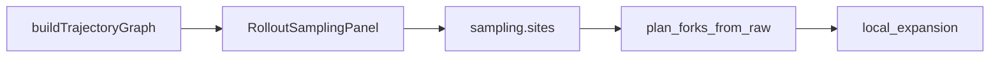

# Rollout Sampling 小窗测试手册

日期：2026-09-16

测的是 **轨迹小窗 → `sampling.sites` → 训练 plan**，不是整仓 ARPO。对照：[ROLLOUT_SAMPLING.md](./ROLLOUT_SAMPLING.md)、[BRANCH_ROLLOUT_UI_TEST.md](./BRANCH_ROLLOUT_UI_TEST.md)（L1.1 / L1.5）、[BRANCH_SITE_DESIGN.md](./BRANCH_SITE_DESIGN.md)。

---

## 自动化命令

| 层 | 命令 | 覆盖 |
|----|------|------|
| 推导 | `./run.sh traj-test` | `trajectoryGraph` vitest（PEV 序、hub+tools、verify、candidate） |
| 运行时 | `.venv/bin/python -m unittest mas.tests.test_phase_abcd_rae_activeset.TestPlanForksTrajectorySites` | `plan_forks`：`after_agent_turn` / `after_verifier` / messages fallback |
| UI 声明 | `./run.sh branch-ui-test` | 双 site：`after_tool` **且** `after_agent_turn` + Collect |
| PEV YAML | `./run.sh branch-ui-test --pev-fixture` | PUT 最小 PEV + 多 agent sites，再还原 hub |
| 短训（可选） | `./run.sh branch-ui-test --train` | 同 BRANCH 手册 L3；看 expansion `event_kind` |

---

## 手动 UI 检查表（S0–S5）

| ID | 操作 | Pass |
|----|------|------|
| S0 | `./run.sh ui --rebuild --daemon`，选 `arpo_e2e` | 主画布下可见 **Rollout Sampling** 小窗 |
| S1 | 轨迹条含 start→hub→end；点 hub → 启用 branch + gate | 保存后 YAML `after_agent_turn` |
| S2 | 勾选「展开 tool 屏障」→ 启用 `execute_python` | YAML `after_tool` |
| S3 | 顶栏改 mode=`rae`、group_n、beam | 同文件 `sampling` 字段更新 |
| S4 | 加载/新建 PEV：planner→executor→verifier 各点启用 | 三条 `after_agent_turn`/`after_verifier`；Inspector Advanced 列表同步 |
| S5 | 主画布角标随 sites 变蓝 | 与小窗一致 |

自动化不替代 **S0 / S4 视觉**；S1 / S2 / S3 由 `branch-ui-test` YAML 断言覆盖；S4 YAML 形态可由 `--pev-fixture` 近似。

---

## 运行时语义（防假绿）

当前 `ActiveSetSession.plan_forks_from_raw` 对每个 site 用 **`site.anchor.kind` 自匹配**（见 `mas/workflow/active_set.py`），不是「仅当真实 event 到达才叉」。

| 现象 | 含义 |
|------|------|
| UI 勾了 `after_agent_turn` 且 gate 过 | 可出 plan，`meta.event_kind=after_agent_turn` |
| 无 `branch_messages` 但有 `messages` | 仍可 plan（messages fallback） |
| Collect 绿 | **不做**树分支；真 branch 看 Train + `.local_expansion` |

本方案**不**改「自匹配 vs 真实 event」语义，仅测试与文档标注现状。

---

## 与 BRANCH 手册的关系

| BRANCH 项 | 本页对应 |
|-----------|----------|
| L1.1 / L1.1b | S1–S3 + `branch-ui-test` 双 site |
| L1.5 PEV | S4 + `--pev-fixture` |
| L3 短训 | 可选 `branch-ui-test --train` |

非目标：不上 Playwright 全浏览器 E2E。
