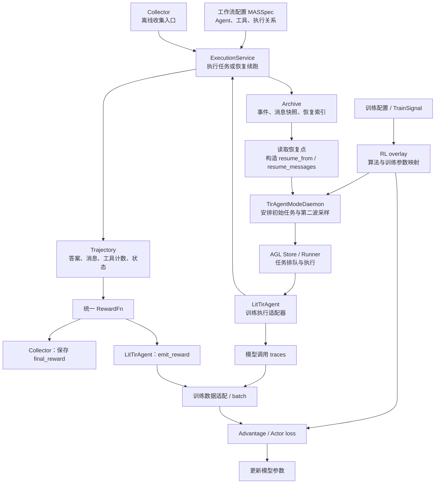

# MAS 多次采样与 RL 训练架构

本文整理 [SAMPLING_ARPO_APPO.md](SAMPLING_ARPO_APPO.md) 涉及的项目架构，区分当前代码已有能力与目标设计。

实现状态依据：2026-09-17 对当前检出代码的核对。本文不是官方 ARPO/APPO 论文复现报告，也不代表端到端训练效果已经验证。

## 1. 架构定位

本项目采用一套 **Agent 执行与 RL 训练分离、通过轨迹和恢复点连接、由外层调度器组织多次采样**的架构。

它不是把官方 ARPO/APPO 代码直接包成一个 MAS 节点，而是将问题拆成三个职责：

> **怎么执行任务 → 从哪里追加采样 → 怎么利用采样结果训练。**

需要明确：原对照文档同时包含现有实现和目标设计。当前代码具备执行、归档、统一评分、两阶段 ARPO/AEPO 采样及 RL 适配基础；声明式 `SamplePolicy`、APPO 和 token 级恢复尚未落实到原文所说的状态。

## 2. 总体架构：两条配置通路，两种使用方式

下面是职责与信息流示意，不表示所有箭头都是直接函数调用，也不表示离线轨迹可以直接转换为完整训练 batch。



**工作流配置与训练配置不是同一回事。** 前者规定 Agent 怎样做任务；后者规定采多少条、使用什么算法、如何更新模型。

**Collector 和 LitTirAgent 是两个入口，不是前后串联的两个步骤。** 一个面向收集和评估，一个面向在线训练；它们复用执行服务和评分规则。

`TrainSignal → overlay` 是训练要求的配置映射通路，并不意味着每次在线 rollout 都必须先经过 Collector 和 TrainSignal。

## 3. 按职责划分的五层

| 层 | 主要组件 | 核心职责 |
| --- | --- | --- |
| **配置层** | `MASSpec`、训练配置、`TrainSignal` | 分别描述工作流与训练要求 |
| **执行层** | `ExecutionService`、Agent、工具 | 执行一次任务，或在支持的范围内从恢复点续跑 |
| **数据与归档层** | `Trajectory`、`Archive`、`Snapshot`、`BranchPoint` | 表达执行结果、保留记录、定位恢复状态 |
| **采集与采样调度层** | `Collector`、`LitTirAgent`、Daemon | 收集结果，安排从头运行或前缀续跑 |
| **评分与学习层** | `RewardFn`、overlay、advantage、RL trainer | 评分、组内比较、构造损失、更新参数 |

这不是严格的单向流水线：**Archive 会向采样调度器提供恢复点，调度器据此追加任务，因此训练侧形成采样闭环。** 当前 ARPO 实现只追加第二波，不是无限或递归扩树。

### 3.1 “解耦”的具体含义

- 执行层不需要知道自己最终服务的是离线评估还是 GRPO。
- RewardFn 不负责决定从哪个位置分叉。
- Daemon 不亲自完成每一次模型生成和工具调用。
- RL trainer 不需要自己解释每种 Agent 工作流如何运行。

各层通过明确的数据结构交换信息，而不是把所有逻辑放在一个 rollout 函数里。解耦不意味着没有适配成本：训练仍需要生成记录、概率、mask、分组及恢复覆盖等信息。

## 4. 核心连接点：轨迹与恢复点

| 对象 | 表达的内容 |
| --- | --- |
| `Trajectory` | 一次执行的结果：消息、答案、工具计数、状态和归档引用等 |
| `Archive` | 保存执行事件、快照及查找索引 |
| `Snapshot` | 某个时刻实际捕获的状态，当前主要是 messages |
| `BranchPoint` | 指向某份快照，说明从哪里续跑、父任务是谁 |
| `TrainSignal` | 轨迹批次及 advantage、loss 等训练要求 |

> **执行产生 Trajectory，Archive 保存过程，Snapshot 保存前缀，BranchPoint 指向续跑起点，TrainSignal 描述训练要求。**

其中，`BranchPoint` 是执行系统与采样算法之间的重要接口：

```text
采样算法：我要从这个快照再试一次
                   ↓ BranchPoint
执行系统：读取该快照，恢复输入，继续执行
```

执行系统不必知道选点依据是熵、人工选择还是其他评分。`ExecutionService.fork` 本质上通过 `resume_from` 调用执行流程；一次调用执行一次续跑，不会自动生成整棵采样树。

**统一引用格式不等于统一恢复能力。** 当前消息快照不能自动恢复任意多 Agent 图的执行位置，也不能恢复外部工具的全部状态。当前 runtime 明确拒绝 `graph_compiled` 模式下的 message-only resume。

相关实现：[contracts.py](../agent-lightning/examples/tir_agent/workflow/contracts.py)、[archive.py](../agent-lightning/examples/tir_agent/workflow/archive.py)、[runtime.py](../agent-lightning/examples/tir_agent/workflow/runtime.py)、[train_signal.py](../agent-lightning/examples/tir_agent/workflow/train_signal.py)。

## 5. 两条实际运行路径

### 5.1 路径 A：只收集、评分，不训练

```text
任务集合
  ↓
Collector 按 n 重复执行
  ↓
ExecutionService
  ↓
Trajectory
  ↓
统一 RewardFn
  ↓
带 final_reward 的轨迹批次
```

这条路径适合观察 Agent 行为和评估输出，不必启动 VERL 或进行参数更新。

Collector 的“同题执行 n 次”是多次采样，但不是自动完成 GRPO 训练。轨迹还需要训练所需的生成记录和适配，才能成为包含 token、概率、mask 等信息的训练数据。

相关实现：[collector.py](../agent-lightning/examples/tir_agent/workflow/collector.py)。

### 5.2 路径 B：训练期间采样并学习

```text
训练配置
  ↓
Daemon 派发任务
  ↓
Runner 执行 LitTirAgent
  ↓
ExecutionService 运行 Agent
  ↓
记录执行、保存快照、统一评分
  ↓
emit_reward + 训练 traces
  ↓
必要时追加第二波任务，重复执行与评分
  ↓
构造训练 batch
  ↓
计算 advantage 和 loss
  ↓
更新模型
```

**真正决定“再采多少条、从头采还是续跑”的是 Daemon，不是 Archive，也不是 RewardFn。**

Collector 与 LitTirAgent 共用评分入口，避免离线收集与训练维护两套不同的终局评分规则。Reward 判断结果，advantage 表达相对训练信号，loss mask 决定哪些 token 参与指定损失，三者职责不同。

相关实现：[lit_tir_agent.py](../agent-lightning/examples/tir_agent/lit_tir_agent.py)、[daemon.py](../agent-lightning/examples/tir_agent/algos/daemon.py)、[rewards.py](../agent-lightning/examples/tir_agent/workflow/rewards.py)。

## 6. ARPO 在架构中的实现位置

当前 MAS ARPO 的算法改动主要落在**采样调度层**。

例如：

```text
总预算 rollout.n：8
初始轨迹 initial_rollouts：2
新增分支上限 beam_size：2
```

在支持的训练模式下，满足分支条件且有可用恢复消息时：

```text
第一波：
Q → 初始轨迹 A
Q → 初始轨迹 B
        ↓
等待完成，读取选定父任务的恢复记录
        ↓
第二波：
A 的前缀 → A1
A 的前缀 → A2
Q → C
Q → D
Q → E
Q → F
        ↓
共安排 8 条轨迹，用于后续同题组相对训练
```

这是调度数量示例，不保证所有任务都成功结束或最终都有有效训练数据。

### 6.1 当前实现范围

- 每题选择 `rids[0]` 作为父任务，不是扫描所有候选快照取最优。
- 使用不确定性代理与确定性阈值决定是否分支，不是官方式随机分叉。
- 分支数受 `beam_size` 和剩余预算限制。
- 其余预算从头重采样。
- 只追加第二波，不递归扩展整棵树。
- `_enqueue_tree_branches` 当前要求 Daemon 的 `mode == "v1"`；树采样入口仅用于训练中的 `arpo`、`aepo`。

当前 ARPO 判断是将 `branch_probability + entropy_weight * delta_h` 与阈值比较，并要求存在恢复消息；不能简化为“只有熵差超过阈值才分叉”。默认参数下，熵差为零也可能满足条件。

而在学习层，[apply_tir_advantages](../agent-lightning/examples/tir_agent/algos/advantage.py) 对 `arpo` 保留基础 GRPO advantage，不增加独立的 ARPO 过程归因逻辑。

> **当前 MAS ARPO = 前缀恢复式的两阶段采样 + 基础 GRPO 学习。**

### 6.2 与官方实现的边界

不能据此宣称与官方“复制完整 response token 和 mask”的训练语义完全一致。

**历史 messages 能被模型读取，不代表历史模型输出 token 会在新分支中重新参与 loss。**

消息级恢复可以复用过去的工具输出，但不等于精确 token 前缀恢复、KV cache 复制或环境状态恢复。同样，前缀续跑也不保证产生不同后续，仍取决于解码设置和模型分布。

## 7. 声明式采样与 APPO：目标扩展方向

### 7.1 声明式采样放在配置层

原文档希望增加：

```text
SamplePolicy
├─ mode：使用哪种采样方式
├─ group_n：每题多少条
├─ beam_size：分支数量限制
└─ barriers：哪些边界允许分叉
```

它应当把采样意图交给调度器，而不是由 UI 直接执行分叉。Barrier 声明合法候选边界，算法决定是否选用，运行时负责判断状态是否足够并执行恢复。

当前 [MASSpec](../agent-lightning/examples/tir_agent/workflow/spec.py) 没有 `sampling`，边类型也没有 `sample_barrier`。当前 `TrainSignal` 也没有独立的 sampling 字段。因此这部分应标为目标接口，而不是“已冻结且已接通”。

### 7.2 APPO 需要同时扩展采样层与学习层

按原文档描述，APPO 不能只增加一个 `mode=appo`：

```text
采样侧：
取得候选 token 与概率信息
→ 计算选点分数
→ 构造准确的前缀
→ 生成分支
→ 保存父子关系和分叉位置

学习侧：
给分支评分
→ 构造对比信号
→ 回写父轨迹指定位置的 advantage
→ 正确屏蔽分支自身的 Actor loss
```

这还依赖数据层保存足够精确的 token、策略概率和位置映射，以及明确的分组、信用回写和 mask 规则。

当前 [VALID_ALGOS](../agent-lightning/examples/tir_agent/algos/overlay.py) 没有 `appo`，advantage 路径也没有 APPO 处理，Snapshot 没有原文描述的 token 前缀字段。因此**当前不能称为“APPO Phase A 已落地”或“精确 token 前缀合同已接通”**。

## 8. 架构判断与能力边界

这套架构的价值，在于把 Agent 平台与训练算法之间的连接做成可复用接口，而不是追求与某篇论文的 rollout 内核完全一致。

| 已有基础 | 仍需区分的边界 |
| --- | --- |
| 统一执行服务 | 不等于任意图可恢复 |
| Archive 与消息快照 | 不等于 token/KV cache/环境快照 |
| Collector 与训练共用评分入口 | 不等于轨迹天然就是完整训练 batch |
| ARPO/AEPO 两阶段追加采样 | 不等于官方循环内持续分叉 |
| RL overlay 与 advantage 扩展点 | 不等于 APPO 已实现 |
| 工作流配置与图结构 | 不等于声明式采样已接通 |

**当前项目的准确定位是：以 `ExecutionService + Archive` 为执行和数据基础，以 `Collector / LitTirAgent` 连接离线收集与在线训练，以 Daemon 组织多次采样，以独立 RewardFn 和 RL adapter 完成评分与学习；声明式采样和完整 APPO 是基于这套基础继续扩展的方向。**
