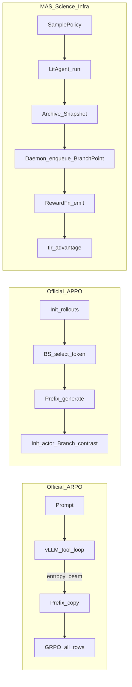

# MAS / ARPO / APPO（智能体过程策略优化） 多次采样与 Reward 对照说明


| 项 | 内容 |
| --- | --- |
| 日期 | 2026-09-14 |
| 范围 | `MAS_Science_Infra`（含 tir\_agent 接入层）、官方 `APPO-main/ARPO`、官方 `APPO-main/APPO` |
| 目的 | 讲清「多次采样」在代码里怎么实现、三者差异、优劣势，以及 reward / advantage 怎么设计 |


相关代码入口：

- MAS：`mas/workflow/`、`algos/daemon.py`、`algos/advantage.py`
- 官方 ARPO：`APPO-main/ARPO/verl_arpo_entropy/verl/workers/rollout/vllm_rollout/vllm_rollout_with_tools.py`
- 官方 APPO：同上目录下的 APPO 变体 + `appo_branching.py` + `ray_trainer.py` 中 APPO advantage

---

## 0. 一句话结论

三套系统都在做同一件事：**同一题（同一 prompt）生成多条轨迹，用组相对优势做 RL**。差异不在「要不要多采样」，而在：

1. **在哪里分叉**（tool 后 / token 级 / 对话 Snapshot）
2. **怎么分叉**（**vLLM** 内拷贝 token 前缀 vs Daemon 二次 enqueue vs Archive fork）
3. **分支轨迹算不算 actor loss**（ARPO 全算；APPO 分支只做对比信号 ）
4. **谁声明采样策略**（官方写在 Hydra/rollout；MAS 声明在 `SamplePolicy`，执行仍走单一 `BranchPoint` 接口）

**都不是** OS 进程 fork，也**不是** Docker/镜像 restore。物理机制一律是：

> **核心都是：可恢复前缀（token 列表或 messages Snapshot）+ 继续采样**

---


## 1. 问题定义：什么叫「多次采样」

训练侧通常有预算 `N = rollout.n`（例如 16）：每道题最终要凑满 N 条完整轨迹进 GRPO 组。

可以粗分三种策略：


| 策略 | 含义 | 谁在用 |
| --- | --- | --- |
| **独立重采样（global）** | 从裸 prompt 再开一条全新轨迹 | GRPO 默认；ARPO/APPO 预算不足时补齐 |
| **前缀分支（branch / beam）** | 在已有轨迹的某个屏障点复制前缀，换随机性继续写 | 官方 ARPO、官方 APPO、MAS ARPO/APPO |
| **声明式屏障（barrier）（其实就是分支的合法位置）** | 图/配置规定「允许在哪些节点 fork」，真正选点由算法做 | MAS `SamplePolicy` + `sample_barrier` 边 |


---
| 层次 | 负责什么 |
| --- | --- |
| 工作流 / UI | 声明哪些边界**允许分叉** |
| 采样算法 | 从允许的边界中选点，决定是否分叉、分几支 |
| 执行运行时 | 保存和恢复状态，真正执行新分支 |


## 2. 官方 ARPO：怎么做多次采样


### 2.1 设计意图

论文核心：**工具返回后不确定性升高的步骤**值得多采。采样预算应压到这些位置，而不是均匀地从 prompt 重开 N 次。

外层 advantage 仍是 **GRPO（无 Critic）**：M 条完整轨迹进同一 `data_id` 组，共享前缀在 importance sampling 下自然接近 soft 设定。

### 2.2 代码落点（单文件核心）

主逻辑在：

`ARPO/.../vllm_rollout/vllm_rollout_with_tools.py`

Agent **没有**独立类；行为嵌在 vLLM rollout 循环里（`rollout.mode=sync_with_tool`）：

```text
while 还有 active 轨迹:
  1. vLLM generate（stop 在 </search> / </python> 等 XML tag）
  2. 对本轮前若干 token 算熵 H_now；与该轨迹初始熵 H_init 比 ΔH
  3. 若 stop 到 tool → 线程池执行工具 → 把 <result>...</result> tokenize 拼回 curr_inputs
     （这些 token 的 result_mask = 0，不进 policy loss）
  4. 若轨迹未结束：按熵自适应概率决定是否 beam 分叉
  5. 分叉 = curr_inputs[source].copy() 追加到 batch，继续 decode
  6. 名额不够 → 可从 init_inputs（裸 prompt）再开全局轨迹
```

关键参数（脚本 / yaml）：

- `rollout.n` / `ROLLOUT_N`：总预算
- `beam_size`：每个 active 点（候选点）最多再分几支
- `branch_probability`、`entropy_weight`：用 `prob = random - entropy_weight * ΔH` 与阈值比较
- `initial_rollouts`（设计上）：先铺一批，再用 branching 补满


### 2.3 「选中的节点」是什么

官方 ARPO 的节点 ≈ **tool-call 轮次结束后的 active sample**（仍在同一 vLLM batch 内）。

不是图上的 Agent 节点，也不是容器 checkpoint。

### 2.4 优劣势（是否适合直接接入 MAS）


| 优势 | 劣势 |
| --- | --- |
| 与论文最接近：decode/tool 循环内真前缀 fork | Agent 协议绑死 XML-TIR，难接标准 function-calling / 多 Agent 图 |
| 前缀拷贝含已发生的 tool 结果文本，续写成本低 | 与 MAS/LangGraph 运行时异构，难直接复用 |
| 软 GRPO：共享前缀自然同 IS | 熵是「本轮前 k token」标量近似，不是完整 procedure 分数 |
| 工程成熟、搜索/数学工具栈完整 | 分叉逻辑焊在 VERL worker，UI/声明层难介入 |


---


## 3. 官方 APPO：怎么做多次采样

### 3.1 设计意图（看token -  更戏子）

ARPO 只在 **tool 边界**看熵；APPO 认为真正影响结局的中间决策遍布 thinking span，**token 熵 ≠ 对结局的影响**。

引入 Branching Score：

```text
BS_t = Z(Entropy_t) * Z(FutureValue_t)

FutureValue_t ≈ exp( Σ_{k≥t} γ^{k-t} · (log π_current(a_k|s_k) - log π_rollout(a_k|s_k)) )
```

选 BS 最高的 token 点分裂；分支续写提供 **对比 reward/advantage**，但 **不直接进 actor loss**（`result_mask` 全 0）。

### 3.2 代码落点

1. **选点 / 造前缀**：`APPO/.../vllm_rollout/appo_branching.py`（`APPOBrancher`）
2. **rollout 内调用**：`vllm_rollout_with_tools.py` 的 `_appo_branch_after_rollout`
3. **advantage / M 缩放**：`ray_trainer.py` 中 `build_appo_branch_request`、`apply_appo_reward_scale_M`、`compute_appo_advantage`

典型流程：

```text
1. 先跑满 initial_rollouts（可带完整 tool loop）
2. 对每条 init 轨迹的每个 response token：
   - 算 entropy（来自 top-k logprobs）
   - 若有 current/old logprob → 算 FutureValue；否则退化为 entropy z-score
3. 过滤无意义 token（标点/空白）
4. top-B 选 BS 点 → split_prefix = prompt + response[:idx+1]
5. inference_engine.generate(branch_prefixes) 续写
6. build_branch_rollout：拼完整序列，result_mask 全 0
7. Trainer：
   - init / branch 分组算相对 advantage
   - 用 branch 结果回写 init 前缀上的 credit（M 缩放）
   - branch 行本身不优化 actor
```

关键开关：`actor_rollout_ref.rollout.appo_dynamic_branching=True`，`algorithm.adv_estimator=appo`。

### 3.3 「选中的节点」是什么

≈ **response 内某个 token 索引（procedure point）**。

可以落在 thinking 中间，不必是 tool 边界。

### 3.4 优劣势


| 优势 | 劣势 |
| --- | --- |
| 选点更细，对准「过程决策」而非仅 tool 后 | 依赖 logprobs / future-value，工程与算力更重 |
| 分支只做对比信号，避免稀释 actor 更新 | FutureValue 是策略内部似然增益，未必经外部 Y 校验（假自信也可抬高 BS） |
| 与 ARPO 同工具栈，复现成本相对可控 | 仍嵌在 VERL rollout，不适合直接当 MAS 图运行时 |
| M 缩放把分支质量映射回原轨迹前缀 | 对「可变环境态」（文件系统/容器）同样没有镜像级 restore |


---


## 4. MAS_Science_Infra：怎么做多次采样

| 组件 | 负责的问题 |
| --- | --- |
| 工作流配置 | 有哪些 Agent、工具、执行关系？ |
| `ExecutionService` | 给定一个任务或恢复点，怎样执行？ |
| `Archive` | 执行发生了什么，哪些状态可以保存和恢复？ |
| `Collector / LitTirAgent` | 怎样收集执行结果并交给后续系统？ |
| `RewardFn` | 这次结果表现如何？ |
| Daemon | 同一道题运行多少次，哪些任务从头开始，哪些恢复执行？ |
| Advantage / RL trainer | 怎样把这些结果转成参数更新？ |


MAS 的目标不是 100% 复现官方 vLLM 内核，而是：

1. **MAS 层声明**采样策略（画布 / `workflow.yaml`）
2. **单一分叉接口**：`ExecutionService.fork(BranchPoint)` / Daemon `resume_from`
3. **数据面与 RL 面解耦**：`Collector` + `RewardFn` + `TrainSignal`；训练路径 `LitTirAgent` 共用同一 RewardFn


### 4.1 分层接口（已冻结）

```text
MASSpec.sampling (SamplePolicy)
    │
    ▼
ExecutionService.run / fork(BranchPoint)     ← 只跑图，不算 reward
    │
    ├─ Archive.snapshot(messages[, token_prefix]) 保存某次执行的具体前缀状态
    │
    ▼
Collector（收集数据，不要求立即训练） / LitTirAgent（接入训练系统）
    │  同一 RewardFn → final_reward / emit_reward
    ▼
TrainSignal → algorithm.tir / tir_algo
    │
    ▼
TirAgentModeDaemon._enqueue_tree_branches    ← 二次 enqueue 真正「多采样」
    │
    ▼
apply_tir_advantages（GRPO / APPO Phase A / …）
```

关键合同：


| 合同 | 作用 |
| --- | --- |
| `SamplePolicy` | `mode`、`group_n`、`beam_size`、`barriers`… 声明怎么采 |
| `Snapshot` | 可恢复状态：默认 `messages`；Phase B 可带 `token_prefix` |
| `BranchPoint` | `archive_id` + `snapshot_id` + `meta`（熵、BS、parent…） |
| `TrainSignal` | 把 algo + sampling 交给 RL overlay |


UI：

- 设置面板改 `sampling.mode`（`grpo_n` / `arpo` / `aepo` / `appo`）
- 边 kind=`sample_barrier`：只声明「允许在此屏障 fork」，**不在 UI 里跑 beam**


### 4.2 GRPO / 独立 n 采样

`mode=grpo_n`（或 `grpo`）：

- Daemon **不**做树分支
- `Collector.collect(..., n=group_n)` 或 VERL `rollout.n`：同一题独立跑 n 次
- Advantage：标准组内相对（GRPO）


### 4.3 MAS 上的 ARPO（近似官方）

实现：`algos/daemon.py` 两阶段 enqueue（不是 vLLM 内 copy）。

```text
波 1：每题只跑 initial_rollouts 条完整轨迹
      LitTirAgent 在 tool 后 dump Archive Snapshot（messages + h_root/h_tool）
波 2：Daemon 读 resume：
      若 ΔH 过阈且预算未满 → enqueue 带 resume_messages / resume_from 的任务（beam_size）
      剩余名额 → 从裸 prompt 补全局轨迹
```

与官方差异（务必诚实）：


|  | 官方 ARPO | MAS ARPO |
| --- | --- | --- |
| 分叉层 | vLLM worker 内 token list copy | AGL Daemon 二次 enqueue + messages resume |
| 熵 | decode 轮次 token 熵 | turn 级 / tool 后代理熵（有 logprobs 更好） |
| Agent | XML stop 循环 | LangGraph function-calling |
| 轨迹进 loss | 完整轨迹 GRPO | 完整轨迹 GRPO（共享前缀 soft） |


语义对齐：**tool 屏障后前缀续跑**；保真度弱于官方 decode 中途 beam。

### 4.4 MAS 上的 APPO（Phase A → Phase B）

**Phase A（已落地，屏障近似）**：

- 与 ARPO 共用 Daemon 树 enqueue 通道
- `branch_score` 用 `|ΔH|` 等屏障级代理（不是完整 token BS）
- `appo_rollout_kind=branch` 的行：advantage 置零（对齐官方「分支不进 actor」）
- init 行可按 `reward_scale_discount` 与 branch_score 做 M 缩放

**Phase B（合同已开，精确 token 前缀可选）**：

- `Snapshot.token_prefix` / `response_token_idx` 可写入 Archive
- 真正的 BS = Z(H)·Z(Ω) 仍宜放在 RL adapter（需要 current/old logprob），经同一 `BranchPoint` 回灌
- **未**把选点塞进 LangGraph 核心（保持接口简单）


### 4.5 优劣势


| 优势 | 劣势 |
| --- | --- |
| 采样策略可 UI/YAML 声明，MAS↔RL 接口单一 | ARPO/APPO 相对论文是近似，尤其 APPO Phase A |
| 可接多 Agent 图、标准 tool-call、Archive/Harness | 对话级 Snapshot 粒度粗于 token fork |
| Reward 单点 `RewardFn`，collect 与 train 同源 | 跨进程 resume 依赖 Archive 索引，运维面更大 |
| 扩展 `env_ref` 有空间（未来可变环境） | 当前 tool 栈仍无环境镜像；与官方一样不做 bit-identical replay |


---


## 5. 三方对比总表


### 5.1 采样机制


| 维度 | 官方 ARPO | 官方 APPO | MAS（tir\_agent） |
| --- | --- | --- | --- |
| 分叉粒度 | tool 轮次后 | **token** procedure point | 对话 Snapshot（tool/agent 屏障）；可扩展 token\_prefix |
| 物理手段 | `token_id` 列表 `.copy()` | 截断前缀再 `generate` | Archive restore → `resume_messages` / `fork` |
| 选点信号 | ΔH（熵变化）+ 随机阈 | BS = Z(H)·Z(Ω) | ARPO：ΔH；APPO-A：屏障代理分数 |
| 执行位置 | VERL rollout worker | VERL rollout + trainer | LitAgent + Daemon +（可选）advantage 钩子 |
| 分支是否训 actor | 是（整条进 GRPO） | **否**（对比信号） | ARPO：是；APPO：否（Phase A 置零） |
| 声明层 | Hydra/脚本 | Hydra/脚本 | `SamplePolicy` **+ 画布 barrier** |
| 环境态 | 嵌在 token 里的 tool 文本 | 同左 | 嵌在 messages 里的 tool 轮次 |
| 镜像/容器 fork | 无 | 无 | 无 |


### 5.2 数据流示意





---


## 6. Reward 设计对照

这里把 **outcome reward（标量回报）** 和 **advantage（怎么用回报做更新）** 分开写。很多人把两者混为一谈。

### 6.1 Outcome reward（轨迹终局分）


#### 官方 ARPO / APPO（同源 `deep_research.py`）

路径：`verl/utils/reward_score/deep_research.py` → `compute_score`

层级规则（与 MAS 几乎同构）：


| 条件 | score |
| --- | --- |
| 格式不合法（标签配对、`\\\\\\\\\\\\\\\\\\\\\\\\\\\\\\\\\\\\\\\\\\\\\\\\\\\\\\\\\\\\\\\\\\\\\\\\\\\\\\\\\\\\\\\\\\\\\\\\\\\\\\\\\\\\\\\\\\\\\\\\\\\\\\\\\\\\\\\\\\\\\\\\\\\\\\\\\\\\\\\\\\\\\\\\\\\\\\\\\\\\\\\\\\\\\\\\\\\\\\\\\\\\\\\\\\\\\\\\\\\\\\\\\\\\\\\\\\\\\\\\\\\\\\\\\\\\\\\\\\\\\\\\\\\\\\\\\\\\\\\\\\\\\\\\\\\\\\\\\\\\\\\\\\\\\\\\\\\\\\\\\\\\\\\\\\\\\\\\\\\\\\\\\\\\\\\\\\\\\\\\\\\\\\\\\\\\\\\\\\\\\\\\\\\\\\\\\\\\\\\\\\\\\\\\\\\\\\\\\\\\\\\\\\\\\\\\\\\\\\\\\\\\\\\\\\\\\\\\\\\\\\\\\\\\\\\\\\\\\\\\\\\\\\\\\\\\\\\\\\\\\\\\\\\\\\\\boxed{}` 等） | **-1** |
| 格式合法但答错（F1=0） | **0** |
| 答对（F1>0） | **F1** |
| 答对且同时用过 search **和** python | **F1 + 0.1** |


要点：

- 评的是**整条生成串**（含 think / tool XML）
- tool 结果文本本身不单独打分；只通过最终答案与是否双工具 shaping
- ARPO 与 APPO **共用**这套 outcome；差异在分支后的 **advantage 用法**，不在 reward 公式本身


#### MAS `compute_outcome_reward`

路径：`workflow/rewards.py`


| 条件 | reward |
| --- | --- |
| `format_ok=False`（缺 `<answer>` / `###` 等） | **-1** |
| 格式合法但 Acc=0 | **0** |
| Acc>0 | **Acc**（gsm8k 数值匹配；QA 为 token F1） |
| Acc>0 且 `n_search>0` 且 `n_python>0` | **Acc + multi\_tool\_bonus(默认 0.1)** |


要点：

- **Collector 与 LitTirAgent 必须调同一函数**（禁止 Agent 内第二套公式）
- collect 写 `Trajectory.final_reward`；train 路径再算一遍后 `agl.emit_reward`
- `MAS_structagent` 另有 `compute_mas_outcome_reward`（无 format 惩罚），是平行入口，不是默认 TIR 路径


#### Outcome 对照小结


|  | 官方 ARPO/APPO | MAS TIR |
| --- | --- | --- |
| 坏格式 | -1 | -1 |
| 对了 | F1 / Acc | Acc/F1 |
| 双工具 bonus | +0.1 | +0.1（可配） |
| 答案抽取 | `<answer>` + `\\\\\\\\\\\\\\\\\\\\\\\\\\\\\\\\\\\\\\\\\\\\\\\\\\\\\\\\\\\\\\\\\\\\\\\\\\\\\\\\\\\\\\\\\\\\\\\\\\\\\\\\\\\\\\\\\\\\\\\\\\\\\\\\\\\\\\\\\\\\\\\\\\\\\\\\\\\\\\\\\\\\\\\\\\\\\\\\\\\\\\\\\\\\\\\\\\\\\\\\\\\\\\\\\\\\\\\\\\\\\\\\\\\\\\\\\\\\\\\\\\\\\\\\\\\\\\\\\\\\\\\\\\\\\\\\\\\\\\\\\\\\\\\\\\\\\\\\\\\\\\\\\\\\\\\\\\\\\\\\\\\\\\\\\\\\\\\\\\\\\\\\\\\\\\\\\\\\\\\\\\\\\\\\\\\\\\\\\\\\\\\\\\\\\\\\\\\\\\\\\\\\\\\\\\\\\\\\\\\\\\\\\\\\\\\\\\\\\\\\\\\\\\\\\\\\\\\\\\\\\\\\\\\\\\\\\\\\\\\\\\\\\\\\\\\\\\\\\\\\\\\\\\\\\\\\boxed{}` | `<answer>` / `###` / `####` |
| 单点强制 | VERL custom reward path | `workflow/rewards.py` 合同 |


### 6.2 Advantage / 如何用多采样轨迹

Outcome 算完后，训练器把标量播到 token，再做组相对：


| 算法 | Advantage 行为 |
| --- | --- |
| **GRPO** | 同题 N 条轨迹：A\_i = (R\_i - \mathrm{mean}\_R)/\mathrm{std}\_R（或仅减均值） |
| **官方 ARPO** | 同 GRPO；分支与全局轨迹**一视同仁**进组 |
| **官方 APPO** | init / branch **分组**；branch 提供对比；M 缩放回写 init 前缀；branch 不进 actor |
| **MAS ARPO** | 同 GRPO（完整轨迹） |
| **MAS APPO Phase A** | branch 行 advantage×0；init 可按 branch\_score 做 M 缩放 |
| **MAS AEPO-lite** | GRPO 后再乘熵相关项（另文；非本文重点） |


因此：

- **Reward 公式**：三家在 TIR 设定上高度同构（-1 / 0 / Acc[+0.1]）
- **多次采样的「算法差」**：主要体现在 **在哪分叉、分支算不算 loss、如何把分支信号传回前缀**，而不是换一套完全不同的终局分数


### 6.3 Tool token 与 loss mask（别和 reward 搞混）


|  | 含义 |
| --- | --- |
| `result_mask=0` / tool 结果 token | **不算 policy gradient**（环境反馈，不是模型生成） |
| APPO branch `result_mask=0` | **整条分支续写**不进 actor，只参与对比 advantage |
| Outcome reward | 仍可对「含 tool 文本的完整串」打分；mask 管的是 **梯度**，不是「这串有没有分」 |


---


## 7. 设计取舍：该怎么理解「接到 MAS」


### 7.1 为什么 MAS 不直接 copy 官方 vLLM fork

1. MAS 运行时是 LangGraph + AGL Runner，不是 `vLLMRolloutWithTools` 内循环
2. 需
3. 要 UI 声明采样、Archive/Harness 回放、多 Agent 边类型
4. 保持 **一个分叉入口**（`BranchPoint`），避免 RL 私自再开一套 resume 协议

代价：相对论文引擎是 **语义对齐的近似**，尤其 APPO 的 token BS 需要 Phase B 才谈得上对齐。

### 7.2 什么时候用哪套心智


| 场景 | 建议 |
| --- | --- |
| 复现论文数字 / 搜索域强基线 | 直接跑官方 ARPO / APPO 仓 |
| 科学 Agent 图、可插拔工具、UI 配采样 | MAS `SamplePolicy` + Daemon |
| 只要组相对、不需要树 | `mode=grpo_n` |
| 要「tool 后多采」 | MAS `arpo` 或官方 ARPO |
| 要「过程点对比、分支不训 actor」 | 官方 APPO；MAS 用 `appo` Phase A 作工程基线，论文对齐走 Phase B |


### 7.3 环境镜像要不要做

当前三家（官方与 MAS）的 tool 主要是 search / python / cache：

- 已发生的 tool 输出已在 **文本前缀**里  
- 分支后的 **新** tool 调用会重新执行（非 bit-identical）

只有未来工具会改真实文件系统/容器时，才需要在 `Snapshot` 上扩展可选 `env_ref`。**现在做镜像是过度设计。**

---


## 8. 关键文件索引


### MAS


| 文件 | 内容 |
| --- | --- |
| `workflow/contracts.py` | `SamplePolicy` / `Snapshot` / `BranchPoint` |
| `workflow/spec.py` | `MASSpec.sampling`；`sample_barrier` 边合并 |
| `workflow/archive.py` | snapshot / restore / token\_prefix |
| `workflow/rewards.py` | 唯一 outcome RewardFn |
| `workflow/runtime.py` | `run` / `fork`；`branch_parent_id` |
| `algos/daemon.py` | ARPO/AEPO/APPO 两阶段 enqueue |
| `algos/advantage.py` | APPO Phase A advantage |
| `algos/overlay.py` | `VALID_ALGOS`含 appo；sampling→tir |
| `webui/.../MasGraphEditor.tsx` | 采样面板 + barrier 边 |
| `tests/test_sample_policy_appo.py` | 合同与 fork/reward 验收 |


