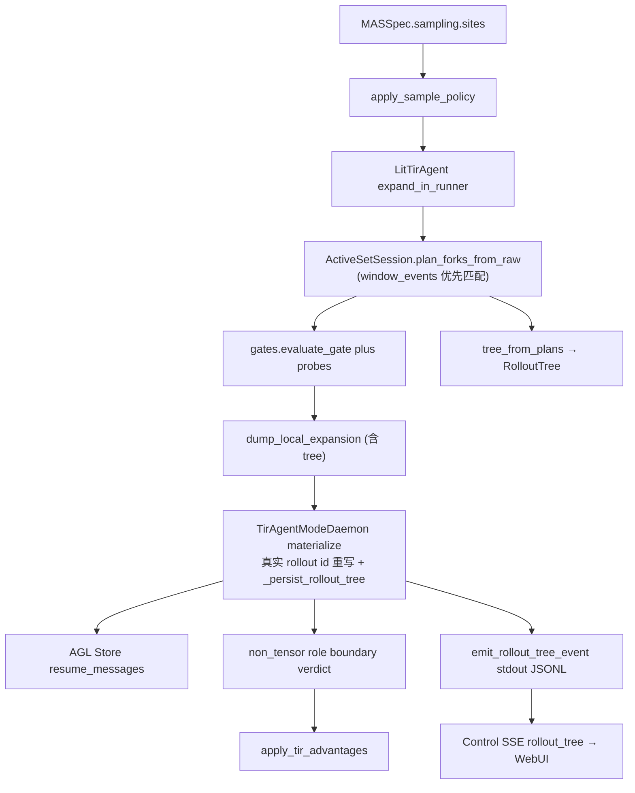

# Agent_Science_Infra 技术框架说明


| 项        | 内容                                                                                                                                                                                                                                                                                                              |
| -------- | --------------------------------------------------------------------------------------------------------------------------------------------------------------------------------------------------------------------------------------------------------------------------------------------------------------- |
| 版本       | 2026-09-20（新增：ARPO 热路径修复（pre-inject expand 字段）+ Daemon 树持久化 `tree_*.json` + blank agent 路由 W1 / 统一 palette W2 + Monitor 离线曲线 + 5 样本端到端实测）；上一版 2026-09-18（新框架 P0–P3 + MAS agent 化重构 + 功能分组测试）                                                                                                                                                                                                                                                |
| 对照提案     | [GPT_analysis.md](./GPT_analysis.md)（架构提案 v1.0）；v2 构思 [new_framework.md](./new_framework.md) → 整理与最优架构 [NEW_FRAMEWORK_DESIGN.md](./NEW_FRAMEWORK_DESIGN.md) → 落地计划 [NEW_FRAMEWORK_MIGRATION_PLAN.md](./NEW_FRAMEWORK_MIGRATION_PLAN.md) → agent 化验收 [MAS_AGENT_FRAMEWORK_TEST.md](./MAS_AGENT_FRAMEWORK_TEST.md)                                                                   |
| 产品原则     | [design.md](../design.md)                                                                                                                                                                                                                                                                                       |
| 层边界      | [LAYER_LAYOUT.md](./LAYER_LAYOUT.md)                                                                                                                                                                                                                                                                            |
| 采样细节     | [ROLLOUT_SAMPLING.md](./ROLLOUT_SAMPLING.md)、[SAMPLING_ARPO_APPO.md](./SAMPLING_ARPO_APPO.md)、[ARPO_TRAIN_TEST.md](./ARPO_TRAIN_TEST.md)、[BRANCH_SITE_DESIGN.md](./BRANCH_SITE_DESIGN.md)、[BRANCH_ROLLOUT_UI_TEST.md](./BRANCH_ROLLOUT_UI_TEST.md)、[ROLLOUT_SAMPLING_UI_TEST.md](./ROLLOUT_SAMPLING_UI_TEST.md) |
| UI 操作    | [CONTROL_UI.md](./CONTROL_UI.md)                                                                                                                                                                                                                                                                                |
| MAS 实现主仓 | `mas/workflow/`（**禁止** import `agentlightning` / `verl` / `ray`；epc_aw 仅 `mas/tools/tool_agents.py` 惰性 import）                                                                                                                                                                                               |
| RL 钩子主仓  | 顶层 `rl/`（reward / loss / TrainSignal / Daemon·Trainer 子类）                                                                                                                                                                                                                                                       |
| CLI      | `science_infra.ui.cli` → `science-infra`                                                                                                                                                                                                                                                                        |
| Control  | `science_infra.control` → `science-infra serve` / `./run.sh ui`                                                                                                                                                                                                                                                 |


本文描述**当前仓库真实结构、职责边界、数据流与关键代码落点**，并对照提案标注实现状态（✅ / 🟡 / ❌）。不以愿景替代代码事实。

---


## 0. 一句话结论

当前仓库是 **Phase 0 MVP + Control UI v1.5 + RL 层抽离（`rl/`）+ BranchSite 声明 + ActiveSet ForkPlanner + RAE reward/advantage + 新框架 P0–P3（RolloutTree / schema 0.3 / WindowEndEvent / 实时 Harness）+ MAS agent 化重构（AgentRegistry 双模式 tool-agent / RouterSpec 运行时 / 两层 memory / per-agent window_events）**。


| 面            | 状态                                                                                                                                              |
| ------------ | ----------------------------------------------------------------------------------------------------------------------------------------------- |
| MAS 构建 / 数据面 | `MASSpec`（schema 0.3：kind/profile/routers）→ `ExecutionService`（TirAgent / mock / Compiler walk）→ Event / Trajectory / Archive；可独立于 RL             |
| Agent 模型      | **一切皆 Agent**：`AgentRegistry`（planner/tool/verifier/blank）+ `RouterSpec`（适配器模式，决策映射为 tool_calls）；tool-agent 双模式（pure / epc_aw llm）       |
| 采样 / 分支      | `SamplePolicy.sites`（`BranchSite`）→ `ActiveSetSession.plan_forks_from_raw`（支持 `window_events` 事件匹配）→ `.local_expansion` → Daemon enqueue；Daemon `_preinject_expand_fields` 在波-1 enqueue 前注入 expand 列（修复 `branch_local=0`，2026-09-20 实测 branch_local=6）；Collect **不做**树 |
| RolloutTree    | `RolloutTree` / `RolloutTreeNode` 一等合同；`tree_from_plans` 建树；Daemon `_persist_rollout_tree` 训练期落盘真实 rollout id 树（`mas/.local_expansion/tree_*.json`，平铺格式）；`GET /api/mas/rollout-trees`（daemon 树优先 + tree_id 去重 + 过滤退化树）+ React Flow 可视化 + SSE 实时    |
| RL 面         | 权威 outcome 在 `rl/rewards`；LossSpec / TrainSignal / overlay / ARPO·AEPO·RAE Daemon 在 `rl/`；token advantage 在 VERL hook；`CreditAssignmentSpec`（k-hop/verdict） |
| Harness       | 四插件 + `Diagnoser.consume` 实时协议 + `RewardHackingMonitor`（leave-one-out z-score）；stdout JSONL 帧 → SSE `rollout_tree`                              |
| Control / UI | 实验 YAML bundle + FastAPI REST/SSE + React 七页（+RolloutTree）+ React Flow→YAML（含 router 菱形节点）+ Rollout Sampling 小窗写 `sampling.sites`（含 router 锚点）+ palette `agent_templates` 统一 Agent 拖拽 + Monitor 离线 reward 回落 |
| 研究原语缺口       | 独立 `Episode`、`Diagnostic`/`Intervention`、Experiment 生命周期状态机仍未冻结                                                                               |


**已跑通**：`WorkflowSpec(YAML) → LangGraph TirAgent → Event/Trajectory → rl.rewards → TrainSignal → Harness → CLI HTML / Monitor`；训练 `LitTirAgent → agl.Trainer/VERL → GRPO 族（含 ARPO/AEPO/RAE 树分支）`；`sampling.sites` → ActiveSet plan → Daemon enqueue → `verdict_list` / R0 prefix-zero（`tir_algo=rae`）；agent 化：RouterSpec 编译进 `tools_for`、per-agent `window_events`、两层 memory 读写、blank agent 经 router 候选 `blank:<id>` 以 tool-call shell 路由（W1）、feature-test `--all` 15 域 154 例全绿（2026-09-20 实跑验证：145 Python + 9 frontend vitest）。**ARPO 训练端到端（2026-09-20，5 样本小数据集）**：run `384d1927458a` returncode=0，`branch_local_count=6`、`store_enqueue_branch_count=6`、`incremental_branch_count=6`、`[TIR arpo] enqueued 4 branch/resume rollouts`、6 棵 `tree_ro-*.json` 落盘（after_tool×2 + after_agent_turn×4，child 为真实 store rollout id），单 step ≈237s（batch=20 时 2704s）。

**硬边界已守住**：

1. `mas/workflow/` **不** import AGL/VERL/Ray（smoke AST 把关）；epc_aw 只在 `mas/tools/tool_agents.py` 惰性 import。
2. 图编辑只生成 **MASSpec YAML**，不生成 LangGraph 代码。
3. AGL 保持黑盒；可改钩子在 `rl/hooks/`。
4. tool_calls 协议完整保留（路由适配器），ARPO `h_tool`/`h_root` 熵估计与 `resume_boundary` 不动。
5. 旧 `experiments/*/workflow.yaml` 零改动仍 Collect+Train（红线，feature-test `schema03`/`e2e` 域回归）。

---


## 1. 架构原则与三栏层布局


### 1.1 产品原则（来自 design.md）


| 原则           | 落地方式                                                                                                    |
| ------------ | ------------------------------------------------------------------------------------------------------- |
| 层可独立         | Collect / Diagnose 可不启 VERL；`workflow/` 零 AGL                                                           |
| 合同优先         | Pydantic：`ExecutionEvent` / `Trajectory` / `SamplePolicy` / `BranchSite` / `TrainSignal` / `Hypothesis` |
| 插件化          | Skill / Role / Diagnoser 注册表；RL 算法经 `tir_algo` + overlay                                                |
| Spec ≠ Graph | UI / YAML 是 Framework；Runtime 是 TirAgent / Compiler walk                                                |
| 事件中心         | Archive 存 `ExecutionEvent[]` + Snapshot，供 fork / Harness                                                |


### 1.2 AGL 黑盒 vs 可改钩子

详见 [LAYER_LAYOUT.md](./LAYER_LAYOUT.md)。

```text
┌─────────────────────────────────────────────────────────────┐
│  Control / UI                                                │
│  science_infra/ + webui/ + experiments/<id>/*.yaml           │
└───────────────────────────┬─────────────────────────────────┘
                            │ REST / SSE / 子进程
┌───────────────────────────▼─────────────────────────────────┐
│  MAS（构图 + 执行 + 轨迹）                                    │
│  mas/workflow/  ·  mas/tir_agent.py  ·  mas/tools/           │
│  产出：Trajectory / Archive / SamplePolicy.sites 声明         │
└───────────────────────────┬─────────────────────────────────┘
                            │ TrajectoryBatch / TrainSignal
┌───────────────────────────▼─────────────────────────────────┐
│  RL 钩子（本仓可改）                                          │
│  rl/rewards · rl/loss · rl/train_signal · rl/hooks/*         │
└───────────────────────────┬─────────────────────────────────┘
                            │ emit_reward / Hydra overlay / subclass
┌───────────────────────────▼─────────────────────────────────┐
│  AGL 黑盒（勿 fork）                                          │
│  agent-lightning: Trainer / VERL / Store / LitAgent 基类      │
└─────────────────────────────────────────────────────────────┘
```

兼容 shim（旧 import 路径仍可用）：


| 旧路径                            | 现权威路径                         |
| ------------------------------ | ----------------------------- |
| `mas/workflow/rewards.py`      | `rl.rewards.outcome`          |
| `mas/workflow/train_signal.py` | `rl.loss` + `rl.train_signal` |
| `mas/algos/*`                  | `rl.hooks.*`                  |


---


## 2. 仓库布局与职责

```text
MAS_Science_Infra/
├── design.md                     # 产品原则
├── pyproject.toml                # science-infra 包 + CLI
├── run.sh                        # smoke / live-* / tests / ui / train
├── .env                          # API / 模型等（密钥不入库）
├── scripts/setup_uv_env.sh       # 本地 uv 环境
├── env_init/                     # 环境初始化脚本
│
├── science_infra/                # 薄 UI / Control（不持有 StateGraph、不训模型）
│   ├── env.py
│   ├── ui/
│   │   ├── cli.py                # collect / diagnose / status / dashboard / doctor / serve
│   │   ├── status.py             # 单文件 HTML
│   │   └── dashboard.py          # CLI 与 Monitor 共用视图模型
│   └── control/
│       ├── app.py                # FastAPI：REST + SSE + /agl 反代
│       ├── experiments.py        # ExperimentMeta + 四段 YAML
│       ├── services.py           # LLM / collect / diagnose / train
│       ├── process_manager.py    # llm | collect | train 子进程
│       ├── events.py             # 进程内 EventBus → SSE
│       └── paths.py
│
├── webui/                        # React + React Flow
│   └── src/
│       ├── pages/                # Experiment / LLM / MAS / RL / Harness / Monitor / RolloutTree
│       ├── features/graph/       # MasGraphEditor → MASSpec YAML（AgentNode/ToolNode/RouterNode）
│       ├── features/sampling/    # RolloutSamplingPanel → sampling.sites（含 router 锚点）
│       └── features/gpu/         # GpuPicker
│
├── experiments/<id>/             # 实验配置真源（默认 demo）
│   ├── experiment.yaml
│   ├── llm.yaml / workflow.yaml / rl.yaml / harness.yaml
│   ├── .secrets.env              # API key，不回显
│   └── artifacts/                # collect / diagnose / archives / runs
│
├── mas/                          # ★ MAS 实现主仓
│   ├── workflow/                 # Spec / Runtime / Event / Collector / ActiveSet / Harness（禁 AGL）
│   │   ├── contracts.py          # Event / Trajectory / SamplePolicy / BranchSite / RolloutTree / WindowEndEvent
│   │   ├── agents.py             # AgentRegistry（双模式 tool-agent）/ BlankAgent（agent 化 A1）
│   │   ├── active_set.py         # ForkPlan / plan_forks_from_raw / tree_from_plans
│   │   ├── active_set_scheduler.py
│   │   ├── gates.py / probes.py
│   ├── specs/hub_react.yaml      # 默认 WorkflowSpec
│   ├── tir_agent.py              # LangGraph ReAct Runtime（routers/agent_id/window_events）
│   ├── lit_tir_agent.py          # AGL LitAgent 适配（胶水）
│   ├── train_tir_agent.py        # 训练入口（--rl-yaml / --algo）
│   ├── algos/                    # → rl.hooks 薄 re-export
│   ├── tools/                    # web_search / wikipedia / python + tool_agents.py（双后端注册表）
│   ├── MAS_structagent/          # 平行 RL 路径（epc_aw 经 tool_agents 惰性接入）
│   ├── scripts/                  # collect_rollouts / check_workflow_deps
│   └── tests/                    # stage1–11 + ActiveSet / RAE / gates / agent_framework
│
├── rl/                           # ★ RL 可改层（相对 AGL 的钩子）
│   ├── rewards/outcome.py        # 权威 outcome reward
│   ├── loss.py                   # LossSpec / AdvantageSpec / CreditAssignmentSpec
│   ├── train_signal.py           # TrainSignal + batch_to_train_signal
│   └── hooks/
│       ├── overlay.py            # algo / SamplePolicy → Hydra
│       ├── advantage.py          # VERL compute_advantage 替换
│       ├── rae_advantage.py      # R0 prefix-zero / R1 verdict / π_tgt / k-hop / verdict tree
│       ├── daemon.py             # 树分支 enqueue + verdict + _rollout_trees + emit_rollout_tree_event
│       ├── trainer.py            # TirAgentLightningTrainer
│       ├── branch_policy.py      # 官方 ARPO fork 概率 / allocate_forks
│       ├── arpo_rollout.py       # 熵估计 / should_branch
│       └── gigpo_core.py
│
├── agent-lightning/              # AGL 基板（黑盒依赖）
├── data/                         # train/val parquet
├── LLM/                          # 本地模型权重（如 Qwen3-4B）
├── docs/                         # 本文与采样 / 层布局 / 提案 / 新框架
├── scripts/                      # feature_test / branch_rollout_ui_test / arpo_train_verify / rollout_tree_verify
└── artifacts/                    # run.sh 冒烟产物
```


| 区域                                        | 角色                                                      | 可否独立于 RL                         |
| ----------------------------------------- | ------------------------------------------------------- | -------------------------------- |
| `science_infra/ui`                        | 传参、采集、诊断、静态可视化、启动 Control                               | 是                                |
| `science_infra/control` + `webui/`        | 实验 YAML、REST/SSE、分层面板、图画 YAML、Rollout Sampling、RolloutTree 页 | collect/diagnose 是；train 否       |
| `experiments/<id>/`                       | 分层配置 + artifacts                                        | 是（配置本身）                          |
| `mas/workflow/`                           | Spec、Runtime、Event、Trajectory、ActiveSet、Harness、Archive、AgentRegistry | 是（ActiveSet 计划不依赖 GPU）           |
| `mas/workflow/agents.py`                  | AgentRegistry（双模式 tool-agent）/ BlankAgent / RouterSpec 解析    | 是（纯 spec 层）                      |
| `mas/tir_agent.py` + `tools/`             | LangGraph 执行后端（routers/agent_id/window_events）；tool_agents 双后端注册表 | 是（需 LLM 或 mock）                  |
| `rl/`                                     | reward / loss / TrainSignal / Daemon·Trainer 钩子         | reward/loss 合同可无 GPU；hooks 训练路径否 |
| `lit_tir_agent.py` + `train_tir_agent.py` | 胶水：跑图 + `rl.*` + `agl.Trainer.fit`                      | 否                                |
| `MAS_structagent/`                        | EPC-AW 等多 Agent 参考（epc_aw LLM-in-tool 经惰性接入）             | epc_aw 后端仅测试态                    |


---


## 3. 运行时数据流

系统有三条面：**研究数据面**、**控制面**、**采样/分支面**（ActiveSet + 训练 Daemon）。Control 不持有 `StateGraph`；训练 live 曲线仍在 AGL `/metrics`（Control 可反代 `/agl`）。

### 3.1 研究数据面

```text
YAML (mas/specs/hub_react.yaml 或 experiments/<id>/workflow.yaml)
        │
        ▼
   MASSpec (+ sampling: SamplePolicy + routers)   ← Definition Plane（schema 0.3）
        │   _normalize_schema03 sugar：top-level tools → kind=tool 节点；
        │   legacy agents 按 role 推断 kind
        ▼
 ExecutionService.run / fork / collect    ← Runtime Plane facade
        │
        ├─ mock: MockRunner → run_mock_episode（agent_id / window_events 真实节点 id）
        ├─ hub_react: TirRunner → TirAgent (LangGraph) via importlib
        │   └─ AgentRegistry 解析 tool-agent 后端（pure 默认；llm.kind=api + profile.llm_required → epc_aw）
        └─ graph: compile_spec → run_compiled_episode（同步交接 walk）
            └─ RouterSpec 候选 kind=tool → tools_for[上游]（适配器糖，tool_calls 协议不变）
            └─ 每 hop 合并 per-agent window_events / window_snapshots
        │
        ▼
 Archive: ExecutionEvent[] + Snapshot + window_events（WindowEndEvent 流）
        │
        ▼
 Trajectory (+ final_reward via rl.rewards)
        │
        ├──────────────────┬──────────────────┬───────────────┐
        ▼                  ▼                  ▼               ▼
   TrainSignal        HARNESS.diagnose    science-infra   RolloutTree
   (rl.train_signal)  → Hypothesis[]      → HTML / Monitor (tree_from_plans)
        │
        ▼  (仅训练路径)
 apply_train_signal / apply_sample_policy → Hydra
        │
        ▼
 LitTirAgent + agl.Trainer + VERL
 (grpo / arpo / aepo / igpo / gigpo / rae)
```


### 3.2 控制面

```text
WebUI 七页  /  science-infra serve  /  ./run.sh ui
        │
        ▼
 FastAPI (science_infra.control.app)
        │
        ├─ PUT  /api/experiments/{id}/{section}  → llm/workflow/rl/harness.yaml
        ├─ POST /api/mas/collect                 → Collector → artifacts/collect.json
        ├─ POST /api/harness/diagnose            → HARNESS → diagnose.json
        ├─ POST /api/rl/train                    → train_tir_agent.py --rl-yaml
        ├─ POST /api/llm/start|stop              → 本地 vLLM 子进程
        ├─ GET  /api/events                      → SSE（进程状态）
        └─ /agl/*                                → 反代 AGL Dashboard（训练 metrics）
        │
        ▼
 ProcessManager  kind ∈ {llm, collect, train}
        │
        ▼
 experiments/<id>/artifacts/{collect,diagnose}.json
                 /artifacts/archives/
                 /artifacts/runs/{run_id}/
```

`ExperimentMeta.pipeline` 默认为 `["collect","diagnose","train"]`，**不会自动串行**；UI 上分别点 Collect / Diagnose / Train。

### 3.3 采样 / 分支面（与 Collect 区分）

详见 [ROLLOUT_SAMPLING.md](./ROLLOUT_SAMPLING.md)、[BRANCH_SITE_DESIGN.md](./BRANCH_SITE_DESIGN.md)。UI 小窗验收：[ROLLOUT_SAMPLING_UI_TEST.md](./ROLLOUT_SAMPLING_UI_TEST.md)。

```text
MASSpec.sampling (SamplePolicy)
        │
        ├─ Collect：只按 group_n 做「独立重开」；忽略 beam / sites 树分支
        │
        └─ Train：apply_sample_policy → rollout.n + algorithm.tir.*（含 sites）
                  │
                  ├─ grpo / igpo / gigpo：Daemon 跑 n 条独立轨迹
                  └─ arpo / aepo / rae：
                        LitTirAgent（expand_in_runner）
                          → ActiveSetSession.plan_forks_from_raw
                          → dump_local_expansion
                        TirAgentModeDaemon materialize
                          → _preinject_expand_fields（波-1 enqueue 前注入
                             expand_in_runner/sampling_budget/branch_sites 列；
                             super() 快照 task input，事后补写不生效）
                          → Store enqueue(resume_messages)
                          → non_tensor: role / resume_boundary / verdict_list
                          → _persist_rollout_tree(tree_*.json) + emit node_added
                        apply_tir_advantages（GRPO 基线 + 可选 R0 / RAE）
```




物理机制：**可恢复 messages Snapshot + 继续采样**，不是 OS fork，也不是 vLLM 内部 beam search。无 token 引擎时 `resume_mode=token_prefix` / `on_token` 站点降级为 messages。

Caveat：`plan_forks_from_raw` 对每个 site 用 `site.anchor.kind` **自匹配**（不是「等真实 event 到达才叉」）；P2 起支持传入 `window_events`（WindowEndEvent 流）做**事件优先匹配**，无事件时回退 `branch_messages`/`messages`。Collect 绿路径**不做**树分支；真 branch 看 Train + `.local_expansion`。

**RolloutTree 链路（P0；2026-09-20 接通落盘）**：`plan_forks_from_raw` 产出的 plans 经 `tree_from_plans` 构成一等 `RolloutTree` 合同（root/children/hops），随 expansion payload 双格式落盘（runner 侧 `mas/.local_expansion/<rollout_id>.json`，child 为合成 id `{parent}:0`）；Daemon `_enqueue_from_runner_expansions` / ready_batch 增量路径 `_enqueue_expansion_for_parent` 用真实 Store rollout id 重写节点 id 后存 `_rollout_trees`，并经 `_persist_rollout_tree` 落盘为 `mas/.local_expansion/tree_<tree_id>.json`（平铺 `{tree_id, query, nodes}`，与 `contracts.RolloutTree` 字段一致）；`emit_rollout_tree_event` 发 stdout JSONL `__rollout_tree_event__` 帧（node_added / loss）；Control SSE `_drain_tree_frames` 转发 `rollout_tree` 事件；`GET /api/mas/rollout-trees` 扫描目录并**双源合并**：daemon `tree_*.json` 优先、同 `tree_id` 的 runner 展开文件去重、无有效节点 id 的退化树过滤；WebUI RolloutTree 页实时渲染。

### 3.4 层边界（四条）

1. **MAS 构建**产出 Event / Trajectory，不算 advantage / loss 张量。
2. **Harness**只读 Trajectory，输出 `Hypothesis`，不改图；回退经 `ExecutionService.fork`（Control **尚未接线**）。
3. **RL**通过 `TrainSignal` + AGL span 消费；权威标量 reward 在 `rl/rewards`；token advantage / RAE 整形在 `rl/hooks/`。
4. **Control**只发命令、写 YAML、启停进程，不持有 LangGraph 对象。

---


## 4. 代码框架详解（按模块）


### 4.1 Definition：`mas/workflow/spec.py`

静态 Framework，不是 Runtime。类名 `MASSpec`（提案称 `WorkflowSpec`）。

```73:100:mas/workflow/spec.py
class MASSpec(BaseModel):
    schema_version: str = "0.1.0"
    topology: str = "hub_react"
    hub: HubSpec = Field(default_factory=HubSpec)
    tools: List[str] = Field(
        default_factory=lambda: ["web_search", "wikipedia_search", "execute_python"]
    )
    llm: LLMBinding = Field(default_factory=LLMBinding)
    memory: MemorySpec = Field(default_factory=MemorySpec)
    archive: ArchiveSpec = Field(default_factory=ArchiveSpec)
    agents: List[AgentNodeSpec] = Field(default_factory=list)
    edges: List[EdgeSpec] = Field(default_factory=list)
    entry_agent: str = "hub"
    sampling: SamplePolicy = Field(default_factory=SamplePolicy)

    def is_executable(self) -> tuple[bool, str]:
        ...
```

默认文件：`mas/specs/hub_react.yaml`；Control 路径：`experiments/<id>/workflow.yaml`。

示例（schema 0.3 agent 化，含采样与路由器）：

```yaml
# experiments/<id>/workflow.yaml
schema_version: 0.3
topology: graph
entry_agent: planner
hub:
  role: orchestrator
  skills: [react_loop]
tools: [web_search, wikipedia_search, execute_python]   # sugar → kind=tool 节点
llm: { kind: api, model: "...", base_url: "..." }
memory: { agent: messages, system: none }
archive: { window: post_first_tool }
agents:
  - { id: planner, kind: planner, tools: [], trainable: true }
  - { id: execute_python, kind: tool, trainable: false }     # 可选 profile.llm_required: true
  - id: expert_phys
    kind: blank                                             # 空白 agent = 自定义专家
    system_prompt: "You are a physics expert."
    profile: { skills: [physics], memory: { policy: append_latest, max_items: 2 } }
routers:                                                    # AgentRouter（适配器模式）
  - { id: route_main, candidates: [execute_python, wikipedia_search, expert_phys], strategy: llm_choice }
edges:
  - { from: planner, to: route_main, kind: message }        # router 相邻边为路由糖
sampling:
  mode: arpo           # UI 可选 grpo_n | arpo | aepo | appo | rae
  group_n: 4
  beam_size: 2
  expand_in_runner: true
  sites: []           # 空则 resolved_sites() 从 barriers 派生 after_tool
```


| 字段                  | 现状                                                                                               |
| ------------------- | ------------------------------------------------------------------------------------------------ |
| `topology`          | `hub_react` / `single` 可执行；`graph` 经 `compile_spec` 校验后可执行                                       |
| `hub.skills`        | 每次 `run` 真正 `Skill.run`                                                                          |
| `hub.verify`        | 可选事后 verifier；失败 `route=hub` 再跑                                                                  |
| `hub.system_prompt` | 写入 TirAgent SystemMessage                                                                        |
| `tools`             | mock 事件 + `TirAgent.from_spec`；schema 0.3 sugar 展开为隐式 `kind=tool` 节点                                |
| `llm.kind`          | Schema：`api` / `local` / `rl_endpoint`；`api` + `profile.llm_required` → tool-agent epc_aw llm 后端（测试态） |
| `agents[].kind`     | `hub` / `planner` / `tool` / `verifier` / `blank`（`AgentNodeSpec`，默认 blank）                        |
| `agents[].profile`  | blank agent 自定义：`skills` / `memory{policy,max_items}` / `llm_required`                              |
| `agents[].memory_scope` | `"agent"`（私有 buffer，**spec 默认**）/ `"shared"`（共享 hub buffer）                                        |
| `routers`           | `RouterSpec{id, candidates, strategy, scorer}`；编译期校验候选存在；候选 kind=tool 进 `tools_for[上游]`（适配器糖） |
| `agents` / `edges`  | 可保存且可执行（`tool_call`/`route`/`message`/`feedback`）；非法边 Collect 400；router 相邻边跳过常规校验            |
| `sampling`          | `SamplePolicy`：Collect 用 `group_n`；Train 经 `apply_sample_policy`（含 `sites` / `expand_in_runner`） |
| Topology Compiler   | `workflow/compiler.py` → 同步交接 walk；每 hop 仍跑 TirAgent/mock                                        |
| schema 归一化         | `load_spec` → `_normalize_schema03`：top-level tools 展开 + legacy kind 推断（**旧 YAML 磁盘零改动**）         |


边种类（`EdgeSpec.kind`）：`message` | `tool_call` | `feedback` | `route` | `sample_barrier`（router 相邻边为路由糖，编译时跳过 agent-agent 校验）。

---


### 4.2 Contracts：`mas/workflow/contracts.py`


| 类型                                                                                   | 职责                      | 提案对照          |
| ------------------------------------------------------------------------------------ | ----------------------- | ------------- |
| `ExecutionEvent` + `EventKind`                                                       | 原子执行事件                  | Event         |
| `Trajectory` / `TrajectoryBatch`                                                     | 研究数据对象                  | Trajectory    |
| `Snapshot` / `ArchiveRef` / `BranchPoint`                                            | Checkpoint / Fork 输入    | Checkpoint 子集 |
| `BranchSite` + `BranchAnchor` / `BranchGate` / `BranchForkSpec` / `BranchSiteReward` | UI 声明的分叉站点              | 本仓扩展          |
| `SamplePolicy`                                                                       | MAS 声明的多采样策略（含 `sites`） | 提案未单独成合同；本仓扩展 |
| `MemoryItem`                                                                         | 双层 Memory 条目            | Memory 子集     |
| `RolloutTreeNode` / `RolloutTree`                                                    | **一等 rollout 树合同**（root/children/hops；`leaves()` / `path_to_root()`） | new_framework P0 |
| `RolloutTreeEvent`                                                                   | 树增量事件（`node_added` 等，SSE 载荷） | new_framework P0/P3 |
| `WindowEndEvent`                                                                     | per-agent 窗口结束事件（`agent_id`/`kind`/`turn`/`snapshot_ref`/`metrics`） | new_framework P2 |
| （内部）`EpisodeRaw`                                                                     | `runtime.py` dataclass（含 `window_events` / `window_snapshots`） | 非正式 Episode   |


**事件种类**：`task_start`、`agent_message`、`tool_call`、`tool_result`、`final_answer`、`snapshot`、`error`、`memory_read`、`memory_write`、`feedback`、`on_token`。

**Branch 站点合同**（`anchor.kind`：`after_tool` | `after_agent_turn` | `after_verifier` | `on_edge` | `on_token`）：

```78:180:mas/workflow/contracts.py
class BranchAnchor(BaseModel):
    kind: str = "after_tool"
    agent_id: Optional[str] = None
    tool_id: Optional[str] = None
    ...

class BranchSiteReward(BaseModel):
    scheme: str = "scalar_grpo"  # scalar_grpo | rae_adjudicate
    p_plus: float = 0.8
    k_min: int = 2
    epsilon_f: float = 1e-3
    dead_end_backprop: int = 1

class BranchSite(BaseModel):
    id: str
    enabled: bool = True
    anchor: BranchAnchor
    when: str = "first"  # first | every | nth
    gate: BranchGate
    fork: BranchForkSpec
    reward: BranchSiteReward
    priority: int = 10

class SamplePolicy(BaseModel):
    mode: str = "grpo_n"  # grpo_n | arpo | aepo | appo | rae
    group_n: int = 1
    beam_size: int = 1
    initial_rollouts: int = 1
    max_branch_depth: int = 2
    expand_in_runner: bool = True
    barriers: List[str] = Field(default_factory=lambda: ["after_tool"])
    sites: List[BranchSite] = Field(default_factory=list)
    extra: Dict[str, Any] = Field(default_factory=dict)

    def resolved_sites(self) -> List[BranchSite]:
        """Enabled sites; fall back to barriers-derived defaults when empty."""
        ...
```

无 `sites` 时 `barriers_to_default_sites` 派生默认 `after_tool` + `entropy_delta`。

`Trajectory` 仍带 TIR 顶层字段（`n_search` / `n_python` / `format_ok`），`sync_tir_meta()` 镜像进 `meta`。

**命名债务**：AGL 的 `agentlightning.execution.events.ExecutionEvent` 是进程取消信号；science 侧是研究事件。提案建议 `MasEvent`，**尚未改**。

---


### 4.3 Runtime：`mas/workflow/runtime.py`

`ExecutionService` 是 MAS 构建门面。


| API                         | 行为                                             | 提案对照           |
| --------------------------- | ---------------------------------------------- | -------------- |
| `run(task) → Trajectory`    | mock / TirAgent / Compiler walk；可选 verifier 回边 | Runtime.run 部分 |
| `fork(branch_point, task?)` | 从 Snapshot / `resume_messages` 续跑              | fork 最小实现      |
| `collect(tasks)`            | 多次 `run`                                       | 薄封装            |
| `pause` / `resume`          | **无**                                          | 未实现            |


Adapter：

```text
ExecutionService
    ├── EpisodeRunner (Protocol, agent_id 参数)
    ├── MockRunner  →  run_mock_episode（window_events 用真实节点 id）
    ├── TirRunner   →  importlib("tir_agent").TirAgent（AgentRegistry 解析 tool-agent 后端）
    └── run_compiled_episode  →  compile_spec 后的多 agent walk
        └── 每 hop 传 agent_id；合并 per-hop window_events / window_snapshots 进最终 EpisodeRaw
```

无第二后端（AgentScope / AutoGen）。TirAgent 经 `importlib` 加载，保证 `workflow/` AST 上不依赖 AGL。

`fork` = **从 Archive Snapshot 续跑**，不是运行中 pause。`TirAgent.resume_react`（finalize 后无 `<answer>` 继续）与 Archive fork **不是**同一原语。

**agent 化运行时（A1–A4 + W1）**：`run_episode` 构造 TirAgent 后按 `spec.llm.kind == "api"` 且 `profile.llm_required` 设 `tool_agent_invoker.prefer_llm`（测试态切 epc_aw 后端，训练/Collect 永远 pure）；`_open/_close_construct` 按节点 `memory_scope` 经 `MemoryStore.read_agent/write_agent` 读写（agent 私有 / shared hub buffer，`profile.memory` append_latest 截断）。**W1（blank agent 路由）**：router 候选中的 `kind=blank` agent 以 `blank:<id>` 前缀注册为 tool-call shell——`TirAgent._make_blank_tool` 生成 LLM 可见的 StructuredTool schema（单 `input` 参数，description=`{id}: {skills}`），`_bind_blank_agent` 经 `BlankAgentAdapter.from_agent(spec).bind_llm(self.llm)` 绑定到 `ToolAgentInvoker.bind_blank_agents`；调用时单跳 `llm.invoke`（该 agent 的 system_prompt + history + input），window_events 记 `agent_kind=blank` 与 router 上下文（`blank:<id>` 也登记进 `_router_by_tool`）。

关键函数：`run_episode`、`episode_to_trajectory`、`apply_verifier_feedback`、`run_compiled_episode`、`ExecutionService`、`_node_memory_settings`。

---

### 4.4 Topology Compiler：`mas/workflow/compiler.py`

把 `topology=graph` 的 agents/edges 编成 `CompiledWorkflow`（`route_out` / `message_out` / `feedback_to` / `tools_for` / **`routers`**），由 Runtime 同步 walk；**不生成** LangGraph Python 代码。

```73:86:mas/workflow/compiler.py
def compile_spec(spec: MASSpec) -> CompiledWorkflow:
    issues: List[str] = []
    agents = _agent_map(spec)
    ...
```

合法边：agent→tool 的 `tool_call`；agent→agent 的 `route` / `message` / `feedback`（feedback 源限 verifier/critic）；**router 相邻边为路由糖**（跳过常规校验）。`trainable_agents(spec)` 供训练侧筛选可训节点（排除 kind=tool）。

**RouterSpec 编译（A2 适配器模式 + W1）**：候选必须存在于 agents/tools（否则 issue）；候选中 `kind=tool` 的注册进 `tools_for[_router_upstream(...)]`（edge source 指向 router 的上游 agent）——tool_call 边语义不变，纯糖；`strategy=score` 时 `scorer` 必须是 agent 节点。`compiled.routers` 携带完整 RouterSpec 供 TirAgent window_events metrics（`router_id` + `candidates`）使用。**W1 扩展**：`kind=blank` 候选同样编入 `tools_for[上游]`，id 带 `blank:` 前缀（`blank:<id>`）；候选写法**裸 id 与 `blank:` 前缀两种都接受**（UI 写带前缀形式），校验时统一 strip 前缀再比对 agents/tools 全集。

---


### 4.5 Archive / Memory / Plugins


| 模块           | 能力                                                                                                     | 缺口                                              |
| ------------ | ------------------------------------------------------------------------------------------------------ | ----------------------------------------------- |
| `archive.py` | events.jsonl、snapshot JSON、`restore`、`BranchPoint`、`dump_resume_with_archive` / `load_resume_messages` | 无窗口淘汰产品化；无跨进程 Object存储                          |
| `memory.py`  | `read/write/latest` + **`read_agent/write_agent`**（`memory_scope: agent/shared` 路由 + `profile.memory` append_latest 截断） | 无 `update/snapshot/restore`；非向量                 |
| `agents.py`  | `AgentRegistry.from_spec`（双模式 tool-agent 绑定 + `_PureOnlyView` 训练态降级）/ `BlankAgent` / `router_for`；blank 经 W1 `BlankAgentAdapter`（`mas/tools/tool_agents.py`）以 tool-call shell 执行 | 多 Runtime Registry 未统一                             |
| `plugins.py` | `Skill`/`AgentRole`；`react_loop`、`verifier`；planner/executor role                                      | 无 Planning/Causal Skill；无独立 `Controller.decide` |


Control 采集时 `archive_root` → `experiments/<id>/artifacts/archives/`。

---


### 4.6 Collector：`mas/workflow/collector.py`

```text
Collector.collect(tasks, n=)
    → 解析 SamplePolicy.group_n（显式 n 优先）
    → ExecutionService.run × group_n（每题独立重开）
    → reward_fn → rl.rewards.compute_outcome_reward
    → TrajectoryBatch（meta: group_id / sample_index / sampling_mode）
```

```102:129:mas/workflow/collector.py
    def collect(self, tasks: Iterable[Dict[str, Any]], *, n: Optional[int] = None) -> TrajectoryBatch:
        ...
        if n is not None:
            group_n = max(1, int(n))
        elif policy_n > 1:
            group_n = policy_n
        else:
            group_n = max(1, int(self.n))
        ...
        for task in task_list:
            group_id = str(task.get("id") or task.get("data_id") or uuid4().hex)
            for i in range(group_n):
                sample = dict(task)
                sample["_sample_index"] = i
                sample["_group_id"] = group_id
                traj = self.collect_one(sample)
```

**Collect 不做** ARPO/RAE 树分支；`beam_size` / `sites` 只写入 YAML，训练路径（ActiveSet + Daemon）才用。

任务来源：CLI `--tasks`；Control `POST /api/mas/collect`（`tasks` 或 `parquet` + `data_n` + `source`）。

---


### 4.6.1 ActiveSet / Branch 运行时

MAS 侧计划分叉，**不算** advantage 张量。训练热路径保持「一 Store 任务一条轨迹」：Runner 产 `ForkPlan`，Daemon enqueue；Scheduler 用于 Collect/local。


| 模块                          | 职责                                                                                                                                     |
| --------------------------- | -------------------------------------------------------------------------------------------------------------------------------------- |
| `active_set.py`             | `ForkPlan` / `ActiveSetSession.plan_forks_from_raw` / `dump_local_expansion` / **`tree_from_plans`**（RolloutTree 组装）                  |
| `gates.py`                  | `evaluate_gate`：`entropy_delta` / `dual_entropy` / `tool_*` / `verifier_*` / `always` / `contradiction` / `failure_trigger` / `signal` |
| `probes.py`                 | dual_entropy / `rae_adjudicate` 前的短探针聚合                                                                                                |
| `active_set_scheduler.py`   | 同 runner ready-batch（异步 tool + 伪 LLM batch）；**非** vLLM Worker 共置 ActiveSet                                                             |
| `rl/hooks/branch_policy.py` | 官方 ARPO `arpo_should_fork` + `allocate_forks` / `distribute_root_budgets`                                                              |


`LitTirAgent`：`expand_in_runner` 且 `sampling_budget>1` 时构造 `ActiveSetSession`（可走 Scheduler），把 plan dump 到 `.local_expansion`；`agl.emit_reward` 仍用标量 outcome。

`plan_forks_from_raw`：优先 `window_events`（P2 事件匹配，WindowEndEvent 流按 `agent_id`/`kind` 精确匹配 site 锚点），否则 `branch_messages` → `messages` fallback；每个 site 用自身 `anchor.kind` 自匹配；gate 过则按 `fork.beam_size` 分配 sibling，meta 带 `reward_scheme` / `resume_boundary` / `event_kind`。`tree_from_plans` 把 plans 组装为一等 `RolloutTree`，随 expansion payload 双格式（`plans` + `tree`）落盘。

---


### 4.7 RL 层：顶层 `rl/`


#### 4.7.1 Reward — 标量 outcome vs 分支 advantage

两层不要混：

1. **标量 outcome**（轨迹终局，零 AGL）在 `rl/rewards/outcome.py`。
2. **分支 / RAE 整形**发生在 VERL `compute_advantage` 之后（`rl/hooks/advantage.py` + `rae_advantage.py`），由 Daemon 写入的 `verdict_list` / `resume_boundary` / `rollout_role` 驱动。

**A. 标量 Outcome** — `rl/rewards/outcome.py`

`workflow.rewards` 是 shim。`Collector.default_reward_fn` 与 `LitTirAgent` 均落到此处；训练时再 `agl.emit_reward`。


| 函数                                    | 行为                                                                                                |
| ------------------------------------- | ------------------------------------------------------------------------------------------------- |
| `compute_outcome_reward`              | format 坏 → **-1**；format ok 且 Acc=0 → **0**；Acc>0 → Acc [+ `multi_tool_bonus` 若 search+python 都用] |
| `compute_mas_outcome_reward`          | **无** `<answer>` format 惩罚；空预测 → 0（`MAS_structagent`）                                             |
| `accuracy`                            | gsm8k 数值匹配；其它 token F1                                                                            |
| `group_zscore` / `discounted_returns` | IGPO/GIGPO 等辅助                                                                                    |


```109:130:rl/rewards/outcome.py
def compute_outcome_reward(
    prediction: Optional[str],
    gold: str,
    *,
    source: str,
    aliases: Optional[Sequence[str]] = None,
    format_ok: bool,
    n_search: int,
    n_python: int,
    multi_tool_bonus: float = 0.1,
) -> float:
    """Hierarchical outcome used by all tir_algo variants.

    Format bad → -1; format ok & Acc=0 → 0; Acc>0 → Acc [+ r_M if both tools used].
    """
```

**B. 分支 / RAE Reward-Advantage**

```text
BranchSite.reward.scheme
  scalar_grpo     → 标准 GRPO 组内 advantage（子轨默认可 R0 前缀置零）
  rae_adjudicate  → Daemon adjudicate_action_group → verdict_list
                    → zero_prefix_advantages_for_children (R0)
                    → apply_rae_verdict_advantages (R1-lite)
                    或 tir.rae_full_tgt → apply_rae_full_tgt_advantages
```


| 步                                                                         | 落点                                                  |
| ------------------------------------------------------------------------- | --------------------------------------------------- |
| 站点 `reward` 写入 ForkPlan.meta                                              | `active_set.py`                                     |
| `verdict_list` / `resume_boundary` / `rollout_role` / `dead_end_backprop` | `rl/hooks/daemon.py`                                |
| R0：child/probe 共享前缀 advantage 置零                                          | `rae_advantage.zero_prefix_advantages_for_children` |
| R1-lite：`validate` / `invalidate` / `abstain` 缩放行 advantage               | `apply_rae_verdict_advantages`                      |
| R1-full：support-set Renorm π_tgt，`A^RAE = log π_tgt - log π_old`          | `apply_rae_full_tgt_advantages`（`tir.rae_full_tgt`） |


`tir_algo=grpo|arpo` 默认 `_maybe_zero_prefix`（`zero_prefix_adv_for_children=True`）。MAS **不算** token advantage。

#### 4.7.2 Loss / Advantage 规格 — `rl/loss.py`

```10:29:rl/loss.py
class LossSpec(BaseModel):
    name: str = "grpo"
    clip_ratio_low: float = 0.2
    clip_ratio_high: float = 0.3
    entropy_coeff: float = 0.0
    kl_loss_coef: float = 0.0
    extra: Dict[str, Any] = Field(default_factory=dict)

class AdvantageSpec(BaseModel):
    name: str = "grpo"
    use_critic: bool = False
    gamma: float = 1.0
    extra: Dict[str, Any] = Field(default_factory=dict)

class CreditAssignmentSpec(BaseModel):
    """P2: 节点级 credit assignment（k_hop 等权均值 + RAE verdict 回写）。"""
    node_level: bool = False   # off → rollout-level only（legacy）
    k_hop: int = 1             # 1..depth；祖先路径窗口等权均值
    use_verdict: bool = True   # RAE validate/invalidate 回写树节点
    extra: Dict[str, Any] = Field(default_factory=dict)
```

这是**超参规格**，不是 token 级 advantage 张量。数值 advantage 仍在 VERL hook（`rl/hooks/advantage.py`）里算；节点级 credit 由 `rl/hooks/rae_advantage.py` 的 `k_hop_cumulative_reward` / `apply_verdicts_to_tree` 纯函数（吃 `RolloutTree`）支持。

#### 4.7.3 TrainSignal — `rl/train_signal.py`

```15:30:rl/train_signal.py
class TrainSignal(BaseModel):
    batch: TrajectoryBatch = Field(default_factory=TrajectoryBatch)
    advantage: AdvantageSpec = Field(default_factory=AdvantageSpec)
    loss: LossSpec = Field(default_factory=LossSpec)
    meta: Dict[str, Any] = Field(default_factory=dict)

def batch_to_train_signal(batch: TrajectoryBatch, *, algo: str = "grpo") -> TrainSignal:
    return TrainSignal(
        batch=batch,
        advantage=AdvantageSpec(name=algo, use_critic=False),
        loss=LossSpec(name=algo),
        meta={"algo": algo, "n": batch.meta.get("n_trajectories")},
    )
```


#### 4.7.4 Hooks — `rl/hooks/`


| 模块                 | 职责                                                                            |
| ------------------ | ----------------------------------------------------------------------------- |
| `overlay.py`       | `VALID_ALGOS`；`apply_algo_overlay`；`apply_sample_policy`；`apply_train_signal` |
| `daemon.py`        | `TirAgentModeDaemon`：`_preinject_expand_fields`（波-1 前注入 expand 列）+ 树 enqueue + `verdict_list` + `_rollout_trees` 存储 + `_persist_rollout_tree`（真实 id 树落盘 `tree_*.json`）+ `emit_rollout_tree_event`（stdout JSONL 帧）+ ready_batch 增量 enqueue 同步落盘 |
| `trainer.py`       | `TirAgentLightningTrainer` / `bound_daemon_cls`                               |
| `advantage.py`     | 替换 VERL `compute_advantage`（IGPO/GIGPO/AEPO/RAE + R0）                         |
| `rae_advantage.py` | R0 / R1-lite / R1-full / dead-end backprop / `k_hop_cumulative_reward` / `apply_verdicts_to_tree` |
| `branch_policy.py` | 官方 ARPO fork 概率、`allocate_forks`                                              |
| `arpo_rollout.py`  | `estimate_turn_entropy` / `should_branch`                                     |
| `gigpo_core.py`    | GIGPO 辅助                                                                      |


`apply_sample_policy` 映射：


| SamplePolicy       | Hydra                                             |
| ------------------ | ------------------------------------------------- |
| `mode`             | `tir_algo`（`appo` → 当前映射为 `arpo`；`rae` → `rae`）   |
| `group_n`          | `actor_rollout_ref.rollout.n` / `rollout_per_gpu` |
| `beam_size`        | `algorithm.tir.beam_size`                         |
| `initial_rollouts` | `algorithm.tir.initial_rollouts`                  |
| `max_branch_depth` | `algorithm.tir.max_branch_depth`                  |
| `expand_in_runner` | `algorithm.tir.expand_in_runner`                  |
| `resolved_sites()` | `algorithm.tir.sites`                             |


```43:81:rl/hooks/overlay.py
def apply_sample_policy(config: Dict[str, Any], sampling: Any) -> Dict[str, Any]:
    ...
    algo_map = {
        "grpo_n": "grpo",
        "grpo": "grpo",
        "arpo": "arpo",
        "aepo": "aepo",
        "appo": "arpo",
        "rae": "rae",
    }
    ...
```

`VALID_ALGOS = ("grpo", "arpo", "aepo", "igpo", "gigpo", "rae")`。VERL 的 `adv_estimator` **固定** `grpo`；真实算法名在 `algorithm.tir_algo`。RAE Hydra 键：`rae_p_plus` / `rae_k_min` / `rae_epsilon_f` / `rae_full_tgt` / `rae_dead_end_backprop`。UI 声明的 branch 站点见 [BRANCH_SITE_DESIGN.md](./BRANCH_SITE_DESIGN.md)。

---


### 4.8 训练胶水：`lit_tir_agent.py` + `train_tir_agent.py`


| 文件                       | 职责                                                                                                                                           |
| ------------------------ | -------------------------------------------------------------------------------------------------------------------------------------------- |
| `mas/lit_tir_agent.py`   | `LitTirAgent(agl.LitAgent)`：`run_episode` + `default_reward_fn` + `agl.emit_reward`；`expand_in_runner` 时 ActiveSet + dump `.local_expansion` |
| `mas/train_tir_agent.py` | CLI profile（`fast` / `a800_*`）+ `--algo` + `--rl-yaml` 深合并 + `apply_train_signal` / SamplePolicy overlay + `Trainer.fit`                     |


训练屏障（branch 点）：由 `SamplePolicy.sites` / ActiveSet 决定；无 `sites` 时 `barriers` 派生默认 `after_tool`（`branch_messages`；见 `tir_agent.py` + `dump_resume_with_archive`）。`after_agent_turn` / `after_verifier` 可走 `messages` fallback。

**Span→Triplet 命名空间映射（2026-09-19 修复）**：AGL `TracerTraceToTriplet` 的 `agent_match` 过滤读 LangGraph span 的 `langchain.chain.type` 属性（= langgraph 节点名：`agent`/`tools`/`should_continue`/`finalize`/`react`），而非 MAS 图 agent 名（如 `hub`）。两个命名空间不同：UI `--active-agent` 传 MAS 名，`train_tir_agent.py` 将其映射为 langgraph 拥有全部 LLM 调用的节点 `"agent"` 后再传给 adapter（`agent_match="agent"`）。若直接把 MAS 名传给 `agent_match`，所有 LLM span 会被过滤 → `adapter.adapt()` 产出 0 个 triplet → 训练 batch 为空 → `IndexError: argmax() Expected reduction dim 0 to have non-zero size`。验证：2-step ARPO 短训 `n_triplets=43`、`n_rollouts_w_reward=8/8`、step:1 reward=0.0757。

**Expand 字段预注入（2026-09-20 修复 `branch_local=0`）**：`AgentModeDaemon._async_set_up` 在 `super()` 里就用 `_to_native()` 快照每条 task input（`{key: data[key][i]}`），事后补写 `self._task_id_to_original_sample` 的字段永远到不了 Agent——旧版 `_stamp_expand_budgets` 跑在 super() 之后，导致 `expand_in_runner`/`sampling_budget`/`branch_sites` 丢失、ARPO 分支静默不发生（metrics 恒 `branch_local_count=0`）。修复：`_preinject_expand_fields(data, n_init=)` 在 super() **之前**把这些字段作为 batch 列注入（每题 wave-1 roots 共享同一列值；per-root 预算 = `ceil(group_n / n_init)`）；`_stamp_expand_budgets` 保留为兜底。回归：`test_daemon_expand.test_preinject_expand_fields_reaches_task_inputs`；实测 5 样本 ARPO run `384d1927458a` `branch_local_count=6` 且出现 `[TIR arpo] enqueued 4 branch/resume rollouts`。

---


### 4.9 Harness：`mas/workflow/harness.py`

插件注册表 `HARNESS`：


| 插件                      | 状态   | 行为                                                |
| ----------------------- | ---- | ------------------------------------------------- |
| `log_error`             | ✅    | 扫描 `EventKind.ERROR`；实现 `consume`（实时帧）          |
| `loss_volatility`       | ✅    | reward 不升 / 波动（可用 metrics JSONL）；`consume` 用 `_recent` 滑窗 |
| `cognitive_convergence` | 🟡   | ERROR 签名归一；后半段仍重复 → high deviation                |
| `reward_hacking`        | ✅    | `RewardHackingMonitor.check_tree`：**leave-one-out z-score** 同父 sibling 离群检测；无外部 Judge LLM |
| `epc_aw_consensus`      | stub | 恒 `[]`；Control `STUB_HARNESS`，UI 勾选禁用             |


**实时协议（P3）**：`Diagnoser` protocol 增加 `consume(frame) -> list[Hypothesis]`——消费 stdout JSONL 帧（`__rollout_tree_event__`）做实时诊断，与离线 `diagnose(batch)` 并存。帧流：训练进程 stdout → Control SSE `_drain_tree_frames` → `rollout_tree` 事件（WebUI RolloutTree 页 LIVE 徽标）。

输出：`Hypothesis{plugin, event_id, message, meta}`，**不是**提案的 `Diagnostic` + `Intervention`。无自动 Intervention / Control fork API。

---


### 4.10 TirAgent 与 Tools


| 路径                   | 职责                                                                  |
| -------------------- | ------------------------------------------------------------------- |
| `mas/tir_agent.py`   | LangGraph ReAct：think → tool → answer；`branch_messages`；`from_spec`（接受 `routers`/`agent_id`）；`call_tools` 双写 snapshots + events（真实节点 id + 路由 metrics） |
| `mas/tools/`         | `web_search`、`wikipedia_search`、`execute_python`                    |
| `mas/tools/tool_agents.py` | `TOOL_AGENTS` 注册表：`ToolAgent` 双后端（`pure` = mas/tools 纯函数；`llm` = epc_aw LLM-in-tool，惰性 import）；`BlankAgentAdapter`（W1：kind=blank agent → `blank:<id>` tool-call shell，单跳 llm） |
| `mas/python_tool.py` | Python 执行沙箱辅助                                                       |


---


### 4.11 UI：CLI + Control + WebUI


#### CLI（`science_infra.ui.cli`）


| 命令                                   | 作用                                 |
| ------------------------------------ | ---------------------------------- |
| `science-infra collect`              | 无 VERL 采集 + batch/TrainSignal JSON |
| `science-infra diagnose`             | 跑 Harness                          |
| `science-infra status` / `dashboard` | 单文件 HTML                           |
| `science-infra doctor`               | Python / GPU / AGL / MASSpec 探测    |
| `science-infra serve`                | FastAPI + 可选 `webui/dist`          |


#### Control API（`science_infra.control.app`）


| Method   | Path                              | 行为                                                             |
| -------- | --------------------------------- | -------------------------------------------------------------- |
| GET      | `/api/health`                     | 健康检查                                                           |
| GET      | `/api/meta`                       | algos / harness / stub / profiles / llm_kinds / sampling_modes |
| GET      | `/api/gpus`                       | nvidia-smi + 推荐档位                                              |
| GET/POST | `/api/experiments`                | 列出 / 创建                                                        |
| GET/PUT  | `/api/experiments/{id}`           | 读 bundle / 写 meta                                              |
| GET/PUT  | `/api/experiments/{id}/workflow`  | workflow.yaml + `executable`                                   |
| PUT      | `/api/experiments/{id}/{section}` | `llm / rl / harness` 段 YAML                                    |
| GET      | `/api/mas/palette`                | skills/roles/tools/edge_kinds/templates/sampling_modes + `agent_templates`（W2 统一 Agent 拖拽模板）+ `tool_agents`（后端清单）         |
| POST     | `/api/llm/health` / `start` / `stop` | 本地 vLLM 健康检查 / 启停                                         |
| POST     | `/api/mas/sample-data`            | parquet 抽样                                                     |
| POST     | `/api/mas/collect`                | mock / live / parquet；不可执行图 400                                |
| POST     | `/api/harness/diagnose`           | 对最近 collect 跑插件                                                |
| POST     | `/api/rl/train` / `stop`          | 训练启停（train_tir_agent.py --rl-yaml）                            |
| GET      | `/api/runs` `/api/runs/{id}`      | 进程状态 + log tail                                                |
| GET      | `/api/monitor/{id}`               | dashboard 模型                                                   |
| GET      | `/api/mas/rollout-trees`          | 扫描 `.local_expansion/` → RolloutTree 列表（P0）：daemon `tree_*.json`（真实 rollout id）优先，同 tree_id 的 runner 展开去重，退化树过滤   |
| GET      | `/api/events`                     | SSE（进程状态 + `rollout_tree` 实时帧）                            |
| `*`      | `/agl/*` `/v1/agl/*`              | 反代 AGL Dashboard                                               |


**无** WebSocket；**无** pause / resume / fork 端点。Collect 为同步 HTTP。SSE `events` 端点含 `_drain_tree_frames`：tail 训练进程 stdout 的 `__rollout_tree_event__` JSONL 帧，转发为 `event: rollout_tree`。

`/api/monitor/{id}` 的训练 reward 曲线有**离线回落**（2026-09-20）：AGL LightningStore 关闭（训练已结束）时，`services._offline_step_rewards` 从 `mas/checkpoints/AgentLightning/<exp>/metrics.jsonl` 读 `training/reward` 序列（路径解析顺序：`AGL_METRICS_JSONL` env → 最近 train run stdout 的 `AGL_METRICS_JSONL=` 行 → glob checkpoints 取最新），并保证 index 单调（重启续跑重复 global_step 时顺延）。

`ProcessManager`：kind ∈ `{llm, collect, train}`，每种同时一个 active；SIGINT→SIGKILL。

#### WebUI（`webui/src`）

`App.tsx` 侧栏：`experiment | llm | mas | rl | harness | monitor | rollout-tree`。


| 面板         | 已接线                                                                                                       | 边界                |
| ---------- | --------------------------------------------------------------------------------------------------------- | ----------------- |
| Experiment | 列表 / 新建 / name+seed                                                                                       | `pipeline` 表单未深编辑 |
| LLM        | kind；health；local 启停；密钥写 `.secrets.env`                                                                   | `rl_endpoint` 仅提示 |
| MAS        | React Flow→YAML（Agent/Tool/**Router 菱形节点** + kind 徽标；**W2 统一 Agent palette**：hub/planner/verifier/tool/blank/router 模板拖拽）；模板；Collect；**Rollout Sampling 小窗**写 `sampling.sites`（mode/group_n/beam + 站点/gate，**含 router 锚点候选**）；主画布角标同步 | 图版本化未做；Fork UI 未做 |
| RL         | GPU 勾选 / n_runners / TrainSignal 预填 / 启停 / 链 AGL metrics                                                  | runs 列表 UI 弱      |
| Harness    | 勾选插件（stub 禁用）+ diagnose                                                                                   | 无 Intervention    |
| Monitor    | Recharts reward、事件、hypotheses；store 关闭后训练 reward 曲线**离线回落** metrics.jsonl（2026-09-20）                                                                             | 不订阅 SSE 刷新图表      |
| RolloutTree | 树列表 + React Flow 渲染 root/child 分层 + 节点徽标（event_kind/h_tool/verdict）+ SSE LIVE 徽标；数据源含 Daemon 落盘真实 rollout id 树                | 无树对比             |


图编辑：`features/graph/workflowGraph.ts` + `MasGraphEditor.tsx` → MASSpec YAML（`flowToWorkflow` round-trip `routers`；`executableInfo` 跳过 router 边）。采样小窗：`features/sampling/RolloutSamplingPanel.tsx` + `trajectoryGraph.ts`（主路径含 `kind=router` 节点，候选锚定 router id）。Inspector「Branch Rollout 站点」为 Advanced 同步列表。

App 启动会查 `GET /api/runs` 自动选中**有活跃（或最近）train run 的实验**（非 demo 时），使 RL 日志 / RolloutTree 反映当前实际运行。注意 `App.tsx` 与 `RolloutTree.tsx` 各持一条 `/api/events` SSE 长连接（RolloutTree 页另有 8s 轮询）：HTTP/1.1 每域名 6 连接上限的浏览器（尤其 IDE 内嵌 webview）里，切到 RolloutTree 页可能出现请求排队、树列表暂显「暂无树」——换外部浏览器即恢复（2026-09-20 排查记录）。

---


### 4.12 Experiment YAML bundle

```27:41:science_infra/control/experiments.py
class ExperimentMeta(BaseModel):
    id: str
    seed: int = 42
    refs: Dict[str, str] = Field(...)
    pipeline: List[str] = Field(default_factory=lambda: ["collect", "diagnose", "train"])
    name: str = ""
    agl_metrics_url: str = "/agl/metrics"
```

磁盘：

```text
experiments/{id}/
  experiment.yaml
  llm.yaml
  workflow.yaml          # 含 sampling
  rl.yaml
  harness.yaml
  .secrets.env           # chmod 600
  artifacts/
    collect.json
    diagnose.json
    tasks_sampled.json
    archives/
    runs/{run_id}/stdout.log, status.json
```

这是 Experiment Layer 的**配置+产物目录雏形**，不是 CREATE→COMPARE 状态机；无 Trial / Result / 配置指纹 API；无 SQLite/PG。

`MAS_structagent/`：平行 GRPO 路径，产品 `ExecutionService` / Compiler 未接入；其 `epc_aw` LLM-in-tool 后端已通过 `mas/tools/tool_agents.py` 惰性注册为 tool-agent 的 llm 模式（仅测试态启用）；`epc_aw_consensus` harness 仍为 stub。

---


## 5. 与 GPT_analysis.md 的对照总表

图例：✅ 已实现 · 🟡 部分/雏形 · ❌ 未实现

### 5.1 设计原则（P1–P6）


| 原则                    | 判定  | 说明                                                                                    |
| --------------------- | --- | ------------------------------------------------------------------------------------- |
| P1 Layer Independence | ✅  | `workflow/` 无 RL（smoke AST 把关）；Harness 可读 JSON；Control 可只 collect/diagnose；epc_aw 惰性隔离。尚无 Experiment **调度**状态机 |
| P2 Contract-First     | 🟡  | Pydantic 合同 + `SamplePolicy`/`BranchSite`/`RolloutTree`/`WindowEndEvent`；六合同未全集冻结；TrainSignal ≠ token TrainingSignal |
| P3 Plugin-Oriented    | 🟡  | Skill / Diagnoser / Role / **AgentRegistry（tool-agent 双后端）**；Model/Runtime/RL 未统一 Registry        |
| P4 Framework Agnostic | 🟡  | Spec ≠ Graph；仅 TirAgent 一条可执行后端（tool-agent 双后端算半条）                                        |
| P5 Event-Centric      | 🟡  | Event 流 + **WindowEndEvent（per-agent）** + RolloutTreeEvent；缺细粒度 LLMRequest/Response                 |
| P6 Reproducibility    | 🟡  | `seed` + YAML；无 Trial/Compare API                                                     |


### 5.2 Universal Data Plane


| 提案对象           | 判定      | 代码落点 / 缺口                                  |
| -------------- | ------- | ------------------------------------------ |
| Event          | 🟡      | `ExecutionEvent` + `WindowEndEvent`（per-agent 窗口） |
| Episode        | ❌       | 内部 `EpisodeRaw`                            |
| Trajectory     | 🟡      | 有；TIR 字段未完全收进 meta                         |
| TrainingSignal | 🟡      | `rl.TrainSignal` 为超参规格 + batch             |
| Diagnostic     | 🟡      | `Hypothesis` 近似；`Diagnoser.consume` 实时协议   |
| Intervention   | ❌       | 仅 `fork(BranchPoint)`                      |
| SamplePolicy   | ✅（本仓扩展） | `BranchSite` + UI 小窗 + overlay + ActiveSet |
| RolloutTree    | ✅（本仓扩展） | 一等合同 + Daemon 真实 id 树 + API + React Flow 可视化 + SSE |


### 5.3 MAS / RL / Harness / Experiment / UI


| 层          | 关键进展                                                             | 主要缺口                                                                      |
| ---------- | ---------------------------------------------------------------- | ------------------------------------------------------------------------- |
| MAS        | Spec（schema 0.3 kind/profile/routers）+ Compiler walk + Archive fork + `BranchSite` / ActiveSet + **AgentRegistry 双模式 + RouterSpec 适配器 + 两层 memory + per-agent events + blank agent tool-call shell（W1）** | pause/resume；多 Runtime；Controller.decide；blank 仍借道 tool_call 单跳执行（非独立 ReAct 执行器） |
| RL         | `rl/` **抽离**；六算法（含 `rae`）+ SamplePolicy→Daemon；R0/R1 + k-hop/verdict credit；`--rl-yaml` | token alignment 合同；TRL/DAPO 产品接口；APPO 现映射 arpo；无 vLLM Worker 共置 ActiveSet |
| Harness    | 四插件 + stub + `consume` 实时协议 + leave-one-out reward hacking 监控         | Intervention；Judge LLM                                                      |
| Experiment | YAML + REST CRUD + 分步执行                                          | 生命周期 Controller；fork/compare API                                          |
| UI         | 七页 + 画布（Router 菱形节点 + **W2 统一 Agent palette**）+ GPU + **Rollout Sampling 小窗** + **RolloutTree 页** + AGL 反代 | WebSocket；图版本；fork 按钮                                                     |


### 5.4 路线图阶段


| 阶段          | 提案目标                                    | 当前                                                  |
| ----------- | --------------------------------------- | --------------------------------------------------- |
| Phase 0 MVP | 单 Agent hub ReAct + AGL + Harness + CLI | **已达成**                                             |
| Phase 1     | 冻结合同 / Experiment / Checkpoint/Fork     | **进行中**（YAML+API 起步；生命周期未开始）                        |
| Phase 2     | 多 Agent + Skill/Memory                  | **最小 Compiler 已起步**                                 |
| Phase 3     | 完善 RL                                   | **部分**：`rl/` 层 + 六算法（含 RAE）+ BranchSite / ActiveSet |
| Phase 4     | 研究型 Harness                             | **薄实现 + stub**                                      |
| Phase 5     | UI / Graph Editor                       | **已提前落地**（含 Rollout Sampling 小窗）                    |


战略偏差仍在：UI/图编辑**早于**合同冻结；正确方向是 Spec 而非代码生成。下一刀应接 Checkpoint/Fork 到 Control，而非再堆画布。

---


## 6. 端到端能力矩阵（研究五问）


| 问题                  | 当前  | 手段                                                    |
| ------------------- | --- | ----------------------------------------------------- |
| What happened?      | 🟡  | Trajectory.events + Archive + status / Monitor        |
| Why failed?         | 🟡  | log_error / cognitive_convergence / reward_hacking（浅） |
| What should change? | ❌   | 无 Diagnostic.recommendation / Intervention 闭环         |
| Did it improve?     | 🟡  | mean_reward、训练 Metrics；无 Experiment Compare           |
| Can I reproduce?    | 🟡  | seed + YAML；无配置指纹重建 API                               |


---


## 7. 已实现功能清单（可操作）

无训练 GPU：

```bash
pip install -e .   # 或 bash scripts/setup_uv_env.sh
science-infra doctor
science-infra collect --mock --n 2 --out /tmp/traj.json
science-infra diagnose /tmp/traj.json
science-infra status /tmp/traj.json --html /tmp/status.html
science-infra dashboard /tmp/traj.json --html /tmp/dash.html
```

Control UI：

```bash
./run.sh ui
# http://127.0.0.1:8787/   API /docs
./run.sh ui-test
./run.sh traj-test
./run.sh branch-ui-test --pev-fixture --router-fixture
./run.sh arpo-train-test            # ARPO 10 轮采样/reward/loss 验收（GPU）
```

功能分组测试（推荐日常回归）：

```bash
./run.sh feature-test --list        # 列出全部功能域与用例数
./run.sh feature-test mas-core      # 单域：MAS 基础层（18 例）
./run.sh feature-test agent-framework   # 单域：registry/router/memory/PEV/blank 路由（24 例）
./run.sh feature-test mas-core rl harness   # 多域
./run.sh feature-test --all         # 全量：15 域 154 例（145 Python + frontend vitest 9 例）
# 域：mas-core rl harness branch rollout-tree agent-framework schema03
#     daemon realtime cli control-ui gpu-compiler verifier e2e frontend smoke
```

RolloutTree 验收（训练后）：

```bash
.venv/bin/python scripts/rollout_tree_verify.py            # 经 Control API
.venv/bin/python scripts/rollout_tree_verify.py --offline  # 直扫 .local_expansion
```

热更新：终端 A `science-infra serve --port 8787`，终端 B `cd webui && npm run dev`。

直调：

```bash
cd mas
PYTHONPATH=..:. python scripts/collect_rollouts.py --mock --n 2 --out /tmp/traj.json
PYTHONPATH=..:. python tests/test_infra_v1.py
# 全量 discover（stage1–11 + 新框架 + agent 化，145 个测试函数，约 30s 全绿）
```

有 GPU + AGL：

```bash
cd mas
PYTHONPATH=..:. python train_tir_agent.py fast --algo grpo --n-runners 1
PYTHONPATH=..:. python train_tir_agent.py fast --algo arpo --rl-yaml ../experiments/demo/rl.yaml
```

仓库脚本：`./run.sh smoke` / `live-api` / `live-api-data` / `live-vllm` / `tests` / `train ...` / `feature-test`。

代码级原语清单：

- YAML Spec → ExecutionService（hub_react；graph 经 Compiler；schema 0.3 sugar 归一化，旧 YAML 零改动）
- Mock / Live → Event → Trajectory → `rl.rewards`
- AgentRegistry：双模式 tool-agent（pure / epc_aw llm）+ BlankAgent + RouterSpec 解析；W1 blank tool-call shell（`BlankAgentAdapter` + `_bind_blank_agent`，`blank:<id>` 单跳 llm + system_prompt，window_events 标 `agent_kind=blank`）
- RouterSpec 运行时（适配器）：编译进 `tools_for[上游]`；路由决策进 window_events（router_id + candidates）
- per-agent `window_events` / `window_snapshots`（graph 路径合并真实节点 id）
- 两层 memory：`read_agent/write_agent`（agent 私有 / shared hub + append_latest 截断）
- Archive snapshot + `fork`（脚本/测试级）
- Skill 热路径 + verifier 回边
- `SamplePolicy.sites` → Collect `group_n` + Train ActiveSet / Daemon 树分支（window_events 优先匹配）
- **span→triplet 命名空间映射**：`train_tir_agent.py` 把 MAS agent 名（`--active-agent hub`）映射为 langgraph 节点 `agent` 再传 `adapter.agent_match`（2026-09-19 修复空 triplet 崩溃；2-step ARPO 验证 `n_triplets=43`、`n_rollouts_w_reward=8/8`）
- RolloutTree：`tree_from_plans` → expansion 双格式 → Daemon 真实 id 重写 + `_persist_rollout_tree` 落盘 `tree_*.json`（ready_batch 增量路径同步落盘 + `node_added` SSE）→ `GET /api/mas/rollout-trees`（daemon 优先 / tree_id 去重 / 过滤退化树）+ SSE + React Flow 页
- TrainSignal → Hydra；`--rl-yaml`；GPU / n_runners；`CreditAssignmentSpec`（k-hop / verdict）
- Harness 四插件 + stub + `consume` 实时协议 + leave-one-out reward hacking
- Experiment bundle + REST/SSE + WebUI 七页 + React Flow→YAML（Router 菱形节点 + W2 统一 Agent palette）+ Rollout Sampling 小窗（router 锚点）+ App 启动自动选中活跃 train run 实验
- `scripts/ui_public_forwarder.py`：AutoDL 公网 6006 → 容器 8787 TCP 转发（SSE 透传），UI 公网可访问
- Monitor 训练曲线离线回落：store 关闭后从 `mas/checkpoints/AgentLightning/<exp>/metrics.jsonl` 续供 reward 序列（`services._offline_step_rewards`）
- `./run.sh feature-test --all` 15 域 154 例（145 Python + 9 frontend vitest，2026-09-20 实测）；`traj-test`（即 frontend 域）；`branch-ui-test`（--pev/--router fixture）；`arpo-train-test`（ARPO 端到端 4 阶段验收：启动→轮询→树落盘→扩展性；2026-09-20 5 样本全 PASS，run `384d1927458a`，step ≈237s，见 `docs/ARPO_TRAIN_TEST.md` §5）

---


## 8. 未实现 / 明确延后

**P0（下一阶段主攻）**

1. 冻结六合同（独立 `Episode` / `Diagnostic` / `Intervention`；Core Trajectory 收敛）
2. Experiment Controller 生命周期（CREATE…COMPARE）；现仅 YAML + 分步按钮
3. Checkpoint/Fork 接到 Control（`POST .../fork`）与 Monitor 对比
4. `RuntimeCapabilities` 声明（即使仍只有 TirAgent）
5. blank 独立 ReAct 执行器（W1 已接通 tool-call shell：`blank:<id>` 经 router 候选单跳 llm + system_prompt 执行；完整多步执行器仍待做）

**P1**

1. RL Adapter 与 MAS 的 token/logprob 合同
2. `Diagnostic → Intervention → fork` 自动闭环
3. Harness 加强（Judge LLM、Failure Attribution）；`epc_aw_consensus` 实装
4. APPO 与官方语义对齐（当前 `appo` overlay 映射 `arpo`）
5. epc_aw llm 后端实跑验收（当前惰性注册 + 单测 mock；需 API 环境回归）
6. RolloutTree 页树对比（fork 前后并排）

**P2+（刻意后置）**

1. 独立 `Controller.decide`、并发 fork、非 Tir 子图
2. Planning/Causal Skill；Memory 产品化
3. TRL / DAPO / RLOO 产品接口
4. WebSocket、运行中改参、Graph 版本仓库

**刻意不做**

- 把 `MAS_structagent` 升为第二产品 Runtime
- 微服务 / Kafka / K8s
- 拖拽生成 Python / LangGraph 代码
- Fork / 拆开重建 `agent-lightning`

---


## 9. 与提案目录的映射


| 提案路径                    | 当前路径                                                                  |
| ----------------------- | --------------------------------------------------------------------- |
| `core/contracts/*`      | `mas/workflow/contracts.py` + `rl/train_signal.py` + `rl/loss.py`     |
| `mas/definition`        | `mas/workflow/spec.py` + `mas/specs/` + `experiments/*/workflow.yaml` |
| `mas/runtime/langgraph` | `mas/tir_agent.py` + `mas/workflow/runtime.py`                        |
| `mas/skill` / `memory`  | `mas/workflow/plugins.py` / `memory.py`                               |
| `data/collector`        | `mas/workflow/collector.py`                                           |
| `rl/*`                  | **顶层** `rl/`（权威）；`mas/algos` 为 shim                                   |
| `harness/*`             | `mas/workflow/harness.py`                                             |
| `experiment/*`          | `science_infra/control/` + `experiments/`                             |
| `ui/*`                  | `science_infra/ui/*` + `webui/` + AGL `/science` / `/agl` 反代          |


稳定后再从 `mas/workflow/` 上抽到更扁平的 `science_infra.core` 仍是可选策略；**RL 可改部分已先抽到顶层** `rl/`。

---


## 9.5 新框架（new_framework v2）P0–P3 + agent 化落地状态

依据 [NEW_FRAMEWORK_DESIGN.md](./NEW_FRAMEWORK_DESIGN.md) / [NEW_FRAMEWORK_MIGRATION_PLAN.md](./NEW_FRAMEWORK_MIGRATION_PLAN.md) 的分期，截至 2026-09-18 **全部落地并通过回归**：

### P0 — RolloutTree 一等合同

| 项 | 落点 |
| -- | ---- |
| `RolloutTreeNode` / `RolloutTree` / `RolloutTreeEvent` | `mas/workflow/contracts.py`（`leaves()` / `path_to_root()`） |
| `tree_from_plans` | `mas/workflow/active_set.py`：ForkPlan 列表 → 树；`expansion_payload_from_result` 双格式（`plans` + `tree`） |
| Daemon 树存储 + 落盘 | `rl/hooks/daemon.py`：`_rollout_trees`；`_enqueue_from_runner_expansions` / ready_batch 增量路径用真实 Store rollout id 重写节点 id + `_persist_rollout_tree` 落盘 `mas/.local_expansion/tree_*.json`（平铺格式，2026-09-20） |
| API + UI | `GET /api/mas/rollout-trees`（daemon `tree_*.json` 优先 + tree_id 去重 runner 展开 + 退化树过滤）+ `webui/src/pages/RolloutTree.tsx`（React Flow 分层） |

### P1 — schema 0.3：kind / profile / routers

| 项 | 落点 |
| -- | ---- |
| `AgentNodeSpec.kind/profile`、`MASSpec.routers`、schema_version "0.3" | `mas/workflow/spec.py` |
| `_normalize_schema03` | `load_spec` sugar：top-level `tools` → `kind=tool` 节点；legacy agents 按 role 推断 kind（**旧 YAML 磁盘零改动**） |
| `ToolAgentInvoker` | `mas/tir_agent.py`：tool 调用适配器，`prefer_llm` 切 epc_aw LLM-in-tool 后端（仅 `llm.kind=api` 测试态；训练永远 pure） |
| `TOOL_AGENTS` 注册表 | `mas/tools/tool_agents.py`：`ToolAgent{pure, llm, llm_required, backend}`；`BlankAgentAdapter`（W1：blank agent → `blank:<id>` tool-call shell） |
| Compiler | `tool_agent_ids`（含 legacy）；`multi_agent` / `trainable_agents` 排除 kind=tool；RouterSpec 校验与候选编译（W1：`kind=blank` 候选编入 `tools_for[上游]`，裸 id / `blank:` 前缀双写法） |
| window_snapshots 双写 | `TirAgent.call_tools`：legacy 路径与 agent 化路径同时产出 |
| WebUI | `AgentNode` kind 徽标；`workflowGraph.ts` routers round-trip；W2 统一 Agent palette（`mas_palette().agent_templates` 六模板） |

### P2 — WindowEndEvent + credit assignment

| 项 | 落点 |
| -- | ---- |
| `WindowEndEvent`（agent_id/kind/turn/snapshot_ref/metrics） | `mas/workflow/contracts.py` |
| `EpisodeRaw.window_events` + 派生 | `mas/workflow/runtime.py`（`run_mock_episode` 显式；graph 路径逐 hop 收集真实节点 id） |
| 事件优先站点匹配 | `plan_forks_from_raw(..., window_events=)`：按 agent_id/kind 匹配锚点，回退 branch_messages/messages |
| `CreditAssignmentSpec` | `rl/loss.py`（node_level / k_hop / use_verdict） |
| `k_hop_cumulative_reward` / `apply_verdicts_to_tree` | `rl/hooks/rae_advantage.py` 纯函数（吃 RolloutTree） |

### P3 — 实时 Harness

| 项 | 落点 |
| -- | ---- |
| stdout JSONL 帧 | `rl/hooks/daemon.py` `emit_rollout_tree_event`（`__rollout_tree_event__` 标记，node_added / loss 等帧） |
| SSE 透传 | `science_infra/control/app.py` `events` 端点 `_drain_tree_frames`：tail 训练进程 stdout → `event: rollout_tree` |
| `Diagnoser.consume` | `mas/workflow/harness.py`：实时帧 → `Hypothesis[]`（log_error / loss_volatility 已实现） |
| `RewardHackingMonitor` | leave-one-out z-score：节点 reward 相对**同父 sibling 组**离群检测（小样本组敏感；注册进 default_harness） |

### Stage A/B — MAS agent 化重构与验收

| 项 | 落点 |
| -- | ---- |
| `AgentRegistry.from_spec` / `BlankAgent` / `_PureOnlyView` | `mas/workflow/agents.py`（训练态 registry 无 llm 后端，防泄漏） |
| RouterSpec 运行时 | `mas/workflow/compiler.py`（候选 kind=tool 进 `tools_for[上游]`，适配器模式）+ `mas/tir_agent.py`（路由 metrics：`router_id` + `candidates`） |
| per-agent window_events | `mas/workflow/runtime.py` `run_compiled_episode`：`current_agent_id` 逐 hop 跟踪；`_open/_close_construct(agent_id)` |
| 两层 memory | `mas/workflow/memory.py` `read_agent/write_agent`（`memory_scope` 路由 + `profile.memory` append_latest 截断） |
| W1 blank 路由 | `mas/tools/tool_agents.py` `BlankAgentAdapter` + `mas/tir_agent.py`（`blank:<id>` tool-call shell，单跳 llm + system_prompt，window_events `agent_kind=blank`）+ `mas/workflow/compiler.py`（裸 id / `blank:` 前缀双写法编入 `tools_for[上游]`） |
| W2 统一 palette | `science_infra/control/services.py` `mas_palette().agent_templates`（hub/planner/verifier/tool/blank/router 六模板）+ `webui MasGraphEditor`（单一 Agent 分类按模板渲染） |
| ARPO 热路径 / 树持久化 | `rl/hooks/daemon.py` `_preinject_expand_fields`（super() 快照前注入 expand 列）+ `_persist_rollout_tree`（`tree_*.json` 平铺落盘，含 ready_batch 增量路径）；`app.py` rollout-trees 双源去重 |
| Monitor 离线曲线 | `science_infra/control/services.py` `_offline_step_rewards`（`mas/checkpoints/AgentLightning/<exp>/metrics.jsonl` 回落） |
| 验收脚本 | `scripts/arpo_train_verify.py`（10 轮训练断言）、`scripts/rollout_tree_verify.py`（API/离线；B3 查规范契约位置 `node.metrics`）、`branch_rollout_ui_test.py --router-fixture`、`scripts/feature_test.py`（15 域 154 例分组） |
| 红线 | 旧 `experiments/*/workflow.yaml` 零改动 Collect+Train 仍绿（feature-test `schema03`/`e2e` 域） |

详细架构说明与测试矩阵：[MAS_AGENT_FRAMEWORK_TEST.md](./MAS_AGENT_FRAMEWORK_TEST.md)。

---


## 10. 建议的下一刀（Vertical Slice）

原则：**合同 / Experiment / Fork 优先于再堆 UI**。

```text
MASSpec (+ SamplePolicy.sites)
  → LangGraph Runtime（现有）
  → Event / Trajectory（Core 最小化）
  → rl.rewards + TrainSignal + RAE advantage（现有）
  → Checkpoint + Fork → Control API（待接）
  → Diagnostic + Intervention
  → Experiment Controller 触发再 Rollout
```

建议顺序：

1. **合同冻结（最小破坏）**：`Diagnostic` / `Intervention` / `Episode` 与现有类型并存映射；TIR 计数只进 `meta`。
2. **Experiment 垂直切片**：同 seed 复现 collect；Harness 带 `recommendation`；`POST /api/.../fork`；Monitor 对比 fork 前后 reward。
3. **RuntimeCapabilities**：`checkpoint/fork/pause/multi_agent` 声明 + `is_executable` 拒绝原因。
4. **Compiler / Harness / RL 加深**（不阻塞 1–3）：Judge LLM；EPC-AW 可读诊断；APPO 语义澄清；TrainSignal↔VERL 边界写进合同。

验收：同一 Experiment + Seed 可复现采集；Harness 建议 fork 后能量化「是否变好」；图编辑仍只生成 Spec。

---


## 11. 文档关系


| 文档                                                           | 用途                           |
| ------------------------------------------------------------ | ---------------------------- |
| [GPT_analysis.md](./GPT_analysis.md)                         | 目标架构与优先级（提案）                 |
| [design.md](../design.md)                                    | 产品原则与 Phase 0 说明             |
| [LAYER_LAYOUT.md](./LAYER_LAYOUT.md)                         | AGL 黑盒 vs `rl/` 钩子           |
| [ROLLOUT_SAMPLING.md](./ROLLOUT_SAMPLING.md)                 | 本仓独立 rollout / branch 采样     |
| [BRANCH_SITE_DESIGN.md](./BRANCH_SITE_DESIGN.md)             | BranchSite 合同、RAE reward、运行时 |
| [BRANCH_ROLLOUT_UI_TEST.md](./BRANCH_ROLLOUT_UI_TEST.md)     | Branch UI 分层验收               |
| [ROLLOUT_SAMPLING_UI_TEST.md](./ROLLOUT_SAMPLING_UI_TEST.md) | Rollout Sampling 小窗测试        |
| [ARPO_TRAIN_TEST.md](./ARPO_TRAIN_TEST.md)                   | MAS→ARPO 训练端到端测试与路径图         |
| [SAMPLING_ARPO_APPO.md](./SAMPLING_ARPO_APPO.md)             | 与官方 ARPO/APPO 对照             |
| [CONTROL_UI.md](./CONTROL_UI.md)                             | Control / WebUI 操作           |
| [new_framework.md](./new_framework.md)                       | v2 构思原始稿                   |
| [NEW_FRAMEWORK_DESIGN.md](./NEW_FRAMEWORK_DESIGN.md)         | v2 整理与最优架构（P0–P3 分期）        |
| [NEW_FRAMEWORK_MIGRATION_PLAN.md](./NEW_FRAMEWORK_MIGRATION_PLAN.md) | v2 落地计划（函数级插入点与验收）   |
| [MAS_AGENT_FRAMEWORK_TEST.md](./MAS_AGENT_FRAMEWORK_TEST.md) | agent 化架构说明 + 测试矩阵 + ARPO 判据表 |
| [TECHNICAL_FRAMEWORK.md](./TECHNICAL_FRAMEWORK.md)           | **当前代码框架 + 差距（本文）**          |
| [infra-gap-analysis.md](./infra-gap-analysis.md)             | 早期差距规格（部分已被超越）               |
| `mas/docs/DESIGN.md`                                         | TIR 算法细节                     |


---


## 12. 关键代码索引（快速跳转）


| 主题                                             | 路径                                                                                    |
| ---------------------------------------------- | ------------------------------------------------------------------------------------- |
| MASSpec / load_spec / _normalize_schema03      | `mas/workflow/spec.py`                                                                |
| Event / Trajectory / SamplePolicy / BranchSite / RolloutTree / WindowEndEvent | `mas/workflow/contracts.py`                                             |
| AgentRegistry / BlankAgent / _PureOnlyView     | `mas/workflow/agents.py`                                                              |
| ExecutionService / run_compiled_episode        | `mas/workflow/runtime.py`                                                             |
| Topology Compiler（含 RouterSpec 编译）           | `mas/workflow/compiler.py`                                                            |
| Collector                                      | `mas/workflow/collector.py`                                                           |
| ActiveSet / ForkPlan / tree_from_plans         | `mas/workflow/active_set.py`                                                          |
| Ready-batch scheduler                          | `mas/workflow/active_set_scheduler.py`                                                |
| Branch gates                                   | `mas/workflow/gates.py`                                                               |
| Probes                                         | `mas/workflow/probes.py`                                                              |
| Archive / resume                               | `mas/workflow/archive.py`                                                             |
| MemoryStore（read_agent/write_agent）           | `mas/workflow/memory.py`                                                              |
| Harness（consume / RewardHackingMonitor）       | `mas/workflow/harness.py`                                                             |
| Skills / Roles                                 | `mas/workflow/plugins.py`                                                             |
| Outcome reward                                 | `rl/rewards/outcome.py`                                                               |
| LossSpec / AdvantageSpec / CreditAssignmentSpec | `rl/loss.py`                                                                          |
| TrainSignal                                    | `rl/train_signal.py`                                                                  |
| Algo / SamplePolicy overlay                    | `rl/hooks/overlay.py`                                                                 |
| 树分支 Daemon（_rollout_trees / _preinject_expand_fields / _persist_rollout_tree / emit_rollout_tree_event） | `rl/hooks/daemon.py`                                                                  |
| Advantage hook                                 | `rl/hooks/advantage.py`                                                               |
| RAE R0/R1 + k_hop/verdict tree                 | `rl/hooks/rae_advantage.py`                                                           |
| Branch policy                                  | `rl/hooks/branch_policy.py`                                                           |
| TirAgent（routers / agent_id / window_events / blank tool-call shell W1） | `mas/tir_agent.py`                                                                    |
| ToolAgentInvoker                               | `mas/tir_agent.py`                                                                    |
| ToolAgent 双后端注册表（pure / epc_aw llm）+ BlankAgentAdapter（W1） | `mas/tools/tool_agents.py`                                                            |
| LitTirAgent                                    | `mas/lit_tir_agent.py`                                                                |
| Train entry                                    | `mas/train_tir_agent.py`                                                              |
| Control API（rollout-trees 双源去重 / SSE tree 帧） | `science_infra/control/app.py`                                                        |
| Experiment bundle                              | `science_infra/control/experiments.py`                                                |
| Collect/Train 服务（palette agent_templates W2 / Monitor 离线回落 _offline_step_rewards） | `science_infra/control/services.py` |
| AutoDL 公网转发器（6006→8787，SSE 透传）            | `scripts/ui_public_forwarder.py`                                                      |
| CLI                                            | `science_infra/ui/cli.py`                                                             |
| SamplePolicy UI                                | `webui/src/pages/MAS.tsx`                                                             |
| RolloutTree 页                                  | `webui/src/pages/RolloutTree.tsx`                                                     |
| Rollout Sampling 小窗                            | `webui/src/features/sampling/RolloutSamplingPanel.tsx`                                |
| 轨迹图推导（含 router 节点）                        | `webui/src/features/sampling/trajectoryGraph.ts`                                      |
| Graph → YAML（routers round-trip）              | `webui/src/features/graph/workflowGraph.ts`                                           |
| Router 菱形节点                                  | `webui/src/features/graph/RouterNode.tsx`                                             |
| 功能分组测试                                       | `scripts/feature_test.py`（`./run.sh feature-test`）                                     |
| ARPO 训练验收                                    | `scripts/arpo_train_verify.py`（`./run.sh arpo-train-test`）                             |
| RolloutTree 验收                                 | `scripts/rollout_tree_verify.py`                                                      |
| Branch UI 回归（--router-fixture）               | `scripts/branch_rollout_ui_test.py`（sys.path 含仓库根：`workflow.*` 传递引用 `rl.*`）                                          |
| Demo 配置                                        | `experiments/demo/*.yaml`                                                             |
| 回归测试                                           | `mas/tests/test_stage*.py`、`test_agent_framework.py`、`test_rollout_tree.py`、`test_schema03_tool_agents.py`、`test_realtime_harness.py` 等 |


---

*生成说明：本文基于仓库实读，最近一次全面更新 2026-09-18（覆盖：`mas/workflow/` 含 `agents.py`/schema 0.3、顶层 `rl/` 含 RolloutTree 树存储与 credit assignment、`science_infra/`、`webui/src/features/{graph,sampling}/` + `pages/RolloutTree.tsx`、`experiments/demo/`、`scripts/feature_test.py` 等验收脚本、stage1–11 + 新框架/agent 化测试与 `run.sh`），记录真实结构与功能，不以提案愿景替代实现状态。2026-09-19 增补：`train_tir_agent.py` 的 span→triplet 命名空间映射（agent_match 修复，见 §4.8）与 branch UI 测试 sys.path 修复。2026-09-20 增补：`rl/hooks/daemon.py` `_preinject_expand_fields`（branch_local=0 修复）与 `_persist_rollout_tree`（`tree_*.json` 落盘）；`app.py` `/api/mas/rollout-trees` daemon 优先双源去重；W1 blank agent tool-call shell；W2 统一 Agent palette；Monitor 离线 reward 回落；`scripts/ui_public_forwarder.py`；5 样本 ARPO 端到端实测（run `384d1927458a`，见 §7.1）。feature-test 实跑：15 域 154 例全绿。*