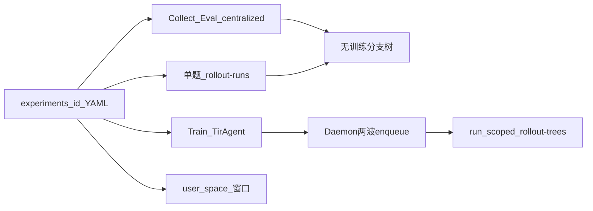

# Science Studio 技术框架

日期：2026-10-01

本文描述当前仓库的边界、三条运行时、Control API 和模块落点。不以愿景替代代码事实。产品原则见 [design.md](../design.md)；层边界见 [LAYER_LAYOUT.md](./LAYER_LAYOUT.md)；操作见 [UI_USER_MANUAL.md](./UI_USER_MANUAL.md)。

## 1. 边界

```text
┌─────────────────────────────────────────────────────────────┐
│  Control / UI                                                │
│  science_infra/ + webui/ + experiments/<id>/*.yaml           │
└───────────────────────────┬─────────────────────────────────┘
                            │ REST / SSE / 子进程
┌───────────────────────────▼─────────────────────────────────┐
│  MAS                                                         │
│  mas/workflow  ·  mas/tir_agent.py  ·  mas/tools             │
│  sidecar: mas/workflow/user_gateway  →  user_space/          │
│  产出：Trajectory / Archive / SamplePolicy.sites             │
└───────────────────────────┬─────────────────────────────────┘
                            │ TrajectoryBatch / TrainSignal
┌───────────────────────────▼─────────────────────────────────┐
│  RL 钩子（本仓可改）                                          │
│  rl/rewards · rl/loss · rl/train_signal · rl/hooks/*         │
└───────────────────────────┬─────────────────────────────────┘
                            │ emit_reward / Hydra overlay
┌───────────────────────────▼─────────────────────────────────┐
│  AGL 黑盒（勿 fork）                                          │
│  agent-lightning: Trainer / VERL / Store / LitAgent 基类      │
└─────────────────────────────────────────────────────────────┘
```

硬边界：

1. `mas/workflow/` 不 import AGL / VERL / Ray。`user_gateway` 同样守这条线。
2. 画布只产 MASSpec YAML（schema 0.3），不生成 LangGraph。
3. 不改 `agent-lightning/` 源码。可改钩子在 `rl/hooks/`。
4. rollout / resume 协议字段保留：`role`、`resume_boundary`、`verdict_list`。
5. Assistant 写入只限 `user_space/projects/<id>/`。

兼容 shim：`mas/workflow/rewards.py` → `rl.rewards.outcome`；`mas/workflow/train_signal.py` → `rl.loss` + `rl.train_signal`；`mas/algos/*` → `rl.hooks.*`。

## 2. 三条运行时

画布上的中心化图是 `planner → router → tool-agent pool → verifier`。这张图**不会**在三条路径里被同一套代码重放。


```mermaid
flowchart LR
  yaml[experiments_id_YAML]
  yaml --> collect[Collect_Eval_centralized]
  yaml --> debug[单题_rollout-runs]
  yaml --> train[Train_TirAgent]
  yaml --> user[user_space_窗口]
  collect --> treeOff[无训练分支树]
  debug --> treeOff
  train --> daemon[Daemon两波enqueue]
  daemon --> trees[run_scoped_rollout-trees]
```

| 路径 | 入口 | 执行 | 分支树 |
|------|------|------|--------|
| Collect / 批量测试 | `science-infra collect` 或 `POST /api/mas/eval-runs` | live 且有 router 时走 [`centralized_runtime.py`](../mas/workflow/centralized_runtime.py)；**mock 不走 centralized** | 无 |
| 单题调试 | `POST /api/mas/rollout-runs` | 同上，产物在 `artifacts/rollout-runs/` | 无 |
| 训练 | `POST /api/rl/runs` → [`train_tir_agent.py`](../mas/train_tir_agent.py) | [`LitTirAgent.rollout`](../mas/lit_tir_agent.py) 只调 `run_episode`（单 hub TirAgent）+ YAML 声明的 BranchSite | 有（arpo/aepo/rae） |

另有平行栈 [`train_mas_agent.py`](../mas/train_mas_agent.py)（StructAgent JSON chat）。产品 UI 不走这条，命令行可单独启。

user_space：上传或 Assistant scaffold 把 HIVE / EPC-AW 收成 PEV 窗口，`profile.backend: user_space`。执行时 [`user_gateway`](../mas/workflow/user_gateway/) 隔离加载 `run_window`，不污染 `mas/workflow` 的 AGL 边界。

## 3. 采样

声明在 `workflow.sampling`：`mode`、`group_n`、`beam_size`、`sites[]`。

设计期：[`site_policy.sampling_preview`](../mas/workflow/site_policy.py) ← [`mas/workflow/sampling/`](../mas/workflow/sampling/) adapters。UI Sampling 画布和 `POST /api/mas/sampling/preview` 用同一套机会表。候选是 agent / verifier / router / on_edge，**不按 tool 展开**。

运行期（仅训练）：`SamplePolicy.sites` → [`ActiveSetSession.plan_forks_from_raw`](../mas/workflow/active_set.py) → [`rl/hooks/daemon.py`](../rl/hooks/daemon.py) 第二波 enqueue。第一波 `group_n` 条独立采样；第二波从断点 `resume_messages` 续写，补齐到组大小。

锚点：`after_agent_turn`（planner / blank / router）、`after_verifier`、`on_edge`。旧 YAML 里的 `after_tool` 不再作为设计期机会。

训练算法 [`VALID_ALGOS`](../science_infra/control/experiments.py)：`grpo, arpo, aepo, igpo, gigpo, rae`。UI 采样模式 `appo` 保存时映射为 `arpo`（[`normalizeRlPayload.ts`](../webui/src/features/rl/model/normalizeRlPayload.ts)）。

树落盘：Daemon 写出 `mas/.local_expansion/tree_*.json`。前端主路径是 `GET /api/rl/runs/{runId}/rollout-trees`。`GET /api/mas/rollout-trees` 仍扫描全局目录，给调试用。

细节：[ROLLOUT_SAMPLING.md](./ROLLOUT_SAMPLING.md)、[BRANCH_SITE_DESIGN.md](./BRANCH_SITE_DESIGN.md)。

## 4. Control API

`science-infra serve` / `./run.sh ui` → [`science_infra/control/app.py`](../science_infra/control/app.py)。完整表见 OpenAPI `/docs`。

| 组 | 路径 | 用途 |
|----|------|------|
| 实验 | `/api/experiments`、`PUT /{id}/{section}` | 五段 YAML bundle |
| 元数据 | `/api/meta`、`/api/gpus`、`/api/health` | algos、插件、GPU |
| 画布 | `/api/mas/palette`、`POST /api/mas/sampling/preview` | 模板、工具、用户项目、站点预览 |
| 单题 | `/api/mas/rollout-runs` | 画布调试 |
| 批量测试 | `/api/mas/eval-sources`、`POST /api/mas/eval-runs` | 顶栏「测试」；`kind=eval` |
| 采集 | `POST /api/mas/collect` | CLI / 脚本；WebUI 无入口 |
| 训练 | `POST /api/rl/runs`、`/api/rl/preflight`、`/api/mas/readiness` | UI 主路径。旧 `POST /api/rl/train` 仍在 |
| 运行 | `/api/rl/runs`、`/activity`、`/{id}/log`、`/events`、`/snapshot` | 列表默认 `kinds=train` |
| 采样树 | `/api/rl/runs/{id}/rollout-trees` | 采样结果页 |
| 资源 | `/api/model-resources`、`/api/dataset-resources` | 模型目录、数据集 |
| 助手 | `/api/assistant/*` | 流式 chat、上传、scaffold、apply |
| 监控 | `/api/monitor/{exp}`、`GET /api/events` | 曲线 + SSE |

WebUI 训练启动走 `launch_training`（preflight revision），不是直接点旧 `/api/rl/train`。

## 5. 模块索引

### Control / UI

| 模块 | 路径 |
|------|------|
| FastAPI 入口 | `science_infra/control/app.py` |
| 实验 bundle | `science_infra/control/experiments.py` |
| 子进程 | `science_infra/control/process_manager.py` |
| 单题 / eval | `science_infra/control/rollout_runs.py` |
| 训练计划 | `science_infra/control/training.py` |
| 模型 / 数据 | `science_infra/control/model_resources.py`、`dataset_resources.py` |
| Assistant | `science_infra/control/assistant.py`、`user_projects.py` |
| CLI | `science_infra/ui/cli.py` |
| 画布 | `webui/src/pages/MAS.tsx`、`features/mas/`、`features/sampling/` |
| 顶栏保存 | `webui/src/features/experiment/saveExperiment.ts` |

### MAS

| 模块 | 路径 |
|------|------|
| MASSpec | `mas/workflow/spec.py` |
| 合同 | `mas/workflow/contracts.py` |
| 编译 | `mas/workflow/compiler.py` |
| 门面 | `mas/workflow/runtime.py`（`ExecutionService`） |
| 中心化执行 | `mas/workflow/centralized_runtime.py` |
| 协议 / 路由 | `mas/workflow/protocol.py`、`router.py` |
| 采集 | `mas/workflow/collector.py` |
| ActiveSet | `mas/workflow/active_set.py` |
| 采样 adapter | `mas/workflow/sampling/`、`site_policy.py` |
| 模板 | `mas/workflow/templates.py`、`mas/specs/templates/` |
| User gateway | `mas/workflow/user_gateway/`（`hive.py`、`epc_aw.py`） |
| Harness | `mas/workflow/harness.py` |
| TirAgent | `mas/tir_agent.py` |
| Tool agents | `mas/tools/tool_agents.py`（kernel / llm / `user_space`；`lite`/`pro`） |
| 训练入口 | `mas/train_tir_agent.py`、`mas/lit_tir_agent.py` |

### RL

| 模块 | 路径 |
|------|------|
| reward | `rl/rewards/outcome.py` |
| overlay | `rl/hooks/overlay.py` |
| Daemon | `rl/hooks/daemon.py` |
| TrainSignal | `rl/train_signal.py`、`rl/loss.py` |

## 6. 仓库布局

```text
MAS_Science_Infra/
├── science_infra/     # Control + CLI
├── webui/             # Science Studio
├── mas/               # 规格、运行时、TirAgent、user_gateway
├── rl/                # 可改 RL 钩子
├── experiments/       # 五段 YAML
├── user_space/        # 用户项目
├── agent-lightning/   # 黑盒 submodule
├── scripts/           # feature_test、arpo_train_verify、转发器
└── docs/
```

实验目录：`experiments/<id>/{experiment,llm,workflow,rl,harness}.yaml`。

## 7. 已知差距

- 画布 PEV 图在 Collect/eval 里执行，训练热路径不原样重放（单 hub TirAgent + YAML 声明的 BranchSite）。
- mock collect 不走 `centralized_runtime`。
- `topology: decentralized` 无实现。
- 独立 `Episode` / `Diagnostic` / `Intervention` 合同未冻结；Harness 仍是 Hypothesis。
- 无 Experiment 生命周期状态机，无 Control fork API。
- `train_mas_agent` 与 Tir 训练栈并存，UI 只接 Tir。
- user_space 窗口走 centralized + gateway，未接入 Tir 训练热路径。
- VERL 循环按 `total_epochs × dataloader` 迭代，`total_training_steps` 只做早停。`ensure_trainer_horizon` 会把 epochs 抬到至少等于 steps，否则 `steps=3, epochs=1` 会在 1/3 处以 rc=0 退出。
- Tir 现已在每次 hub LLM 回复后发 `after_agent_turn`；`after_verifier` 仍取决于 verifier 是否真正跑过，训练里不保证。

## 8. 测试入口

```bash
./run.sh feature-test --list
./run.sh feature-test functional user-space studio
./run.sh smoke
./run.sh arpo-train-test --steps 3 --timeout 1800
```

域和用例数以 `--list` 为准。本轮 `feature-test --all` 与 `smoke` 全绿。GPU：run `2d32648f58c0`，3 step，`branch_local_count` 5/3/6，采样树 API 30 棵 / 8 条分支。手册：[ARPO_TRAIN_TEST.md](./ARPO_TRAIN_TEST.md)。
