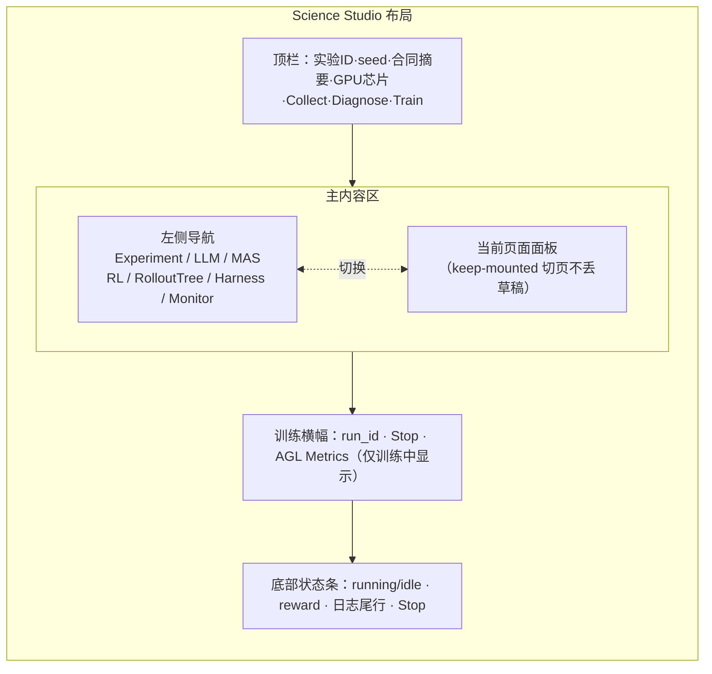
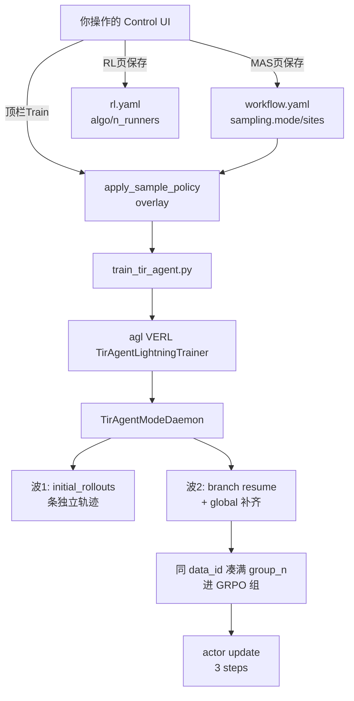

# Science Control UI 使用手册

日期：2026-09-20

本手册面向使用者，覆盖 **Science Control UI**（`webui/` + `science_infra/control/`）的全部模块介绍、参数设置教程，以及「跑一个典型例子：ARPO 训练」的端到端操作步骤。

相关文档（本文不重复展开，需要时交叉引用）：

- [CONTROL_UI.md](./CONTROL_UI.md) — 控制面落地说明与 API 一览
- [ROLLOUT_SAMPLING.md](./ROLLOUT_SAMPLING.md) — 采样语义（独立 rollout / branch / beam_size）
- [SAMPLING_ARPO_APPO.md](./SAMPLING_ARPO_APPO.md) — 官方 ARPO/APPO 与 MAS 的机制对照
- [ARPO_TRAIN_TEST.md](./ARPO_TRAIN_TEST.md) — ARPO 训练端到端测试手册（CLI 视角）
- [BRANCH_ROLLOUT_UI_TEST.md](./BRANCH_ROLLOUT_UI_TEST.md) — Branch / RAE 验收清单（防假绿）
- [ROLLOUT_SAMPLING_UI_TEST.md](./ROLLOUT_SAMPLING_UI_TEST.md) — Rollout Sampling 小窗手测表

---

## 目录

1. [快速开始](#1-快速开始)
2. [界面总览](#2-界面总览)
3. [各模块详解](#3-各模块详解)
   - 3.1 [顶栏与全局操作](#31-顶栏与全局操作)
   - 3.2 [Experiment 页](#32-experiment-页)
   - 3.3 [LLM 页](#33-llm-页)
   - 3.4 [MAS 页（画布 + Rollout Sampling 小窗）](#34-mas-页)
   - 3.5 [RL 页](#35-rl-页)
   - 3.6 [RolloutTree 页](#36-rollouttree-页)
   - 3.7 [Harness 页](#37-harness-页)
   - 3.8 [Monitor 页](#38-monitor-页)
4. [参数设置教程](#4-参数设置教程)
5. [典型例子：跑一次 ARPO 训练](#5-典型例子跑一次-arpo-训练)
6. [常见问题 FAQ](#6-常见问题-faq)

---

## 1. 快速开始

### 1.1 启动 UI

总命令（仓库 uv `.venv`，不要用 miniconda）：

```bash
./run.sh ui                    # 前台启动（首次会自动 npm build webui）
./run.sh ui --port 8787 --rebuild  # 指定端口并强制重建前端
./run.sh ui --daemon           # 后台启动；日志在 artifacts/run_smoke/ui.log
./run.sh ui --stop             # 停止后台 UI
```

启动后浏览器打开 [http://127.0.0.1:8787/](http://127.0.0.1:8787/)；后端 API 文档在 `/docs`。

`./run.sh ui` 等价于：

```bash
# 由 run.sh 自动完成：
#   .venv/bin/science-infra serve --host 0.0.0.0 --port 8787
cd webui && npm install && npm run build && cd ..
```

### 1.2 前置条件

| 依赖 | 说明 | 缺失时的症状 |
|------|------|------------|
| uv `.venv` | `bash scripts/setup_uv_env.sh` 创建（Python 3.11） | `run.sh` 报「未找到 uv 虚拟环境」 |
| npm | 构建 `webui/dist` | `run.sh ui` 报「启动 UI 需要 npm」 |
| `.env` API 配置 | `OPENAI_API_KEY / OPENAI_API_BASE / OPENAI_MODEL`（live Collect 用） | Collect (live) 失败 |
| GPU + nvidia-smi | 仅训练需要 | Train 被拒；`./run.sh train` 报错 |
| `data/*.parquet` | `mas/scripts/prepare_data.sh` 生成 | 训练报「缺少 parquet」 |
| 本地模型 | `LLM/Qwen3-4B`（local LLM 与 RL 训练的 `model_path`） | local 模式 / 训练失败 |

### 1.3 最小验证路径

```bash
./run.sh ui --daemon          # L0.1 起 UI
# 浏览器选实验（如 arpo_e2e）
./run.sh ui-test --no-train   # L0.3 测 GPU/RL 控制 API 活着
```

代码更新后 **必须重启 UI**（`./run.sh ui --stop && ./run.sh ui --daemon`），否则 palette 可能缺少 `rae` 等新选项、Collect 可能拒绝 `sites`。

### 1.4 AutoDL 公网访问（6006 → 8787 转发器）

AutoDL 实例的公网入口固定在 6006 端口（HTTP），而 Control UI 跑在容器内 8787。若「我的云程序」里映射到 6006 的是 JupyterLab 等其他服务，UI 就无法从公网打开。用仓库自带 TCP 转发器解决（`scripts/ui_public_forwarder.py`，纯标准库，支持 SSE 长连接透传）：

```bash
# 先在 AutoDL「我的云程序」里停掉占用 6006 的实例（如 JupyterLab）
nohup python3 scripts/ui_public_forwarder.py --listen 6006 --target 127.0.0.1:8787 \
  > artifacts/ui_forwarder.log 2>&1 &
```

之后用 AutoDL 给出的公网地址（`https://xxx.gpushare.com:6006/` 形式）直接访问 Control UI，SSE 实时事件（`rollout_tree` / 状态 chip）也能正常透传。不用时 `pkill -f ui_public_forwarder` 并把 JupyterLab 映射恢复即可。

> 注意：浏览器打开 UI 建议用**外部浏览器**（Chrome/Edge/Firefox）。IDE 内嵌 webview 有每域名 6 连接的 HTTP/1.1 硬上限，UI 两条 SSE 长连接 + RolloutTree 轮询容易把请求饿死（见 FAQ Q12）。

---

## 2. 界面总览

整体布局：左侧导航 + 顶部工具栏 + 主内容区 + 底部状态条。



### 2.1 顶栏

从左到右：

| 元素 | 内容 | 来源 |
|------|------|------|
| 实验标识 | `<experiment_id>` + `seed=<n>` | `experiment.yaml` |
| 合同摘要 | `入口=hub · 可训=[hub] · GPU=0 · n=2 · runners=1` | 汇总 workflow/rl |
| GPU 芯片 | 每张卡一个按钮（`GPU 0 · 45%` 带利用率条），点选/取消 | `GET /api/gpus`；写入 `rl.devices.ids` |
| Collect | mock 采集 1 条（会先保存 workflow） | `POST /api/mas/collect {mock:true}` |
| Diagnose | 对最近 Collect 跑 Harness 诊断 | `POST /api/harness/diagnose` |
| Train | 启动训练（有确认弹窗；会停本地 vLLM） | `POST /api/rl/train` |
| 状态 chip | `train running` / 最近事件（如 `collect_done`） | SSE `/api/events` |

合同摘要字段含义：

- **入口**：`workflow.entry_agent` — Episode 从哪个 Agent 开始。
- **可训**：`agents[].trainable=true` 的列表 — 训练时映射 `--active-agent`。
- **GPU**：`rl.devices.ids` — 即 `CUDA_VISIBLE_DEVICES`。
- **n**：每题采样条数（GRPO 组大小，`rollout.n`）。
- **runners**：并行采集进程数 `n_runners`。

### 2.2 左侧导航（7 个页面）

| 页面 | 职责 | 写哪个 YAML |
|------|------|-----------|
| Experiment | 实验 切换/新建/seed | `experiment.yaml` |
| LLM | 推理后端：API / 本地 vLLM / RL endpoint | `llm.yaml`（密钥进 `.secrets.env`） |
| MAS | Agent 图编辑 + Rollout Sampling 小窗 + Collect | `workflow.yaml` |
| RL | 训练超参 + 启停训练 + 日志 | `rl.yaml` |
| RolloutTree | 每 query 一棵 rollout 树可视化（只读） | — |
| Harness | 诊断插件勾选 + hypotheses | `harness.yaml` |
| Monitor | reward 曲线 / 轨迹表 / 训练日志 | — |

App 启动时会查 `GET /api/runs`：若存在**活跃（或最近）的 train run** 且其实验 ≠ 当前所选，自动切换到该实验（提示 chip `auto-selected <exp>`），保证 RL 日志 / RolloutTree / Monitor 反映当前真正在跑的 run（2026-09-20 起）。

### 2.3 训练横幅与底部状态条

训练运行时主内容区上方出现横幅：`run=<run_id>`、**Stop**（中断训练）、**AGL Metrics**（训练中 LightningStore 存活时才可点，同源打开 `/agl/metrics`）。

底部状态条常驻：`running/idle` 状态 chip、`reward=<mean_reward>`（Monitor 数据）、最近日志尾行（悬停看全文）、训练中额外显示 Stop。

### 2.4 「切页不丢草稿」机制

七个面板在 `App` 里 **keep-mounted**（`display:none` 切换，不卸载）。因此：

- 未点保存的草稿（RL 数字、MAS 图、LLM 密钥框、Harness 勾选、Experiment seed）切 Tab 后仍在，对应面板会显示「未保存」chip。
- 仅在 **切换 experiment_id** 时才会用磁盘 YAML 覆盖本地草稿。
- 顶栏 Collect / 勾 GPU 会 `reload()` bundle，但不会把未保存数字打回 YAML。
- 训练 `run_id` / stdout 提升到 App 全局轮询（4s），切走 RL 再回来训练仍显示 running，可 Stop。

---

## 3. 各模块详解

### 3.1 顶栏与全局操作

已在 §2.1 介绍元素布局，这里补充操作要点：

- **GPU 芯片**：点击切换选中；至少保留一张（取消最后一张会自动保留一张）。悬停显示显存/利用率。保存即写 `rl.devices.ids` 与 `trainer.n_gpus_per_node`。
- **Collect**：mock 模式，n=1，用于快速验证 workflow 可执行并产生 `artifacts/collect.json`（供 Monitor / Diagnose 使用）。图非法（`executable=false`）时按钮禁用。
- **Diagnose**：对最近一次 Collect 的产物跑 Harness 插件诊断。
- **Train**：等价 RL 页「一键启动训练」；确认弹窗提示「启动训练将停止本地 LLM（若在跑）」。

### 3.2 Experiment 页

**功能**：管理实验（一个实验 = `experiments/<id>/` 目录，含 5 个 YAML + `artifacts/`）。

**操作**：

1. **当前实验**下拉切换（切换会用磁盘 YAML 覆盖所有面板草稿，注意先保存）。
2. 编辑 **name** / **seed** → 「保存 experiment.yaml」。
3. **新建实验**：输入新 exp id → 「创建」（默认 seed=42）。
4. 底部显示 `path=... · topology=... · executable/blocked` 状态 chip。

**字段表**：

| UI 字段 | YAML 字段 | 说明 |
|---------|----------|------|
| name | `experiment.name` | 展示名 |
| seed | `experiment.seed` | 随机种子（默认 42） |
| agl_metrics_url | — | 只读，固定同源 `/agl/metrics` |

### 3.3 LLM 页

**功能**：配置推理后端。三种模式：

| 模式 | 用途 | 可用阶段 |
|------|------|---------|
| `api` | 第三方 OpenAI 兼容 API（如 dmxapi 的 qwen3.5-27b） | Collect (live) / 诊断 |
| `local` | 一键启动本地 vLLM（占 GPU） | Collect (live)；**与训练互斥** |
| `rl_endpoint` | 训练时由 Agent-Lightning ProxyLLM 注入 | 仅训练中；Collect 阶段不可用 |

**api 模式字段**：

| 字段 | YAML | 说明 |
|------|------|------|
| model | `llm.model` | 模型名，如 `qwen3.5-27b` |
| base_url | `llm.base_url` | 如 `https://www.dmxapi.cn/v1/` |
| API Key | 写入 `.secrets.env` | 输入框 password 型，**不回显**；已配置时显示 `••••（已配置）` |

**local 模式额外字段**：

| 字段 | YAML | 默认 | 说明 |
|------|------|------|------|
| model_path | `llm.model_path` | — | 本地权重路径，如 `LLM/Qwen3-4B` |
| port | `llm.port` | 8000 | vLLM OpenAI 端口 |
| gpu_memory_utilization | `llm.gpu_memory_utilization` | 0.45 | 显存占用比例 |

**操作按钮**：

- 「保存 llm.yaml」
- 「探测连接」：POST `/api/llm/health`，返回 ok / 错误码
- local 模式额外有：「一键启动 LLM」（先保存再启动 vLLM 子进程）、「停止 LLM」

注意：训练启动会自动停止本地 vLLM（Train 与本地 LLM 抢 GPU）。

### 3.4 MAS 页

MAS 页是核心编辑区，从上到下分三块：**主画布**（React Flow 图编辑器）、**Rollout Sampling 小窗**（分支采样声明）、**live-api-data 采集卡**。

#### 3.4.1 主画布（MasGraphEditor）

**添加节点（W2 统一 Agent palette，2026-09-20 起）**：左侧「添加」区把过去按角色拆分的多个 Agent 分类合并为**单一 Agent 分类**，按钮直接由后端 `GET /api/mas/palette` 的 `agent_templates` 渲染（6 种模板），Tool 列表改由 `tool_agents`（后端注册表）渲染：

| 模板按钮 | kind / role | hint | 说明 |
|------|------|------|------|
| `+ [tool] Tool Agent` | `tool` | 封装工具为 agent，可开 LLM 后端 | 工具 Agent 节点（双后端 pure/epc_aw llm） |
| `+ [blank] 空白 Agent` | `blank` | 自定义 profile 多专家 | 只带 profile（system_prompt / skills / memory_scope），经 router 候选 `blank:<id>` 以 tool-call shell 单跳执行（W1） |
| `+ [verifier] Verifier` | `verifier` | 校验上游产出并反馈 | 自动带 `verifier` skill，连 feedback 边回 hub 成回路 |
| `+ [planner] Planner` | `planner` | 任务分解与派发 | 默认 `react_loop` skill |
| `+ [hub] Hub` | `hub` | ReAct 主循环入口 | 默认 `react_loop` skill；可设采集入口 / trainable |
| `+ [router] Router` | `router` | 多专家路由 | 菱形节点（W5 起独立于 Agent 分类，仍单列） |

- 模板缺省时（老后端）自动回退到旧的 `palette.roles` 角色按钮，不破坏兼容。
- Tool 按钮：从 `tool_agents` 列表渲染（含 `(llm)` 标注 `llm_required` 的后端）。
- 模板按钮：一键应用「Hub ReAct (executable)」等预置 workflow。
- **blank agent 用法（W1）**：拖入空白 Agent 模板 → Inspector 填 `system_prompt`、profile skills、`memory_scope` → 在 router 节点候选里选它（编译器同时接受裸 id 与 `blank:` 前缀两种写法，UI 写带前缀形式）。运行时该 agent 以单次 LLM 调用执行（该 agent 自己的 system_prompt + 会话历史 + 输入），window_events 标 `agent_kind=blank`。

**连线**：从节点输出锚点拖到目标节点。连线前可选 kind：

| kind | 语义 | 合法方向 |
|------|------|---------|
| `message` | 消息传递 | Agent ↔ Agent |
| `route` | 路由（目标只能有一条入 route） | Agent → Agent |
| `feedback` | 反馈回路（如 verifier→hub） | Agent → Agent |
| `tool_call` | 工具调用 | Agent → Tool（连到 Tool 时自动设为 tool_call） |
| `sample_barrier` | 声明「允许在此屏障 fork」（不做 UI beam） | 边语义 |

非法边（如 Agent↔Agent 的 `tool_call`）保存后 Collect 会返回 400，画布上会显示 `not executable: <原因>` chip。

**采集入口 pin**：把「采集入口」按钮拖到某个 Agent 上，表示 Episode 从该节点开始（`workflow.entry_agent`）。也可以在节点属性里点「设为采集入口」。

**节点属性 Inspector**（点选节点后右侧卡片）：

| 字段 | 说明 |
|------|------|
| role | agent 角色 |
| system prompt (profile) | 系统提示词 |
| skills | 逗号分隔，如 `react_loop`、`verifier` |
| tools | 复选框勾选该 agent 可用的工具 |
| 参与 RL（trainable） | 是否可训练 → 训练 `--active-agent` |
| 设为采集入口 | 等价拖 pin |
| verify skill（仅 hub） | 选 verifier skill 开启校验回路（空=关闭） |

**训练简参**（入口节点的 details 折叠区）：每题采样条数（GRPO 组大小）、n_runners——直接写 `rl.yaml`，**不要**画成图节点。

#### 3.4.2 Rollout Sampling 小窗（重点）

主画布下方的轨迹条 + 迷你 Inspector，是声明 **分支采样策略**（`workflow.yaml` 的 `sampling`）的主交互。

**顶栏三个旋钮**：

| 旋钮 | 写入 | 含义 |
|------|------|------|
| mode | `sampling.mode` | `grpo_n` / `arpo` / `aepo` / `appo` / `rae` |
| group_n | `sampling.group_n` | 每题最终凑满的完整轨迹条数（GRPO 组大小） |
| beam_size | `sampling.beam_size` | 从一个中间 snapshot 最多再开几条 branch（详见 [ROLLOUT_SAMPLING.md](./ROLLOUT_SAMPLING.md) §5） |

**轨迹条**：横向展示简化轨迹 `start → agent… → verify → end`。点击某个 agent 屏障节点后，下方出现该站点的配置行：

| 控件 | 写入 | 说明 |
|------|------|------|
| 启用 branch | `sites[].enabled` | 该屏障点允许 fork |
| gate | `sites[].gate.type` | 9 种：`entropy_delta`（推荐）/ `dual_entropy` / `always` / `tool_ok` / `tool_error` / `verifier_pass` / `verifier_fail` / `contradiction` / `failure_trigger` |
| reward | `sites[].reward.scheme` | `scalar_grpo`（R0）或 `rae_adjudicate`（R1，RAE 裁决） |
| beam | `sites[].fork.beam_size` | 该站点分支数（默认 2） |

**采样选点（anchor）与触发时机**：站点的 `anchor.kind` 支持 `after_tool`（工具调用后，需选 tool_id）/ `after_agent_turn`（agent 轮次后）/ `after_verifier`（verifier 裁决后）/ `on_token`（token 级，Advanced）/ `after_edge`（指定边后，需 edge_id）；`when` 支持 `first`（首个匹配）/ `nth`（第 nth 次，配合 `nth` 参数）/ `all`（每次匹配都采样）。这 5×3 组合均经 API 持久化回归验证（2026-09-19）。

勾「展开 tool 屏障」可把 tool 边界（如 `after execute_python`）也列为可点站点。

保存后这些写入 `workflow.yaml` 的 `sampling.sites`，画布上对应节点出现 `branch:<gate>` 角标（蓝色边框）。

**Branch Rollout 站点（Advanced）**：节点属性卡下方的折叠区，列出全部候选站点（含 `on_token` token 级候选、`on_edge` barrier 边候选），并可设 `fork.resume_mode`：

- `messages`（默认）：从对话消息前缀续写
- `token_prefix`（Advanced）：token 前缀续写；**注意**训练侧无 token 引擎时会降级 messages 并打 `resume_mode_downgraded`，属已知合同行为

#### 3.4.3 Collect 操作区

**卡片一（Workflow 卡底部）**：

| 控件 | 说明 |
|------|------|
| 保存 workflow.yaml | 序列化画布 + sampling |
| 采集条数 n | mock/live Collect 的每题轨迹条数 |
| algo | 写入 TrainSignal 的 advantage 名（如 `arpo`/`rae`） |
| Collect (mock) | 假 LLM，验证 wiring（**不做**树分支） |
| Collect (live) | 真实 LLM 跑 n 条 |

**卡片二（live-api-data）**：对齐 `./run.sh live-api-data`，从 parquet 抽题经 API 跑：

| 字段 | 默认 | 说明 |
|------|------|------|
| parquet | `data/val.parquet` | 数据源 |
| data_n | 5 | 抽取条数 |
| source | `gsm8k` | 按任务来源过滤 |

结果表列出 group / idx / id / answer / reward / branch / tool。产物写入 `experiments/<id>/artifacts/collect.json`。

**防假绿提醒**（详见 [BRANCH_ROLLOUT_UI_TEST.md](./BRANCH_ROLLOUT_UI_TEST.md) §0）：Collect 成功（含 mock）**不等于**树分支真的发生。真 branch 只在训练 Daemon（`tir_algo∈{arpo,aepo,rae}`）里出现。

### 3.5 RL 页

**功能**：训练超参编辑 + 训练启停 + 日志 tail。

**基本字段**：

| 字段 | YAML | 说明 |
|------|------|------|
| algo | `rl.algo` | `grpo` / `arpo` / `aepo` / `appo` / `rae`（`/api/meta` 提供，即 `VALID_ALGOS`） |
| profile | `rl.profile` | `fast` / `a800` / `a800_2gpu` 资源档位 |
| 每题采样条数 | `rl.rollout_per_gpu` → `actor_rollout_ref.rollout.n` | GRPO 组大小 |
| 并行采集进程 | `rl.n_runners` | rollout runner 进程数 |
| model_path | `rl.model_path` | 训练模型权重（如 `LLM/Qwen3-4B`） |

占用卡数 = 顶栏已勾 GPU 数（保存时自动写 `trainer.n_gpus_per_node`）。

**高级 Hydra 字段**（「高级 Hydra 字段」按钮展开）：

| 字段（UI 标签） | YAML 路径 |
|---------------|----------|
| actor.optim.lr | `actor_rollout_ref.actor.optim.lr` |
| clip_ratio_low / high | `actor_rollout_ref.actor.clip_ratio_low/high` |
| entropy_coeff / kl_loss_coef | 同名 |
| train_batch_size | `data.train_batch_size` |
| rollout.n | `actor_rollout_ref.rollout.n` |
| gpu_memory_utilization | `actor_rollout_ref.rollout.gpu_memory_utilization` |
| n_gpus_per_node / total_epochs / experiment_name | `trainer.*` |

**操作按钮**：

- 「按当前机器推荐」：按 `GET /api/gpus` 的 `recommend` 档位预填（1 卡时 `a800_2gpu` 自动降为 `a800`/`fast`），需点保存
- 「保存超参」：写 `rl.yaml`
- 「从 TrainSignal 预填」：把 Monitor 里最近 Collect 的 TrainSignal（advantage 名、clip_ratio、entropy_coeff 等）预填进表单，需点保存
- 「一键启动训练」：先保存再 Train（确认弹窗；会停本地 vLLM）
- 「一键中断训练」：Stop
- 「打开 AGL Metrics」：训练中 LightningStore 存活时可点
- 「刷新日志」：拉取训练 stdout tail（页面底部 `<pre>` 展示）

### 3.6 RolloutTree 页

**功能**：可视化每条 query 的 rollout 树，只读。

**数据源（2026-09-20 起）**：`GET /api/mas/rollout-trees` 双源合并——

1. **优先**：Daemon 训练期落盘的 `mas/.local_expansion/tree_<tree_id>.json`（`_persist_rollout_tree`，平铺格式）。child 节点 id 是**真实的 Store rollout id**，点进训练 rollout 日志能对上号。
2. 补充：runner 侧展开文件 `mas/.local_expansion/<rollout_id>.json`（同 `tree_id` 已被 daemon 树覆盖时**去重跳过**；无有效节点的退化树**过滤**，不再出现在列表里）。

- 树 chip 列表切换：每棵树按 `tree_id` 前 14 位展示；显示 `file / nodes / leaves / query` 概要。
- 节点标注：`node_id` + 关键 metrics（`event_kind`、`h_tool`、`site_id`、`reward_scheme`）+ `r=<reward>` + verdict。
- SSE 实时更新：训练/采集进程写入新节点或 outcome 时顶部出现绿色 chip（如 `node_added · nodes=12`），loss 事件会显示前 4 个 metric。
- 每 8 秒自动刷新（仅页面可见时）。

**心智模型**：root=query，叶子=outcome。Collect 产出为单链树（**树≠branch**）；**真分支树在训练进行中就会出现**——Daemon ready_batch 增量 enqueue 路径每合入一棵新树即落盘 `tree_*.json` 并发 `node_added` SSE 帧（不再需要等训练完全结束或手动跑 `branch-ui-test --train`）。离线复核命令：`.venv/bin/python scripts/rollout_tree_verify.py`（5/5 PASS 判据见 §5.11）。

### 3.7 Harness 页

**功能**：选择诊断插件并运行。

**可用插件**（`/api/meta` 的 `harness_plugins`）：

| 插件 | 状态 |
|------|------|
| log_error | 可用 |
| loss_volatility | 可用 |
| cognitive_convergence | 可用 |
| reward_hacking | 可用 |
| epc_aw_consensus | **stub**（复选框禁用） |

**操作**：

1. 勾选插件 → 「保存」（写 `harness.yaml` 的 `plugins`）
2. 「对最近 Collect 诊断」：保存后跑 `POST /api/harness/diagnose`，表格列出 plugin / event_id / message（hypotheses）

### 3.8 Monitor 页

**功能**：实验观测中枢，自动轮询（4s）。

**统计 chip 行**：`collect n` / `collect mean` / `sampling mode` / `group_n` / `train pts` / `errors`。

**卡片**：

1. **训练日志**：stdout tail（`experiments/<id>/artifacts/runs/<run>/stdout.log`；Control 重启后从磁盘恢复）。训练中可开 AGL Metrics。
2. **训练 Reward（AGL）**：训练步 reward 曲线（与 AGL Metrics 同源）；训练中读 LightningStore。**2026-09-20 起支持离线回落**：训练结束（LightningStore 关闭）后曲线**不再消失**，后端自动回落到 `mas/checkpoints/AgentLightning/<exp>/metrics.jsonl` 续供历史 step 序列（重启 UI 生效）。无训练记录时为空，提示「等第一批 episode 结束」。
3. **Collect Reward**：MAS 采集的 reward 曲线（**不是**训练步）。
4. **Trajectories（按 group 分组）**：表列 group / idx / id / reward / branch / format / answer；点击行展开该轨迹完整 Events JSON。
5. **Harness**：hypotheses 表（可按 plugin 过滤）+ TrainSignal 摘要（advantage / loss 参数）。

---

## 4. 参数设置教程

### 4.1 UI 面板 → YAML → 生效代码 总表

| UI 位置 | 写入文件 | 生效字段/调用 |
|---------|---------|--------------|
| 顶栏 GPU 芯片 | `rl.yaml` | `devices.ids` → `CUDA_VISIBLE_DEVICES`；`trainer.n_gpus_per_node` |
| 顶栏 Collect/Diagnose/Train | — | `POST /api/mas/collect` / `/api/harness/diagnose` / `/api/rl/train` |
| Experiment 页 | `experiment.yaml` | `seed` / `name` |
| LLM 页 | `llm.yaml`（密钥进 `.secrets.env`） | Collector LLM；local 模式 vLLM start/stop |
| MAS 画布 + 小窗 | `workflow.yaml` | `agents/edges/entry_agent` + `sampling.{mode,group_n,beam_size,sites}` |
| MAS Inspector 训练简参 | `rl.yaml` | `rollout_per_gpu` / `n_runners` |
| RL 页 | `rl.yaml` | 全部超参；Train 时 overlay `algorithm.tir_algo` 等 |
| Harness 页 | `harness.yaml` | `plugins` → `HARNESS.diagnose` |
| Monitor / RolloutTree | — | 只读 `artifacts/collect.json` + 训练 stdout / `.local_expansion` |

保存动作永远是显式的（各页「保存」按钮）；切换页面不丢草稿但也不落盘。

### 4.2 三个易混旋钮辨析（勿混用「Rollout」一词）

| 说法 | 字段 | 在哪改 |
|------|------|-------|
| **采集入口**（Episode 从哪个 Agent 开始） | `workflow.entry_agent` | 画布拖「采集入口」pin 或 Inspector「设为采集入口」 |
| **可训练 Agent**（谁吃梯度） | `agents[].trainable` → `--active-agent` | 节点属性 Inspector 勾选 |
| **每题几条 / 并行进程** | `rl.rollout_per_gpu` / `rl.n_runners` | Inspector 训练简参或 RL 页 |

**不要**把 `rollout.n` 画成图节点。顶栏合同摘要是快速自检：`入口=hub · 可训=[hub] · GPU=0 · n=2 · runners=1`。

### 4.3 GPU / RL 旋钮

| 用户说法 | 字段 |
|---------|------|
| 选用哪些卡 | `rl.devices.ids` → `CUDA_VISIBLE_DEVICES` |
| 训练占几张卡 | `trainer.n_gpus_per_node = len(ids)`（保存时自动同步） |
| 每题采几条 | `rollout_per_gpu` → `actor_rollout_ref.rollout.n` |
| 并行采集进程 | `n_runners` |

`GET /api/gpus` 返回本机 GPU 列表与推荐档位。1 卡机器选 `a800_2gpu` 会自动降为 `a800`/`fast`。

### 4.4 采样语义：mode / group_n / initial_rollouts / beam_size

以 `group_n=4`（每题凑满 4 条）、`initial_rollouts=2`（第一波独立跑 2 条）、`tir_algo=arpo` 为例：

```text
Q ──┬── P1 ──[tool]── suffix_A          波1（独立）
    └── P2 ──[tool']── suffix_B         波1（独立）

从 P1 的 [tool] 拷贝前缀:
        ├── B1 ── suffix_C              波2 branch（共享前缀，只采后段）
        └── B2 ── suffix_D              波2 branch
```

`beam_size` 数值效果（分支条件成立时）：

| beam_size | 波1 | remaining | n_branch | n_global | 结果 |
|-----------|-----|-----------|----------|----------|------|
| 1 | 2 | 2 | 1 | 1 | 1 条前缀续写 + 1 条从头再开 |
| 2 | 2 | 2 | 2 | 0 | 2 条都从同一 tool 后前缀续写 |
| 8 | 2 | 2 | 2 | 0 | 被 remaining 卡住，仍 2 条 branch |

若 gate 不过（如 ΔH 不足）：`n_branch=0`，剩余名额全部 global 独立重开（仍凑满 group_n）。

mode 速查：

| mode | 行为 |
|------|------|
| `grpo_n` | 无树分支；每题独立跑 group_n 条，组内相对优势 |
| `arpo` | 两波：initial 独立 → 熵门控 branch + global 补齐；分支轨迹进 GRPO 组 |
| `aepo` | 类 ARPO 但波 1 仅 1 条探针；按熵预算分配 branch/global |
| `appo` | 经 overlay **映射为** arpo 通道（分支行 advantage 置零的独立实现尚未完成） |
| `rae` | RAE 裁决链；site `reward.scheme=rae_adjudicate`，组内 k≥k_min 才出 verdict |

深入阅读：[ROLLOUT_SAMPLING.md](./ROLLOUT_SAMPLING.md)（§5 beam 详解、§8 任务池模型）、[SAMPLING_ARPO_APPO.md](./SAMPLING_ARPO_APPO.md)（与官方实现对照）。

---

## 5. 典型例子：跑一次 ARPO 训练

以实验 `experiments/arpo_e2e/`（已预置 `sampling.mode=arpo`、`group_n=4`、`total_training_steps=3`）为例，从 UI 全程走通 ARPO。CLI 等价命令见 [ARPO_TRAIN_TEST.md](./ARPO_TRAIN_TEST.md)。

### 5.1 端到端路径图



### 5.2 第一步：准备

```bash
nvidia-smi -L                                     # 确认 GPU
ls LLM/Qwen3-4B data/train.parquet data/val.parquet
# 缺数据时：
cd mas && TRAIN_LIMIT=32 VAL_LIMIT=8 bash scripts/prepare_data.sh
```

> 注意：当前仓库内 `data/{train,val}.parquet` 是 **5 行小样本**（为端到端快速验证而截断；2026-09-20 实测单 step ≈237s）。完整数据备份在 `data/*.full.parquet.bak`，恢复：`cp data/train.full.parquet.bak data/train.parquet && cp data/val.full.parquet.bak data/val.parquet`。小样本下 `experiments/arpo_e2e/rl.yaml` 的 `train_batch_size` 已同步调为 5。

`.env` 里配好 API（Collect live 用）：`OPENAI_API_KEY / OPENAI_API_BASE / OPENAI_MODEL`。

### 5.3 第二步：启动 UI 并选实验

```bash
./run.sh ui --daemon        # 后台；日志 artifacts/run_smoke/ui.log
```

浏览器打开 `http://127.0.0.1:8787/`，顶栏（或 Experiment 页）选实验 **`arpo_e2e`**。确认合同摘要出现 `入口=hub · 可训=[hub]`。

### 5.4 第三步：LLM 页

- Collect 验证用：模式选 `api`，填 `model=qwen3.5-27b`、`base_url=https://www.dmxapi.cn/v1/`、API Key → 「探测连接」ok 后「保存 llm.yaml」。
- 训练本身用本地权重（RL 页 `model_path`），不受此页影响；**训练启动会自动停掉本地 vLLM**，无需手动处理 `local` 模式。

### 5.5 第四步：MAS 页声明分支采样（Rollout Sampling 小窗）

1. 小窗顶栏：**mode=`arpo`**、**group_n=`4`**、**beam_size=`2`**。
2. 轨迹条点选 `hub` agent 屏障 → 勾「启用 branch」，gate 保持 **`entropy_delta`**。
3. 勾选「展开 tool 屏障」→ 点 `execute_python` → 同样启用 branch（gate `entropy_delta`）。这样形成双 site：`after_agent_turn` + `after_tool`。
4. 「保存 workflow.yaml」。

保存后磁盘 `experiments/arpo_e2e/workflow.yaml` 应包含（节选）：

```yaml
sampling:
  mode: arpo
  group_n: 4
  beam_size: 2
  sites:
  - id: site_after_tool_hub_execute_python
    enabled: true
    anchor: { kind: after_tool, agent_id: hub, tool_id: execute_python }
    gate: { type: entropy_delta }
    fork: { beam_size: 2, resume_mode: messages }
  - id: site_after_turn_hub
    enabled: true
    anchor: { kind: after_agent_turn, agent_id: hub }
    gate: { type: entropy_delta }
```

画布上 hub 节点出现 `branch:entropy_delta` 角标即声明成功。

### 5.6 第五步：RL 页设训练参数

1. **algo=`arpo`**（下拉）。
2. **每题采样条数=`4`**（= group_n，overlay 会同步 `actor_rollout_ref.rollout.n=4`）。
3. **n_runners=`1`**；profile=`fast`（单卡）。
4. model_path 确认为 `LLM/Qwen3-4B`（绝对路径）。
5. 可选：「按当前机器推荐」预填档位；「高级 Hydra 字段」里 `total_epochs=1`、`experiment_name` 等（`total_training_steps=3` 在 rl.yaml 中，短训验收够用）。
6. 「保存超参」。

### 5.7 第六步：（可选）先 Collect 冒烟

MAS 页：algo 填 `arpo` → 「Collect (mock)」。预期：

- 响应里 `train_signal.advantage.name=arpo`；
- `experiments/arpo_e2e/artifacts/collect.json` 生成；
- **没有** expansion / `branch_local_count`（Collect 不做树分支，属正常）。

想验真实链路再用「Collect from parquet (live)」（默认 `data/val.parquet` × 5 × gsm8k）。

### 5.8 第七步：启动训练

1. 顶栏 GPU 芯片勾选训练用卡（如 `GPU 0`）——已写入 `rl.devices.ids`。
2. 点 **Train**（或 RL 页「一键启动训练」）→ 确认弹窗（会停本地 LLM）。
3. 顶部出现训练横幅 `run=<run_id>`；RL / Monitor 页可见 stdout tail。

训练启动时后端会：写回 `rl.yaml` 前调用 `apply_sample_policy(workflow.sampling)`，同步 `algo` / `rollout.n` / `algorithm.tir.*`（`tir_algo=arpo`），再以 `CUDA_VISIBLE_DEVICES=<勾选卡>` 拉起 `train_tir_agent.py --rl-yaml .../arpo_e2e/rl.yaml`。

### 5.9 第八步：验收（对照 [ARPO_TRAIN_TEST.md](./ARPO_TRAIN_TEST.md) Phase 4）

| 判据 | 期望 | 在哪看 |
|------|------|-------|
| 启动日志 | `tir_algo=arpo`（`adv_estimator` 仍为 `grpo`，正常） | RL/Monitor 日志 |
| sibling sampling | `Applied sibling workflow.sampling → tir_algo=arpo rollout.n=4` | 同上 |
| 波 1 | 每题约 `initial_rollouts=2` 条独立轨迹 | 同上 |
| 波 2（branch） | enqueue 元数据出现 `resume_messages` / `arpo_branch` / `tir_branch`；`training/incremental_branch_count` 增长 | 日志 / metrics |
| **branch 真的触发**（2026-09-20 新增） | metrics 行出现 `training/branch_local_count` > 0，且日志出现 `[TIR arpo] enqueued <N> branch/resume rollouts` | RL/Monitor 日志、`training.log_metrics` |
| **RolloutTree 落盘可见**（2026-09-20 新增） | `mas/.local_expansion/tree_ro-*.json` 出现（daemon 平铺格式，child 为真实 store rollout id），且 **RolloutTree 页立即可见、可点选** | 文件 / RolloutTree 页 |
| expansion 产物 | `mas/.local_expansion/<rollout_id>.json` 含 `plans[]`、`branch_local_count>0`，plan meta 可含 `event_kind`（after_tool / after_agent_turn） | 文件 / RolloutTree 页 |
| 组大小 | 同 `data_id` 凑近 `rollout.n=4` | Monitor Trajectories 按 group 分组 |
| 步进 | AGL metrics / TensorBoard ≥ 3 steps | 横幅「AGL Metrics」 |
| 磁盘 overlay | `rl.yaml` 的 `algorithm.tir_algo=arpo` 且 `rollout.n=4` | 文件 |

一句话验收：日志出现 `tir_algo=arpo`，同题先跑 2 条独立轨迹，再出现带 `resume_messages` 的第二波，且 metrics 写出 ≥ 3 个 training step。

**2026-09-20 实测（5 样本小数据集，run `384d1927458a`）**：`branch_local_count=6`、`store_enqueue=6`、`incremental_branch_count=6`；日志 `[TIR arpo] enqueued 4 branch/resume rollouts`；`mas/.local_expansion/tree_ro-*.json` 共 6 棵（`after_tool`×2 + `after_agent_turn`×4）；单 training step ≈237s（batch=20 时为 2704s）。

**关键日志（2026-09-19 起）**：启动日志应出现 `Adapter agent match: 'agent' (MAS agent 'hub' -> langgraph node)`——这确认 span→triplet 命名空间映射已生效；随后 metrics 应出现 `training/n_triplets` 非零（如 43）。若看到 `Length of triplets is 0` 连续告警并最终 `IndexError: argmax() Expected reduction dim 0 to have non-zero size`，说明 triplet 提取被 agent_match 过滤为空（旧版本 bug，已修复）。

### 5.10 第九步：停止与产物

- 停止：横幅或底条 **Stop**（`POST /api/rl/stop`）。
- 产物路径：

| 产物 | 路径 |
|------|------|
| 训练 stdout | `experiments/arpo_e2e/artifacts/runs/<run>/stdout.log`（Control 重启后仍可恢复） |
| overlay 后 rl.yaml | `experiments/arpo_e2e/rl.yaml` |
| expansion plans | `mas/.local_expansion/<rollout_id>.json`（runner 展开，合成 `{parent}:0` 节点 id） |
| **RolloutTree 持久化** | `mas/.local_expansion/tree_<tree_id>.json`（Daemon 落盘，真实 store rollout id，2026-09-20 起） |
| **训练 reward 历史（离线曲线源）** | `mas/checkpoints/AgentLightning/<exp>/metrics.jsonl`（Monitor 离线回落读取） |
| collect 产物 | `experiments/arpo_e2e/artifacts/collect.json` |
| 训练曲线 | 横幅 AGL Metrics（训练中） / TensorBoard / Monitor 离线曲线（训练后） |

### 5.11 假绿警告（务必读）

| 假绿 | 真相 |
|------|------|
| Collect 成功（`collect.json` 绿） | **不做**树分支；真 branch 只在 Train Daemon（`tir_algo∈{arpo,aepo,rae}` + `expand_in_runner`） |
| UI 勾了 `on_token` | runtime 默认 `after_tool`，不发 `ON_TOKEN` 事件 |
| `token_prefix` 已选 | 训练侧恒降级 messages（`resume_mode_downgraded`） |
| `tir.ready_batch_size=0` | 训练默认路径常为 0；以 Daemon **增量 enqueue** + 单测为准 |
| 负例：`beam_size=1` 或极大 gate 阈值 | 仍应凑满 group_n（global fill），`n_plans` 可为 0 |
| GPU 显得空闲（训练中） | 训练进程若崩溃（如旧版 triplet 空批 bug），vLLM 随之退出 → GPU 空白；先看 RL 页日志尾部是否 `IndexError`，不要误判为「LLM 没启动」 |

自动化复核：

```bash
./run.sh branch-ui-test              # 验 sites + Collect wiring
./run.sh branch-ui-test --train      # 再短训扫 expansion / rl.yaml
./run.sh arpo-train-test             # 10 轮采样/reward/loss 断言
.venv/bin/python scripts/rollout_tree_verify.py   # RolloutTree 落盘/契约/API 验收（B1-B5；2026-09-20 起 5/5 PASS）
.venv/bin/python -m unittest \
  mas.tests.test_gates_and_rae \
  mas.tests.test_phase_abcd_rae_activeset \
  mas.tests.test_branch_policy_activeset -v   # 单测兜底
```

**参数矩阵回归（2026-09-19 新增，全部 PASS）**：采样小窗的参数持久化可经 Control API 批量验证——8 种 gate 类型 ×1、5 种 anchor × 3 种 when（`first`/`nth`/`all`）=15 组、fork 参数（beam_size 1–3 / share_observation / resume_mode / probe_max_tokens）4 组、reward scheme（`scalar_grpo`/`rae_adjudicate`/`pairwise`/`pairwise_plus`）4 组、sampling 顶层（5 种 mode + group_n/beam_size/initial_rollouts/max_total_rollouts/branch_prob）10 组、RL 参数（profile×3、algo×4、n_runners、trainer/algorithm/data 子块）19 组。分支判定运行时逻辑（熵增触发、consecutive_high 惩罚、ARPO fork 概率、allocate_forks 预算、distribute_root_budgets、AEPO 全局预算）另有纯函数单测覆盖。

---

## 6. 常见问题 FAQ

**Q1：AGL Metrics 按钮为什么是灰的？**
LightningStore（默认 `:4747`）只在 `agl.Trainer.fit()` 期间存在，Control UI 自己不起 AGL。无训练或训练已结束时按钮禁用并显示「Metrics 未就绪」；训练 running 且探活成功后自动可点（同源 `/agl/metrics`）。**不要**手动访问 `127.0.0.1:4747`（AutoDL 上那可能是你的笔记本）。可用环境变量 `AGL_METRICS_ORIGIN` 改 origin。

**Q2：改了代码 / 更新了 palette，UI 下拉里没有新选项（如 `rae`）？**
必须重启 UI：`./run.sh ui --stop && ./run.sh ui --daemon`。前端 dist 与后端 palette 都在启动时加载。

**Q3：Collect 按钮是灰的 / 保存后报 400？**
图不可执行（`executable=false`）。常见原因：Agent↔Agent 连了 `tool_call`、`route` 目标有多条入边、`message` 连到 Tool 节点。画布顶部的 chip 会显示具体原因，修正边后重新保存。

**Q4：Collect 成功但没看到分支树？**
Collect **不做**树分支（`beam_size` 只是声明）。真 branch 只在训练（`tir_algo∈{arpo,aepo,rae}`）时由 Daemon 产生，产物在 `mas/.local_expansion/`，用 RolloutTree 页查看（跑 `./run.sh branch-ui-test --train` 也能生成）。

**Q5：训练启动后本地 vLLM 被停了？**
设计行为：Train 与本地 LLM 互斥（抢 GPU）。启动训练的确认弹窗有提示；训练结束后在 LLM 页重新「一键启动 LLM」。

**Q6：Monitor 的 Collect 曲线和训练 Reward 有什么区别？**
Collect 曲线只反映 MAS 采集（Collect 时打点）；训练 Reward 与 AGL Metrics 同源（LightningStore），两者独立。

**Q7：`rollout_per_gpu` 和小窗 `group_n` 不一致会怎样？**
Train 时后端用 `apply_sample_policy(workflow.sampling)` 覆盖：`group_n → rollout.n`。以小窗为准，建议两边保持一致（ARPO 例中都是 4）。

**Q8：想换算法跑 RAE？**
小窗 mode=`rae`，选中的 site reward 改 `rae_adjudicate`（组内 k≥k_min 才出 verdict，不足允许 abstain）；RL 页 algo=`rae`。复核命令：`./run.sh branch-ui-test --algo rae --train`。

**Q9：如何不训练只验证控制面？**
```bash
./run.sh ui-test --no-train   # GPU/RL API smoke（start 后立刻 stop）
./run.sh branch-ui-test       # sites + Collect wiring
```

**Q10：测试入口一览？**
```bash
./run.sh feature-test --list  # 16 个功能域
./run.sh feature-test branch  # 只测分支采样域
./run.sh traj-test            # 前端轨迹推导 vitest
./run.sh arpo-train-test      # ARPO 训练 10 轮断言（结束后恢复 YAML）
```

**Q11：训练日志里 `Length of triplets is 0` 反复出现然后崩溃（`IndexError: argmax()`），GPU 也空了？**
旧版本 bug（2026-09-19 已修复）：span→triplet 的 `agent_match` 误用 MAS 图 agent 名（`hub`），而 AGL adapter 读的是 LangGraph 节点名（`agent`/`tools`/...），命名空间不匹配导致所有 LLM span 被过滤、训练 batch 为空。修复后训练入口会打印 `Adapter agent match: 'agent' (MAS agent 'hub' -> langgraph node)`。GPU 空白 = 训练进程已崩溃退出（vLLM 内嵌在训练进程里），与「没启动本地 LLM」无关——LLM 页的一键启动只服务 Collect(live)。

**Q12：IDE 内嵌浏览器（webview）里 RolloutTree 页一直显示「暂无树」/ 请求挂起，但 curl 同一 API 秒回？**
不是数据问题，是浏览器连接配额问题：`App.tsx` 与 `RolloutTree.tsx` 各持有一条 `/api/events` SSE 长连接，RolloutTree 页还有 8 秒轮询；HTTP/1.1 下每个域名最多 6 条并发连接，内嵌 webview 里很容易把配额占满，后续 `fetch` 全部排队饿死。**改用外部浏览器**（Chrome/Edge/Firefox，经 §1.4 的公网转发或 SSH 端口转发访问 8787）即恢复正常。API 层可用 `curl http://127.0.0.1:8787/api/mas/rollout-trees` 直接验证数据（2026-09-20 排查记录）。

**Q13：训练结束后 Monitor 的训练 Reward 曲线消失了？**
旧行为（LightningStore 随训练进程退出而关闭，曲线清空）。**已修复（2026-09-20）**：`services._offline_step_rewards` 离线回落读取 `mas/checkpoints/AgentLightning/<exp>/metrics.jsonl`，训练结束后曲线保留（历史 step 序列，index 单调）。需要**重启 UI**（`./run.sh ui --stop && ./run.sh ui --daemon`）加载新后端代码后生效。


