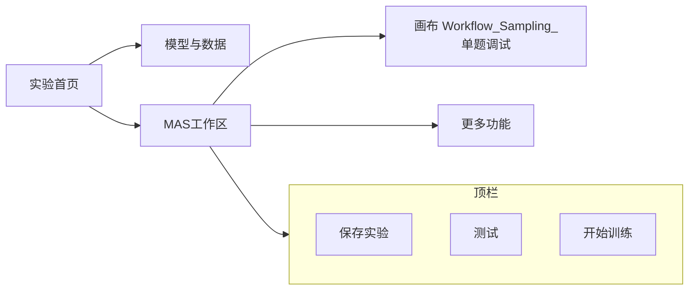

# Science Studio 使用手册

日期：2026-10-01

界面和命令行读写同一份五层 YAML。本文只讲现在的壳和三条主流程。采样语义见 [ROLLOUT_SAMPLING.md](./ROLLOUT_SAMPLING.md)；ARPO 训练验收见 [ARPO_TRAIN_TEST.md](./ARPO_TRAIN_TEST.md)；API 见 [CONTROL_UI.md](./CONTROL_UI.md)。

## 1. 启动

```bash
./run.sh ui --daemon           # http://127.0.0.1:8787/
./run.sh ui --stop
./run.sh ui --rebuild --daemon # 改过前端后重建
```

需要 uv `.venv`（`bash scripts/setup_uv_env.sh`）和 npm。训练才要 GPU。改过 Python 后必须重启 UI，否则 palette / 采样站点可能是旧的。

公网入口固定在 6006 时，用 `scripts/ui_public_forwarder.py` 把 6006 转到 8787。请用外部浏览器；IDE 内嵌 webview 大约只有 6 条 HTTP/1.1 连接，SSE 容易把其余请求堵住。

## 2. 界面总览

两个入口：首页「实验」（`#/experiments`），独立页「模型与数据」（`#/resources/models`、`#/resources/datasets`）。打开实验后进入工作区。


工作区不是七个平级菜单。默认面是 **MAS 画布 + 左侧训练配置**。顶栏右侧是「模型与数据」和「更多功能」（实验信息、诊断工具、实验监控、训练记录）。LLM / RL / Harness 仍可通过旧 hash 打开，但都落到同一份草稿上的设置区。


```mermaid
flowchart LR
  home[实验首页] --> resources[模型与数据]
  home --> workspace[MAS工作区]
  subgraph header [顶栏]
    save[保存实验]
    test[测试]
    train[开始训练]
  end
  workspace --> header
  workspace --> canvas[画布 Workflow_Sampling_单题调试]
  workspace --> more[更多功能]
```

切设置、切画布模式不会丢掉草稿。换实验会用磁盘上的五份 YAML 覆盖。未保存时离开会拦截。

## 3. 顶栏

| 控件 | 作用 |
|------|------|
| 返回 | 回到实验首页 |
| 实验名 | 当前实验 |
| GPU | 多选训练占用的卡，保存时写入 `rl.devices.ids` |
| 保存实验 | 把 Experiment、LLM、MAS、RL、Harness 草稿一并写入五份 YAML |
| 测试 | 选已登记数据集做批量推理。不启训练。日志在控制台，按跳打印 `src -> dst` |
| 开始训练 / 查看训练 | 确认后停止本地 vLLM，再 `POST /api/rl/runs`。已有活动训练时变成「查看训练」 |
| 模型与数据 | 打开资源页 |
| 更多功能 | 实验信息、诊断、Monitor、训练记录 |

采样结果不在顶栏。从训练记录或控制台进入 `#/experiments/<id>/runs/<runId>/samples`。

## 4. 工作区

### 画布

底栏三个动作：

| 模式 | 做什么 |
|------|--------|
| Workflow 编排 | 拖 Agent / 工具 / Router / 用户项目节点，连边 |
| Sampling 编排 | 在 planner、verifier、router 或边上放分支站点。不按 tool 展开 |
| 单题调试 | 仅 Workflow 模式下可用。live 或 mock 跑一题，走 `POST /api/mas/rollout-runs` |

左侧节点库有模板、内置五工具、用户项目。用户区节点的代码在 `user_space/projects/<id>/`，只能由 Assistant 改。

### 左侧训练配置

四段：训练对象、数据与奖励、训练策略（含采样摘要）、执行资源。点采样摘要会切到 Sampling 画布。推理连接在设置区 `inference`；诊断插件在 `diagnostics`。

训练算法下拉以 `/api/meta` 的 `algos` 为准：`grpo` / `arpo` / `aepo` / `igpo` / `gigpo` / `rae`。Sampling 模式里仍有 APPO，保存时映射成 ARPO。

### 底部控制台

训练和批量测试共用。训练 run 有「采样结果」「停止训练」；eval run 没有这两项。训练记录列表默认只显示 `kind=train`，eval 只出现在控制台的 run 下拉里。

## 5. 三条主流程

### 单题调试

1. 保存实验。
2. 画布保持 Workflow，点「单题调试」。
3. 选 live 或 mock，提交。产物在 `artifacts/rollout-runs/<run_id>`，不是训练分支树。

CLI 等价：`science-infra collect --mock --n 1`。Collect **不**产生训练分支。

### 批量测试

1. 「模型与数据」登记一份 parquet 或 HIVE 式 JSON。
2. 顶栏「测试」，选数据源。门禁走 `/api/mas/readiness`。
3. 开始后进入控制台，stdout 一行一个 `src -> dst`。

这是 `POST /api/mas/eval-runs`，`kind=eval`，不调用训练。

### 训练

1. GPU 勾选，保存实验。
2. 采样 mode 与 RL algo 对齐（例如都是 `arpo`），`group_n` 与每题条数一致。
3. 「开始训练」。日志在控制台。
4. 训练记录 → 采样结果，看该 run 的树。Monitor 看实验级 reward 曲线。

真分支只在 `tir_algo` 为 `arpo` / `aepo` / `rae` 的训练里。站点写在非 tool agent 结束之后，以及 router 结束之后。verifier 用 `after_verifier`，其余用 `after_agent_turn`。

## 6. 采样站点

Sampling 画布高亮可放站点的节点和边。设计期预览走 `POST /api/mas/sampling/preview`。

| 锚点 | 放在哪 | 常用门控 |
|------|--------|----------|
| `after_agent_turn` | planner、blank、router | `entropy_delta` |
| `after_verifier` | verifier | `verifier_fail` |
| `on_edge` | route / message / feedback 边 | 按边 |

`group_n` 是每题独立条数，也是 GRPO 组大小。`beam_size` 是第二波从断点续写的预算。细节见 [ROLLOUT_SAMPLING.md](./ROLLOUT_SAMPLING.md)。

## 7. 采样结果与 Monitor

采样结果页读 `GET /api/rl/runs/{runId}/rollout-trees`（按 run 归档）。旧的 `GET /api/mas/rollout-trees` 仍在，但不是这个页的主路径。


Monitor 只有两块：实验级 AGL reward 曲线，以及当前 run 的 stdout。Collect 曲线、轨迹表、Harness 假设表不在这里。诊断仍在「更多功能 → 诊断工具」，对已有 `collect.json` 跑插件。


## 8. Assistant 与用户项目

右下角对话代理。它只能写 `user_space/projects/<id>/{adapted,contracts,artifacts}/`。封装 HIVE 或 EPC-AW 时走窗口包装（Planner / Executor / Diagnoser），再 `apply` 到画布草稿。实验 YAML 仍须点「保存实验」才落盘。

配置与实验 LLM 分离：`AI_ASSISTANT_API_KEY` / `AI_ASSISTANT_API_BASE` / `AI_ASSISTANT_MODEL`。

## 9. 模型与数据

资源页登记推理连接和训练权重。密钥写入 `.secrets.env`，不回显。数据集可以是 parquet，也可以是 HIVE 式 JSON。训练权重绑定后出现在左侧「训练对象」；批量测试只列出已登记的数据源。

## 10. 常见问题

- 采集或单题调试成功，采样结果却是空的。训练分支不在 Collect / eval 里。到对应训练 run 的采样结果页看。
- `branch_local_count` 一直是 0。确认 algo 是 arpo/aepo/rae，站点在 planner/verifier/router 上，并已保存。重启 UI 后再训。
- 训练结束后 Monitor 曲线空了。曲线回落到 `mas/checkpoints/AgentLightning/<exp>/metrics.jsonl`。控制台日志绑定当前 run，换 run 会清空。
- 采样结果一直转圈。换外部浏览器；`curl` 打 `/api/rl/runs/<runId>/rollout-trees?experiment_id=<id>`。
- Assistant 改不了实验。它只写用户区；应用到画布后仍要点「保存实验」。

参数字段和 Hydra overlay 见 [TECHNICAL_FRAMEWORK.md](./TECHNICAL_FRAMEWORK.md)。

## 11. 本轮对照（2026-10-01）

界面路径与上文一致：首页 → 模型与数据 → 工作区（画布 + 左侧训练配置 + 顶栏保存/测试/训练）→ 单题调试 → 采样结果 / Monitor。ARPO 训练 run `2d32648f58c0` 跑完 3 step 后，采样结果页能看到分支边；Monitor 是实验级 reward 条数加当前 run 日志，没有 Collect 轨迹表。验收长表见 [ARPO_TRAIN_TEST.md](./ARPO_TRAIN_TEST.md)。
