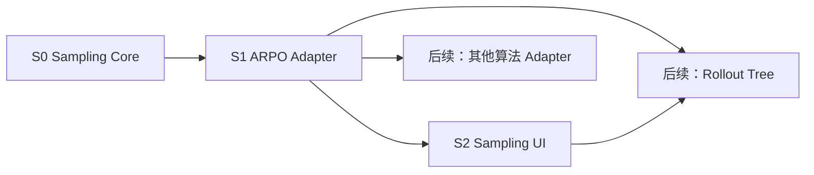

# Plan

本轮只建设完整的 Sampling Framework 核心、ARPO Tool Result Window 适配器和适配器驱动的 Sampling UI。其他算法适配与 Rollout Tree 均在 ARPO 纵向闭环完成后实施，不提前在 UI 中暴露未完成能力。

当前最准确的项目状态是：

```text
通用 Sampling 合同与部分执行骨架
        +
ARPO Tool Result Window 纵向切片
```

不能写成“通用 Sampling Framework 已完成”，也不能写成“Sampling 只是 ARPO 专用代码”。本轮目标是把已有骨架收口为稳定核心，并让 ARPO 成为第一个遵循核心合同的正式适配器。

## Position in the Project

[new_framework 设计](../../docs/NEW_FRAMEWORK_DESIGN.md)定义最终目标：

```text
Window → Opportunity → Decision → Expansion
                         ↓
                    Rollout Tree
```

本轮只完成 Rollout Tree 之前的设计态和执行态 Sampling：

```text
Workflow / Runtime
  → Sampling Window
  → Strategy Adapter
  → Decision / ExpansionPlan
  → Daemon enqueue
```

Rollout Tree 是后续对这些事实的按 run 投影，不是本轮 Sampling Core 的输入。

## Why Three Stages

三个阶段分别冻结不同责任，不能合并：

1. **核心合同先行**：如果 Window、机会、决策和扩展计划仍带有 `after_tool`、`tir_algo` 等混合语义，ARPO 与 UI 会继续互相塑形。
2. **ARPO 单独适配**：ARPO 的原生位置是 Tool Result Window；必须先证明适配器只在这个窗口做 entropy Gate 和预算扩展。
3. **UI 最后消费能力**：只有适配器能准确返回支持窗口后，画布才能只显示真实机会；否则 UI 会再次复制后端规则或展示目标模型中的未实现能力。

## Stage Overview

| 阶段 | 核心交付 | 完成边界 |
| --- | --- | --- |
| S0 | [窗口合同与适配器核心](Sampling框架第一阶段-窗口合同与适配器核心.md) | 核心不知道 ARPO/AEPO/RAE；旧 anchor 只在边界归一化 |
| S1 | [ARPO Tool Result Window 适配](Sampling框架第二阶段-ARPO工具窗口适配.md) | ARPO 只声明并执行 Tool Result Window，服务器闭环可验收 |
| S2 | [适配器驱动画布交互](Sampling框架第三阶段-适配器驱动画布交互.md) | UI 只展示当前适配器原生机会，兼容配置单列 |

依赖关系：



## Target Domain Model

核心领域对象：

```python
class SamplingWindow:
    window_id: str
    owner_agent_id: str
    kind: str
    sequence: int
    snapshot_ref: str
    metrics: dict
    interaction: dict


class SamplingOpportunity:
    window_kind: str
    selector: dict
    resumable: bool
    allowed_gates: list[str]


class SamplingDecision:
    window_id: str
    site_id: str
    passed: bool
    score: float
    reason: str


class ExpansionPlan:
    parent_rollout_id: str
    window_id: str
    snapshot_ref: str
    count: int
    metadata: dict
```

算法适配器：

```python
class SamplingStrategyAdapter:
    id: str

    def opportunities(self, workflow) -> list[SamplingOpportunity]: ...
    def decide(self, window, site, policy) -> SamplingDecision: ...
    def allocate(self, decision, budget, site) -> int: ...
    def training_overlay(self, config, policy) -> dict: ...
```

核心只编排 Window、Opportunity、Decision 和 Expansion，不根据算法名称分支。

## Current-to-Target Mapping

| 当前对象或字段 | 本轮归属 |
| --- | --- |
| `WindowEndEvent` | S0 升级为统一 `SamplingWindow` 合同 |
| `BranchSite.anchor` | S0 作为兼容声明，归一化为 Window selector |
| `Archive Snapshot` | S0 保证一个 Window 对应一个独立可恢复 Snapshot |
| `ActiveSetSession` | S0 收口为执行核心，不直接解释算法名称 |
| `apply_sample_policy()` | S0/S1 分离通用 policy 合并和 ARPO overlay |
| entropy Gate | S1 ARPO Adapter |
| `initial_rollouts` / group budget | S1 ARPO Adapter |
| `sampling/preview` | S2 改为 Adapter capability projection |
| Sampling Canvas | S2 只显示适配器返回的机会 |
| `after_agent_turn(hub)` | legacy 兼容输入，不作为 ARPO 原生机会 |

## Scope

- In：通用 Window/Adapter 核心、legacy anchor 归一化、ARPO Tool Result Window、适配器能力投影和 Sampling UI。
- In：继续使用 messages Snapshot、Store/Daemon 二波 enqueue 和现有 AGL/VERL 训练入口。
- Out：AEPO、RAE、IGPO、GIGPO 的正式适配器。
- Out：普通 Agent、Router、Verifier、`on_edge`、`on_token` 的原生窗口执行。
- Out：按 run Rollout Tree、实时树页面、节点级 credit 产品闭环。

## Compatibility Rules

- 旧 `workflow.sampling` YAML 可读取和无损保存。
- `after_tool(agent, tool)` 归一化为 `tool_result` Window selector。
- `after_agent_turn(hub)` 当前仅作为旧配置兼容映射，不提升为原生 Agent Window。
- 适配器不支持的已启用 Site 由 Preflight 阻断；UI 单列并允许禁用、删除或迁移。
- 不改 AGL/VERL 内部执行协议；Tool Call/ToolMessage 仍可作为底层兼容格式。

## Acceptance and Delivery Boundary

本轮完成必须满足：

- Sampling Core 中没有根据 `arpo/aepo/rae` 名称选择 Window 或 Gate 的逻辑。
- ARPO Adapter 明确只支持 Tool Result Window。
- 一个 Tool Result Window 绑定一个独立 Snapshot，ExpansionPlan 引用该 Window。
- Sampling UI 在 ARPO 下只在 Agent—Tool 交互边界展示原生机会。
- 普通 Agent、Router、Verifier 和旧兼容 Site 不作为可开启的 ARPO 原生机会。
- UI 的能力来自 Adapter projection，不复制 Python 能力矩阵。
- 真实训练仍由用户明确启动；代码编译或页面显示不能替代服务器 ARPO 闭环。

## Deferred Work

完成 S0–S2 和 ARPO 服务器验收后，后续顺序为：

1. 选择并实现下一个算法 Adapter；每个 Adapter 单独声明所需 Window、Gate、预算和训练信号。
2. [按 run 存储 Rollout Tree](RolloutTree第一阶段-按run存储与结果回填.md)。
3. [Rollout Tree 节点详情与实时更新](RolloutTree第二阶段-节点详情与实时更新.md)。

其他算法与 Rollout Tree 不作为本轮三个阶段的完成前置条件。
